# Gênesis Cap 41

**1** 	E ACONTECEU que, ao fim de dois anos inteiros, Faraó sonhou, e eis que estava em pé junto ao rio.

> **Cmt MHenry**: *Versículos 1-8* O meio de José para ser liberado da prisão foram os sonhos do Faraó, que aqui se relatam. Agora que Deus já não fala mais desse jeito, não importa que façamos pouco caso dos sonhos ou os contemos. Contar sonhos néscios não pode ser melhor que falar bobagens. Mas estes sonhos evidentemente tinham sido enviados por Deus; quando o faraó acordou, seu espírito estava perturbado.

 

**2** 	E eis que subiam do rio sete vacas, formosas à vista e gordas de carne, e pastavam no prado.

**3** 	E eis que subiam do rio após elas outras sete vacas, feias à vista e magras de carne; e paravam junto às outras vacas na praia do rio.

**4** 	E as vacas feias à vista e magras de carne, comiam as sete vacas formosas à vista e gordas. Então acordou Faraó.

**5** 	Depois dormiu e sonhou outra vez, e eis que brotavam de um mesmo pé sete espigas cheias e boas.

**6** 	E eis que sete espigas miúdas, e queimadas do vento oriental, brotavam após elas.

**7** 	E as espigas miúdas devoravam as sete espigas grandes e cheias. Então acordou Faraó, e eis que era um sonho.

**8** 	E aconteceu que pela manhã o seu espírito perturbou-se, e enviou e chamou todos os adivinhadores do Egito, e todos os seus sábios; e Faraó contou-lhes os seus sonhos, mas ninguém havia que lhos interpretasse.

 

**9** 	Então falou o copeiro-mor a Faraó, dizendo: Das minhas ofensas me lembro hoje:

> **Cmt MHenry**: *Versículos 9-32* O tempo de Deus para o crescimento de seu povo é o tempo mais adequado. Se o chefe dos copeiros tivesse logrado que José fora liberado da prisão, provavelmente este teria regressado à terra dos hebreus. Então não teria sido abençoado tanto, nem tampouco teria havido tamanha bênção para sua família, como resultou depois. José dá honra a Deus quando o apresentam ao faraó. Faraó tinha sonhado que estava na beira do rio Nilo e viu umas vacas, gordas e depois magras, saírem do rio. O Egito não tem chuvas, mas a colheita do ano depende da enchente do rio Nilo. Note-se quantos caminhos tem a Providência para dispensar suas dádivas; contudo, nossa dependência da Primeira Causa continua sendo a mesma, a qual faz que cada coisa criada seja o que é para nós, seja chuva ou rio. Veja-se a que mudanças estão sujeitas as comodidades desta vida. Não podemos estar seguros de que amanhã será como hoje, ou que o ano próximo seja como este. Devemos aprender a ter pobreza e a estar em abundância. Note-se a bondade de Deus para mandar os sete anos de abundância antes que os da fome, para que pudesse ser feita provisão. O produto da terra é às vezes mais, e às vezes menos, porém, tomados em conjunto, para quem colheita muito não sobra nada, e àquele que colheita pouco, nada lhe falta ([Êx 16.18](../02A-Ex/16.md#18)). e perceba na natureza perecível de nossos prazeres mundanos. As colheitas maiores dos anos de abundância se perderam por completo, sendo consumidas nos anos de escassez, e aquilo que parecia muito, somente serviu para manter viva a gente. Há pão que permanece para a *vida eterna* pelo qual vale a pena trabalhar. Os que fazem com que as coisas deste mundo sejam seu bem mais prezado, acharão pouco prazer ao lembrar que as receberam.

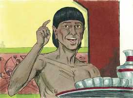 

**10** 	Estando Faraó muito indignado contra os seus servos, e pondo-me sob prisão na casa do capitão da guarda, a mim e ao padeiro-mor,

**11** 	Então tivemos um sonho na mesma noite, eu e ele; sonhamos, cada um conforme a interpretação do seu sonho.

**12** 	E estava ali conosco um jovem hebreu, servo do capitão da guarda, e contamos-lhe os nossos sonhos e ele no-los interpretou, a cada um conforme o seu sonho.

**13** 	E como ele nos interpretou, assim aconteceu; a mim me foi restituído o meu cargo, e ele foi enforcado.

**14** 	Então mandou Faraó chamar a José, e o fizeram sair logo do cárcere; e barbeou-se e mudou as suas roupas e apresentou-se a Faraó.

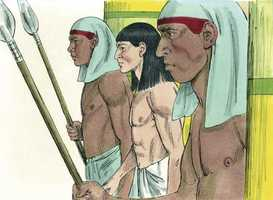 

**15** 	E Faraó disse a José: Eu tive um sonho, e ninguém há que o interprete; mas de ti ouvi dizer que quando ouves um sonho o interpretas.

**16** 	E respondeu José a Faraó, dizendo: Isso não está em mim; Deus dará resposta de paz a Faraó.

**17** 	Então disse Faraó a José: Eis que em meu sonho estava eu em pé na margem do rio,

 

**18** 	E eis que subiam do rio sete vacas gordas de carne e formosas à vista, e pastavam no prado.

**19** 	E eis que outras sete vacas subiam após estas, muito feias à vista e magras de carne; não tenho visto outras tais, quanto à fealdade, em toda a terra do Egito.

**20** 	E as vacas magras e feias comiam as primeiras sete vacas gordas;

**21** 	E entravam em suas entranhas, mas não se conhecia que houvessem entrado; porque o seu parecer era feio como no princípio. Então acordei.

**22** 	Depois vi em meu sonho, e eis que de um mesmo pé subiam sete espigas cheias e boas;

 

**23** 	E eis que sete espigas secas, miúdas e queimadas do vento oriental, brotavam após elas.

**24** 	E as sete espigas miúdas devoravam as sete espigas boas. E eu contei isso aos magos, mas ninguém houve que mo interpretasse.

**25** 	Então disse José a Faraó: O sonho de Faraó é um só; o que Deus há de fazer, mostrou-o a Faraó.

 

**26** 	As sete vacas formosas são sete anos, as sete espigas formosas também são sete anos, o sonho é um só.

**27** 	E as sete vacas feias à vista e magras, que subiam depois delas, são sete anos, e as sete espigas miúdas e queimadas do vento oriental, serão sete anos de fome.

 

**28** 	Esta é a palavra que tenho dito a Faraó; o que Deus há de fazer, mostrou-o a Faraó.

**29** 	E eis que vêm sete anos, e haverá grande fartura em toda a terra do Egito.

**30** 	E depois deles levantar-se-ão sete anos de fome, e toda aquela fartura será esquecida na terra do Egito, e a fome consumirá a terra;

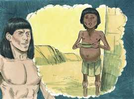 

**31** 	E não será conhecida a abundância na terra, por causa daquela fome que haverá depois; porquanto será gravíssima.

**32** 	E que o sonho foi repetido duas vezes a Faraó, é porque esta coisa é determinada por Deus, e Deus se apressa em fazê-la.

**33** 	Portanto, Faraó previna-se agora de um homem entendido e sábio, e o ponha sobre a terra do Egito.

> **Cmt MHenry**: *Versículos 33-45* José deu um bom conselho a faraó. A boa advertência sempre deve ir seguida por um bom conselho. Deus nos tem dito em sua Palavra que há um dia de provação para nós, quando necessitaremos de toda a graça que possamos ter. portanto, faça agora a provisão correspondente. O faraó deu um testemunho honorável de José. É um homem em quem está o Espírito de Deus; e tais homens devem ser estimados. O faraó deposita em José sinais de honra. Deu-lhe um nome que falava do valor que tinha para ele, Zafenate-Panéia, que significa "revelador de segredos". Esta ascensão de José nos dá ânimos para confiarmos em Deus. O novo nome de José, alguns o traduzem como "o salvador do mundo". As glórias mais resplandecentes, ainda do mundo superior, estão depositadas em Cristo; a maior confiança tem sido depositada em sua mão e todo o poder no céu e na terra lhe foram dados.

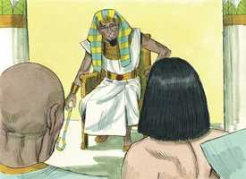 

**34** 	Faça isso Faraó e ponha governadores sobre a terra, e tome a quinta parte da terra do Egito nos sete anos de fartura,

**35** 	E ajuntem toda a comida destes bons anos, que vêm, e amontoem o trigo debaixo da mão de Faraó, para mantimento nas cidades, e o guardem.

**36** 	Assim será o mantimento para provimento da terra, para os sete anos de fome, que haverá na terra do Egito; para que a terra não pereça de fome.

**37** 	E esta palavra foi boa aos olhos de Faraó, e aos olhos de todos os seus servos.

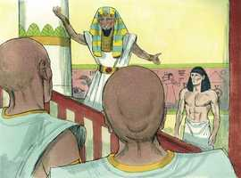 

**38** 	E disse Faraó a seus servos: Acharíamos um homem como este em quem haja o espírito de Deus?

**39** 	Depois disse Faraó a José: Pois que Deus te fez saber tudo isto, ninguém há tão entendido e sábio como tu.

**40** 	Tu estarás sobre a minha casa, e por tua boca se governará todo o meu povo, somente no trono eu serei maior que tu.

**41** 	Disse mais Faraó a José: Vês aqui te tenho posto sobre toda a terra do Egito.

> **Cmt MHenry**: *CAPÍTULO 41N-Mc

**42** 	E tirou Faraó o anel da sua mão, e o pôs na mão de José, e o fez vestir de roupas de linho fino, e pôs um colar de ouro no seu pescoço.

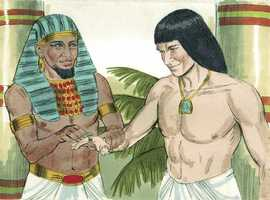 

**43** 	E o fez subir no segundo carro que tinha, e clamavam diante dele: Ajoelhai. Assim o pôs sobre toda a terra do Egito.

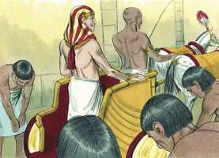 

**44** 	E disse Faraó a José: Eu sou Faraó; porém sem ti ninguém levantará a sua mão ou o seu pé em toda a terra do Egito.

**45** 	E Faraó chamou a José de Zafenate-Panéia, e deu-lhe por mulher a Azenate, filha de Potífera, sacerdote de Om; e saiu José por toda a terra do Egito.

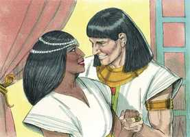 

**46** 	E José era da idade de trinta anos quando se apresentou a Faraó, rei do Egito. E saiu José da presença de Faraó e passou por toda a terra do Egito.

> **Cmt MHenry**: *Versículos 46-57* José se apropriou da divina providência nos nomes de seus dois filhos, Manassés e Efraim. 1) Esqueceu sua desgraça. 2) Foi frutífero na terra de sua aflição. Chegaram os sete anos de abundância e se terminaram. Devemos esperar o fim dos dias, tanto de nossa prosperidade como de nossa oportunidade. Não devemos sentir-nos seguros da prosperidade nem sermos preguiçosos para fazer bom uso da oportunidade. Os anos da abundância acabarão; faça tudo o que estiver ao alcance de sua mão para ser feito; e colha no tempo da colheita. Chegou a escassez e a fome se fez sentir não somente no Egito, senão também em outras terras. José foi diligente para armazenar enquanto durou a abundância. Quando chegou a fome, foi prudente e cuidadoso para dar. José esteve dedicado às lavoras úteis e impressões. Porém, em meio desta atividade sua foi que seu pai Jacó disse: José não aparece! Quão grande seria a parte de nossos problemas que seria eliminada se soubéssemos toda a verdade! Que estes acontecimentos nos conduzam a Jesus. há fome do pão de vida em toda a terra. Vão a Jesus e façam o que Ele lhes peça. Escutem Sua voz, peçam-lhe; Ele abrirá seus tesouros e satisfará com bondade a alma faminta de toda época e nação, sem dinheiro e sem preço. Mas os que não prestam a devida atenção a esta provisão, devem passar fome, e os inimigos dela serão destruídos. "

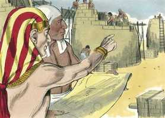 

**47** 	E nos sete anos de fartura a terra produziu abundantemente.

 

**48** 	E ele ajuntou todo o mantimento dos sete anos, que houve na terra do Egito; e guardou o mantimento nas cidades, pondo nas mesmas o mantimento do campo que estava ao redor de cada cidade.

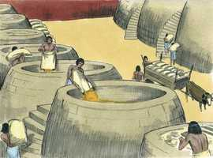 

**49** 	Assim ajuntou José muitíssimo trigo, como a areia do mar, até que cessou de contar; porquanto não havia numeração.

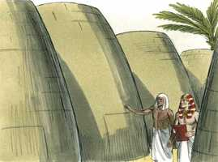 

**50** 	E nasceram a José dois filhos (antes que viesse um ano de fome), que lhe deu Azenate, filha de Potífera, sacerdote de Om.

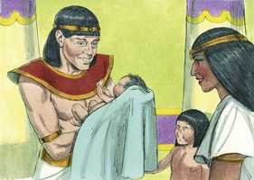 

**51** 	E chamou José ao primogênito Manassés, porque disse: Deus me fez esquecer de todo o meu trabalho, e de toda a casa de meu pai.

**52** 	E ao segundo chamou Efraim; porque disse: Deus me fez crescer na terra da minha aflição.

**53** 	Então acabaram-se os sete anos de fartura que havia na terra do Egito.

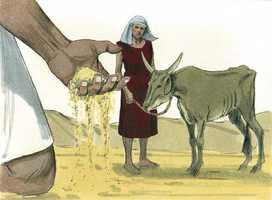 

**54** 	E começaram a vir os sete anos de fome, como José tinha dito; e havia fome em todas as terras, mas em toda a terra do Egito havia pão.

 

**55** 	E tendo toda a terra do Egito fome, clamou o povo a Faraó por pão; e Faraó disse a todos os egípcios: Ide a José; o que ele vos disser, fazei.

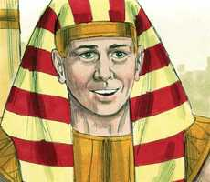 

**56** 	Havendo, pois, fome sobre toda a terra, abriu José tudo em que havia mantimento, e vendeu aos egípcios; porque a fome prevaleceu na terra do Egito.

 

**57** 	E de todas as terras vinham ao Egito, para comprar de José; porquanto a fome prevaleceu em todas as terras.

> **Cmt MHenry** Intro: *• Versículos 1-8*> 28A-Os sonhos do Faraó*> *• Versículos 9-32*> *José interpreta os sonhos do Faraó*> *• Versículos 33-45*> *O conselho de José – Ascendido a um alto cargo*> *• Versículos 46-57*> 28A-Os filhos de José – O começo da fome*