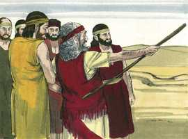
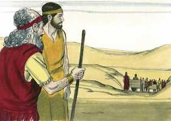
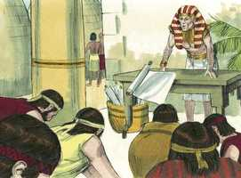
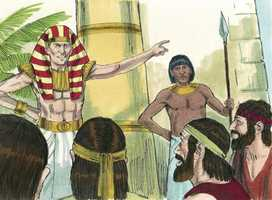
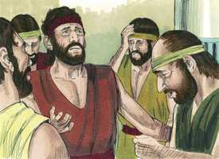
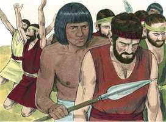
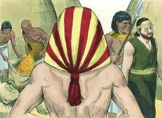
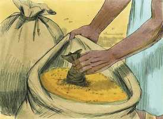
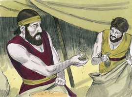
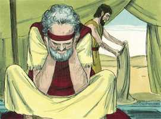

# Gênesis Cap 42

**1** 	VENDO então Jacó que havia mantimento no Egito, disse a seus filhos: Por que estais olhando uns para os outros?

> **Cmt MHenry**: *Versículos 1-6* Jacó viu o trigo que seus vizinhos tinham comprado e levado a suas casas desde o Egito. O ver que outros têm encontrado seu abastecimento estimula à ação. Os outros terão alimento para suas almas, e nós passaremos fome enquanto há aonde conseguir? Tendo descoberto onde há ajuda, devemos pedi-la sem demora, sem diminuir o esforço nem queixar-nos do custo, especialmente a respeito de nossas almas imortais. Há provisão em Cristo, mas devemos acudir a Ele e pedir-lhe.

 

**2** 	Disse mais: Eis que tenho ouvido que há mantimentos no Egito; descei para lá, e comprai-nos dali, para que vivamos e não morramos.

**3** 	Então desceram os dez irmãos de José, para comprarem trigo no Egito.

**4** 	A Benjamim, porém, irmão de José, não enviou Jacó com os seus irmãos, porque dizia: Para que lhe não suceda, porventura, algum desastre.

 

**5** 	Assim, entre os que iam lá foram os filhos de Israel para comprar, porque havia fome na terra de Canaã.

**6** 	José, pois, era o governador daquela terra; ele vendia a todo o povo da terra; e os irmãos de José chegaram e inclinaram-se a ele, com o rosto em terra.

 

**7** 	E José, vendo os seus irmãos, conheceu-os; porém mostrou-se estranho para com eles, e falou-lhes asperamente, e disse-lhes: De onde vindes? E eles disseram: Da terra de Canaã, para comprarmos mantimento.

> **Cmt MHenry**: *Versículos 7-20* José foi duro com seus irmãos, não por espírito vingativo, senão para levá-los ao arrependimento. Ao não ver seu irmão Benjamim, suspeitou que o tivessem eliminado, e lhes deu ocasião para falar de seu pai e de seu irmão. Em sua providência, às vezes Deus parece duro com os que ama e fala com rudeza àqueles para os quais reserva grande misericórdia. José dispôs, finalmente, que um deles ficasse e o resto fosse a sua casa a trazer a Benjamim. Foi muito animador que ele lhes dissesse: "Eu temo a Deus"; como se tiver dito "Vocês podem ter a certeza de que não lhes farei mal; não me atrevo, pois sei que há um mais alto que eu". Daqueles que temem a Deus podemos esperar um tratamento justo.

**8** 	José, pois, conheceu os seus irmãos; mas eles não o conheceram.

 

**9** 	Então José lembrou-se dos sonhos que havia tido deles e disse-lhes: Vós sois espias, e viestes para ver a nudez da terra.

**10** 	E eles lhe disseram: Não, senhor meu; mas teus servos vieram comprar mantimento.

**11** 	Todos nós somos filhos de um mesmo homem; somos homens de retidão; os teus servos não são espias.

**12** 	E ele lhes disse: Não; antes viestes para ver a nudez da terra.

 

**13** 	E eles disseram: Nós, teus servos, somos doze irmãos, filhos de um homem na terra de Canaã; e eis que o mais novo está com nosso pai hoje; mas um já não existe.

 

**14** 	Então lhes disse José: Isso é o que vos tenho dito, sois espias;

**15** 	Nisto sereis provados; pela vida de Faraó, não saireis daqui senão quando vosso irmão mais novo vier aqui.

**16** 	Enviai um dentre vós, que traga vosso irmão, mas vós ficareis presos, e vossas palavras sejam provadas, se há verdade convosco; e se não, pela vida de Faraó, vós sois espias.

**17** 	E pô-los juntos, em prisão, três dias.

 

**18** 	E ao terceiro dia disse-lhes José: Fazei isso, e vivereis; porque eu temo a Deus.

 

**19** 	Se sois homens de retidão, que fique um de vossos irmãos preso na casa de vossa prisão; e vós ide, levai mantimento para a fome de vossa casa,

**20** 	E trazei-me o vosso irmão mais novo, e serão verificadas vossas palavras, e não morrereis. E eles assim fizeram.

**21** 	Então disseram uns aos outros: Na verdade, somos culpados acerca de nosso irmão, pois vimos a angústia da sua alma, quando nos rogava; nós porém não ouvimos, por isso vem sobre nós esta angústia.

> **Cmt MHenry**: *Versículos 21-24* O ofício da consciência é lembrar coisas que faz muito foram ditas e feitas. Quando estava fresca a culpa do pecado dos irmãos de José, eles não lhe deram importância e se sentaram a comer pão, mas agora, muito depois, suas consciências os acusam disso. Veja-se o bom das aflições; amiúde resultam ser um meio ditoso que desperta a consciência e traz o pecado a nossa memória, além do negativo da culpa para com os nossos irmãos. Agora a consciência lhes recriminava por isso. Cada vez que pensemos que nos têm feito dano, devemos lembrar o mal que nós temos feito ao próximo. Rubem somente lembrou, com consolo, que ele tinha feito o que pudera para impedir a maldade. Quando partilhamos com os outros seus sofrimentos, será um consolo ter o testemunho de nossas consciências de que não participamos nas más obras, senão que em nosso momento demos testemunho contra elas. José se retirou a chorar. Embora sua razão lhe dizia que ainda devia comportar-se como estranho porque ainda eles não estavam suficientemente humilhados, o afeto natural, contudo, não podia senão operar.

**22** 	E Rúben respondeu-lhes, dizendo: Não vo-lo dizia eu: Não pequeis contra o menino; mas não ouvistes; e vedes aqui, o seu sangue também é requerido.

**23** 	E eles não sabiam que José os entendia, porque havia intérprete entre eles.

**24** 	E retirou-se deles e chorou. Depois tornou a eles, e falou-lhes, e tomou a Simeão dentre eles, e amarrou-o perante os seus olhos.

**25** 	E ordenou José, que enchessem os seus sacos de trigo, e que lhes restituíssem o seu dinheiro a cada um no seu saco, e lhes dessem comida para o caminho; e fizeram-lhes assim.

> **Cmt MHenry**: *Versículos 25-28* Os irmãos vieram por grão, e conseguiram grão; não somente isso, senão que cada homem recebeu seu dinheiro de volta. Assim Cristo, como José, nos dá provisões sem dinheiro e sem preço. Os mais pobres são convidados a comprar. Mas as consciências culpáveis são propensas a levar a mal as boas providências e a dar uma interpretação de maldade até nas coisas que se fazem em seu favor.

 

**26** 	E carregaram o seu trigo sobre os seus jumentos e partiram dali.

**27** 	E, abrindo um deles o seu saco, para dar pasto ao seu jumento na estalagem, viu o seu dinheiro; porque eis que estava na boca do seu saco.

 

**28** 	E disse a seus irmãos: Devolveram o meu dinheiro, e ei-lo também aqui no saco. Então lhes desfaleceu o coração, e pasmavam, dizendo um ao outro: Que é isto que Deus nos tem feito?

**29** 	E vieram para Jacó, seu pai, na terra de Canaã; e contaram-lhe tudo o que lhes aconteceu, dizendo:

> **Cmt MHenry**: *Versículos 29-38* Eis aqui o informe que os filhos de Jacó deram a seu pai. Isto perturbou ao bom homem. Até as bolsas de dinheiro que, com bondade, José devolveu a seu pai, o assustaram. Jogou a culpa em seus filhos; conhecendo-os, temeu que tivessem provocado aos egípcios e tivessem trapaceado para trazer o dinheiro de volta para sua casa. Jacó simplesmente desconfiava de seus filhos, lembrando que nunca viu a José desde o dia em que este fora a ter com eles. É mau para uma família quando os filhos se comportam tão errado que os pais não sabem se podem confiar neles. Jacó dá por perdido a José, e a Simeão e a Benjamim os vê em perigo; e conclui que todas estas coisas estavam em sua contra. Resultou ser o contrário, pois todas essas coisas estavam a seu favor, operando juntas para seu bem e o bem de sua família. Volta e meia pensamos que está em nossa contra o que, em realidade, está a nosso favor. Somos afligidos no corpo, o patrimônio, o nome e em nossas relações, e pensamos que todas essas coisas estão em nossa contra quando, em realidade, estão operando em nós um peso de glória. Assim o Senhor Jesus se disfarça, Ele e seu favor, assim repreende e disciplina às pessoas para as quais tem um propósito de amor. Mediante agudos corretivos e humilhantes convicções (de pecado), Ele romperá a teimosia e quebrantará o orgulho do coração e o levará ao arrependimento verdadeiro. Porém, antes que os pecadores o conheçam plenamente ou saibam que Ele é bom, Ele consulta seu bem e sustenta suas almas para que esperem nEle. Então nós nunca devemos render-nos ao desencorajamento, determinando não buscar outro refúgio que Ele, e humilhar-nos mais e mais sob sua poderosa mão. em seu devido momento, Ele responderá nossas petições e fará por nós mais do que podemos esperar. "

**30** 	O homem, o senhor da terra, falou conosco asperamente, e tratou-nos como espias da terra;

**31** 	Mas dissemos-lhe: Somos homens de retidão; não somos espias;

**32** 	Somos doze irmãos, filhos de nosso pai; um não mais existe, e o mais novo está hoje com nosso pai na terra de Canaã.

**33** 	E aquele homem, o senhor da terra, nos disse: Nisto conhecerei que vós sois homens de retidão; deixai comigo um de vossos irmãos, e tomai para a fome de vossas casas, e parti,

**34** 	E trazei-me vosso irmão mais novo; assim saberei que não sois espias, mas homens de retidão; então vos darei o vosso irmão e negociareis na terra.

**35** 	E aconteceu que, despejando eles os seus sacos, eis que cada um tinha o pacote com seu dinheiro no seu saco; e viram os pacotes com seu dinheiro, eles e seu pai, e temeram.

 

**36** 	Então Jacó, seu pai, disse-lhes: Tendes-me desfilhado; José já não existe e Simeão não está aqui; agora levareis a Benjamim. Todas estas coisas vieram sobre mim.

**37** 	Mas Rúben falou a seu pai, dizendo: Mata os meus dois filhos, se eu não tornar a trazê-lo para ti; entrega-o em minha mão, e tornarei a trazê-lo.

**38** 	Ele porém disse: Não descerá meu filho convosco; porquanto o seu irmão é morto, e só ele ficou. Se lhe suceder algum desastre no caminho por onde fordes, fareis descer minhas cãs com tristeza à sepultura.

> **Cmt MHenry** Intro: *Capítulo 42N-Lc> *• Versículos 1-6*> *Jacó manda a dez de seus filhos a comprar trigo*> *• Versículos 7-20*> *O trato que José dá a seus irmãos*> *• Versículos 21-24*> *O remorso deles – Simeão é retido*> *• Versículos 25-28*> *O resto regressa com o trigo*> *• Versículos 29-38*> *Jacó nega-se a enviar a Benjamim ao Egito*