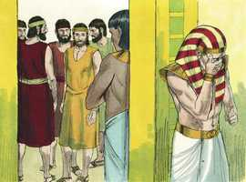
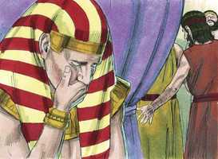
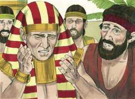
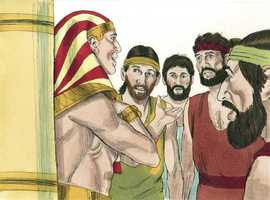
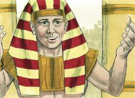
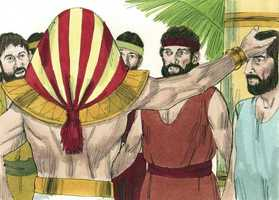
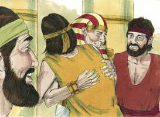
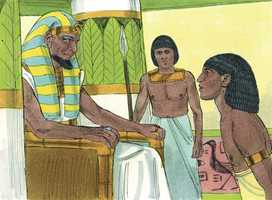
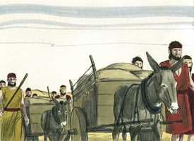
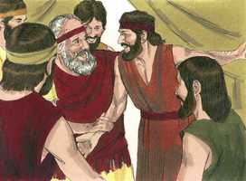

# Gênesis Cap 45

**1** 	ENTÃO José não se podia conter diante de todos os que estavam com ele; e clamou: Fazei sair daqui a todo o homem; e ninguém ficou com ele, quando José se deu a conhecer a seus irmãos.

> **Cmt MHenry**: *Versículos 1-15* José deixou falar a Judá e escutou todo o que tinha para dizer. Achou a seus irmãos humilhados por seus pecados, considerados ele, pois Judá o mencionou duas vezes em seu discurso, respeitosos de seu pai e muito doce com seu irmão Benjamim. Agora estavam preparados para o consolo que lhes daria, identificando-se. José ordenou a todos seus servos que saíssem. Assim Cristo se dá a conhecer Ele mesmo, e expressa sua amorosa bondade a seu povo, fora da vista e dos ouvidos do mundo. José derramou lágrimas de ternura e forte afeto e com estas apagou a austeridade com que se havia comportado com seus irmãos até esse momento. Isto representa a compaixão divina para os que voltam arrependidos. "Eu sou José, seu irmão". Isso os humilharia ainda mais por seu pecado de vendê-lo, porém os alentaria a esperar um bom tratamento. Assim, pois, quando Cristo quis convencer a Paulo disse: "Eu sou Jesus", e quando consolava a seus discípulos dizia "Eu sou, não temam". Quando Cristo se manifesta a seu povo, os anima a aproximar-se a Ele com um coração sincero. José o faz assim e lhes mostra que, seja o que eles pensavam fazer contra ele, Deus o havia usado para bem. Os pecadores devem condoer-se e irar-se consigo mesmos, embora Deus tire algo bom de seus pecados, pois isso não é mérito deles. É muito impressionante a concordância de tudo isto com o caso do pecador, ao manifestar-se Cristo a sua alma. neste relato ele não pensa que o pecado seja um mal menor, senão maior; e, de todas formas, está tão armado contra a desesperação que chega a regozijar-se no que Deus há operado, enquanto que treme pensando nos perigos e na ruína da qual escapou. José promete cuidar de seu pai e de toda a família. Dever dos filhos é, se a necessidade de seus pais o requer em qualquer momento, mantê-los e dar-lhes o melhor que possam; isto é mostrar a piedade em casa ([1 Tm 5.4](../54N-1Tm/05.md#4)). Depois que José houve abraçado a Benjamim, os acariciou a todos e, depois, seus irmãos conversaram livremente com ele de todos os assuntos da casa de seus pais. Depois dos sinais da verdadeira reconciliação com o Senhor Jesus, segue-se uma doce comunhão com Ele.

 

**2** 	E levantou a sua voz com choro, de maneira que os egípcios o ouviam, e a casa de Faraó o ouviu.

 

**3** 	E disse José a seus irmãos: Eu sou José; vive ainda meu pai? E seus irmãos não lhe puderam responder, porque estavam pasmados diante da sua face.

 

**4** 	E disse José a seus irmãos: Peço-vos, chegai-vos a mim. E chegaram-se; então disse ele: Eu sou José vosso irmão, a quem vendestes para o Egito.

 

**5** 	Agora, pois, não vos entristeçais, nem vos pese aos vossos olhos por me haverdes vendido para cá; porque para conservação da vida, Deus me enviou adiante de vós.

 

**6** 	Porque já houve dois anos de fome no meio da terra, e ainda restam cinco anos em que não haverá lavoura nem sega.

**7** 	Pelo que Deus me enviou adiante de vós, para conservar vossa sucessão na terra, e para guardar-vos em vida por um grande livramento.

**8** 	Assim não fostes vós que me enviastes para cá, senão Deus, que me tem posto por pai de Faraó, e por senhor de toda a sua casa, e como regente em toda a terra do Egito.

**9** 	Apressai-vos, e subi a meu pai, e dizei-lhe: Assim tem dito o teu filho José: Deus me tem posto por senhor em toda a terra do Egito; desce a mim, e não te demores;

 

**10** 	E habitarás na terra de Gósen, e estarás perto de mim, tu e os teus filhos, e os filhos dos teus filhos, e as tuas ovelhas, e as tuas vacas, e tudo o que tens.

**11** 	E ali te sustentarei, porque ainda haverá cinco anos de fome, para que não pereças de pobreza, tu e tua casa, e tudo o que tens.

**12** 	E eis que vossos olhos, e os olhos de meu irmão Benjamim, vêem que é minha boca que vos fala.

**13** 	E fazei saber a meu pai toda a minha glória no Egito, e tudo o que tendes visto, e apressai-vos a fazer descer meu pai para cá.

**14** 	E lançou-se ao pescoço de Benjamim seu irmão, e chorou; e Benjamim chorou também ao seu pescoço.

 

**15** 	E beijou a todos os seus irmãos, e chorou sobre eles; e depois seus irmãos falaram com ele.

**16** 	E esta notícia ouviu-se na casa de Faraó: Os irmãos de José são vindos; e pareceu bem aos olhos de Faraó, e aos olhos de seus servos.

> **Cmt MHenry**: *Versículos 16-24* O faraó foi amável com José e com seus familiares por amor a ele. Egito compensaria as perdas da mudança deles. Assim, os que vão receber de Cristo sua glória celestial, não deveriam ter consideração das coisas deste mundo. O melhor de seus deleites é só cinza; não podemos estar seguros deles enquanto estejamos aqui, e muito menos levá-los conosco. Não coloquemos nossa vista ou nosso coração no mundo; há coisas melhores para nós na terra bendita aonde se foi Cristo, nosso José, a preparar-nos um lugar. José despediu a seus irmãos com uma advertência apropriada: "Não briguem pelo caminho". Sabia que eram demasiado dados a brigar entre eles e, tendo perdoado a todos, lhes faz este encargo, de não brigar entre eles. Esta ordem nos foi dada por nosso Senhor Jesus, que nos amemos uns a outros e que aconteça o que acontecer ou que tenha acontecido, não briguemos. Já que somos irmãos, todos temos o mesmo Pai. Todos somos culpáveis e, em lugar de brigar uns com outros, temos razão para admoestar-nos a nós mesmos. Somos ou esperamos ser perdoados por Deus, a quem todos temos ofendido e, portanto, deveríamos estar prontos para perdoar-nos uns a outros. Estamos "no caminho", um caminho através da terra do Egito, onde temos muitos olhos sobre nós que procuram aproveitar-se de nós, um caminho que leva à Canaã celestial, onde esperamos estar por sempre em perfeita paz.

 

**17** 	E disse Faraó a José: Dize a teus irmãos: Fazei isto: carregai os vossos animais e parti, tornai à terra de Canaã.

**18** 	E tornai a vosso pai, e às vossas famílias, e vinde a mim; e eu vos darei o melhor da terra do Egito, e comereis da fartura da terra.

**19** 	A ti, pois, é ordenado: Fazei isto: tomai vós da terra do Egito carros para vossos meninos, para vossas mulheres, e para vosso pai, e vinde.

**20** 	E não vos pese coisa alguma dos vossos utensílios; porque o melhor de toda a terra do Egito será vosso.

**21** 	E os filhos de Israel fizeram assim. E José deu-lhes carros, conforme o mandado de Faraó; também lhes deu comida para o caminho.

 

**22** 	A todos lhes deu, a cada um, mudas de roupas; mas a Benjamim deu trezentas peças de prata, e cinco mudas de roupas.

**23** 	E a seu pai enviou semelhantemente dez jumentos carregados do melhor do Egito, e dez jumentos carregados de trigo e pão, e comida para seu pai, para o caminho.

**24** 	E despediu os seus irmãos, e partiram; e disse-lhes: Não contendais pelo caminho.

**25** 	E subiram do Egito, e vieram à terra de Canaã, a Jacó seu pai.

> **Cmt MHenry**: *Versículos 25-28* Ouvir que José está vivo é uma notícia demasiado boa para ser vã; Jacó se afligiu pois não o crê. Nós nos afligimos porque não cremos. Finalmente Jacó se convence da vê. Jacó estava velho, e não esperava viver muito mais. Diz: "Que meus olhos se refresquem com esta visão antes que se fechem e, depois disso, não necessito outra coisa para fazer-me feliz neste mundo". Eis aqui, Jesus se manifesta a Si mesmo como Irmão e Amigo antes os que uma vez o desprezaram e foram seus inimigos. Ele os assegura seu amor e as riquezas de sua graça. Lhes ordena deixar de lado a inveja, a raiva, a maldade e a discórdia, e que vivam em paz uns com outros. Lhes ensina a renunciar ao mundo por Ele e sua plenitude. Proporciona-lhes todo o necessário para conduzi-los a casa, a Ele mesmo, para que onde Ele está, estejam também eles. Afinal, quando envia por seu povo, conquanto eles possam por um tempo sentir algumas dúvidas e temores, o pensamento de ver sua glória e de estar com Ele lhes permitirá dizer: "Basta, estou disposto a morrer; e que ir a ver e a estar com o Amado de minha alma". "

**26** 	Então lhe anunciaram, dizendo: José ainda vive, e ele também é regente em toda a terra do Egito. E o seu coração desmaiou, porque não os acreditava.

**27** 	Porém, havendo-lhe eles contado todas as palavras de José, que ele lhes falara, e vendo ele os carros que José enviara para levá-lo, reviveu o espírito de Jacó seu pai.

 

**28** 	E disse Israel: Basta; ainda vive meu filho José; eu irei e o verei antes que morra.

> **Cmt MHenry** Intro: *CAPÍTULO 45N-Rm> *• Versículos 1-15*> *José consola a seus irmãos e envia por seu pai*> *• Versículos 16-24*> *O faraó confirma o convite de José – Os presentes de José*> *para seus irmãos*> *• Versículos 25-28*> *Jacó recebe a notícia de que José está vivo*