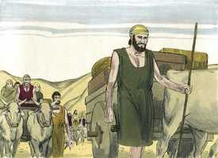

# Gênesis Cap 46

**1** 	E PARTIU Israel com tudo quanto tinha, e veio a Berseba, e ofereceu sacrifícios ao Deus de seu pai Isaque.

> **Cmt MHenry**: *Versículos 1-4* Ainda nos fatos e empreendimentos que parecem mais gratos devemos buscar o conselho, a ajuda e a bênção do Senhor. Em atender seus mandamentos e termos recebido as prendas de seu amor na aliança, temos a esperança de Sua presença e a paz que confere. Em todas nossas mudanças devemos lembrar-nos de nossa saída deste mundo. Quando passamos pelo vale da sombra da morte, nada pode animar-nos a não temer mal nenhum salvo a presença de Cristo.

**2** 	E falou Deus a Israel em visões de noite, e disse: Jacó, Jacó! E ele disse: Eis-me aqui.

**3** 	E disse: Eu sou Deus, o Deus de teu pai; não temas descer ao Egito, porque eu te farei ali uma grande nação.

**4** 	E descerei contigo ao Egito, e certamente te farei tornar a subir, e José porá a sua mão sobre os teus olhos.

**5** 	Então levantou-se Jacó de Berseba; e os filhos de Israel levaram a seu pai Jacó, e seus meninos, e as suas mulheres, nos carros que Faraó enviara para o levar.

> **Cmt MHenry**: *Versículos 5-27* Aqui temos uma lista detalhada da família de Jacó. Embora o cumprimento das promessas sempre é seguro, entretanto, costuma ser lento. Agora se passaram 215 anos desde que Deus havia prometido a Abraão fazer dele uma grande nação (capítulo 12.2); contudo, esse ramo de sua semente, ao qual foi feita a promessa, somente havia aumentado a setenta, dos quais se conserva esta relação específica para mostrar o poder de Deus para fazer que estes setenta se convertessem numa grande multidão.

 

**6** 	E tomaram o seu gado e os seus bens que tinham adquirido na terra de Canaã, e vieram ao Egito, Jacó e toda a sua descendência com ele;

**7** 	Os seus filhos e os filhos de seus filhos com ele, as filhas, e as filhas de seus filhos, e toda a sua descendência levou consigo ao Egito.

**8** 	E estes são os nomes dos filhos de Israel, que vieram ao Egito, Jacó e seus filhos: Rúben, o primogênito de Jacó.

**9** 	E os filhos de Rúben: Enoque, Palu, Hezrom e Carmi.

**10** 	E os filhos de Simeão: Jemuel, Jamim, Oade, Jaquim, Zoar e Saul, filho de uma mulher cananéia.

**11** 	E os filhos de Levi: Gérson, Coate e Merari.

**12** 	E os filhos de Judá: Er, Onã, Selá, Perez e Zerá; Er e Onã, porém, morreram na terra de Canaã; e os filhos de Perez foram Hezrom e Hamul.

**13** 	E os filhos de Issacar: Tola, Puva, Jó e Sinrom.

**14** 	E os filhos de Zebulom: Serede, Elom e Jaleel.

**15** 	Estes são os filhos de Lia, que ela deu a Jacó em Padã-Arã, além de Diná, sua filha; todas as almas de seus filhos e de suas filhas foram trinta e três.

**16** 	E os filhos de Gade: Zifiom, Hagi, Suni, Esbom, Eri, Arodi e Areli.

**17** 	E os filhos de Aser: Imna, Isvá, Isvi, Berias e Sera, a irmã deles; e os filhos de Berias: Héber e Malquiel.

**18** 	Estes são os filhos de Zilpa, a qual Labão deu à sua filha Lia; e deu a Jacó estas dezesseis almas.

**19** 	Os filhos de Raquel, mulher de Jacó: José e Benjamim.

**20** 	E nasceram a José na terra do Egito, Manassés e Efraim, que lhe deu Azenate, filha de Potífera, sacerdote de Om.

**21** 	E os filhos de Benjamim: Belá, Bequer, Asbel, Gera, Naamã, Eí, Rôs, Mupim, Hupim e Arde.

**22** 	Estes são os filhos de Raquel, que nasceram a Jacó, ao todo catorze almas.

**23** 	E o filho de Dã: Husim.

**24** 	E os filhos de Naftali: Jazeel, Guni, Jezer e Silém.

**25** 	Estes são os filhos de Bila, a qual Labão deu à sua filha Raquel; e deu estes a Jacó; todas as almas foram sete.

**26** 	Todas as almas que vieram com Jacó ao Egito, que saíram dos seus lombos, fora as mulheres dos filhos de Jacó, todas foram sessenta e seis almas.

**27** 	E os filhos de José, que lhe nasceram no Egito, eram duas almas. Todas as almas da casa de Jacó, que vieram ao Egito, eram setenta.

**28** 	E Jacó enviou Judá adiante de si a José, para o encaminhar a Gósen; e chegaram à terra de Gósen.

> **Cmt MHenry**: *Versículos 28-34* Considerou justo fazer saber ao faraó que sua família se estabeleceria em seus domínios. Se outros depositam sua confiança em nós, não devemos ser tão baixos como para abusar deles e impor-nos. Porém, que vai fazer José com seus irmãos? Houve um tempo em que eles se confabularam para livrar-se dele, agora ele pensa aonde estabelecê-los para proveito deles; isto é devolver bem por mal. Queria que eles vivessem sozinhos na terra de Gósen, que estava mais perto de Canaã. Os pastores eram uma abominação para os egípcios. Mas José não queria que eles fossem envergonhados ao reconhecer aquela como a ocupação deles ante o faraó. Poderia ter-lhes procurado cargos na corte ou no exército. Mas tais distinções os exporiam à inveja dos egípcios, ou a tentação de esquecer Canaã e a promessa feita a seus pais. Uma vocação honesta não é desgraça, nem devemos contá-la como tal senão, melhor, reconhecer que é vergonhoso estar ocioso ou não ter nada a fazer. Geralmente é melhor que a gente permaneça nas vocações em que foram criados e as que estão acostumados. Qualquer que seja o emprego e condição que Deus, em sua providência, nos tenha designado, acostumemo-nos a isso, sintamo-nos contentes com isso e não pensemos em posições mais elevadas. Melhor é ser o crédito de um povo modesto que a vergonha de um elevado. Se desejarmos destruir nossas almas ou as almas de nossos filhos, procuremos grandes coisas para nós e para eles, porém, senão, nos corresponde estarmos contentes no que estamos, tendo comida e vestido.

**29** 	Então José aprontou o seu carro, e subiu ao encontro de Israel, seu pai, a Gósen. E, apresentando-se-lhe, lançou-se ao seu pescoço, e chorou sobre o seu pescoço longo tempo.

 

**30** 	E Israel disse a José: Morra eu agora, pois já tenho visto o teu rosto, que ainda vives.

**31** 	Depois disse José a seus irmãos, e à casa de seu pai: Eu subirei e anunciarei a Faraó, e lhe direi: Meus irmãos e a casa de meu pai, que estavam na terra de Canaã, vieram a mim!

**32** 	E os homens são pastores de ovelhas, porque são homens de gado, e trouxeram consigo as suas ovelhas, e as suas vacas, e tudo o que têm.

**33** 	Quando, pois, acontecer que Faraó vos chamar, e disser: Qual é o vosso negócio?

**34** 	Então direis: Teus servos foram homens de gado desde a nossa mocidade até agora, tanto nós como os nossos pais; para que habiteis na terra de Gósen, porque todo o pastor de ovelhas é abominação aos egípcios.

> **Cmt MHenry** Intro: *CAPÍTULO 46N-1Co> *• Versículos 1-4*> *As promessas de Deus para Jacó*> *• Versículos 5-27*> *Jacó e sua família vão ao Egito*> *• Versículos 28-34*> *José se reúne com seu pai e seus irmãos*