# Êxodo Cap 01

**1** 	ESTES pois são os nomes dos filhos de Israel, que entraram no Egito com Jacó; cada um entrou com sua casa:

> **Cmt MHenry**: *Versículos 1-7* Durante mais de duzentos anos, enquanto Abraão, Isaque e Jacó viveram em liberdade, a população hebraica cresceu lentamente; somente umas setenta pessoas entraram no Egito. Ali, quase na mesma quantidade de anos, porém sob cruel servidão, se converteram numa nação grande. Este assombroso aumento foi em conformidade com a promessa feita muito tempo antes aos pais. Embora às vezes o cumprimento das promessas de Deus seja lento, sempre é seguro.

> **Cmt MHenry**: *CAPÍTULO 10A-2Sm 11A-1Rs 12A-2Rs 13A-1Cr 14A-2Cr 15A-Es 16A-Ne 17A-Et 18A-Jo 19A-Sl

**2** 	Rúben, Simeão, Levi, e Judá;

**3** 	Issacar, Zebulom, e Benjamim;

**4** 	Dã e Naftali, Gade e Aser.

**5** 	Todas as almas, pois, que procederam dos lombos de Jacó, foram setenta almas; José, porém, estava no Egito.

**6** 	Faleceu José, e todos os seus irmãos, e toda aquela geração.

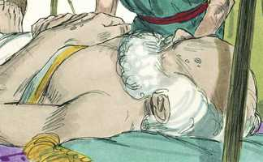 

**7** 	E os filhos de Israel frutificaram, aumentaram muito, e multiplicaram-se, e foram fortalecidos grandemente; de maneira que a terra se encheu deles.

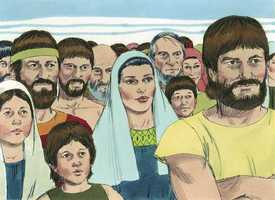  

**8** 	E levantou-se um novo rei sobre o Egito, que não conhecera a José;

> **Cmt MHenry**: *Versículos 8-14* A terra do Egito se converteu em casa de servidão para Israel. O lugar onde fomos felizes pode tornar-se, de repente, um lugar de aflição; o lugar do qual dissemos: Este é nosso lugar de consolo, pode ser a cruz maior para nós. Deixem de confiar no homem, e que não se diga de nenhum lugar deste lado do céu: "Este é meu repouso". Todos conheciam a José, o amavam e foram amáveis com seus irmãos por amor a ele; ainda os melhores e mais úteis serviços que um homem faça pelos outros, logo são esquecidos depois de sua morte. Nosso grande interesse deve ser servir a Deus e comprazer Àquele que não é injusto, como os homens, para esquecer nossa obra e trabalho de amor. A ofensa de Israel é que prospera. Não há coisa mais odiosa para um homem malvado que a prosperidade do justo. Os egípcios temiam que os filhos de Israel se unissem a seus inimigos e os expulsassem da terra. A maldade é sempre cobarde e injusta; faz que o homem tema onde nada há que temer, e que fuja quando ninguém o persegue. A sabedoria humana amiúde é néscia e muito pecaminosa. O povo de Deus tinha capatazes sobre eles, não só para oprimi-los, senão para afligi-los com suas cargas. Não somente os faziam servir para proveito do faraó, senão para amargá-lhes as vidas. Os israelitas aumentaram maravilhosamente. O cristianismo se difunde mais quando é perseguido: o sangue dos mártires foi a semente da igreja. Os que aceitam conselho contra o Senhor e seu Israel somente imaginam coisas vãs e acarretam maior afronta contra si mesmos.

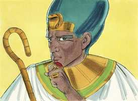 

**9** 	O qual disse ao seu povo: Eis que o povo dos filhos de Israel é muito, e mais poderoso do que nós.

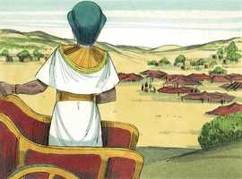 

**10** 	Eia, usemos de sabedoria para com eles, para que não se multipliquem, e aconteça que, vindo guerra, eles também se ajuntem com os nossos inimigos, e pelejem contra nós, e subam da terra.

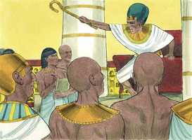 

**11** 	E puseram sobre eles maiorais de tributos, para os afligirem com suas cargas. Porque edificaram a Faraó cidades-armazéns, Pitom e Ramessés.

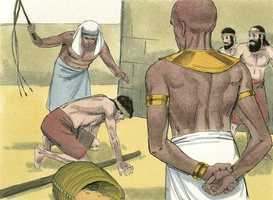 

**12** 	Mas quanto mais os afligiam, tanto mais se multiplicavam, e tanto mais cresciam; de maneira que se enfadavam por causa dos filhos de Israel.

**13** 	E os egípcios faziam servir os filhos de Israel com dureza;

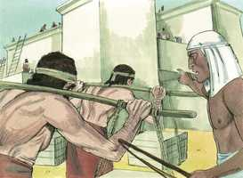 

**14** 	Assim que lhes fizeram amargar a vida com dura servidão, em barro e em tijolos, e com todo o trabalho no campo; com todo o seu serviço, em que os obrigavam com dureza.

**15** 	E o rei do Egito falou às parteiras das hebréias (das quais o nome de uma era Sifrá, e o da outra Puá),

> **Cmt MHenry**: *Versículos 15-22* Os egípcios trataram de destruir a Israel assassinado a seus filhos. A inimizade que há na semente da serpente contra a Semente da mulher, faz com que os homens esqueçam toda compaixão. Fica claro que os hebreus estavam agora sob uma bênção pouco comum. Vemos que os serviços feitos para o Deus de Israel são freqüentemente recompensados com bondade. O faraó deu a ordem de afogar todos os filhos varões dos hebreus. O inimigo que, por meio do faraó, tratava de destruir a igreja em seu estado infantil, se ocupa de frustrar o surgimento de reflexões sérias no coração do homem. Que temam pecar os que escapem, e clamem socorro ao Senhor, direta e fervorosamente. "

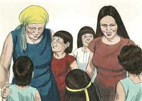 

**16** 	E disse: Quando ajudardes a dar à luz às hebréias, e as virdes sobre os assentos, se for filho, matai-o; mas se for filha, então viva.

**17** 	As parteiras, porém, temeram a Deus e não fizeram como o rei do Egito lhes dissera, antes conservavam os meninos com vida.

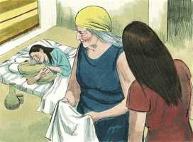 

**18** 	Então o rei do Egito chamou as parteiras e disse-lhes: Por que fizestes isto, deixando os meninos com vida?

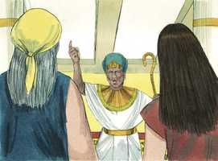 

**19** 	E as parteiras disseram a Faraó: É que as mulheres hebréias não são como as egípcias; porque são vivas, e já têm dado à luz antes que a parteira venha a elas.

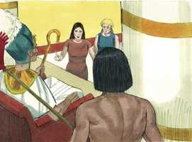 

**20** 	Portanto Deus fez bem às parteiras. E o povo se aumentou, e se fortaleceu muito.

**21** 	E aconteceu que, como as parteiras temeram a Deus, ele estabeleceu-lhes casas.

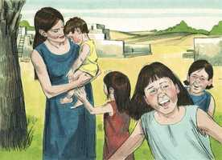 

**22** 	Então ordenou Faraó a todo o seu povo, dizendo: A todos os filhos que nascerem lançareis no rio, mas a todas as filhas guardareis com vida.

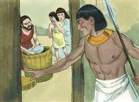 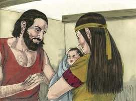 

> **Cmt MHenry** Intro: *• Versículos 1-7*> 28A-Os filhos de Israel aumentam no Egito depois da morte de*> *• Versículos 8-14*> *São oprimidos, mas se multiplicam sobremodo*> *• Versículos 15-22*> *Morte dos filhos varões*