# Êxodo Cap 02

**1** 	E FOI um homem da casa de Levi e casou com uma filha de Levi.

> **Cmt MHenry**: *Versículos 1-4* Observe a ordem da Providência: justo no momento em que a crueldade do Faraó chega ao máximo, mandando matar os meninos hebreus, nasce o libertador. Quando os homens se confabulam para levar a igreja à ruína, Deus está preparando sua salvação. Os pais de Moisés viram que era um menino formoso. A fé viva sente-se fortalecida com o menor indício do favor divino. [H](../58N-Hb/11.md#23)[ebreus 11.23](../58N-Hb/11.md#23) diz que pela fé os pais de Moisés o esconderam; tinham a promessa de que Israel seria preservado, e acreditaram nela. A fé na promessa de Deus anima a usar meios legais para obter misericórdia. O cumprimento de nosso dever vai seguido dos feitos de Deus. a fé em Deus sempre nos porá por acima do temor do homem. Ao cabo de três meses, quando já não podiam esconder mais o bebê, o colocaram numa arca de juncos na beira do rio, e sua irmã para que o vigiasse. Se o fraco afeto de uma mãe foi tão cuidadoso, que pensaremos dAquele cujo amor, cuja compaixão são infinitos, como Ele. Moisés nunca teve proteção mais poderosa a seu redor, que agora quando jaz sozinho, um indefeso bebê sobre as águas. Não há água, não há egípcio que possa machucá-lo. Deus está mais presente ao nosso lado quando parecemos mais abandonados e desamparados.

**2** 	E a mulher concebeu e deu à luz um filho; e, vendo que ele era formoso, escondeu-o três meses.

> **Cmt MHenry**: *CAPÍTULO 20A-Pv 21A-Ec 22A-Ct 23A-Is 24A-Jr 25A-Lm 26A-Ez 27A-Dn 28A-Os 29A-Jl

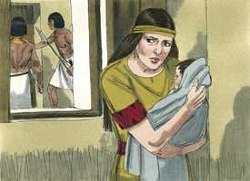 

**3** 	Não podendo, porém, mais escondê-lo, tomou uma arca de juncos, e a revestiu com barro e betume; e, pondo nela o menino, a pôs nos juncos à margem do rio.

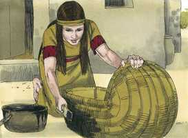 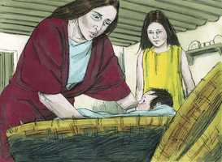 

**4** 	E sua irmã postou-se de longe, para saber o que lhe havia de acontecer.

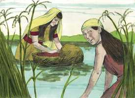 

**5** 	E a filha de Faraó desceu a lavar-se no rio, e as suas donzelas passeavam, pela margem do rio; e ela viu a arca no meio dos juncos, e enviou a sua criada, que a tomou.

> **Cmt MHenry**: *Versículos 5-10* Venham, vejam o lugar onde esse grande homem, Moisés, jaz sendo um menininho; numa cesta de juncos na beira do rio. Se tiver permanecido longo tempo ali, teria perecido. Porém, ao lugar onde está este pobre bebê desamparado, Deus traz a filha do Faraó e inclina seu coração à compaixão, coisa que ela se atreve a fazer quando ninguém mais podia. O cuidado que Deus teve de nós em nossa infância deveríamos mencioná-lo repetidas vezes para seu louvor. O faraó tratou cruelmente de destruir a Israel, mas sua própria filha teve dó de um menino hebreu e não só isso, senão que, sem sabê-lo, preservou o libertador de Israel e deu a Moisés uma boa ama, isto é, sua própria mãe. Para que tivesse uma ama hebraica, a irmã de Moisés trouxe a sua mãe como ama. Moisés foi tratado como filho da filha do Faraó. Muitos que têm um nascimento escuro e pobre, por atos surpreendentes da Providência são colocados a grande altura no mundo, para que os homens saibam que Deus reina.

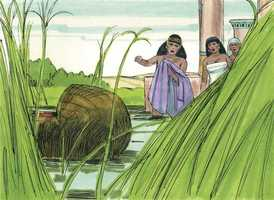 

**6** 	E abrindo-a, viu ao menino e eis que o menino chorava; e moveu-se de compaixão dele, e disse: Dos meninos dos hebreus é este.

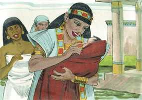 

**7** 	Então disse sua irmã à filha de Faraó: Irei chamar uma ama das hebréias, que crie este menino para ti?

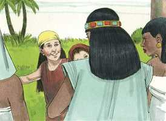 

**8** 	E a filha de Faraó disse-lhe: Vai. Foi, pois, a moça, e chamou a mãe do menino.

**9** 	Então lhe disse a filha de Faraó: Leva este menino, e cria-mo; eu te darei teu salário. E a mulher tomou o menino, e criou-o.

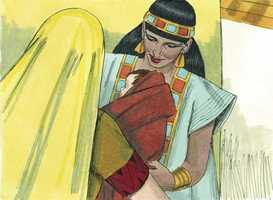 

**10** 	E, quando o menino já era grande, ela o trouxe à filha de Faraó, a qual o adotou; e chamou-lhe Moisés, e disse: Porque das águas o tenho tirado.

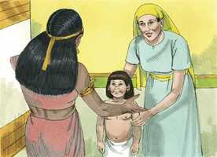 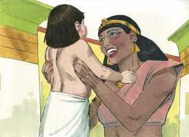 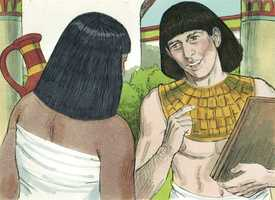 

**11** 	E aconteceu naqueles dias que, sendo Moisés já homem, saiu a seus irmãos, e atentou para as suas cargas; e viu que um egípcio feria a um hebreu, homem de seus irmãos.

> **Cmt MHenry**: *Versículos 11-15* Moisés assumiu atrevidamente a causa do Povo de Deus. Fica claro em [Hebreus 11](../58N-Hb/11.md#0) que isto foi feito pela fé, com o propósito pleno de abandonar as honras, as riquezas e os prazeres da categoria que tinha entre os egípcios. Pela graça de Deus foi um príncipe da fé em Cristo, que vence ao mundo. Devido a que tinha a certeza de que Israel era o povo de Deus, estava disposto não só a arriscá-lo tudo, senão a sofrer por amor a Ele. Por concessão especial do Céu, que não senta jurisprudência para outros casos, Moisés matou a um egípcio e resgatou a um israelita oprimido. Além disso, tratou de pôr fim a uma disputa entre dois hebreus. A recriminação de Moisés ainda poderia ser usada. Não podemos aplicá-lo aos que disputam, e com seus ardorosos debates dividem e debilitam a igreja cristã? Esquecem que são irmãos. Aquele que agia errado atacou a Moisés. Irar-se pela repreensão é sinal de culpa. Os homens não sabem o que fazem, nem quão inimigos são de si mesmos, quando resistem e desprezam a repreensão fiel e a quem a faz. Moisés poderia ter dito: Se este é o espírito dos hebreus, voltarei à corte e serei o filho da filha de Faraó". Todavia, devemos ter cuidado de não colocar-nos em contra dos caminhos de Deus e de seu povo, por tolice e maus modos de algumas pessoas que professam a religião. Moisés viu-se obrigado a fugir à terra de Madiã. Deus ordenou isto com fins sábios e santos.

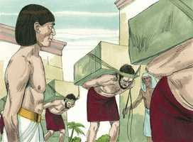 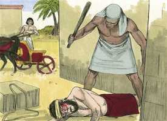 

**12** 	E olhou a um e a outro lado e, vendo que não havia ninguém ali, matou ao egípcio, e escondeu-o na areia.

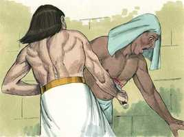 

**13** 	E tornou a sair no dia seguinte, e eis que dois homens hebreus contendiam; e disse ao injusto: Por que feres a teu próximo?

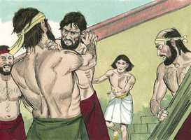 

**14** 	O qual disse: Quem te tem posto a ti por maioral e juiz sobre nós? Pensas matar-me, como mataste o egípcio? Então temeu Moisés, e disse: Certamente este negócio foi descoberto.

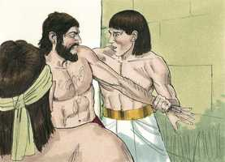 

**15** 	Ouvindo, pois, Faraó este caso, procurou matar a Moisés; mas Moisés fugiu de diante da face de Faraó, e habitou na terra de Midiã, e assentou-se junto a um poço.

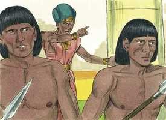 

**16** 	E o sacerdote de Midiã tinha sete filhas, as quais vieram tirar água, e encheram os bebedouros, para dar de beber ao rebanho de seu pai.

> **Cmt MHenry**: *Versículos 16-22* Moisés encontrou refúgio em Madiã. Embora tinha sido criado e educado na sabedoria da corte, esteve disposto a ajudar às filhas de Reuel a que dessem de beber a seus rebanhos. Moisés gostava de fazer *justiça* e agir em defesa dos que via prejudicados, coisa que todo homem deveria fazer se estiver a seu alcance. Ele gostava de fazer 18A-Jo 46N-1Co 47N-2Co 62N-1Jo 63N-2Jo 64N-3Jo bem*; onde quer que nos coloque a providência de Deus, devemos desejar sermos úteis e tratar de sê-lo; e quando não possamos fazer o bem que devemos, temos de estar preparados para fazer o bem que possamos. Moisés se recomendou sozinho ao príncipe de Madiã, o qual casou uma de suas filhas com Moisés, com a qual teve um filho, Gerson, "um estranho ali", para que lembrasse a terra na qual tinha sido estrangeiro.

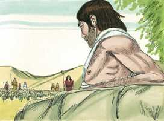 

**17** 	Então vieram os pastores, e expulsaram-nas dali; Moisés, porém, levantou-se e defendeu-as, e deu de beber ao rebanho.

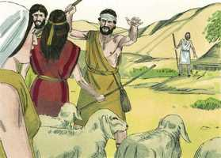 

**18** 	E voltando elas a Reuel seu pai, ele disse: Por que hoje tornastes tão depressa?

**19** 	E elas disseram: Um homem egípcio nos livrou da mão dos pastores; e também nos tirou água em abundância, e deu de beber ao rebanho.

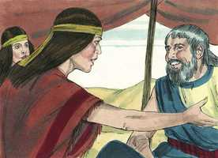 

**20** 	E disse a suas filhas: E onde está ele? Por que deixastes o homem? Chamai-o para que coma pão.

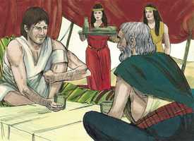 

**21** 	E Moisés consentiu em morar com aquele homem; e ele deu a Moisés sua filha Zípora,

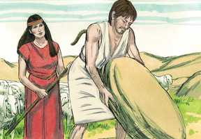 

**22** 	A qual deu à luz um filho, a quem ele chamou Gérson, porque disse: Peregrino fui em terra estranha.

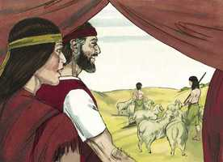 

**23** 	E aconteceu, depois de muitos dias, que morrendo o rei do Egito, os filhos de Israel suspiraram por causa da servidão, e clamaram; e o seu clamor subiu a Deus por causa de sua servidão.

> **Cmt MHenry**: *Versículos 23-25* Embora não seguiu o assassinato dos meninos varões, continuou a servidão dos israelitas no Egito. Às vezes, o Senhor tolera que a vara dos malvados caia longa e pesada sobre a sorte do justo. afinal, submetidos a suas tribulações, começaram a pensar em Deus. é sinal de que o Senhor vem a nós com liberação quando se inclina e faz que clamemos a Ele. Deus *ouviu* seus *gemidos*; deixou em claro que tinha tomado nota de suas lamentações. Ele *lembrou* sua aliança, da qual nunca esquece. Levou isto em consideração, e não qualquer mérito deles. Ele *olhou* para os filhos de Israel. Moisés os olhou e os compadeceu, porém, agora Deus os olhou e os ajudou. Ele *teve respeito* por eles. Seus olhos estavam agora fitos sobre Israel para mostrar-se em favor deles. Deus sempre é assim, uma muito pronta ajuda nas tribulações. Então, animem-se vocês, que cientes de culpa e servidão, estão esperando nEle para serem liberados. Deus, em Cristo Jesus, também olha para eles. Um chamado de amor se une a uma promessa do Redentor. Venham a mim todos os que estejam cansados e carregados, e eu os farei descansar ([Mt 11.28](../40N-Mt/11.md#28)). "

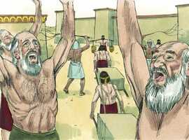 

**24** 	E ouviu Deus o seu gemido, e lembrou-se Deus da sua aliança com Abraão, com Isaque, e com Jacó;

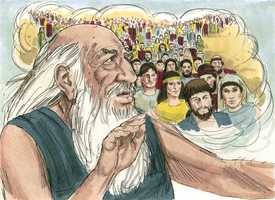 

**25** 	E viu Deus os filhos de Israel, e atentou Deus para a sua condição.

> **Cmt MHenry** Intro: *• Versículos 1-4*> *Nasce Moisés e o deixam no rio*> *• Versículos 5-10*> *O encontram e o levam para a filha do Faraó*> *• Versículos 11-15*> *Moisés mata um egípcio e foge a Madiã*> *• Versículos 16-22*> *Moisés casa com a filha de Jetro*> *• Versículos 23-25*> *Deus ouve aos israelitas*