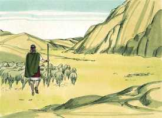
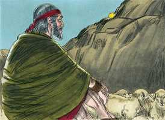
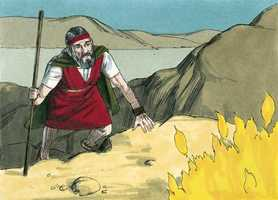
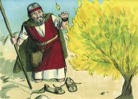
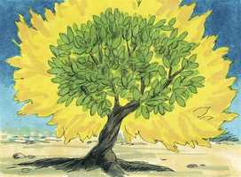
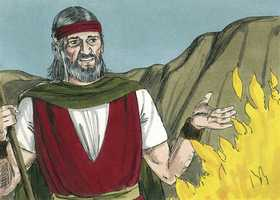
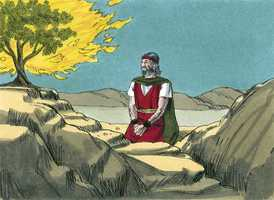
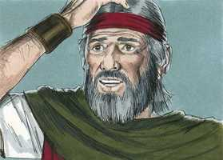
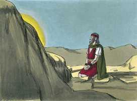
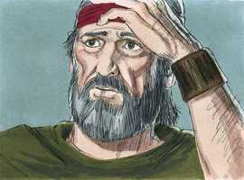

# Êxodo Cap 03

**1** 	E APASCENTAVA Moisés o rebanho de Jetro, seu sogro, sacerdote em Midiã; e levou o rebanho atrás do deserto, e chegou ao monte de Deus, a Horebe.

> **Cmt MHenry**: *Versículos 1-6* A vida de Moisés divide-se em três períodos de quarenta anos: os primeiros quarenta que passou como príncipe na corte do Faraó; os segundos, como pastor em Madiã; os terceiros, como rei em Jesurum. Quão variável é a vida do homem! A primeira aparição de Deus achou a Moisés cuidando ovelhas. Parece um pobre emprego para um homem de sua capacidade e educação, embora esteja satisfeito com ele; deste modo aprende a mansidão e o contentamento, pelos quais se destaca mais que por todo seu saber nos escritos sagrados. Satanás gosta de encontrar-nos ociosos. Deus se agrada quando nos encontra ocupados. Estar sozinhos é bom para nossa comunhão com Deus. Com grande assombro, Moisés viu uma sarça que ardia sem um fogo que a acendesse. A sarça ardia mas não se consumir, emblema da igreja escravizada no Egito. Em forma adequada nos lembra a igreja de toda época que, ainda sob as perseguições mais severas, não pôde ser destruída porque Deus a conservou. Na Escritura, o fogo é um emblema da justiça e santidade divinas, e das aflições e tribulações com que Deus prova e purifica a seu povo, e ainda o batismo do Espírito Santo, pelo qual são consumidos os afetos pecaminosos, e a alma muda à natureza e imagem de Deus. Deus fez a Moisés um chamado por graça, ao qual ele deu uma resposta imediata. Os que hão de ter comunhão com Deus devem prestá-lhe atenção nas ordenanças através das quais lhe apraz manifestar-se a si mesmo e a sua glória,embora seja numa sarça. Descalçar-se era um sinal de respeito e submissão. Para chegar-nos a Deus devemos fazê-lo pausadamente e com uma solene preparação, evitando cuidadosamente todo o que pareça leviano, vulgar e inconveniente a seu serviço. Deus não diz: "*Eu era* o Deus de Abraão, Isaque e Jacó", senão "*Eu sou*". Os patriarcas ainda vivem, depois de tantos anos que seus corpos tem permanecido no túmulo. Nenhuma extensão no tempo pode separar a alma dos justos de seu Criador. Dizendo isto, Deus ensinou a Moisés acerca de outro mundo e fortaleceu sua crença num estado futuro. Assim o interpreta nosso Senhor Jesus, o qual, a partir disto, prova que os mortos ressuscitam ([Lc 20.37](../42N-Lc/20.md#37)). Moisés escondeu seu rosto, como envergonhado ao tempo que assustado de olhar para Deus. quanto mais vemos de Deus e de sua graça e seu amor na aliança, mais motivo veremos para adorá-lo com reverência e piedoso temor.

 

**2** 	E apareceu-lhe o anjo do Senhor em uma chama de fogo do meio duma sarça; e olhou, e eis que a sarça ardia no fogo, e a sarça não se consumia.

 

**3** 	E Moisés disse: Agora me virarei para lá, e verei esta grande visão, porque a sarça não se queima.

> **Cmt MHenry**: *CAPÍTULO 30A-Am 31A-Ob 32A-Jn 33A-Mq 34A-Na 35A-Hc 36A-Sf 37A-Ag 38A-Zc 39A-Ml

 

**4** 	E vendo o Senhor que se virava para ver, bradou Deus a ele do meio da sarça, e disse: Moisés, Moisés. Respondeu ele: Eis-me aqui.

 

**5** 	E disse: Não te chegues para cá; tira os sapatos de teus pés; porque o lugar em que tu estás é terra santa.

**6** 	Disse mais: Eu sou o Deus de teu pai, o Deus de Abraão, o Deus de Isaque, e o Deus de Jacó. E Moisés encobriu o seu rosto, porque temeu olhar para Deus.

**7** 	E disse o Senhor: Tenho visto atentamente a aflição do meu povo, que está no Egito, e tenho ouvido o seu clamor por causa dos seus exatores, porque conheci as suas dores.

> **Cmt MHenry**: *Versículos 7-10* Deus nota as aflições de Israel. Suas *angústias*; até as angústias secretas do povo de Deus lhe são conhecidas. Seu *clamor*: Deus ouve os gritos de seu povo afligido. A *opressão* que suportavam; os opressores mais altos e grandes de seu povo não estão por acima dEle. Deus promete pronta libertação por métodos alheios aos caminhos comuns da providência. Aos que Deus, por sua graça, libera de um Egito espiritual, os levará à Canaã celestial.

 

**8** 	Portanto desci para livrá-lo da mão dos egípcios, e para fazê-lo subir daquela terra, a uma terra boa e larga, a uma terra que mana leite e mel; ao lugar do cananeu, e do heteu, e do amorreu, e do perizeu, e do heveu, e do jebuseu.

**9** 	E agora, eis que o clamor dos filhos de Israel é vindo a mim, e também tenho visto a opressão com que os egípcios os oprimem.

**10** 	Vem agora, pois, e eu te enviarei a Faraó para que tires o meu povo (os filhos de Israel) do Egito.

**11** 	Então Moisés disse a Deus: Quem sou eu, que vá a Faraó e tire do Egito os filhos de Israel?

> **Cmt MHenry**: *Versículos 11-15* Moisés tinha-se crido capaz, antes, de liberar a Israel, porém se deu à tarefa com demasiada pressa. Agora, quando é a pessoa mais adequada para isso, conhece suas próprias fraquezas. Este foi o efeito de um maior conhecimento de Deus e de si mesmo. anteriormente foi a confiança em si mesmo misturada com uma firme fé e grande zelo; agora, um pecaminoso desconfiar em Deus se arrasta disfarçado de humildade; tão defeituosas são as graças mais firmes e os melhores deveres dos santos mais proeminentes. Mas todas as objeções recebem resposta: "Certamente eu estarei contigo". Isso basta. Dois nomes pelos quais Deus será agora conhecido. Um nome que denota que é em si: EU SOU O QUE SOU. Isto explica seu nome Jeová e significa: 1) *Que Ele é auto-existente*: e tem seu ser de Si mesmo. 2) *Que é eterno e imutável* e sempre o mesmo, ontem, hoje e pelos séculos. 3) *Que Ele é incompreensível*; não podemos, por médios humanos, desentranhar o que é: este nome detém todas as indagatórias ousadas e curiosas acerca de Deus. 4) *Que Ele é fiel e veraz* a todas suas promessas, imutável em sua palavra assim como em sua natureza; que Israel saiba disso, EU SOU me enviou a vocês. Eu sou, e não há ninguém fora de mim. Todo o resto tem seu ser de Deus e é totalmente dependente dEle. Além disso, eis aqui um nome que denota o que Deus é para seu povo. O Senhor Deus de seus pais me enviou. Moisés deve reviver neles a religião de seus pais, que estava quase perdida; e, então, eles podiam ter a expectativa do cumprimento rápido das promessas feitas a seus pais.

 

**12** 	E disse: Certamente eu serei contigo; e isto te será por sinal de que eu te enviei: Quando houveres tirado este povo do Egito, servireis a Deus neste monte.

 

**13** 	Então disse Moisés a Deus: Eis que quando eu for aos filhos de Israel, e lhes disser: O Deus de vossos pais me enviou a vós; e eles me disserem: Qual é o seu nome? Que lhes direi?

 

**14** 	E disse Deus a Moisés: EU SOU O QUE SOU. Disse mais: Assim dirás aos filhos de Israel: EU SOU me enviou a vós.

 

**15** 	E Deus disse mais a Moisés: Assim dirás aos filhos de Israel: O Senhor Deus de vossos pais, o Deus de Abraão, o Deus de Isaque, e o Deus de Jacó, me enviou a vós; este é meu nome eternamente, e este é meu memorial de geração em geração.

 

**16** 	Vai, e ajunta os anciãos de Israel e dize-lhes: O Senhor Deus de vossos pais, o Deus de Abraão, de Isaque e de Jacó, me apareceu, dizendo: Certamente vos tenho visitado e visto o que vos é feito no Egito.

> **Cmt MHenry**: *Versículos 16-22* O êxito de Moisés com os anciãos de Israel seria bom. Deus, que, por sua graça, inclina o coração e abre o ouvido, pôde dizer de antemão: Eles escutarão tua voz, pois Ele lhes daria a disposição neste dia de poder. Em quanto ao Faraó, aqui lhe diz a Moisés que as petições, as persuasões e as queixas humildes não prevaleceriam com ele; nem sequer uma mão poderosa estendida em sinais e prodígios. Mas os que não se inclinam ante o poder de sua palavra, certamente serão quebrantados pelo poder da mão de Deus. o povo do Faraó daria riquezas a Israel em sua partida. Na tirania do Faraó e a opressão de Israel vemos o estado miserável e abjeto dos pecadores. Embora o jugo é áspero, eles trabalham como escravos até que o Senhor manda a redenção. Junto com os convites do Evangelho, Deus envia o ensino de seu Espírito. Assim, os homens recebem a disposição para buscar e esforçar-se por sua liberação. Satanás perde seu poder de retê-los, eles se saem adiante com todo o que têm e são, e aplicam toda a glória a Deus e ao serviço de sua igreja. "

 

**17** 	Portanto eu disse: Far-vos-ei subir da aflição do Egito à terra do cananeu, do heteu, do amorreu, do perizeu, do heveu e do jebuseu, a uma terra que mana leite e mel.

**18** 	E ouvirão a tua voz; e irás, tu com os anciãos de Israel, ao rei do Egito, e dir-lhe-eis: O Senhor Deus dos hebreus nos encontrou. Agora, pois, deixa-nos ir caminho de três dias para o deserto, para que sacrifiquemos ao Senhor nosso Deus.

**19** 	Eu sei, porém, que o rei do Egito não vos deixará ir, nem ainda por uma mão forte.

**20** 	Porque eu estenderei a minha mão, e ferirei ao Egito com todas as minhas maravilhas que farei no meio dele; depois vos deixará ir.

**21** 	E eu darei graça a este povo aos olhos dos egípcios; e acontecerá que, quando sairdes, não saireis vazios,

**22** 	Porque cada mulher pedirá à sua vizinha e à sua hóspeda jóias de prata, e jóias de ouro, e vestes, as quais poreis sobre vossos filhos e sobre vossas filhas; e despojareis os egípcios.

> **Cmt MHenry** Intro: *• Versículos 1-6*> *Deus se aparece a Moisés numa sarça ardente*> *• Versículos 7-10*> *Deus envia Moisés para liberar a Israel*> *• Versículos 11-15*> *O nome Jeová*> *• Versículos 16-22*> *Promessa de liberação para os israelitas*