# Êxodo Cap 04

**1** 	ENTÃO respondeu Moisés, e disse: Mas eis que não me crerão, nem ouvirão a minha voz, porque dirão: O Senhor não te apareceu.

> **Cmt MHenry**: *Versículos 1-9* Moisés diz que a gente não crerá a menos que ele lhes mostre algum sinal. Deus lhe dá poder para fazer milagres. Mas os que na atualidade se ocupam em entregar a mensagem de Deus aos homens não têm poder para operar milagres: o caráter deles e sua doutrina devem ser provados pela Palavra de Deus a qual apelam. Estes milagres se referem especialmente aos milagres do Senhor Jesus Cristo. Somente correspondia a Ele expulsar da alma o poder do diabo e sarar a alma da lepra do pecado; e assim era para Ele, primeiro expulsar ao diabo e curar a lepra do corpo.

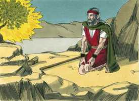 

**2** 	E o Senhor disse-lhe: Que é isso na tua mão? E ele disse: Uma vara.

**3** 	E ele disse: Lança-a na terra. Ele a lançou na terra, e tornou-se em cobra; e Moisés fugia dela.

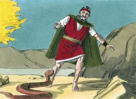 

**4** 	Então disse o Senhor a Moisés: Estende a tua mão e pega-lhe pela cauda. E estendeu sua mão, e pegou-lhe pela cauda, e tornou-se em vara na sua mão;

> **Cmt MHenry**: *CAPÍTULO 40N-Mt 41N-Mc 42N-Lc 43N-Joa 44N-At 45N-Rm 46N-1Co 47N-2Co 48N-Gl 49N-Ef

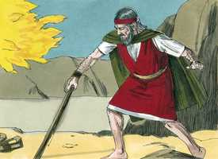 

**5** 	Para que creiam que te apareceu o Senhor Deus de seus pais, o Deus de Abraão, o Deus de Isaque e o Deus de Jacó.

**6** 	E disse-lhe mais o Senhor: Põe agora a tua mão no teu seio. E, tirando-a, eis que a sua mão estava leprosa, branca como a neve.

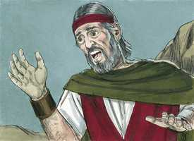 

**7** 	E disse: Torna a por a tua mão no teu seio. E tornou a colocar sua mão no seu seio; depois tirou-a do seu seio, e eis que se tornara como a sua carne.

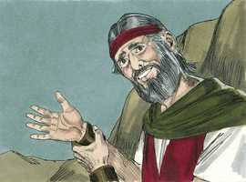 

**8** 	E acontecerá que, se eles não te crerem, nem ouvirem a voz do primeiro sinal, crerão à voz do derradeiro sinal;

**9** 	E se acontecer que ainda não creiam a estes dois sinais, nem ouvirem a tua voz, tomarás das águas do rio, e as derramarás na terra seca; e as águas, que tomarás do rio, tornar-se-ão em sangue sobre a terra seca.

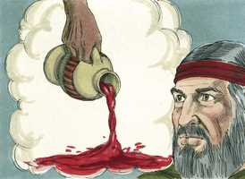 

**10** 	Então disse Moisés ao Senhor: Ah, meu Senhor! eu não sou homem eloqüente, nem de ontem nem de anteontem, nem ainda desde que tens falado ao teu servo; porque sou pesado de boca e pesado de língua.

> **Cmt MHenry**: *Versículos 10-17* Moisés seguiu com reticência a obra que Deus lhe designou; havia muita cobardia, indolência e incredulidade nele. Não devemos julgar os homens pela prontidão de seu discurso. A língua tardia pode ter muita sabedoria e verdadeiro valor. Às vezes Deus escolhe como mensageiros seus aos que têm em grau mínimo as vantagens da arte ou da natureza, para que neles possa ver-se sua graça de forma mais gloriosa. Os discípulos de Cristo não eram oradores, até que o Espírito Santo os fez tais. Deus condescende a responder à escusa de Moisés. Até a auto-desconfiança que nos impede cumprir 18A-Jo 46N-1Co 47N-2Co 62N-1Jo 63N-2Jo 64N-3Jo dever* ou nos obstrui no trabalho é muito desagradável para o Senhor. porém, enquanto culpamos a Moisés por sua atitude neste serviço perigoso, perguntemos a nossos corações se não estamos descuidando deveres mais fáceis e menos perigosos. A língua de Arão, com a cabeça e o coração de Moisés, comporiam um ser completamente apto para esta tarefa. Deus promete "Eu estarei com tua boca e com sua boca". Até Arão, que podia falar bem, não poderia falar deste cometido a menos que Deus lhe desse permanente ensino e ajuda; pois sem a ajuda constante da graça divina até os melhores dons falharão.

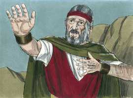 

**11** 	E disse-lhe o Senhor: Quem fez a boca do homem? ou quem fez o mudo, ou o surdo, ou o que vê, ou o cego? Não sou eu, o Senhor?

**12** 	Vai, pois, agora, e eu serei com a tua boca e te ensinarei o que hás de falar.

**13** 	Ele, porém, disse: Ah, meu Senhor! Envia pela mão daquele a quem tu hás de enviar.

 

**14** 	Então se acendeu a ira do Senhor contra Moisés, e disse: Não é Arão, o levita, teu irmão? Eu sei que ele falará muito bem; e eis que ele também sai ao teu encontro; e, vendo-te, se alegrará em seu coração.

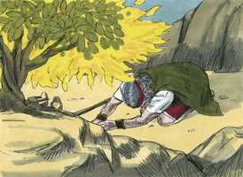 

**15** 	E tu lhe falarás, e porás as palavras na sua boca; e eu serei com a tua boca, e com a dele, ensinando-vos o que haveis de fazer.

**16** 	E ele falará por ti ao povo; e acontecerá que ele te será por boca, e tu lhe serás por Deus.

**17** 	Toma, pois, esta vara na tua mão, com que farás os sinais.

**18** 	Então foi Moisés, e voltou para Jetro, seu sogro, e disse-lhe: Eu irei agora, e tornarei a meus irmãos, que estão no Egito, para ver se ainda vivem. Disse, pois, Jetro a Moisés: Vai em paz.

> **Cmt MHenry**: *Versículos 18-23* Depois que apareceu na sarça, Deus falou freqüentemente com Moisés. O Faraó tinha endurecido seu coração contra os gemidos e clamores dos israelitas oprimidos; agora Deus, no caminho de fazer um justo juízo, endurece o coração do Faraó contra o ensinamento que lhe deixam os milagres e o terror das pragas. Todavia, seja que o Faraó ouça ou seja que proíba, Moisés deve dizê-lhe: Assim diz o Senhor. Deve exigir a libertação de Israel: Deixa ir meu filho; não só a meu servo ao qual não tens direito de reter, senão a meu filho. Meu filho é quem me serve e, portanto, deve ser liberado, por Ele deve rogar-se. Em caso de rejeição: Eu matarei a teu filho, teu primogênito. Como os homens tratam ao povo de Deus, assim devem ser tratados.

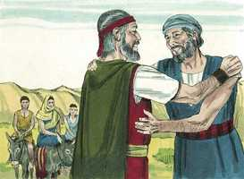 

**19** 	Disse também o Senhor a Moisés em Midiã: Vai, volta para o Egito; porque todos os que buscavam a tua alma morreram.

**20** 	Tomou, pois, Moisés sua mulher e seus filhos, e os levou sobre um jumento, e tornou à terra do Egito; e Moisés tomou a vara de Deus na sua mão.

 

**21** 	E disse o Senhor a Moisés: Quando voltares ao Egito, atenta que faças diante de Faraó todas as maravilhas que tenho posto na tua mão; mas eu lhe endurecerei o coração, para que não deixe ir o povo.

**22** 	Então dirás a Faraó: Assim diz o Senhor: Israel é meu filho, meu primogênito.

**23** 	E eu te tenho dito: Deixa ir o meu filho, para que me sirva; mas tu recusaste deixá-lo ir; eis que eu matarei a teu filho, o teu primogênito.

**24** 	E aconteceu no caminho, numa estalagem, que o Senhor o encontrou, e o quis matar.

> **Cmt MHenry**: *Versículos 24-31* Deus sai irado ao encontro de Moisés. O Senhor o ameaça de morte ou com mandá-lhe uma doença como castigo por ter passado por alto a circuncisão de seu filho. Quando Deus nos dá a conhecer o que está mal em nossa vida, devemos pôr toda diligência em emendar-nos com prontidão. Esta é a voz da vara cada vez que a usa; nos chama a que nos voltemos a quem nos tem disciplinado. Deus enviou a Arão ao encontro de Moisés. quanto melhor viam eles que Deus era quem os reunia, mais agradável era seu encontro. Os anciãos de Israel os encontraram em fé e estiveram dispostos a obedecê-los. Freqüentemente acontece que se encontra menos dificuldade que a esperada nas empresas que são conforme com a vontade de Deus e para sua glória. Somente levantemo-nos e esforcemo-nos em nossa obra, que o Senhor estará conosco e nos prosperará. Se Israel acolheu as notícias de sua libertação e adorou ao Senhor, como não deveríamos nós acolher a boa nova da redenção, para abraçá-la por fé e adorar ao Redentor! "

**25** 	Então Zípora tomou uma pedra aguda, e circuncidou o prepúcio de seu filho, e lançou-o a seus pés, e disse: Certamente me és um esposo sanguinário.

**26** 	E desviou-se dele. Então ela disse: Esposo sanguinário, por causa da circuncisão.

**27** 	Disse o Senhor a Arão: Vai ao deserto, ao encontro de Moisés. E ele foi, e encontrou-o no monte de Deus, e beijou-o.

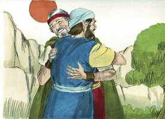 

**28** 	E relatou Moisés a Arão todas as palavras do Senhor, com que o enviara, e todos os sinais que lhe mandara.

**29** 	Então foram Moisés e Arão, e ajuntaram todos os anciãos dos filhos de Israel.

**30** 	E Arão falou todas as palavras que o Senhor falara a Moisés e fez os sinais perante os olhos do povo.

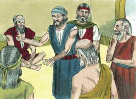 

**31** 	E o povo creu; e quando ouviram que o Senhor visitava aos filhos de Israel, e que via a sua aflição, inclinaram-se, e adoraram.

> **Cmt MHenry** Intro: *• Versículos 1-9*> *Deus dá poder a Moisés para fazer milagres*> *• Versículos 10-17*> *Moisés não quer ser enviado – Arão terá de ajudá-lo*> *• Versículos 18-23*> *Moisés parte de Madiã – A mensagem de Deus para Faraó*> *• Versículos 24-31*> *O desagrado de Deus contra Moisés – Encontro com Arão – O*> *povo crê neles*