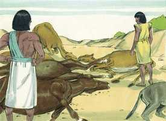
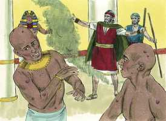
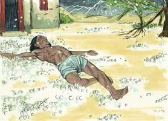
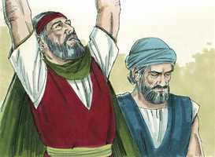
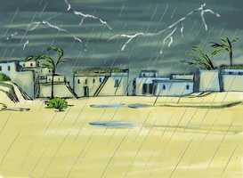
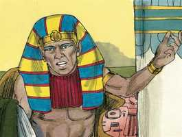

# Êxodo Cap 09

**1** 	DEPOIS o Senhor disse a Moisés: Vai a Faraó, e dize-lhe: Assim diz o Senhor Deus dos hebreus: Deixa ir o meu povo, para que me sirva.

> **Cmt MHenry**: *Versículos 1-7* Deus quer que Israel seja liberado; Faraó se opõe, e está em jogo de quem é a palavra que prevalecerá. A mão do Senhor cai de imediato sobre o gado, muito do qual, alguns de todas as classes, morre por um tipo infeccioso de doença. Esta foi uma grande perda para seus donos; eles tinham empobrecido a Israel e, agora, Deus os empobrecia a eles. Deve ver-se a mão de Deus ainda na doença e a morte do gado, porque não cai um pardal na terra sem a vontade de nosso Pai. Nada do gado dos israelitas morreria; o Senhor marcaria a diferença. O gado morreu. Os egípcios adoravam seu gado. O que nós idolatramos, Deus considera justo tirá-lo de nós. Este tirano orgulhoso e cruel opressor merecia um tratamento exemplar de parte do justo Juiz do universo. Ninguém que seja castigado conforme ao que merece pode queixar-se com justiça. A dureza do coração denota um estado mental no qual não fazem impressão perdurável as ameaças ou as promessas, os juízos ou as misericórdias. A consciência está endurecida e o coração cheio de orgulho e presunção, de modo que eles persistem na incredulidade e a desobediência. Este estado mental também se chama de coração de pedra. Muito diferente é o coração de carne, o coração contrito e humilhado. Os pecadores não devem culpar a ninguém, só a si mesmos, pelo orgulho e a impiedade que abusa da generosidade e da paciência de Deus. porque seja como for que o Senhor endurece os corações dos homens, sempre é como um castigo de pecados prévios.

**2** 	Porque se recusares deixá-los ir, e ainda por força os detiveres,

**3** 	Eis que a mão do Senhor será sobre teu gado, que está no campo, sobre os cavalos, sobre os jumentos, sobre os camelos, sobre os bois, e sobre as ovelhas, com pestilência gravíssima.

**4** 	E o Senhor fará separação entre o gado dos israelitas e o gado dos egípcios, para que nada morra de tudo o que for dos filhos de Israel.

**5** 	E o Senhor assinalou certo tempo, dizendo: Amanhã fará o Senhor esta coisa na terra.

**6** 	E o Senhor fez isso no dia seguinte, e todo o gado dos egípcios morreu; porém do gado dos filhos de Israel não morreu nenhum.

 

**7** 	E Faraó enviou a ver, e eis que do gado de Israel não morrera nenhum; porém o coração de Faraó se agravou, e não deixou ir o povo.

**8** 	Então disse o Senhor a Moisés e a Arão: Tomai vossas mãos cheias de cinza do forno, e Moisés a espalhe para o céu diante dos olhos de Faraó;

> **Cmt MHenry**: *Versículos 8-12* Quando os egípcios não foram comovidos pela morte do gado, Deus mandou uma praga que os atacou em seus próprios corpos. Se os juízos menores não operam, Deus manda um maior. Às vezes, Deus mostra aos homens seu pecado mediante o castigo. Eles haviam oprimido a Israel nos fornos, e agora as cinzas dos fornos se constituem no terror deles. A própria praga era muito incômoda. Os mesmos magos foram atacados pelos furúnculos. O poder deles foi antes refreado; mas eles continuaram opondo-se a Moisés e confirmando ao Faraó em sua incredulidade, até que se viram obrigados a ceder. O Faraó insistiu em sua obstinação. Tinha endurecido seu coração e, agora, Deus justamente lhe deu em conformidade com as injúrias de seu coração, permitindo que Satanás o cegasse e endurecesse. Se os homens fecham seus olhos à luz, é justo que Deus lhes feche seus olhos. Este é o juízo mais doloroso sob o qual pode estar um homem fora do inferno.

**9** 	E tornar-se-á em pó miúdo sobre toda a terra do Egito, e se tornará em sarna, que arrebente em úlceras, nos homens e no gado, por toda a terra do Egito.

> **Cmt MHenry**: *CAPÍTULO 9*

**10** 	E eles tomaram a cinza do forno, e puseram-se diante de Faraó, e Moisés a espalhou para o céu; e tornou-se em sarna, que arrebentava em úlceras nos homens e no gado;

 

**11** 	De maneira que os magos não podiam parar diante de Moisés, por causa da sarna; porque havia sarna nos magos, e em todos os egípcios.

**12** 	Porém o Senhor endureceu o coração de Faraó, e não os ouviu, como o Senhor tinha dito a Moisés.

**13** 	Então disse o Senhor a Moisés: Levanta-te pela manhã cedo, e põe-te diante de Faraó, e dize-lhe: Assim diz o Senhor Deus dos hebreus: Deixa ir o meu povo, para que me sirva;

> **Cmt MHenry**: *Versículos 13-21* Aqui se ordena a Moisés que leve a Faraó uma mensagem espantosa. A Providência o ordenou: que Moisés tivesse de enfrentar-se com um homem de espírito tão feroz e porfiado como este Faraó; e todo o converte num indigitado exemplo do poder que Deus tem para humilhar e derrubar o mais orgulhoso de seus inimigos. Quando a justiça de Deus ameaça ruína, ao mesmo tempo sua misericórdia mostra uma saída. Deus não somente fez distinção entre os egípcios e os israelitas, senão entre um e outro egípcio. Se Faraó não se rendia e assim impedia o juízo mesmo, os que acataram a advertência poderiam buscar refúgio. Alguns acreditaram, tiveram medo e albergaram a seus servos e seu gado em suas casas, e essa foi uma sábia decisão. Até entre os servos de faraó houve alguns que tremeram ante as palavras de Deus, e os filhos de Israel não terão temor? Porém outros não creram, e deixaram o gado no campo. A incredulidade obstinada é surda às melhores advertências e aos conselhos mais sábios, o que deixa que o sangue dos que perecem caia sobre suas cabeças.

**14** 	Porque esta vez enviarei todas as minhas pragas sobre o teu coração, e sobre os teus servos, e sobre o teu povo, para que saibas que não há outro como eu em toda a terra.

**15** 	Porque agora tenho estendido minha mão, para te ferir a ti e ao teu povo com pestilência, e para que sejas destruído da terra;

**16** 	Mas, deveras, para isto te mantive, para mostrar meu poder em ti, e para que o meu nome seja anunciado em toda a terra.

**17** 	Tu ainda te exaltas contra o meu povo, para não o deixar ir?

**18** 	Eis que amanhã por este tempo farei chover saraiva mui grave, qual nunca houve no Egito, desde o dia em que foi fundado até agora.

**19** 	Agora, pois, envia, recolhe o teu gado, e tudo o que tens no campo; todo o homem e animal, que for achado no campo, e não for recolhido à casa, a saraiva cairá sobre eles, e morrerão.

 

**20** 	Quem dos servos de Faraó temia a palavra do Senhor, fez fugir os seus servos e o seu gado para as casas;

**21** 	Mas aquele que não tinha considerado a palavra do Senhor deixou os seus servos e o seu gado no campo.

**22** 	Então disse o Senhor a Moisés: Estende a tua mão para o céu, e haverá saraiva em toda a terra do Egito, sobre os homens e sobre o gado, e sobre toda a erva do campo, na terra do Egito.

> **Cmt MHenry**: *Versículos 22-35* Esta saraiva fez uma terrível destruição: matou homens e gado; o trigo brotado foi destruído e somente o que ainda não tinha brotado foi preservado. A terra de Gósen foi passada por alto. Deus faz que chova ou saraive sobre uma cidade e não em outra, por misericórdia ou por juízo. Faraó se humilhou a Moisés. nenhum homem poderia ter falado melhor: ele reconhece ter errado; reconhece que Jeová é justo; e Deus deve ser justificado quando fala, ainda que o faça por meio de trovões e raios. Porém seu coração continuava endurecido. Moisés roga a Deus: apesar de ter razão para pensar que Faraó se arrependerá de ter-se arrependido, e assim o anuncia a ele, promete ser seu amigo. Moisés saiu da cidade, apesar do granizo e dos raios que mantiveram dentro a Faraó e seus servos. A paz com Deus faz aos homens a prova de trovões. O faraó estava assustado pelo tremendo juízo, porém quando passou, suas boas promessas foram esquecidas. Os que não melhoram pelos juízos e as misericórdias, ordinariamente pioram.

 

**23** 	E Moisés estendeu a sua vara para o céu, e o Senhor deu trovões e saraiva, e fogo corria pela terra; e o Senhor fez chover saraiva sobre a terra do Egito.

 

**24** 	E havia saraiva, e fogo misturado entre a saraiva, tão grave, qual nunca houve em toda a terra do Egito desde que veio a ser uma nação.

**25** 	E a saraiva feriu, em toda a terra do Egito, tudo quanto havia no campo, desde os homens até aos animais; também a saraiva feriu toda a erva do campo, e quebrou todas as árvores do campo.

**26** 	Somente na terra de Gósen, onde estavam os filhos de Israel, não havia saraiva.

**27** 	Então Faraó mandou chamar a Moisés e a Arão, e disse-lhes: Esta vez pequei; o Senhor é justo, mas eu e o meu povo ímpios.

 

**28** 	Orai ao Senhor (pois que basta) para que não haja mais trovões de Deus nem saraiva; e eu vos deixarei ir, e não ficareis mais aqui.

**29** 	Então lhe disse Moisés: Em saindo da cidade estenderei minhas mãos ao Senhor; os trovões cessarão, e não haverá mais saraiva; para que saibas que a terra é do Senhor.

**30** 	Todavia, quanto a ti e aos teus servos, eu sei que ainda não temereis diante do Senhor Deus.

**31** 	E o linho e a cevada foram feridos, porque a cevada já estava na espiga, e o linho na haste.

**32** 	Mas o trigo e o centeio não foram feridos, porque estavam cobertos.

**33** 	Saiu, pois, Moisés da presença de Faraó, da cidade, e estendeu as suas mãos ao Senhor; e cessaram os trovões e a saraiva, e a chuva não caiu mais sobre a terra.

**34** 	Vendo Faraó que cessou a chuva, e a saraiva, e os trovões, pecou ainda mais; e endureceu o seu coração, ele e os seus servos.

**35** 	Assim o coração de Faraó se endureceu, e não deixou ir os filhos de Israel, como o Senhor tinha dito por Moisés.

> **Cmt MHenry** Intro: *• Versículos 1-7*> *Mortandade no gado*> *• Versículos 8-12*> *A praga de furúnculos e úlceras*> *• Versículos 13-21*> *Anúncio da praga da saraiva*> *• Versículos 22-35*> *A praga da saraiva*