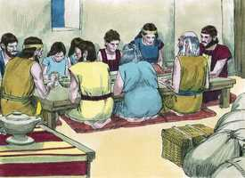
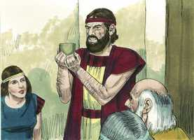
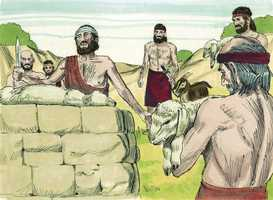
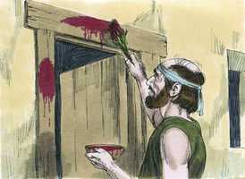
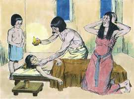
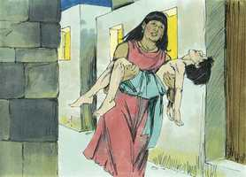
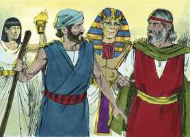
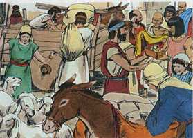
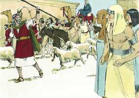
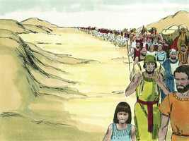

# Êxodo Cap 12

**1** 	E FALOU o Senhor a Moisés e a Arão na terra do Egito, dizendo:

> **Cmt MHenry**: *Versículos 1-20* O Senhor faz novas todas as coisas para aqueles que liberta da escravidão de Satanás e os toma para si mesmos a fim de que sejam seu povo. o momento em que Ele faz isto, para eles é o começo de uma vida nova. Deus indicou que, a noite em que sairiam do Egito, cada família matasse um cordeiro ou que duas ou três famílias, se eram pequenas, deviam matar um cordeiro em conjunto. Este cordeiro devia comer-se na forma aqui indicada, e o sangue devia aspergir-se nas ombreiras e na verga da porta para marcar as casas dos israelitas, e distingui-las das dos egípcios. O anjo do dinheiro, quando destruísse os primogênitos egípcios, passaria por alto as casas marcadas com o sangue do cordeiro: daqui o nome desta festa ou ordenança sagrada Páscoa é a transcrição grega do termo aramaico para a Páscoa, que vem do hebraico *pasac*: passar por cima, deixar de lado. . A Páscoa deveria celebrar-se cada ano, tanto como uma lembrança da preservação de Israel e sua liberação do Egito, e como um notável tipo de Cristo. a seguridade e a liberação dos israelitas não foi uma recompensa de sua justiça própria senão uma dádiva misericordiosa. A eles se lembrava disso e, por meio desta ordenança, foram ensinados que todas as bênçãos lhes chegaram por meio do derramamento e a aspersão do sangue. Observe-se: 1) *O cordeiro pascoal era um tipo.* Cristo é a nossa Páscoa ([1 Co 5.7](../46N-1Co/05.md#7)); Cristo é o Cordeiro de Deus ([Jo 1.29](../43N-Joa/01.md#29)); muitas vezes é chamado Cordeiro no Apocalipse. Devia ser de qualidade ótima; Cristo se ofereceu no melhor de sua idade, não quando era o bebê de Belém. Devia carecer de todo defeito; o Senhor Jesus foi um Cordeiro sem mácula: o juiz que condenou a Cristo o declarou inocente. Tinha de ser separado quatro dias antes, denotando assim a designação do Senhor Jesus para ser Salvador, tanto no propósito como na promessa. Devia ser morto e queimado com fogo, denotando isto os penosos sofrimentos dEle, até a morte, e morte de cruz. A ira de Deus é como fogo e Cristo foi feito maldição por nós. Nenhum osso dele devia ser quebrado, coisa que foi cumprida em Cristo ([Jo 19.33](../43N-Joa/19.md#33)), indicando nisto a fortaleza não quebrantada do Senhor Jesus. 2) *A aspersão do sangue era um tipo.* O sangue do cordeiro devia borrifar-se, indicando a aplicação dos méritos da morte de Cristo a nossas almas; temos que receber a expiação ([Rm 5.11](../45N-Rm/05.md#11)). A fé é o hissopo com o qual nos são aplicadas as promessas e os benefícios do sangue de Cristo. devia ser colocado no topo e nos laterais da porta, indicando a profissão direta de fé em Cristo que devemos fazer. Não devia borrifar-se sobre o umbral, o qual nos adverte para termos cuidado de não pisotear o sangue da aliança. É sangue precioso e deve sê-lo para nós. O sangue, assim aspergido, foi um meio para preservar os israelitas do anjo destruidor, que não tinha nada a fazer onde estiver esse sangue. O sangue de Cristo é a proteção do crente da ira de Deus, da maldição da lei, e da condição do inferno ([Rm 8.1](../45N-Rm/08.md#1)). 3) *O comer solenemente o cordeiro era um tipo de nosso dever para com Cristo no Evangelho.* O cordeiro pascoal não era somente para ser contemplado, senão para comê-lo. assim, pela fé temos de apropriar-nos de Cristo; e receber força e alimento espiritual dEle, como de nossa comida (veja-se [Jo 6.53](../43N-Joa/06.md#53),[55](../43N-Joa/06.md#55)). Era para ser comido *todo*; os que pela fé se alimentam de Cristo, devem fazê-lo de um Cristo total: devem tomar a Cristo e seu jugo, a Cristo e sua cruz, e assim também a Cristo e sua coroa. Devia ser comido de uma só vez, de imediato, sem deixar nada para o dia seguinte. Hoje se oferece a Cristo e deve ser recebido em tanto se diz hoje, antes que durmamos o sono da morte. Devia ser comido com ervas amargas, lembrando a amargura da escravidão do Egito; nós devemos alimentar-nos de Cristo com dor e com o coração quebrantado, lembrando o pecado. Cristo será doce para nós se o pecado é amargo. Devia ser comido de pé, com o cajado na mão, prestes a partir. Quando nos alimentamos de Cristo pela fé, devemos abandonar o reinado e o domínio do pecado; liberar-nos do mundo e de tudo o que nele há; abandoná-lo todo por Cristo e não considerá-lo como mau negócio ([Hb 13.13-14](../58N-Hb/13.md#13)). 4) *A festa dos pães ázimos era um tipo da vida cristã* ([1 Co 5.7-8](../46N-1Co/05.md#7)). Tendo recebido a Cristo Jesus o Senhor, devemos gozar-nos continuamente nEle. Nenhuma classe de obra deve ser feita, isto é, não admitir nem albergar esforços que não concordem com este santo gozo, ou que o rebaixem. Os judeus eram muito estritos em quanto a que na Páscoa nada de fermento devia ser achado em suas casas. Deve ser uma festa que se observa com caridade, sem o levedo da malícia; e com sinceridade, sem o levedo da hipocrisia. Era uma ordenança perpétua; na medida em que vivamos, devemos continuar alimentando-nos de Cristo, regozijando-nos nEle sempre, e mencionando com gratidão as grandes coisas que Ele tem feito por nós.

**2** 	Este mesmo mês vos será o princípio dos meses; este vos será o primeiro dos meses do ano.

**3** 	Falai a toda a congregação de Israel, dizendo: Aos dez deste mês tome cada um para si um cordeiro, segundo as casas dos pais, um cordeiro para cada família.

**4** 	Mas se a família for pequena para um cordeiro, então tome um só com seu vizinho perto de sua casa, conforme o número das almas; cada um conforme ao seu comer, fareis a conta conforme ao cordeiro.

**5** 	O cordeiro, ou cabrito, será sem mácula, um macho de um ano, o qual tomareis das ovelhas ou das cabras.

**6** 	E o guardareis até ao décimo quarto dia deste mês, e todo o ajuntamento da congregação de Israel o sacrificará à tarde.

**7** 	E tomarão do sangue, e pô-lo-ão em ambas as ombreiras, e na verga da porta, nas casas em que o comerem.

**8** 	E naquela noite comerão a carne assada no fogo, com pães ázimos; com ervas amargosas a comerão.

 

**9** 	Não comereis dele cru, nem cozido em água, senão assado no fogo, a sua cabeça com os seus pés e com a sua fressura.

**10** 	E nada dele deixareis até amanhã; mas o que dele ficar até amanhã, queimareis no fogo.

**11** 	Assim pois o comereis: Os vossos lombos cingidos, os vossos sapatos nos pés, e o vosso cajado na mão; e o comereis apressadamente; esta é a páscoa do Senhor.

**12** 	E eu passarei pela terra do Egito esta noite, e ferirei todo o primogênito na terra do Egito, desde os homens até aos animais; e em todos os deuses do Egito farei juízos. Eu sou o Senhor.

> **Cmt MHenry**: *CAPÍTULO 12A-2Rs

**13** 	E aquele sangue vos será por sinal nas casas em que estiverdes; vendo eu sangue, passarei por cima de vós, e não haverá entre vós praga de mortandade, quando eu ferir a terra do Egito.

**14** 	E este dia vos será por memória, e celebrá-lo-eis por festa ao Senhor; nas vossas gerações o celebrareis por estatuto perpétuo.

**15** 	Sete dias comereis pães ázimos; ao primeiro dia tirareis o fermento das vossas casas; porque qualquer que comer pão levedado, desde o primeiro até ao sétimo dia, aquela alma será cortada de Israel.

 

**16** 	E ao primeiro dia haverá santa convocação; também ao sétimo dia tereis santa convocação; nenhuma obra se fará neles, senão o que cada alma houver de comer; isso somente aprontareis para vós.

**17** 	Guardai pois a festa dos pães ázimos, porque naquele mesmo dia tirei vossos exércitos da terra do Egito; pelo que guardareis a este dia nas vossas gerações por estatuto perpétuo.

**18** 	No primeiro mês, aos catorze dias do mês, à tarde, comereis pães ázimos até vinte e um do mês à tarde.

**19** 	Por sete dias não se ache nenhum fermento nas vossas casas; porque qualquer que comer pão levedado, aquela alma será cortada da congregação de Israel, assim o estrangeiro como o natural da terra.

**20** 	Nenhuma coisa levedada comereis; em todas as vossas habitações comereis pães ázimos.

**21** 	Chamou pois Moisés a todos os anciãos de Israel, e disse-lhes: Escolhei e tomai vós cordeiros para vossas famílias, e sacrificai a páscoa.

> **Cmt MHenry**: *Versículos 21-28* Essa noite, quando os primogênitos seriam destruídos, nenhum israelita devia sair pelas portas até que fossem chamados para partir do Egito. Sua seguridade devia-se ao sangue aspergido. Se deixassem essa proteção, o faziam sob seu próprio risco. No tempo vindouro deviam ensinar cuidadosamente a seus filhos o significado deste serviço. É bom que as crianças perguntem acerca das coisas de Deus; os que buscam o caminho o acharão. Observar anualmente esta solenidade era: 1) *Olhar atrás* para lembrar quantas grandes coisas Deus tinha feito por eles e por seus pais. As misericórdias antigas para conosco ou para com nossos pais não devem ser esquecidas para que Deus seja louvado e nossa fé nEle seja fortalecida. 2) Tinha o propósito de *olhar para frente* como prenda do grande sacrifício do Cordeiro de Deus no cumprimento do tempo. Cristo, nossa Rocha, foi sacrificado por nós; sua morte foi nossa vida.

 

**22** 	Então tomai um molho de hissopo, e molhai-o no sangue que estiver na bacia, e passai-o na verga da porta, e em ambas as ombreiras, do sangue que estiver na bacia; porém nenhum de vós saia da porta da sua casa até à manhã.

 

**23** 	Porque o Senhor passará para ferir aos egípcios, porém quando vir o sangue na verga da porta, e em ambas as ombreiras, o Senhor passará aquela porta, e não deixará o destruidor entrar em vossas casas, para vos ferir.

**24** 	Portanto guardai isto por estatuto para vós, e para vossos filhos para sempre.

**25** 	E acontecerá que, quando entrardes na terra que o Senhor vos dará, como tem dito, guardareis este culto.

**26** 	E acontecerá que, quando vossos filhos vos disserem: Que culto é este?

**27** 	Então direis: Este é o sacrifício da páscoa ao Senhor, que passou as casas dos filhos de Israel no Egito, quando feriu aos egípcios, e livrou as nossas casas. Então o povo inclinou-se, e adorou.

**28** 	E foram os filhos de Israel, e fizeram isso como o Senhor ordenara a Moisés e a Arão, assim fizeram.

**29** 	E aconteceu, à meia-noite, que o Senhor feriu a todos os primogênitos na terra do Egito, desde o primogênito de Faraó, que se sentava em seu trono, até ao primogênito do cativo que estava no cárcere, e todos os primogênitos dos animais.

> **Cmt MHenry**: *Versículos 29-36* As trevas mantiveram os egípcios na ansiedade e no horror durante três dias e suas noites; agora, seu repouso é interrompido por uma calamidade muito mais terrível. A praga atacou os primogênitos, o gozo e esperança de suas famílias. Eles tinham dado morte aos filhos dos hebreus, agora Deus matava aos seus. Abrangeu desde o trono até o calabouço: príncipe e camponês ficam ao mesmo nível ante os juízos de Deus. o anjo destruidor, como mensageiro da dor, entrou em cada vivenda que não tinha o sinal do sangue. Realizou sua diligência espantosa sem deixar casa na qual não houvesse um morto. Imaginem, então, o clamor que correu pela terra do Egito, o longo e estridente uivo de agonia que explodiu em cada lar. Assim será na hora espantosa em que o Filho do homem visite os pecadores com o juízo final. Os filhos de Deus, seus primogênitos, se salvaram. Melhor é que os homens se submetam primeiro às condições de Deus, porque Ele nunca seguirá as deles. Agora o orgulho de Faraó é abatido e se rende. A palavra de Deus é a que permanece; nada obtemos com contender ou com a demora em submeter-nos. O terror dos egípcios conseguiu o favor e a rápida partida de Israel. Assim, pois, o Senhor cuidou que lhes fossem pagados os salários duramente ganhos e a gente os proveu para sua viagem.

 

**30** 	E Faraó levantou-se de noite, ele e todos os seus servos, e todos os egípcios; e havia grande clamor no Egito, porque não havia casa em que não houvesse um morto.

 

**31** 	Então chamou a Moisés e a Arão de noite, e disse: Levantai-vos, saí do meio do meu povo, tanto vós como os filhos de Israel; e ide, servi ao Senhor, como tendes dito.

 

**32** 	Levai também convosco vossas ovelhas e vossas vacas, como tendes dito; e ide, e abençoai-me também a mim.

**33** 	E os egípcios apertavam ao povo, apressando-se para lançá-los da terra; porque diziam: Todos seremos mortos.

**34** 	E o povo tomou a sua massa, antes que levedasse, e as suas amassadeiras atadas em suas roupas sobre seus ombros.

**35** 	Fizeram, pois, os filhos de Israel conforme à palavra de Moisés, e pediram aos egípcios jóias de prata, e jóias de ouro, e roupas.

 

**36** 	E o Senhor deu ao povo graça aos olhos dos egípcios, e estes lhe davam o que pediam; e despojaram aos egípcios.

**37** 	Assim partiram os filhos de Israel de Ramessés para Sucote, cerca de seiscentos mil a pé, somente de homens, sem contar os meninos.

> **Cmt MHenry**: *Versículos 37-42* Os filhos de Israel se puseram em marcha sem demora. Uma multidão de toda classe de gente foi com eles. Talvez alguns estivessem dispostos a deixar sua pátria, desolada pelas pragas; outros, por curiosidade; talvez uns poucos por amor a eles e a sua religião. Porém entre os israelitas sempre houve os que não eram israelitas. Da mesma maneira, ainda há hipócritas na igreja. Este grande acontecimento ocorreu aos 430 anos de ter sido feita a promessa a Abraão: veja-se [Gálatas 3.17](../48N-Gl/03.md#17). Tanto tempo tinha-se passado sem cumprir-se a promessa de estabelecê-los em sua terra; porém, embora as promessas de Deus não tenham rápido cumprimento, se cumprirão no momento mais oportuno. Esta é essa noite do Senhor, uma noite notável, digna de ser celebrada em todas as gerações. As grandes coisas que Deus faz por seu povo não são uma maravilha somente para uns quantos dias, senão para ser lembradas em todas as épocas, especialmente a obra de nossa redenção por Cristo. a primeira noite da Páscoa foi uma noite do Senhor, digna de ser observada; porém a noite da última Páscoa, na que Cristo foi traído e na qual se deu fim à primeira Páscoa, com as outras cerimônias judaicas, foi uma noite do Senhor, que deve ser celebrada ainda mais. Nessa ocasião, foi quebrantado e tirado de nosso pescoço um jugo mais pesado que o do Egito, e foi colocada diante de nós uma terra melhor que a de Canaã. Foi uma redenção digna de celebrar-se no céu por toda a eternidade.

 

**38** 	E subiu também com eles muita mistura de gente, e ovelhas, e bois, uma grande quantidade de gado.

**39** 	E cozeram bolos ázimos da massa que levaram do Egito, porque não se tinha levedado, porquanto foram lançados do Egito; e não se puderam deter, nem prepararam comida.

**40** 	O tempo que os filhos de Israel habitaram no Egito foi de quatrocentos e trinta anos.

**41** 	E aconteceu que, passados os quatrocentos e trinta anos, naquele mesmo dia, todos os exércitos do Senhor saíram da terra do Egito.

**42** 	Esta noite se guardará ao Senhor, porque nela os tirou da terra do Egito; esta é a noite do Senhor, que devem guardar todos os filhos de Israel nas suas gerações.

**43** 	Disse mais o Senhor a Moisés e a Arão: Esta é a ordenança da páscoa: nenhum filho do estrangeiro comerá dela.

> **Cmt MHenry**: *Versículos 43-51* Nos tempos vindouros toda a congregação de Israel devia guardar a Páscoa. Todos os que participam das misericórdias de Deus devem unir-se em louvores de gratidão por elas. A Páscoa do Novo Testamento, a Ceia do Senhor, não deve ser descuidada por ninguém. Os estrangeiros, se eram circuncidados, podiam comer da Páscoa. Eis aqui uma indicação precoce de favor para com os gentios. Isto ensinou aos judeus que o que lhes dava direito a seus privilégios era o ser uma nação favorecida por Deus, não sua descendência de Abraão. Cristo, nossa Páscoa, foi sacrificado por nós ([1 Co 5.7](../46N-1Co/05.md#7)). Seu sangue é o único resgate por nossas almas; sem o derramamento de sangue não há remissão; sem derramamento de sangue não se faz remissão. Por fé nEle, temos refugiado nossas almas da merecida vingança, colocando-as sob a proteção de seu sangue expiatório? Nos mantemos perto dEle, descansando constantemente nEle? Professamos nossa fé no Redentor e nossas obrigações para com Ele, de modo que todos os que passam por nosso lado saibam a quem pertencemos? Estamos preparados para seu serviço, dispostos a andar em seus caminhos e a separar-nos de seus inimigos? Estas são perguntas de enorme importância para a alma; que o Senhor dirija nossas consciências para respondê-las com honestidade.

**44** 	Porém todo o servo comprado por dinheiro, depois que o houveres circuncidado, então comerá dela.

**45** 	O estrangeiro e o assalariado não comerão dela.

**46** 	Numa casa se comerá; não levarás daquela carne fora da casa, nem dela quebrareis osso.

**47** 	Toda a congregação de Israel o fará.

**48** 	Porém se algum estrangeiro se hospedar contigo e quiser celebrar a páscoa ao Senhor, seja-lhe circuncidado todo o homem, e então chegará a celebrá-la, e será como o natural da terra; mas nenhum incircunciso comerá dela.

**49** 	Uma mesma lei haja para o natural e para o estrangeiro que peregrinar entre vós.

**50** 	E todos os filhos de Israel o fizeram; como o Senhor ordenara a Moisés e a Arão, assim fizeram.

**51** 	E aconteceu naquele mesmo dia que o Senhor tirou os filhos de Israel da terra do Egito, segundo os seus exércitos.

 

> **Cmt MHenry** Intro: *• Versículos 1-20*> *Mudança do começo do ano – Instituição da Páscoa*> *• Versículos 21-28*> *Instruções ao povo para a observância da Páscoa*> *• Versículos 29-36*> *Morte dos primogênitos egípcios – Pedem aos israelitas que*> *saiam da terra do Egito*> *• Versículos 37-42*> *A primeira jornada dos israelitas até o Sucote*> *• Versículos 43-51*> *Ordem de respeitar a Páscoa*