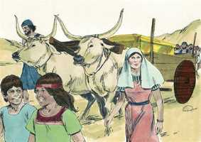
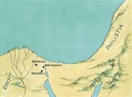
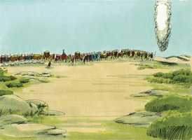

# Êxodo Cap 13

**1** 	ENTÃO falou o Senhor a Moisés, dizendo:

> **Cmt MHenry**: *Versículos 1-10* Em comemoração da destruição dos primogênitos do Egito, dos homens e dos animais, e da liberação dos israelitas da escravidão. Os varões primogênitos dos israelitas foram separados para o Senhor. Por este médio foi-lhes apresentado o fato de que suas vidas tinham sido preservadas por meio do resgate da expiação, a que a seu devido tempo se realizaria pelo pecado. eles deviam também considerar que suas vidas, assim resgatadas da morte, deviam agora estar consagradas ao serviço de Deus. os pais não deviam pensar que tivessem algum direito sobre seus primogênitos, até que os apresentassem solenemente a Deus, e Ele lhes desse seu título de propriedade a eles. O que, por misericórdia especial, nos é devolvido, deve aplicar-se à honra de Deus; pelo menos, deve ser feito um reconhecimento de gratidão com obras de piedade e amor. A comemoração de sua saída do Egito devia observar-se anualmente. O dia da ressurreição de Cristo deve comemorar-se porque nEle fomos ressuscitados com Cristo, saindo da casa da escravidão e da morte. A Escritura não nos diz expressamente que dia do ano ressuscitou Cristo, porém estabelece particularmente que dia da semana aconteceu, porque como liberação mais valiosa deve comemorar-se *semanalmente*. Os israelitas deviam guardar a festa dos pães Deus fermento. No Evangelho não só lembramos a Cristo, senão que observamos a Santa Ceia. Façam isto em memória dEle. Além disso, deviam ter cuidado de ensinar às crianças o conhecimento de Deus. Esta é uma antiga lei para a catequese. É sumamente útil familiarizar as crianças em sua primeira infância com os relatos da Bíblia. Os que têm a lei de Deus em seus corações devem tê-la em sua boca para falar dela todo o tempo, para afetar a si mesmos e ensinar aos outros.

**2** 	Santifica-me todo o primogênito, o que abrir toda a madre entre os filhos de Israel, de homens e de animais; porque meu é.

**3** 	E Moisés disse ao povo: Lembrai-vos deste mesmo dia, em que saístes do Egito, da casa da servidão; pois com mão forte o Senhor vos tirou daqui; portanto não comereis pão levedado.

 

**4** 	Hoje, no mês de Abibe, vós saís.

**5** 	E acontecerá que, quando o Senhor te houver introduzido na terra dos cananeus, e dos heteus, e dos amorreus, e dos heveus, e dos jebuseus, a qual jurou a teus pais que te daria, terra que mana leite e mel, guardarás este culto neste mês.

**6** 	Sete dias comerás pães ázimos, e ao sétimo dia haverá festa ao Senhor.

**7** 	Sete dias se comerá pães ázimos, e o levedado não se verá contigo, nem ainda fermento será visto em todos os teus termos.

**8** 	E naquele mesmo dia farás saber a teu filho, dizendo: Isto é pelo que o Senhor me tem feito, quando eu saí do Egito.

**9** 	E te será por sinal sobre tua mão e por lembrança entre teus olhos, para que a lei do Senhor esteja em tua boca; porquanto com mão forte o Senhor te tirou do Egito.

**10** 	Portanto tu guardarás este estatuto a seu tempo, de ano em ano.

**11** 	Também acontecerá que, quando o Senhor te houver introduzido na terra dos cananeus, como jurou a ti e a teus pais, quando ta houver dado,

> **Cmt MHenry**: *Versículos 11-16* Os primogênitos dos animais que não se usavam para o sacrifício deviam ser trocados por outros que se usassem, ou deviam ser mortos. Nossa alma tem sido entregue à justiça de Deus e a menos que seja resgatada pelo sacrifício de Cristo, certamente perecerá. Estas instituições os lembrariam continuamente seu dever de amar e servir ao Senhor. de igual modo, o batismo e a Ceia do Senhor, se são explicadas e observadas adequadamente, nos farão lembrar nossa profissão e nosso dever, dando-nos ocasião de lembrar-nos uns a outros.

**12** 	Separarás para o Senhor tudo o que abrir a madre e todo o primogênito dos animais que tiveres; os machos serão do Senhor.

**13** 	Porém, todo o primogênito da jumenta resgatarás com um cordeiro; e se o não resgatares, cortar-lhe-ás a cabeça; mas todo o primogênito do homem, entre teus filhos, resgatarás.

> **Cmt MHenry**: *CAPÍTULO 13A-1Cr

**14** 	E quando teu filho te perguntar no futuro, dizendo: Que é isto? Dir-lhe-ás: O Senhor nos tirou com mão forte do Egito, da casa da servidão.

**15** 	Porque sucedeu que, endurecendo-se Faraó, para não nos deixar ir, o Senhor matou todos os primogênitos na terra do Egito, desde o primogênito do homem até o primogênito dos animais; por isso eu sacrifico ao Senhor todos os primogênitos, sendo machos; porém a todo o primogênito de meus filhos eu resgato.

**16** 	E será isso por sinal sobre tua mão, e por frontais entre os teus olhos; porque o Senhor, com mão forte, nos tirou do Egito.

**17** 	E aconteceu que, quando Faraó deixou ir o povo, Deus não os levou pelo caminho da terra dos filisteus, que estava mais perto; porque Deus disse: Para que porventura o povo não se arrependa, vendo a guerra, e volte ao Egito.

> **Cmt MHenry**: *Versículos 17-20* Havia dois caminhos do Egito ao Canaã. Um era de somente uns poucos dias de viagem; o outro, era muito mais longo, indo para o deserto, e esse foi o caminho que Deus escolheu para conduzir a seu povo Israel. Os egípcios deviam afogar-se no Mar Vermelho; os israelitas deviam humilhar-se e ser provados no deserto. O caminho de Deus é o bom caminho, embora não pareça. Se pensarmos que Ele não conduz a seu povo pelo caminho *mais curto* podemos ter, não obstante, a certeza de que Ele os leva pelo *melhor* caminho, e assim ficará em evidência quando chegarmos afinal de nossa viagem. Os filisteus eram inimigos fortes; era necessário que os israelitas fossem preparados para as guerras de Canaã, passando pelas dificuldades do deserto. Assim, pois, Deus proporciona provas a seu povo para fortaleza deles ([1 Co 10.13](../46N-1Co/10.md#13)). Saíram em boa ordem. Uns iam de a cinco por fileira; outros, em cinco bandos, o que parece ser significativo. Levaram com eles os ossos de José. Era um estímulo para sua fé e esperança que Deus os levasse a Canaã, cuja esperança fazia que eles levassem seus ossos pelo deserto.

 

**18** 	Mas Deus fez o povo rodear pelo caminho do deserto do Mar Vermelho; e armados, os filhos de Israel subiram da terra do Egito.

**19** 	E Moisés levou consigo os ossos de José, porquanto havia este solenemente ajuramentado os filhos de Israel, dizendo: Certamente Deus vos visitará; fazei, pois, subir daqui os meus ossos convosco.

**20** 	Assim partiram de Sucote, e acamparam-se em Etã, à entrada do deserto.

**21** 	E o Senhor ia adiante deles, de dia numa coluna de nuvem para os guiar pelo caminho, e de noite numa coluna de fogo para os iluminar, para que caminhassem de dia e de noite.

> **Cmt MHenry**: *Versículos 21-22* O Senhor ia diante deles numa coluna, como presença da Majestade Divina. Cristo estava com a igreja do deserto ([1 Co 10.9](../46N-1Co/10.md#9)). aos que Deus leva a um deserto, Deus não os abandonará nem os deixará perder-se ali, senão que cuidará de conduzi-los na travessia. Foi uma grande satisfação para Moisés e para os israelitas piedosos ter a certeza de estarem sob sem direção divina. Os que têm como fim a glória de Deus, como regra a Palavra de Deus, como guia de seus afetos o Espírito de Deus, e a providência de Deus como condutor de seus assuntos, podem estar seguros de que o Senhor vai diante deles, embora não o possam ver com seus olhos: agora devemos viver por fé. Quando Israel marchava, a coluna ia diante e indicava o lugar onde acampar, segundo o estimasse conveniente a Sabedoria divina. De diz os resguardava do calor, e pela noite lhes dava luz. A Bíblia é lâmpada para os nossos pés, e luz para o nosso caminho, a que em seu amor nos tem deixado o Salvador. Dá testemunho de Cristo. Para nós é como a coluna para os israelitas. Escutem a voz que clama: Eu sou a luz do mundo; quem me segue não andará nas trevas mas terá a luz da vida ([Jo 8.12](../43N-Joa/08.md#12)). somente Jesus Cristo é o Caminho, a Verdade e a Vida, ([Jo 14.6](../43N-Joa/14.md#6)), segundo o mostra a Bíblia e o recomenda o Espírito Santo a alma em resposta à oração.

 

**22** 	Nunca tirou de diante do povo a coluna de nuvem, de dia, nem a coluna de fogo, de noite.

> **Cmt MHenry** Intro: *• Versículos 1-10*> *Consagração dos primogênitos a Deus – Ordem de*> *comemorar a Páscoa*> *• Versículos 11-16*> *Separação dos primogênitos das bestas*> *• Versículos 17-20*> 28A-Os ossos de José levados pelos israelitas – Chegada a Etã*> *• Versículos 21-22*> *Deus guia os israelitas por meio de uma coluna de nuvem e*