# Êxodo Cap 14

**1** 	ENTÃO falou o Senhor a Moisés, dizendo:

> **Cmt MHenry**: *Versículos 1-9* Faraó pensou que todo Israel estava capturado no deserto e que seria presa fácil. Porém Deus disse: Serei glorificado em Faraó. Sendo todos os homens feitos para honra de seu Criador, Ele será honrado *naqueles* *pelos quais* Ele não é honrado. O que pareceria ser a ruína da igreja, volta e meia é utilizado para ruína dos inimigos dela. Embora faraó satisfez sua maldade e vingança, ele ajudou a que se cumprissem os conselhos de Deus acerca dele. Mesmo que tinha deixado sair a Israel com toda razão, agora estava irado consigo mesmo por tê-lo feito. Deus faz que a inveja e fúria dos homens contra seu povo sejam um tormento para eles mesmos. Os que voltam seus olhos ao céu e vivem piedosamente em Cristo Jesus devem esperar o acosso das tentações e terrores de Satanás. Ele não deixará mansamente que ninguém saia de seu serviço.

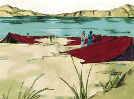 

**2** 	Fala aos filhos de Israel que voltem, e que se acampem diante de Pi-Hairote, entre Migdol e o mar, diante de Baal-Zefom; em frente dele assentareis o campo junto ao mar.

**3** 	Então Faraó dirá dos filhos de Israel: Estão embaraçados na terra o deserto os encerrou.

**4** 	E eu endurecerei o coração de Faraó, para que os persiga, e serei glorificado em Faraó e em todo o seu exército, e saberão os egípcios que eu sou o Senhor. E eles fizeram assim.

**5** 	Sendo, pois, anunciado ao rei do Egito que o povo fugia, mudou-se o coração de Faraó e dos seus servos contra o povo, e disseram: Por que fizemos isso, havendo deixado ir a Israel, para que não nos sirva?

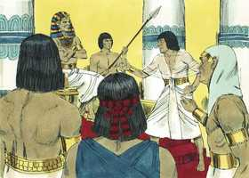 

**6** 	E aprontou o seu carro, e tomou consigo o seu povo;

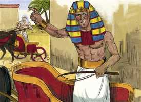 

**7** 	E tomou seiscentos carros escolhidos, e todos os carros do Egito, e os capitães sobre eles todos.

**8** 	Porque o Senhor endureceu o coração de Faraó, rei do Egito, para que perseguisse aos filhos de Israel; porém os filhos de Israel saíram com alta mão.

**9** 	E os egípcios perseguiram-nos, todos os cavalos e carros de Faraó, e os seus cavaleiros e o seu exército, e alcançaram-nos acampados junto ao mar, perto de Pi-Hairote, diante de Baal-Zefom.

**10** 	E aproximando Faraó, os filhos de Israel levantaram seus olhos, e eis que os egípcios vinham atrás deles, e temeram muito; então os filhos de Israel clamaram ao Senhor.

> **Cmt MHenry**: *Versículos 10-14* Não havia caminho aberto para Israel, senão para acima e dali veio a liberação deles. Nós podemos estar no caminho do dever, seguindo a Deus, e avançando para o céu, mas podemos estar rodeados de tribulações. Alguns clamaram ao Senhor; o temor os fez orar e isso esteve certo. Deus nos põe em apertos para fazer-nos cair de joelhos. Outros clamaram contra Moisés; o medo os fez murmurar como se Deus já não fosse mais capaz de fazer milagres. Eles repreenderam a Moisés por tê-los tirado do Egito e, assim, estavam irados com Deus pela maior bondade que tinha-lhes sido feita; assim de grosseiros são os absurdos da incredulidade. Moisés disse: Não temam. Quando não possamos sair dos problemas, sempre é nosso dever e interesse colocar-nos por acima de nossos medos; que avivem nossas orações e esforços, porém que não silenciem nossa fé e esperança. "Fiquem firmes"; não pensem em salvar-se a vocês mesmos lutando ou fugindo; esperem as ordens de Deus e obedeçam-nas. Conservem a serenidade, confiados em Deus, para que pensem pacificamente na grande salvação que Deus está por operar em vocês. Se Deus permite que seu povo esteja em apuros, achará o caminho para tirá-los.

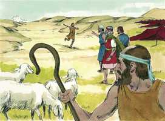 

**11** 	E disseram a Moisés: Não havia sepulcros no Egito, para nos tirar de lá, para que morramos neste deserto? Por que nos fizeste isto, fazendo-nos sair do Egito?

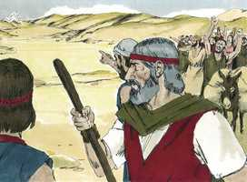 

**12** 	Não é esta a palavra que te falamos no Egito, dizendo: Deixa-nos, que sirvamos aos egípcios? Pois que melhor nos fora servir aos egípcios, do que morrermos no deserto.

**13** 	Moisés, porém, disse ao povo: Não temais; estai quietos, e vede o livramento do Senhor, que hoje vos fará; porque aos egípcios, que hoje vistes, nunca mais os tornareis a ver.

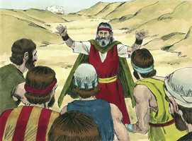 

**14** 	O Senhor pelejará por vós, e vós vos calareis.

> **Cmt MHenry**: *CAPÍTULO 14A-2Cr

**15** 	Então disse o Senhor a Moisés: Por que clamas a mim? Dize aos filhos de Israel que marchem.

> **Cmt MHenry**: *Versículos 15-20* As silenciosas orações da fé de Moisés prevaleceram diante de Deus mais que os fortes gritos de terror de Israel. A nuvem e a coluna de fogo iam trás deles onde necessitavam guarda, e eram uma muralha entre eles e seus inimigos. A palavra e providência de Deus têm um lado negro e tenebroso para o pecado e os pecadores, mas um lado luminoso e agradável para o povo do Senhor. aquele que separou a luz das trevas ([Gn 1.4](../01A-Gn/01.md#4)), designou a escuridão aos egípcios e a luz aos israelitas. Essa diferença existirá entre a herança dos santos da luz e as negras trevas que será a porção dos hipócritas para sempre.

**16** 	E tu, levanta a tua vara, e estende a tua mão sobre o mar, e fende-o, para que os filhos de Israel passem pelo meio do mar em seco.

**17** 	E eis que endurecerei o coração dos egípcios, e estes entrarão atrás deles; e eu serei glorificado em Faraó e em todo o seu exército, nos seus carros e nos seus cavaleiros,

**18** 	E os egípcios saberão que eu sou o Senhor, quando for glorificado em Faraó, nos seus carros e nos seus cavaleiros.

**19** 	E o anjo de Deus, que ia diante do exército de Israel, se retirou, e ia atrás deles; também a coluna de nuvem se retirou de diante deles, e se pôs atrás deles.

**20** 	E ia entre o campo dos egípcios e o campo de Israel; e a nuvem era trevas para aqueles, e para estes clareava a noite; de maneira que em toda a noite não se aproximou um do outro.

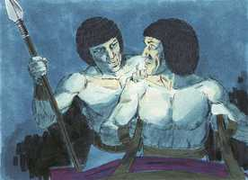 

**21** 	Então Moisés estendeu a sua mão sobre o mar, e o Senhor fez retirar o mar por um forte vento oriental toda aquela noite; e o mar tornou-se em seco, e as águas foram partidas.

> **Cmt MHenry**: *Versículos 21-31* A divisão do Mar Vermelho foi terror para os cananeus ([Js 2.9-10](../06A-Js/02.md#9)); o louvor e o triunfo dos israelitas ([Sl 114.3](../19A-Sl/114.md#3); [106.9](../19A-Sl/106.md#9); [136.13](../19A-Sl/136.md#13)). foi um tipo do batismo ([1 Co 10.1-2](../46N-1Co/10.md#1)). A passagem dos israelitas no meio do mar era tipo da conversão das almas ([Is 11.15](../23A-Is/11.md#15)); e que os egípcios fossem afogados nele era tipo da ruína final dos pecadores impenitentes. Deus mostrou sua onipotência abrindo uma passagem em meio das águas, de umas 40 milhas Aproximadamente 65 km. de comprimento. Deus pode levar a seu povo através das dificuldades maiores e fazer caminho onde não há. Foi um exemplo de seu favor maravilhoso para seu Israel. Eles passaram em meio do mar, caminharam em seco pelo fundo do mar. Foi feito para animar o povo de Deus de todas as épocas para que confiem em Deus nas maiores dificuldades. Que não *pode* *fazer* Aquele que fez isso? Que não *fará* Ele pelos que o temem e amam, já que fez isto pelos israelitas queixosos e incrédulos? Depois sobreveio a ira reta e justa de Deus sobre seus inimigos e os de seu povo. A ruína dos pecadores é acarretada por eles mesmos, devido a seu próprio furor e soberba. Eles poderiam ter deixado em paz a Israel, mas não quiseram; agora gostariam de esconder o rosto de Israel, mas não podem. Os homens não se convencem até que é demasiado tarde, de que os que se metem contra o povo de Deus, o fazem para seu próprio prejuízo. Foi ordenado a Moisés que estendesse sua mão sobre o mar; as águas regressaram e afogaram a toda a hoste dos egípcios. Faraó e seus servos, que tinham-se endurecido mutuamente em pecado, juntos caíram agora, sem escapar nenhum só. Os israelitas viram mortos os egípcios sobre as areias. O espetáculo os afetou muito. Quando os homens vêm as obras de Deus e percebem o benefício recebido, o temem e confiam nEle. Quão bom seria para nós se sempre estivéssemos de bom ânimo, como as vezes acontece! Eis aqui o fim para o qual pode atentar o cristão. Seus inimigos ardem de furor e são poderosos; porém, enquanto ele estiver firmemente sustentado por Deus, passará a salvo pelas ondas, guardado pelo mesmo poder de seu Salvador, que descerá contra cada inimigo espiritual. os inimigos de sua alma que tenha visto hoje, não tornará a vê-los. "

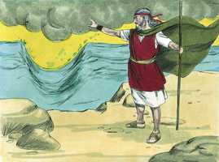 

**22** 	E os filhos de Israel entraram pelo meio do mar em seco; e as águas foram-lhes como muro à sua direita e à sua esquerda.

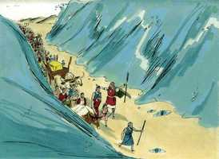 

**23** 	E os egípcios os seguiram, e entraram atrás deles todos os cavalos de Faraó, os seus carros e os seus cavaleiros, até ao meio do mar.

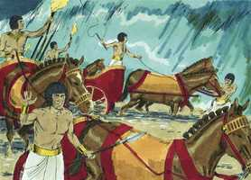 

**24** 	E aconteceu que, na vigília daquela manhã, o Senhor, na coluna do fogo e da nuvem, viu o campo dos egípcios; e alvoroçou o campo dos egípcios.

**25** 	E tirou-lhes as rodas dos seus carros, e dificultosamente os governavam. Então disseram os egípcios: Fujamos da face de Israel, porque o Senhor por eles peleja contra os egípcios.

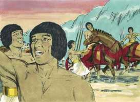 

**26** 	E disse o Senhor a Moisés: Estende a tua mão sobre o mar, para que as águas tornem sobre os egípcios, sobre os seus carros e sobre os seus cavaleiros.

**27** 	Então Moisés estendeu a sua mão sobre o mar, e o mar retornou a sua força ao amanhecer, e os egípcios, ao fugirem, foram de encontro a ele, e o Senhor derrubou os egípcios no meio do mar,

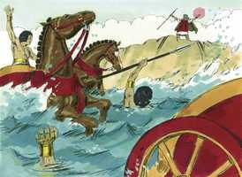 

**28** 	Porque as águas, tornando, cobriram os carros e os cavaleiros de todo o exército de Faraó, que os haviam seguido no mar; nenhum deles ficou.

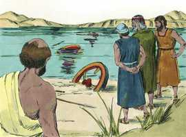 

**29** 	Mas os filhos de Israel foram pelo meio do mar seco; e as águas foram-lhes como muro à sua mão direita e à sua esquerda.

**30** 	Assim o Senhor salvou Israel naquele dia da mão dos egípcios; e Israel viu os egípcios mortos na praia do mar.

**31** 	E viu Israel a grande mão que o Senhor mostrara aos egípcios; e temeu o povo ao Senhor, e creu no Senhor e em Moisés, seu servo.

> **Cmt MHenry** Intro: *• Versículos 1-9*> *Deus leva os israelitas a Pi-Hairote – Faraó os persegue*> *• Versículos 10-14*> 28A-Os israelitas se queixam – Moisés os consola*> *• Versículos 15-20*> *Instruções de Deus a Moisés – A nuvem entre os israelitas e*> *os egípcios*> *• Versículos 21-31*> 28A-Os israelitas cruzam o Mar Vermelho, os egípcios se afogam*