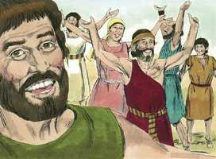
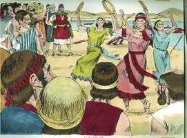
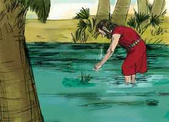
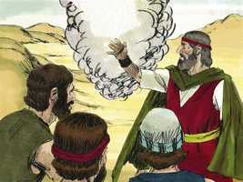
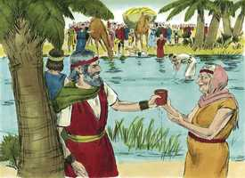

# Êxodo Cap 15

**1** 	ENTÃO cantou Moisés e os filhos de Israel este cântico ao Senhor, e falaram, dizendo: Cantarei ao Senhor, porque gloriosamente triunfou; lançou no mar o cavalo e o seu cavaleiro.

> **Cmt MHenry**: *Versículos 1-21* Este cântico é o mais antigo que conhecemos. É um cântico santo para a honra de Deus, para exaltar seu nome e celebrar seu louvor e somente o seu, pois no em nada magnifica a nenhum homem. A santidade do Senhor está em cada parte dele. Pode ser considerado como tipo e profecia da destruição final dos inimigos da igreja. Felizes aqueles cujo Deus é o Senhor. Eles têm trabalho a fazer, tentações com as quais contender e aflições que suportar, e em si mesmos são fracos mas sua graça é 34A-Na 43N-Joa fortaleza deles*. Amiúde estão apenados, porém nEle têm consolo; Ele é 18A-Jo 46N-1Co 47N-2Co 62N-1Jo 63N-2Jo 64N-3Jo cântico deles*. O pecado e a morte e o inferno os ameaçam, mas Ele é e será a *salvação deles*. O Senhor é um Deus todo-poderoso e ai daqueles que lutam com seu Fazedor! Ele é um Deus de incomparável perfeição; Ele é *glorioso em santidade*; sua santidade é sua glória. Sua santidade se mostra no ódio do pecado e sua ira contra os pecadores obstinados. Se vê na liberação de Israel e sua fidelidade a sua própria promessa. Ele é temível em louvores; aquilo que é matéria de louvor para os servos de Deus é muito espantoso para seus inimigos. Ele está *operando prodígios*, coisas fora do curso corriqueiro da natureza; maravilhas para aqueles em cujo favor são feitas, que são tão indignos que não tinham motivos para esperá-las. Houve prodígios de poder e prodígios de graça; em ambos, Deus era para ser humildemente adorado.

 

**2** 	O Senhor é a minha força, e o meu cântico; ele me foi por salvação; este é o meu Deus, portanto lhe farei uma habitação; ele é o Deus de meu pai, por isso o exaltarei.

**3** 	O Senhor é homem de guerra; o Senhor é o seu nome.

**4** 	Lançou no mar os carros de Faraó e o seu exército; e os seus escolhidos príncipes afogaram-se no Mar Vermelho.

**5** 	Os abismos os cobriram; desceram às profundezas como pedra.

**6** 	A tua destra, ó Senhor, se tem glorificado em poder, a tua destra, ó Senhor, tem despedaçado o inimigo;

**7** 	E com a grandeza da tua excelência derrubaste aos que se levantaram contra ti; enviaste o teu furor, que os consumiu como o restolho.

**8** 	E com o sopro de tuas narinas amontoaram-se as águas, as correntes pararam como montão; os abismos coalharam-se no coração do mar.

**9** 	O inimigo dizia: Perseguirei, alcançarei, repartirei os despojos; fartar-se-á a minha alma deles, arrancarei a minha espada, a minha mão os destruirá.

**10** 	Sopraste com o teu vento, o mar os cobriu; afundaram-se como chumbo em veementes águas.

**11** 	Ó Senhor, quem é como tu entre os deuses? Quem é como tu glorificado em santidade, admirável em louvores, realizando maravilhas?

**12** 	Estendeste a tua mão direita; a terra os tragou.

**13** 	Tu, com a tua beneficência, guiaste a este povo, que salvaste; com a tua força o levaste à habitação da tua santidade.

**14** 	Os povos o ouviram, eles estremeceram, uma dor apoderou-se dos habitantes da Filístia.

**15** 	Então os príncipes de Edom se pasmaram; dos poderosos dos moabitas apoderou-se um tremor; derreteram-se todos os habitantes de Canaã.

> **Cmt MHenry**: *CAPÍTULO 15A-Es

**16** 	Espanto e pavor caiu sobre eles; pela grandeza do teu braço emudeceram como pedra; até que o teu povo houvesse passado, ó Senhor, até que passasse este povo que adquiriste.

**17** 	Tu os introduzirás, e os plantarás no monte da tua herança, no lugar que tu, ó Senhor, aparelhaste para a tua habitação, no santuário, ó Senhor, que as tuas mãos estabeleceram.

**18** 	O Senhor reinará eterna e perpetuamente;

**19** 	Porque os cavalos de Faraó, com os seus carros e com os seus cavaleiros, entraram no mar, e o Senhor fez tornar as águas do mar sobre eles; mas os filhos de Israel passaram em seco pelo meio do mar.

**20** 	Então Miriã, a profetisa, a irmã de Arão, tomou o tamboril na sua mão, e todas as mulheres saíram atrás dela com tamboris e com danças.

 

**21** 	E Miriã lhes respondia: Cantai ao Senhor, porque gloriosamente triunfou; e lançou no mar o cavalo com o seu cavaleiro.

**22** 	Depois fez Moisés partir os israelitas do Mar Vermelho, e saíram ao deserto de Sur; e andaram três dias no deserto, e não acharam água.

> **Cmt MHenry**: *Versículos 22-27* No deserto de Sur os israelitas não tiveram água. Em Mara tiveram água, porém era amarga, de modo que não puderam bebê-la. Deus pode fazer-nos amargoso aquilo que mais nos prometamos a nós mesmos, e volta e meia faz assim no deserto deste mundo, para que nossas carências e desenganos na criatura nos levianamente ao Criador em cujo favor pode ter-se consolo verdadeiro. Em seu mal-estar, a gente se afanou e brigou com Moisés. os hipócritas podem mostrar muito afeto e parecer fervorosos nos exercícios religiosos, porém caem no momento da tentação. Ainda os crentes verdadeiros serão tentados, em momentos de aguda prova, a afanar-se, desconfiar e resmungar. Mas em cada prova devemos lançar nossa preocupação sobre o Senhor e derramar nossos corações diante dEle. Então acharemos que uma vontade submissa, uma consciência pacífica e os consolos do Espírito Santo, tornarão suportável a prova mais amarga, até torná-la agradável. Moisés fez o que o povo tinha descuidado fazer; ele clamou ao Senhor. Deus proveu bondosamente para eles. Ele dirigiu a Moisés para uma árvore que lançou nas águas e de imediato viraram doces. Alguns fazem desta árvore um tipo da cruz de Cristo que dulcifica as águas amargas da aflição para todos os fiéis e os capacita para regozijar-se na tribulação. Porém o israelita rebelde não se sairá melhor livrado do que o egípcio rebelde. A ameaça é somente implícita, a promessa é explícita. Deus é o grande Médico. Se somos bem conservados, é Ele que nos mantém; se somos melhorados, Ele é quem nos recupera. Ele é nossa vida e o longo de nossos dias. Não esqueçamos que somos preservados da destruição e livrados de nossos inimigos para sermos os servos do Senhor. Em Elim tiveram água boa e suficiente. Embora por um tempo Deus pode ordenar que seu povo acampe na margem das águas amargas de Mara, essa não será por sempre sua sorte. Não desfaleçamos nas tribulações.

**23** 	Então chegaram a Mara; mas não puderam beber das águas de Mara, porque eram amargas; por isso chamou-se o lugar Mara.

 

**24** 	E o povo murmurou contra Moisés, dizendo: Que havemos de beber?

**25** 	E ele clamou ao Senhor, e o Senhor mostrou-lhe uma árvore, que lançou nas águas, e as águas se tornaram doces. Ali lhes deu estatutos e uma ordenança, e ali os provou.

**26** 	E disse: Se ouvires atento a voz do Senhor teu Deus, e fizeres o que é reto diante de seus olhos, e inclinares os teus ouvidos aos seus mandamentos, e guardares todos os seus estatutos, nenhuma das enfermidades porei sobre ti, que pus sobre o Egito; porque eu sou o Senhor que te sara.

 

**27** 	Então vieram a Elim, e havia ali doze fontes de água e setenta palmeiras; e ali se acamparam junto das águas.

 

> **Cmt MHenry** Intro: *• Versículos 1-21*> *O cântico de Moisés pela liberação de Israel*> *• Versículos 22-27*> *As águas amargas de Mara – Os israelitas chegam a Elim*