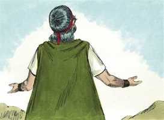
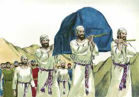
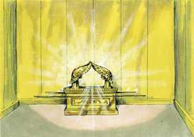
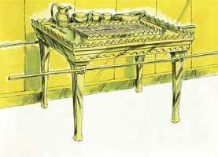
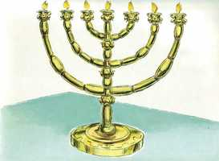

# Êxodo Cap 25

**1** 	ENTÃO falou o Senhor a Moisés, dizendo:

> **Cmt MHenry**: *Versículos 1-9* Deus escolheu o povo de Israel para que fosse um povo peculiar para Si mesmo, por acima de todo outro povo, e Ele mesmo seria o Rei deles. Ordenou que se fizesse para ele um palácio real, chamado santuário, lugar santo ou habitação santa. Nele mostraria sua santa presença em meio deles. Já que no deserto habitam em tendas ou barracas, mandou que este palácio real fosse um tabernáculo, que pudesse ser trasladado quando eles se deslocassem. O povo devia subministrar a Moisés os materiais, em forma completamente voluntária. O melhor uso que podemos dar a nossa riqueza mundana é honrar a Deus com ela em obras de piedade e caridade. Devemos perguntar não só "Que *devemos* fazer?", senão "Que *podemos* fazer por Deus?". O que dessem, deviam dá-lo alegremente, não de má vontade, porque Deus ama o doador alegre ([2 Co 9.7](../47N-2Co/09.md#7)). O que se coloca a serviço de Deus deve contar-se como bem empregado, e todo o que se faça para o serviço de Deus deve fazer-se segundo Suas ordens.

 

**2** 	Fala aos filhos de Israel, que me tragam uma oferta alçada; de todo o homem cujo coração se mover voluntariamente, dele tomareis a minha oferta alçada.

**3** 	E esta é a oferta alçada que recebereis deles: ouro, e prata, e cobre,

**4** 	E azul, e púrpura, e carmesim, e linho fino, e pêlos de cabras,

**5** 	E peles de carneiros tintas de vermelho, e peles de texugos, e madeira de acácia,

**6** 	Azeite para a luz, especiarias para o óleo da unção, e especiarias para o incenso,

**7** 	Pedras de ônix, e pedras de engaste para o éfode e para o peitoral.

**8** 	E me farão um santuário, e habitarei no meio deles.

**9** 	Conforme a tudo o que eu te mostrar para modelo do tabernáculo, e para modelo de todos os seus pertences, assim mesmo o fareis.

 

**10** 	Também farão uma arca de madeira de acácia; o seu comprimento será de dois côvados e meio, e a sua largura de um côvado e meio, e de um côvado e meio a sua altura.

> **Cmt MHenry**: *Versículos 10-22* A arca era um cofre, recoberto de ouro, no que seriam guardadas as duas Tábuas da Lei. Estas tábuas são chamadas testemunho; nelas Deus dá testemunho de Sua vontade. A lei era um testemunho *para* os israelitas a fim de orientá-los em seus deveres, e para convertê-la num testemunho *contra* eles, caso a transgredissem. A arca foi colocada no Lugar Santíssimo; o sumo sacerdote a borrifou com o sangue dos sacrifícios e queimou incenso ante ela; e sobre ela aparecia a glória visível, símbolo da presença Divina. Era um tipo de Cristo em sua natureza sem pecado, que não viu corrupção, unido pessoalmente com sua natureza Divina, que fez expiação com sua morte por nossos pecados cometidos contra Deus. Os querubins de ouro estavam um enfrente do outro, e ambos olhavam embaixo, para a arca. Representavam a assistência dos anjos ao Redentor, sua disposição de fazer Sua vontade, sua presença na assembléia dos santos, e seu anseio de olhar os mistérios do Evangelho. A arca estava coberta com uma tampa de ouro chamada de propiciatório. É dito que Deus mora ou se assenta no propiciatório, entre os querubins. Ali Ele daria sua lei e escutaria aos suplicantes, como um príncipe em seu trono.

 

**11** 	E cobri-la-á de ouro puro; por dentro e por fora a cobrirás; e farás sobre ela uma coroa de ouro ao redor;

**12** 	E fundirás para ela quatro argolas de ouro, e as porás nos quatro cantos dela, duas argolas num lado dela, e duas argolas noutro lado.

**13** 	E farás varas de madeira de acácia, e as cobrirás com ouro.

**14** 	E colocarás as varas nas argolas, aos lados da arca, para se levar com elas a arca.

**15** 	As varas estarão nas argolas da arca, não se tirarão dela.

**16** 	Depois porás na arca o testemunho, que eu te darei.

**17** 	Também farás um propiciatório de ouro puro; o seu comprimento será de dois côvados e meio, e a sua largura de um côvado e meio.

**18** 	Farás também dois querubins de ouro; de ouro batido os farás, nas duas extremidades do propiciatório.

**19** 	Farás um querubim na extremidade de uma parte, e o outro querubim na extremidade da outra parte; de uma só peça com o propiciatório, fareis os querubins nas duas extremidades dele.

**20** 	Os querubins estenderão as suas asas por cima, cobrindo com elas o propiciatório; as faces deles uma defronte da outra; as faces dos querubins estarão voltadas para o propiciatório.

**21** 	E porás o propiciatório em cima da arca, depois que houveres posto na arca o testemunho que eu te darei.

**22** 	E ali virei a ti, e falarei contigo de cima do propiciatório, do meio dos dois querubins (que estão sobre a arca do testemunho), tudo o que eu te ordenar para os filhos de Israel.

 

**23** 	Também farás uma mesa de madeira de acácia; o seu comprimento será de dois côvados, e a sua largura de um côvado, e a sua altura de um côvado e meio.

> **Cmt MHenry**: *Versículos 23-30* Deviam fazer uma mesa de madeira revestida de ouro, para colocá-la na primeira habitação do tabernáculo, e devia ter continuamente o pão da proposição. A mesa com seus utensílios nela, e seu uso, parece tipificar a comunhão que o Senhor tem com seu povo remido por meio de suas ordenanças, as provisões de sua casa, as festas com que são favorecidos. Além disso, o alimento para sua alma, que sempre encontram quando o necessitam; e o deleite que Ele encontra nas pessoas e seu serviço, segundo são apresentados ante Ele em Cristo.

 

**24** 	E cobri-la-ás com ouro puro; também lhe farás uma coroa de ouro ao redor.

**25** 	Também lhe farás uma moldura ao redor, da largura de quatro dedos, e lhe farás uma coroa de ouro ao redor da moldura.

> **Cmt MHenry**: *CAPÍTULO 25A-Lm

**26** 	Também lhe farás quatro argolas de ouro; e porás as argolas aos quatro cantos, que estão nos seus quatro pés.

**27** 	Defronte da moldura estarão as argolas, como lugares para os varais, para se levar a mesa.

**28** 	Farás, pois, estes varais de madeira de acácia, e cobri-los-ás com ouro; e levar-se-á com eles a mesa.

**29** 	Também farás os seus pratos, e as suas colheres, e as suas cobertas, e as suas tigelas com que se hão de oferecer libações; de ouro puro os farás.

**30** 	E sobre a mesa porás o pão da proposição perante a minha face perpetuamente.

**31** 	Também farás um candelabro de ouro puro; de ouro batido se fará este candelabro; o seu pé, as suas hastes, os seus copos, os seus botões, e as suas flores serão do mesmo.

> **Cmt MHenry**: *Versículos 31-40* O candelabro representa a luz da Palavra e do Espírito de Deus em Cristo Jesus e por meio dEle, concedido neste mundo tenebroso ao povo crente, para dirigir a adoração e a obediência deles, e para dar-lhes consolo. A igreja ainda está em sombras, como o tabernáculo, em comparação com o que será no céu, porém a palavra de Deus é uma luz que brilha em um lugar escuro ([2 Pe 1.19](../61N-2Pe/01.md#19)), e sem dúvida o mundo seria um lugar muito escuro sem ela. No versículo 40 há uma expressa advertência para Moisés. Nada foi deixado a sua fantasia, ou à dos operários ou do povo; a vontade de Deus devia observar-se em cada detalhe. A instrução de Cristo a seus discípulos ([Mt 28.20](../40N-Mt/28.md#20)) tem o mesmo sentido: Guardem todas as coisas que lhes mandei. Lembremos que somos os templos do Espírito Santo, que temos a lei de Deus em nossos corações, que devemos levar uma vida de comunhão com Deus, celebrar suas ordenanças e ser luz para o mundo, se verdadeiramente somos seguidores de Cristo. que o Senhor No-Amom ajude a provar-nos por esta enfoque da religião e a caminho conforme a isso. "

 

**32** 	E dos seus lados sairão seis hastes; três hastes do candelabro de um lado dele, e três hastes do outro lado dele.

**33** 	Numa haste haverá três copos a modo de amêndoas, um botão e uma flor; e três copos a modo de amêndoas na outra haste, um botão e uma flor; assim serão as seis hastes que saem do candelabro.

**34** 	Mas no candelabro mesmo haverá quatro copos a modo de amêndoas, com seus botões e com suas flores;

**35** 	E um botão debaixo de duas hastes que saem dele; e ainda um botão debaixo de duas outras hastes que saem dele; e ainda um botão debaixo de duas outras hastes que saem dele; assim se fará com as seis hastes que saem do candelabro.

**36** 	Os seus botões e as suas hastes serão do mesmo; tudo será de uma só peça, obra batida de ouro puro.

**37** 	Também lhe farás sete lâmpadas, as quais se acenderão para iluminar defronte dele.

**38** 	Os seus espevitadores e os seus apagadores serão de ouro puro.

**39** 	De um talento de ouro puro os farás, com todos estes vasos.

**40** 	Atenta, pois, que o faças conforme ao seu modelo, que te foi mostrado no monte.

> **Cmt MHenry** Intro: *• Versículos 1-9*> *O que ofereceram os israelitas para construir o tabernáculo*> *• Versículos 10-22*> *• Versículos 23-30*> *A mesa com seus utensílios*> *• Versículos 31-40*> *O candelabro*