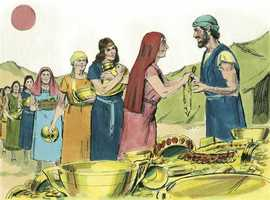
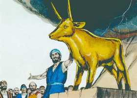
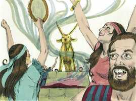
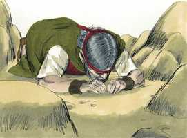
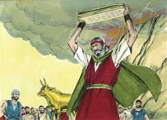
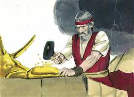
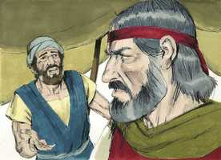
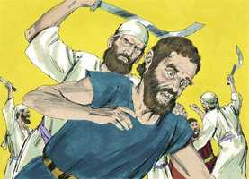

# Êxodo Cap 32

**1** 	MAS vendo o povo que Moisés tardava em descer do monte, acercou-se de Arão, e disse-lhe: Levanta-te, faze-nos deuses, que vão adiante de nós; porque quanto a este Moisés, o homem que nos tirou da terra do Egito, não sabemos o que lhe sucedeu.

> **Cmt MHenry**: *Versículos 1-6* Enquanto Moisés estava no monte recebendo a lei de Deus, o povo inflamado se dirigiu a Arão. A multidão embrutecida estava cansada de esperar o retorno de Moisés. O cansaço da espera dá lugar a muitas tentações. Deve esperar-se o dinheiro até que chegue, e deve ser esperado ainda que demore. Que a prontidão deles para entregar seus pendentes de ouro para fabricar um ídolo envergonhe nossa mesquinhez no serviço do Deus verdadeiro. Não se detiveram a considerar o custo da idolatria, e nós nos queixamos por nosso gasto na religião? Arão fez a imagem de um boi ou bezerro, e lhe deu certa terminação com um buril. E eles ofereceram sacrifícios a este ídolo. Já que colocaram uma imagem ante eles e assim trocaram a verdade de Deus em mentira, seus sacrifícios foram abominação. Uns poucos dias antes, nesse mesmo lugar, não tinham eles ouvido a voz de Jeová Deus dizendo-lhes desde o meio do fogo: "Não te farás imagem"? Eles mesmos, não tinham entrado solenemente numa aliança com Deus, no sentido de fazer tudo o que Ele lhes tinha falado, e que obedeceriam? (Capítulo 24.7). Contudo, antes de sair do lugar onde tinham feito solenemente o pacto, romperam um mandamento expresso, desafiando uma ameaça expressa. Isto mostra claramente que a lei não era capaz de santificar, como não era capaz de justificar; por ela se conhece o pecado, mas não a cura do pecado. Arão foi separado por nomeação divina para o ofício do sacerdócio; todavia ele, que uma vez se envergonhou ao extremo de levantar um altar para o bezerro de ouro, agora deve reconhecer-se indigno da honra de servir no altar de Deus, e deve sentir-se em dívida com a livre graça por isso. deste modo foram silenciados o orgulho e a jactância.

**2** 	E Arão lhes disse: Arrancai os pendentes de ouro, que estão nas orelhas de vossas mulheres, e de vossos filhos, e de vossas filhas, e trazei-mos.

**3** 	Então todo o povo arrancou os pendentes de ouro, que estavam nas suas orelhas, e os trouxeram a Arão.

 

**4** 	E ele os tomou das suas mãos, e trabalhou o ouro com um buril, e fez dele um bezerro de fundição. Então disseram: Este é teu deus, ó Israel, que te tirou da terra do Egito.

 

**5** 	E Arão, vendo isto, edificou um altar diante dele; e apregoou Arão, e disse: Amanhã será festa ao Senhor.

**6** 	E no dia seguinte madrugaram, e ofereceram holocaustos, e trouxeram ofertas pacíficas; e o povo assentou-se a comer e a beber; depois levantou-se a folgar.

 

**7** 	Então disse o Senhor a Moisés: Vai, desce; porque o teu povo, que fizeste subir do Egito, se tem corrompido,

> **Cmt MHenry**: *Versículos 7-14* Deus diz a Moisés que os israelitas tinham-se corrompido. O pecado é a corrupção do pecador, e é uma corrupção de si mesmo; cada um é tentado, quando de sua própria concupiscência é atraído e seduzido. Eles tinham-se descaminhado. O pecado é sair-se do caminho do dever e tomar um atalho. Logo esqueceram as obras de Deus. Ele vê o que eles não enxergam, e nenhuma maldade do mundo lhe está oculta. Nós não suportaríamos ver a milésima parte da maldade que Deus vê a diário. Deus expressa a grandeza de seu justo desagrado no estilo dos homens, que não teriam permitido que alguém intercedesse por aqueles contra os que tivessem resolvido serem severos. Nada, senão a oração de Moisés, podia salvá-los da ruína; deste modo, foi um tipo de Cristo, por cuja única mediação Deus reconciliaria o mundo consigo mesmo. Moisés põe como prenda a glória de Deus. A glorificação do nome de Deus, que deveria ser nossa primeira petição, como é no Pai Nosso, deveria ser nosso rogo principal. As promessas de Deus devem ser nosso principal rogo na oração, já que quem o prometeu é poderoso para cumprir. Note-se o poder da oração. Em resposta às orações de Moisés, Deus mostrou seu propósito de perdoar o povo, da forma que antes *parecia* decidido a destruí-lo; a mudança na expressão anterior de seu propósito é chamada "arrepender-se do mal".

**8** 	E depressa se tem desviado do caminho que eu lhe tinha ordenado; eles fizeram para si um bezerro de fundição, e perante ele se inclinaram, e ofereceram-lhe sacrifícios, e disseram: Este é o teu deus, ó Israel, que te tirou da terra do Egito.

**9** 	Disse mais o Senhor a Moisés: Tenho visto a este povo, e eis que é povo de dura cerviz.

**10** 	Agora, pois, deixa-me, para que o meu furor se acenda contra ele, e o consuma; e eu farei de ti uma grande nação.

**11** 	Moisés, porém, suplicou ao Senhor seu Deus e disse: Ó Senhor, por que se acende o teu furor contra o teu povo, que tiraste da terra do Egito com grande força e com forte mão?

 

**12** 	Por que hão de falar os egípcios, dizendo: Para mal os tirou, para matá-los nos montes, e para destruí-los da face da terra? Torna-te do furor da tua ira, e arrepende-te deste mal contra o teu povo.

**13** 	Lembra-te de Abraão, de Isaque, e de Israel, os teus servos, aos quais por ti mesmo tens jurado, e lhes disseste: Multiplicarei a vossa descendência como as estrelas dos céus, e darei à vossa descendência toda esta terra, de que tenho falado, para que a possuam por herança eternamente.

**14** 	Então o Senhor arrependeu-se do mal que dissera que havia de fazer ao seu povo.

**15** 	E virou-se Moisés e desceu do monte com as duas tábuas do testemunho na mão, tábuas escritas de ambos os lados; de um e de outro lado estavam escritas.

> **Cmt MHenry**: *Versículos 15-20* Que mudança! Descer do monte da comunhão com Deus para conversar com um mundo malvado. Nada vemos em Deus que não seja puro prazeroso; no mundo, nada que não seja pecador e provocativo. Para que fosse visto que um ídolo é nada no mundo, Moisés pulverizou o bezerro. O ato de misturar este pó com a água que bebiam representa o fato de que o coração do apóstata deve encher-se com seus próprios caminhos.

**16** 	E aquelas tábuas eram obra de Deus; também a escritura era a mesma escritura de Deus, esculpida nas tábuas.

**17** 	E, ouvindo Josué a voz do povo que jubilava, disse a Moisés: Alarido de guerra há no arraial.

**18** 	Porém ele respondeu: Não é alarido dos vitoriosos, nem alarido dos vencidos, mas o alarido dos que cantam, eu ouço.

**19** 	E aconteceu que, chegando Moisés ao arraial, e vendo o bezerro e as danças, acendeu-se-lhe o furor, e arremessou as tábuas das suas mãos, e quebrou-as ao pé do monte;

 

**20** 	E tomou o bezerro que tinham feito, e queimou-o no fogo, moendo-o até que se tornou em pó; e o espargiu sobre as águas, e deu-o a beber aos filhos de Israel.

 

**21** 	E Moisés perguntou a Arão: Que te tem feito este povo, que sobre ele trouxeste tamanho pecado?

> **Cmt MHenry**: *Versículos 21-29* Nunca houve homem sábio que desse uma escusa mais frívola e néscia que a de Arão. Não devemos ser levados a pecar por algo que o homem possa dizer-nos ou fazer-nos; pois os homens somente podem tentar-nos a pecar, mas não podem obrigar-nos a fazê-lo. a forma em que Moisés enfrentou o problema virou a dança em tremor. A vergonha de seu pecado foi exposta à luz. Para tirar a recriminação, Moisés não ocultou o pecado, nem lhe impôs uma cor falsa, senão que o castigou. Os levitas tiveram de matar os líderes desta maldade, mas ninguém foi executado, senão os que se enfrentaram abertamente. Os que persistem em pecar estão marcados para a ruína: os que pela manhã cantavam e dançavam, morreram antes do anoitecer. Os juízos do Senhor produzem mudanças súbitas às vezes, com os pecadores que se sentem seguros e alegres em seu pecar.

**22** 	Então respondeu Arão: Não se acenda a ira do meu senhor; tu sabes que este povo é inclinado ao mal;

 

**23** 	E eles me disseram: Faze-nos um deus que vá adiante de nós; porque não sabemos o que sucedeu a este Moisés, a este homem que nos tirou da terra do Egito.

**24** 	Então eu lhes disse: Quem tem ouro, arranque-o; e deram-mo, e lancei-o no fogo, e saiu este bezerro.

**25** 	E, vendo Moisés que o povo estava despido, porque Arão o havia deixado despir-se para vergonha entre os seus inimigos,

**26** 	Pôs-se em pé Moisés na porta do arraial e disse: Quem é do Senhor, venha a mim. Então se ajuntaram a ele todos os filhos de Levi.

**27** 	E disse-lhes: Assim diz o Senhor Deus de Israel: Cada um ponha a sua espada sobre a sua coxa; e passai e tornai pelo arraial de porta em porta, e mate cada um a seu irmão, e cada um a seu amigo, e cada um a seu vizinho.

**28** 	E os filhos de Levi fizeram conforme à palavra de Moisés; e caíram do povo aquele dia uns três mil homens.

 

**29** 	Porquanto Moisés tinha dito: Consagrai hoje as vossas mãos ao Senhor; porquanto cada um será contra o seu filho e contra o seu irmão; e isto, para que ele vos conceda hoje uma bênção.

**30** 	E aconteceu que no dia seguinte Moisés disse ao povo: Vós cometestes grande pecado. Agora, porém, subirei ao Senhor; porventura farei propiciação por vosso pecado.

> **Cmt MHenry**: *Versículos 30-35* Moisés o qualificou de grande pecado. a obra dos ministros deve mostrar a enormidade de seus pecados à gente. O grande mal do pecado se evidência no preço do perdão. Moisés roga misericórdia a Deus; ele não foi a dar escusas, senão a expiar. Não devemos supor que Moisés quer dizer que sempre estiver disposto a morrer pelo povo. temos de amar a nosso próximo *como* a nós mesmos, mas não *mais* que a nós mesmos. Porém, com o sentir que havia em Cristo, Ele estava disposto a por sua vida da maneira mais dolorosa, se desse modo puder preservar o povo. Moisés não podia apaziguar totalmente a ira de Deus; o qual mostra que a lei de Moisés não era capaz de reconciliar os homens com Deus, nem de aperfeiçoar nossa paz com Ele. somente em Cristo Deus perdoa o pecado, para não lembrá-lo mais. Esta história nos mostra que nenhum coração carnal, que não se humilhou, pode suportar por muito tempo os preceitos santos, as verdades humilhantes e a adoração espiritual de Deus. Porém um deus, um sacerdote, um culto, uma doutrina e um sacrifício, na medida da mente carnal, sempre acharão abundância de adoradores. Pode-se perverter o evangelho mesmo a ponto tal que se adapte ao gosto mundano. É bom para nós que o Profeta, incomparavelmente mais poderoso e misericordioso, tenha feito, como Moisés, expiação por nossa alma, e agora interceda por nós. Regozijemo-nos em sua graça. "

**31** 	Assim tornou-se Moisés ao Senhor, e disse: Ora, este povo cometeu grande pecado fazendo para si deuses de ouro.

**32** 	Agora, pois, perdoa o seu pecado; se não, risca-me, peço-te, do teu livro, que tens escrito.

> **Cmt MHenry**: *CAPÍTULO 32A-Jn

**33** 	Então disse o Senhor a Moisés: Aquele que pecar contra mim, a este riscarei do meu livro.

**34** 	Vai, pois, agora, conduze este povo para onde te tenho dito; eis que o meu anjo irá adiante de ti; porém no dia da minha visitação visitarei neles o seu pecado.

**35** 	Assim feriu o Senhor o povo, por ter sido feito o bezerro que Arão tinha formado.

> **Cmt MHenry** Intro: *• Versículos 1-6*> *O povo faz que Arão fabrique um bezerro de ouro*> *• Versículos 7-14*> *O desagrado de Deus – A intercessão de Moisés*> *• Versículos 15-20*> *Moisés quebra as tábuas da lei – Destrói o bezerro de ouro*> *• Versículos 21-29*> *A desculpa de Arão – Morte dos idólatras*> *• Versículos 30-35*> *Moisés ora pelo povo*