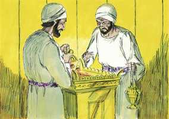
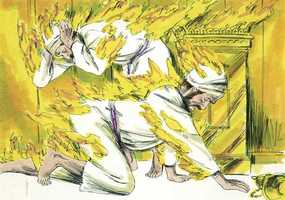
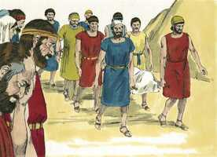

# Levítico Cap 10

**1** 	E OS filhos de Arão, Nadabe e Abiú, tomaram cada um o seu incensário e puseram neles fogo, e colocaram incenso sobre ele, e ofereceram fogo estranho perante o Senhor, o que não lhes ordenara.

> **Cmt MHenry**: *Versículos 1-2* Depois de Moisés e Arão, ninguém tinha mais probabilidades de ser honrado em Is que Nadabe e Abiú. Há razão para pensar que eles se encheram de orgulho e que se acenderam com vinho. Enquanto o povo estava prostrado ante o Senhor, adorando Sua presença e glória, eles entraram precipitadamente ao tabernáculo para queimar incenso, ainda que não fosse o momento indicado; os dois juntos em lugar de um só, e com fogo que não fora tomado do altar. Se o tivessem feito por ignorância, lhes teria sido permitido apresentar uma oferta pelo pecado. Porém a alma que age presunçosamente e com desdém da majestade e justiça de Deus, essa alma será cortada. O salário do pecado é a morte. Eles morreram no ato mesmo de seu pecado. O pecado e o castigo destes sacerdotes mostrou a imperfeição do sacerdócio desde seu começo mesmo, e que não podia resguardar do fogo da ira de Deus, não sendo outro coisa senão um tipo do sacerdócio de Cristo.

 

**2** 	Então saiu fogo de diante do Senhor e os consumiu; e morreram perante o Senhor.

 

**3** 	E disse Moisés a Arão: Isto é o que o Senhor falou, dizendo: Serei santificado naqueles que se chegarem a mim, e serei glorificado diante de todo o povo. Porém Arão calou-se.

> **Cmt MHenry**: *Versículos 3-7* As considerações mais tranqüilizadoras na aflição devem ser buscadas na Palavra de Deus. Que foi o que disse Deus? Embora o coração de Paz deve ter estado cheio de angústia e consternação, em silenciosa submissão honrou a justiça do golpe. Quando Deus nos corrige pelo pecado, a nós ou aos nossos, é o nosso dever aceitar o castigo e dizer: Jeová é; faça o que bem achar. Cada vez que adoramos a Deus, nos aproximamos a Ele como sacerdotes espirituais. Isto deve deixar-nos muito sérios em todos os atos de devoção. Quando nos aproximamos de Deus, concerne a todos nós realizarmos todo exercício religioso com a postura dos que crêem que o Deus com quem temos a ver é o Deus santo. Ele se vingará daqueles que profanam seu sagrado nome usando-o levianamente.

**4** 	E Moisés chamou a Misael e a Elzafã, filhos de Uziel, tio de Arão, e disse-lhes: Chegai, levai a vossos irmãos de diante do santuário, para fora do arraial.

 

**5** 	Então chegaram, e os levaram nas suas túnicas para fora do arraial, como Moisés lhes dissera.

**6** 	E Moisés disse a Arão, e a seus filhos Eleazar e Itamar: Não descobrireis as vossas cabeças, nem rasgareis vossas vestes, para que não morrais, nem venha grande indignação sobre toda a congregação; mas vossos irmãos, toda a casa de Israel, lamentem este incêndio que o Senhor acendeu.

**7** 	Nem saireis da porta da tenda da congregação, para que não morrais; porque está sobre vós o azeite da unção do Senhor. E fizeram conforme à palavra de Moisés.

**8** 	E falou o Senhor a Arão, dizendo:

> **Cmt MHenry**: *Versículos 8-11* Não bebam vinho nem bebidas fortes. Estavam proibidas aos sacerdotes durante o tempo em que ministravam. Exige-se dos ministros do evangelho que não sejam dados ao vinho ([1 Tm 3.3](../54N-1Tm/03.md#3)). diz: "Para que não morram", morram enquanto estiverem bêbados. O risco de morte ao qual estamos expostos continuamente deve comprometer-nos a todos a sermos sóbrios.

**9** 	Não bebereis vinho nem bebida forte, nem tu nem teus filhos contigo, quando entrardes na tenda da congregação, para que não morrais; estatuto perpétuo será isso entre as vossas gerações;

**10** 	E para fazer diferença entre o santo e o profano e entre o imundo e o limpo,

> **Cmt MHenry**: *CAPÍTULO 10A-2Sm

**11** 	E para ensinar aos filhos de Israel todos os estatutos que o Senhor lhes tem falado por meio de Moisés.

**12** 	E disse Moisés a Arão, e a Eleazar e a Itamar, seus filhos, que lhe ficaram: Tomai a oferta de alimentos, restante das ofertas queimadas do Senhor, e comei-a sem levedura junto ao altar, porquanto é coisa santíssima.

> **Cmt MHenry**: *Versículos 12-20* As aflições deveriam estimular-nos a cumprir nosso dever, em vez de afastar-nos. Mas nossa inaptidão para com o dever, quando é natural e não pecaminosa, nos permitirá que tenhamos grandes concessões a causa dela; Deus terá misericórdia e não pedirá sacrifício. Aproveitemos a solene advertência que transmite essa história. Quando os professantes vêm a adorar com zelo, sem conhecimento, com afeto carnal e pensamentos triviais, vãos, ligeiros e terrenos, artifícios todos da adoração soldado a própria vontade, em lugar de oferecer alma e espírito, então é quando se acende o incenso com um fogo que não veio do céu, que o Espírito do Deus santo nunca colocou dentro de seu coração. "

**13** 	Portanto a comereis no lugar santo; porque isto é a tua porção, e a porção de teus filhos, das ofertas queimadas do Senhor; porque assim me foi ordenado.

**14** 	Também o peito da oferta movida e a espádua da oferta alçada, comereis em lugar limpo, tu, e teus filhos e tuas filhas contigo; porque foram dados por tua porção, e por porção de teus filhos, dos sacrifícios pacíficos dos filhos de Israel.

**15** 	A espádua da oferta alçada e o peito da oferta movida trarão com as ofertas queimadas de gordura, para oferecer por oferta movida perante o Senhor; o que será por estatuto perpétuo, para ti e para teus filhos contigo, como o Senhor tem ordenado.

**16** 	E Moisés diligentemente buscou o bode da expiação, e eis que já fora queimado; portanto indignou-se grandemente contra Eleazar e contra Itamar, os filhos de Arão que ficaram, dizendo:

**17** 	Por que não comestes a expiação do pecado no lugar santo, pois é coisa santíssima e Deus a deu a vós, para que levásseis a iniqüidade da congregação, para fazer expiação por eles diante do Senhor?

**18** 	Eis que não se trouxe o seu sangue para dentro do santuário; certamente devíeis ter comido no santuário, como tenho ordenado.

**19** 	Então disse Arão a Moisés: Eis que hoje ofereceram a sua expiação pelo pecado e o seu holocausto perante o Senhor, e tais coisas me sucederam; se hoje tivesse comido da oferta da expiação pelo pecado, seria isso porventura aceito aos olhos do Senhor?

**20** 	E Moisés, ouvindo isto, deu-se por satisfeito.

> **Cmt MHenry** Intro: *• Versículos 1-2*> *O pecado e a morte de Nadabe e Abiú*> *• Versículos 3-7*> *Proíbe-se a Arão e a seus filhos de levar luto por Nadabe a*> *• Versículos 8-11*> *Proibição do vinho aos sacerdotes quando estiverem ao*> *serviço do tabernáculo*> *• Versículos 12-20*> *De comer as coisas stas*