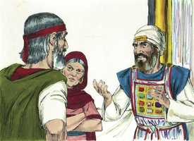
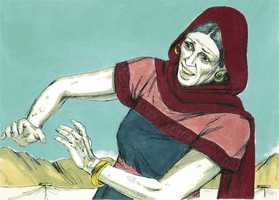

# Números Cap 12

**1** 	E FALARAM Miriã e Arão contra Moisés, por causa da mulher cusita, com quem casara; porquanto tinha casado com uma mulher cusita.

> **Cmt MHenry**: *Versículos 1-9* A paciência de Moisés foi provada em sua própria família, assim como pelo povo. o pretexto foi que tinha-se casado com uma estrangeira; porém provavelmente o orgulho deles tinha sido ferido e a inveja tinha sido excitada por sua maior autoridade. A oposição de nossos familiares próximos e dos amigos religiosos é sumamente dolorosa. Mas deve ter-se isto em consideração, e será bom que em tais conseqüências possamos conservar a bondade e a mansidão de Moisés, o qual estava desse modo equipado para a obra a que estava chamado. Deus não só declarou inocente a Moisés, senão que o elogiou. Moisés tinha o espírito de profecia num grau que o coloca muito por acima de todos os outros profetas; mas aquele que é o menor no Reino dos Céus é o maior nele; e nosso Senhor Jesus o excede infinitamente ([Hb 3.1](../58N-Hb/03.md#1)). Que Miriã e Arão considerem a quem estavam insultando. Nós temos motivos para temer dizer ou fazer algo contra os servos de Deus. sem dúvida são presunçosos os que não temem falar mal das potestades superiores ([2 Pe 2.10](../61N-2Pe/02.md#10)). Ser banidos da presença de Deus é o sinal mas certo e triste do desagrado de Deus. Ai de nós se Ele se afastar! Ele nunca se distancia até que pelo pecado e a tolice nós o deixamos.

 

**2** 	E disseram: Porventura falou o Senhor somente por Moisés? Não falou também por nós? E o Senhor o ouviu.

**3** 	E era o homem Moisés mui manso, mais do que todos os homens que havia sobre a terra.

**4** 	E logo o Senhor disse a Moisés, a Arão e a Miriã: Vós três saí à tenda da congregação. E saíram eles três.

 

**5** 	Então o Senhor desceu na coluna de nuvem, e se pôs à porta da tenda; depois chamou a Arão e a Miriã e ambos saíram.

**6** 	E disse: Ouvi agora as minhas palavras; se entre vós houver profeta, eu, o Senhor, em visão a ele me farei conhecer, ou em sonhos falarei com ele.

**7** 	Não é assim com o meu servo Moisés que é fiel em toda a minha casa.

**8** 	Boca a boca falo com ele, claramente e não por enigmas; pois ele vê a semelhança do Senhor; por que, pois, não tivestes temor de falar contra o meu servo, contra Moisés?

**9** 	Assim a ira do Senhor contra eles se acendeu; e retirou-se.

**10** 	E a nuvem se retirou de sobre a tenda; e eis que Miriã ficou leprosa como a neve; e olhou Arão para Miriã, e eis que estava leprosa.

> **Cmt MHenry**: *Versículos 10-16* A nuvem se afastou, e Miriã ficou leprosa. Quando Deus vai embora, chega o mal; não esperem o bem quando Deus parte. A imunda língua dela, como disse o bispo Hall, foi justamente castigada com rosto imundo. Arão, como sacerdote, era o juiz da lepra. Ele não podia declará-la leprosa sem tremer, sabendo que ele mesmo era igualmente culpável. Mas se ela foi deste modo castigada por falar contra Moisés, que será dos que pecam contra Cristo? Arão, que se uniu a sua irmã para difamar a Moisés, se vê forçado por si mesmo e sua irmã, a suplicar e falar com altura daquele a quem tinham tão recentemente acusado. Os que pisoteiam aos santos e servos de Deus, um dia se alegrarão de serem parte de seu séqüito. Bom é quando a repreensão produz confissão de pecado e arrependimento. Tais ofensores, embora derrotados e desonrados, serão perdoados. Moisés fez evidente que ele perdoava a injúria infligida. Devemos conformar-nos a esta pauta de Moisés e à de nosso Salvador, que disse: "Pai, perdoa-os". É dada uma razão para o afastamento de Miriã do acampamento durante sete dias, porque desse modo ela devia aceitar o castigo de seu pecado. quando estamos sob o sinal do desagrado de Deus pelo pecado, nos corresponde aceitar a vergonha. Isso obstaculizou o avanço do povo em sua marcha rumo a Canaã. Muitas coisas se nos opõem, mas nada nos estorva tanto no caminho ao céu como o pecado. "

 

**11** 	Por isso Arão disse a Moisés: Ai, senhor meu, não ponhas sobre nós este pecado, pois agimos loucamente, e temos pecado.

**12** 	Ora, não seja ela como um morto, que saindo do ventre de sua mãe, a metade da sua carne já esteja consumida.

> **Cmt MHenry**: *CAPÍTULO 12A-2Rs

**13** 	Clamou, pois, Moisés ao Senhor, dizendo: Ó Deus, rogo-te que a cures.

**14** 	E disse o Senhor a Moisés: Se seu pai cuspira em seu rosto, não seria envergonhada sete dias? Esteja fechada sete dias fora do arraial, e depois a recolham.

**15** 	Assim Miriã esteve fechada fora do arraial sete dias, e o povo não partiu, até que recolheram a Miriã.

**16** 	Porém, depois o povo partiu de Hazerote; e acampou-se no deserto de Parã.

> **Cmt MHenry** Intro: *• Versículos 1-9*> *Deus repreende a murmuração de Arão e Miriã*> *• Versículos 10-16*> *Miriã atacada de lepra e sarada ao orar Moisés*