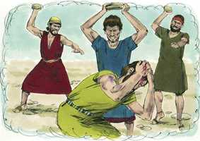

# Números Cap 15

**1** 	DEPOIS falou o Senhor a Moisés, dizendo:

> **Cmt MHenry**: *Versículos 1-21* São dadas instruções completas sobre as ofertas de farinha e da libação. O começo deste ensinamento é muito alentador. "Quando tenham entrado na terra de sua habitação que Eu lhes dou". Esta era uma simples indicação de que Deus garante a terra prometida a sua semente. Dado que os sacrifícios de reconhecimento eram concebidos como o alimento da mesa de Deus, era requisito que houvesse uma provisão constante de pão, óleo e vinho, qualquer fosse a carne. E a intenção desta lei é ensinar as proporções da oferta de farinha e a libação. Os nativos e os estrangeiros são colocados no mesmo nível nesta matéria como em outras afins. Isto era um feliz anúncio do chamado dos gentios e de sua admissão na igreja. Se a lei fazia tão pouca diferença entre judeu e gentio, muita menos diferença faria o evangelho que derrubou o muro de separação e reconciliou a ambos com Deus.

**2** 	Fala aos filhos de Israel, e dize-lhes: Quando entrardes na terra das vossas habitações, que eu vos hei de dar,

**3** 	E ao Senhor fizerdes oferta queimada, holocausto, ou sacrifício, para cumprir um voto, ou em oferta voluntária, ou nas vossas solenidades, para fazerdes ao Senhor um cheiro suave de ovelhas ou gado,

**4** 	Então aquele que apresentar a sua oferta ao Senhor, por oferta de alimentos trará uma décima de flor de farinha misturada com a quarta parte de um him de azeite.

**5** 	E de vinho para libação prepararás a quarta parte de um him, para holocausto, ou para sacrifício para cada cordeiro;

**6** 	E para cada carneiro prepararás uma oferta de alimentos de duas décimas de flor de farinha, misturada com a terça parte de um him de azeite.

**7** 	E de vinho para a libação oferecerás a terça parte de um him ao Senhor, em cheiro suave.

**8** 	E, quando preparares novilho para holocausto ou sacrifício, para cumprir um voto, ou um sacrifício pacífico ao Senhor,

**9** 	Com o novilho apresentarás uma oferta de alimentos de três décimas de flor de farinha misturada com a metade de um him de azeite.

**10** 	E de vinho para a libação oferecerás a metade de um him, oferta queimada em cheiro suave ao Senhor.

**11** 	Assim se fará com cada boi, ou com cada carneiro, ou com cada um dos cordeiros ou cabritos.

**12** 	Segundo o número que oferecerdes, assim o fareis com cada um, segundo o número deles.

**13** 	Todo o natural assim fará estas coisas, oferecendo oferta queimada em cheiro suave ao Senhor.

**14** 	Quando também peregrinar convosco algum estrangeiro, ou que estiver no meio de vós nas vossas gerações, e ele apresentar uma oferta queimada de cheiro suave ao Senhor, como vós fizerdes, assim fará ele.

**15** 	Um mesmo estatuto haja para vós, ó congregação, e para o estrangeiro que entre vós peregrina, por estatuto perpétuo nas vossas gerações; como vós, assim será o peregrino perante o Senhor.

> **Cmt MHenry**: *CAPÍTULO 15A-Es

**16** 	Uma mesma lei e um mesmo direito haverá para vós e para o estrangeiro que peregrina convosco.

**17** 	Falou mais o Senhor a Moisés, dizendo:

**18** 	Fala aos filhos de Israel, e dize-lhes: Quando entrardes na terra em que vos hei de introduzir,

**19** 	Acontecerá que, quando comerdes do pão da terra, então oferecereis ao Senhor oferta alçada.

**20** 	Das primícias da vossa massa oferecereis um bolo em oferta alçada; como a oferta da eira, assim o oferecereis.

**21** 	Das primícias das vossas massas dareis ao Senhor oferta alçada nas vossas gerações.

**22** 	E, quando vierdes a errar, e não cumprirdes todos estes mandamentos, que o Senhor falou a Moisés,

> **Cmt MHenry**: *Versículos 22-29* Embora a ignorância constitui escusa em certo grau, não justificará aqueles que poderiam ter conhecido a vontade de seu Senhor, mas não o fizeram. Davi orava para ser limpado de suas faltas ocultas, os pecados dos que ele mesmo não tinha consciência. Os pecados cometidos por ignorância serão perdoados por meio de Cristo, o grande Sacrifício que, quando se ofereceu a si mesmo de uma só vez para sempre na cruz, pareceu explicar parte da intenção de sua oferta com a oração: Pai, perdoa-os, porque não sabem o que fazem. Isto atentava com favor aos gentios, pois a lei da expiação pelos pecados de ignorância está feita expressamente para estendê-la aos que eram estrangeiros em Israel.

**23** 	Tudo quanto o Senhor vos tem mandado por intermédio de Moisés, desde o dia que o Senhor ordenou, e dali em diante, nas vossas gerações,

**24** 	Será que, quando se fizer alguma coisa por ignorância, e for encoberto aos olhos da congregação, toda a congregação oferecerá um novilho para holocausto em cheiro suave ao Senhor, com a sua oferta de alimentos e libação conforme ao estatuto, e um bode para expiação do pecado.

**25** 	E o sacerdote fará expiação por toda a congregação dos filhos de Israel, e lhes será perdoado, porquanto foi por ignorância; e trouxeram a sua oferta, oferta queimada ao Senhor, e a sua expiação do pecado perante o Senhor, por causa da sua ignorância.

**26** 	Será, pois, perdoado a toda a congregação dos filhos de Israel, e mais ao estrangeiro que peregrina no meio deles, porquanto por ignorância sobreveio a todo o povo.

**27** 	E, se alguma alma pecar por ignorância, para expiação do pecado oferecerá uma cabra de um ano.

**28** 	E o sacerdote fará expiação pela pessoa que pecou, quando pecar por ignorância, perante o Senhor, fazendo expiação por ela, e lhe será perdoado.

**29** 	Para o natural dos filhos de Israel, e para o estrangeiro que no meio deles peregrina, uma mesma lei vos será, para aquele que pecar por ignorância.

**30** 	Mas a pessoa que fizer alguma coisa temerariamente, quer seja dos naturais quer dos estrangeiros, injuria ao Senhor; tal pessoa será extirpada do meio do seu povo.

> **Cmt MHenry**: *Versículos 30-36* Reconhecem-se como pecadores com soberba aos que pecam deliberadamente contra a vontade e a glória de Deus. Os pecados assim cometidos são excessivamente pecaminosos. O que assim transgride o mandamento, *repreende* ao Senhor e também *despreza* a palavra do Senhor. Os pecadores soberbos a desprezam pensando que são demasiado grandes, demasiado bons, e demasiado sábios para serem governados por ela. Narra-se um caso particular de desafio no pecado de transgredir o dia de repouso. A transgressão foi ajuntar lenha para fazer fogo no dia de repouso, em tanto que o povo devia cozinhar o que for no dia anterior ([Êx 16.23](../02A-Ex/16.md#23)). Isto foi feito como afronta tanto à lei como ao Legislador. Deus é zeloso da honra de seus dias de repouso, e não considerará inocente ao que os profana, façam o que fizerem os homens. Deus concebeu este castigo como advertência para que todos tomem consciência de guardar o caráter sagrado do dia de repouso. E podemos ter a certeza de que jamais foi dado mandamento para castigo do pecado, que no dia do juízo não resulte ter procedido do amor e da justiça perfeitos. O direito de Deus a um dia de devoção a Ele será disputado e negado somente pelos que atentam ao orgulho e à incredulidade de seu coração em vez de ouvir o ensinamento do Espírito da verdade e da vida. Em que radica a diferença entre aquele que foi surpreendido recolhendo lenha no deserto no dia de Deus e o homem que dá as costas as bênçãos das ordenanças do dia de repouso e as promessas das misericórdias do dia de repouso, para usar seu tempo, seus interesses e sua alma em acumular riquezas, e desperdiça suas horas, seus bens e sua força no prazer pecaminoso? A riqueza pode vir pelo esforço ímpio, mas não virá sozinha; terá sua espantosa recompensa. As empresas dos pecadores conduzem à ruína.

**31** 	Pois desprezou a palavra do Senhor, e anulou o seu mandamento; totalmente será extirpada aquela pessoa, a sua iniqüidade será sobre ela.

**32** 	Estando, pois, os filhos de Israel no deserto, acharam um homem apanhando lenha no dia de sábado.

**33** 	E os que o acharam apanhando lenha o trouxeram a Moisés e a Arão, e a toda a congregação.

**34** 	E o puseram em guarda; porquanto ainda não estava declarado o que se lhe devia fazer.

**35** 	Disse, pois, o Senhor a Moisés: Certamente morrerá aquele homem; toda a congregação o apedrejará fora do arraial.

 

**36** 	Então toda a congregação o tirou para fora do arraial, e o apedrejaram, e morreu, como o Senhor ordenara a Moisés.

**37** 	E falou o Senhor a Moisés, dizendo:

> **Cmt MHenry**: *Versículos 37-41* O Senhor manda a gente que coloque franjas na borda de suas vestes. Os judeus se distinguiam de seus vizinhos por sua roupa e por sua dieta e, deste modo, ensinavam a não conformar-se com os costumes dos pagãos em outras coisas. Proclamavam-se judeus onde quer que fossem, e não se envergonhavam de Deus e de sua lei. As franjas não foram ordenadas como terminação e enfeite de sua roupa, senão a modo de lembrança para despertar sua mente. Se fossem tentados a pecar, a franja os advertiria que não deviam quebrantar os mandamentos de Deus. Devemos usar todos os médios para refrescar em nossas memórias as verdades e preceitos da palavra de Deus, para fortalecer e avivar nossa obediência e armar nossas mentes contra a tentação. Sejam santos para seu Deus; limpos de pecado e sinceramente dedicados a Seu serviço; e aquela grande razão de todos os mandamentos se repete uma e outra vez: "Eu, Jeová, vosso Deus". "

**38** 	Fala aos filhos de Israel, e dize-lhes: Que nas bordas das suas vestes façam franjas pelas suas gerações; e nas franjas das bordas ponham um cordão de azul.

**39** 	E as franjas vos serão para que, vendo-as, vos lembreis de todos os mandamentos do Senhor, e os cumprais; e não seguireis o vosso coração, nem após os vossos olhos, pelos quais andais vos prostituindo.

**40** 	Para que vos lembreis de todos os meus mandamentos, e os cumprais, e santos sejais a vosso Deus.

**41** 	Eu sou o Senhor vosso Deus, que vos tirei da terra do Egito, para ser vosso Deus. Eu sou o Senhor vosso Deus.

> **Cmt MHenry** Intro: *• Versículos 1-21*> *A lei da oferta e da libação – O estrangeiro está sob a mesma*> *• Versículos 22-29*> *O sacrifício pelo pecado da ignorância*> *• Versículos 30-36*> *O castigo do desafio – O transgressor do dia de repouso é*> *• Versículos 37-41*> *A lei das franjas das vestes*