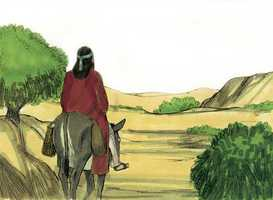
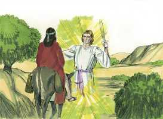
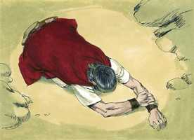

# Números Cap 22

**1** 	DEPOIS partiram os filhos de Israel, e acamparam-se nas campinas de Moabe, além do Jordão na altura de Jericó.

> **Cmt MHenry**: *Versículos 1-14* O rei de Moabe se fez um plano para amaldiçoar o povo de Israel; isto é, para pôr a Deus em contra deles, que até agora tinha lutado em favor deles. Tinha a falsa idéia de que se lograva que um profeta orasse pedindo que lhes sobreviesse o mal, e que desse uma bênção a ele e seus exércitos, então poderia enfrentar o inimigo. Ninguém tinha uma reputação maior que Balaão, e Balaque o empregará, apesar que teve que fazê-lo vir de longe. Não se sabe se antes disto o Senhor tinha falado alguma vez a Balaão, ou às vezes dele, embora é provável que o tivesse feito, e é seguro que depois o fez. Contudo, temos provas abundantes de que ele viveu e morreu como homem malvado, inimigo de Deus e de seu povo. A maldição não virá a nós se não há uma causa, embora os homens a pronunciem. Para convencer a Balaão, eles levaram a paga da injustiça, mas Deus limitou a Balaão, proibindo-lhe de amaldiçoar a Israel. Balaão não era um estranho da causa de Israel, de modo que deveria ter respondido de imediato aos mensageiros que nunca amaldiçoaria um povo que Deus tiver abençoado. Porém se toma uma noite para considerar o que fazer. Quando parlamentamos com as tentações estamos em grave perigo de sermos derrotados. Balaão não foi fiel para entregar a mensagem com a resposta de Deus aos mensageiros. Os que diminuem as restrições divinas são um bom alvo para a tentação de Satanás, como se ir contra a lei de Deus for somente andar sem sua permissão. Os mensageiros tampouco são fiéis ao dar a resposta de Balaão a Balaque. Assim, muitos são maltratados pelos elogios dos que os rodeiam e lhes impedem de ver seus próprios defeitos e tolices.

**2** 	Vendo, pois, Balaque, filho de Zipor, tudo o que Israel fizera aos amorreus,

**3** 	Moabe temeu muito diante deste povo, porque era numeroso; e Moabe andava angustiado por causa dos filhos de Israel.

**4** 	Por isso Moabe disse aos anciãos dos midianitas: Agora lamberá esta congregação tudo quanto houver ao redor de nós, como o boi lambe a erva do campo. Naquele tempo Balaque, filho de Zipor, era rei dos moabitas.

**5** 	Este enviou mensageiros a Balaão, filho de Beor, a Petor, que está junto ao rio, na terra dos filhos do seu povo, a chamá-lo, dizendo: Eis que um povo saiu do Egito; eis que cobre a face da terra, e está parado defronte de mim.

**6** 	Vem, pois, agora, rogo-te, amaldiçoa-me este povo, pois mais poderoso é do que eu; talvez o poderei ferir e lançar fora da terra; porque eu sei que, a quem tu abençoares será abençoado, e a quem tu amaldiçoares será amaldiçoado.

**7** 	Então foram-se os anciãos dos moabitas e os anciãos dos midianitas com o preço dos encantamentos nas suas mãos; e chegaram a Balaão, e disseram-lhe as palavras de Balaque.

**8** 	E ele lhes disse: Passai aqui esta noite, e vos trarei a resposta, como o Senhor me falar; então os príncipes dos moabitas ficaram com Balaão.

**9** 	E veio Deus a Balaão, e disse: Quem são estes homens que estão contigo?

**10** 	E Balaão disse a Deus: Balaque, filho de Zipor, rei dos moabitas, os enviou, dizendo:

**11** 	Eis que o povo que saiu do Egito cobre a face da terra; vem agora, amaldiçoa-o; porventura poderei pelejar contra ele e expulsá-lo.

**12** 	Então disse Deus a Balaão: Não irás com eles, nem amaldiçoarás a este povo, porquanto é bendito.

**13** 	Então Balaão levantou-se pela manhã, e disse aos príncipes de Balaque: Ide à vossa terra, porque o Senhor recusa deixar-me ir convosco.

**14** 	E levantaram-se os príncipes dos moabitas, e vieram a Balaque, e disseram: Balaão recusou vir conosco.

**15** 	Porém Balaque tornou a enviar mais príncipes, mais honrados do que aqueles.

> **Cmt MHenry**: *Versículos 15-21* Partiu uma segunda embaixada para Balaão. Bom seria para nós sermos fervorosos e constantes para prosseguirmos a boa obra, apesar das decepções. Balaque pôs uma isca não só para a cobiça de Balaão, senão para seu orgulho e ambição. Com quanto fervor devemos rogar diariamente a Deus que mortifique tais desejos em nós! Assim, os pecadores não reparam em dores nem em custos, nem se importam de quão baixo se dobrem para satisfazer seus luxos ou sua maldade. Então, deveríamos estar dispostos a fazer o errado? Deus não o permita! As *convicções* de Balaão lhe encarregaram aderir-se ao mandamento de Deus; nenhum outro homem teria podido falar melhor. Porém muitos que chamam de seu a Deus, não são *verdadeiramente* seus, porque não são *exclusivamente* seus. Não deve julgar-se aos homens pelo que eles dizem; Deus conhece o coração. Ao mesmo tempo, as *corrupções* de Balaão o inclinaram a ir em contra do mandamento. Pareceria que ele rejeita a tentação, mas não expressa aborrecimento dela. Ele tinha um forte desejo de aceitar a oferta, e esperava que Deus pudesse dar-lhe a permissão para ir. Ele já sabia qual era a vontade de Deus. Prova certeira do reinado da corrupção no coração é *pedir* *permissão para pecar*. Deus entregou a Balaão à concupiscência de seu coração. Como às vezes Deus nega com amor as orações de seu povo, assim também, às vezes, concede com ira os desejos do ímpio.

**16** 	Os quais foram a Balaão, e lhe disseram: Assim diz Balaque, filho de Zipor: Rogo-te que não te demores em vir a mim.

**17** 	Porque grandemente te honrarei, e farei tudo o que me disseres; vem pois, rogo-te, amaldiçoa-me este povo.

**18** 	Então Balaão respondeu, e disse aos servos de Balaque: Ainda que Balaque me desse a sua casa cheia de prata e de ouro, eu não poderia ir além da ordem do Senhor meu Deus, para fazer coisa pequena ou grande;

**19** 	Agora, pois, rogo-vos que também aqui fiqueis esta noite, para que eu saiba o que mais o Senhor me dirá.

**20** 	Veio, pois, Deus a Balaão, de noite, e disse-lhe: Se aqueles homens te vieram chamar, levanta-te, vai com eles; todavia, farás o que eu te disser.

**21** 	Então Balaão levantou-se pela manhã, e albardou a sua jumenta, e foi com os príncipes de Moabe.

 

**22** 	E a ira de Deus acendeu-se, porque ele se ia; e o anjo do Senhor pôs-se-lhe no caminho por adversário; e ele ia caminhando, montado na sua jumenta, e dois de seus servos com ele.

> **Cmt MHenry**: *Versículos 22-35* Não devemos pensar que, devido a que pela sua providência Deus nem sempre detém os homens em seu pecado, o aprove, o que não lhe era aborrecível. Os santos anjos se opõem ao pecado e, talvez sejam empregados para evitá-lo mais do que percebemos. Este anjo era um adversário para Balaão, porque ele o reputou como tal; os que detêm nosso avanço pelos caminhos do pecado são realmente nossos melhores amigos, e devemos reconhecê-los como tais. A asna avisa a Balaão do desagrado de Deus. é comum que os que têm o coração total voltado para o mal, continuem avançando com violência por entre as dificuldades que a Providência coloca em seu caminho. O Senhor abriu a boca da asna. Este foi um grande milagre operado pelo poder de Deus. O que fez falar ao homem pode, quando lê aprouver, fazer falar a asna com a voz do homem. A asna se queixou da crueldade de Balaão. O justo Deus não permite que seja maltratado o menor ou mais fraco, e se eles não falam em sua própria defesa, Ele falará por eles de uma ou de outra forma. Afinal Balaão abriu os olhos. Deus tem muitas formas de abater o coração duro e enaltecido. Quando nossos olhos se abrem, vemos o perigo dos caminhos pecaminosos, e quão vantajoso seria para nós ter sido detidos. Balaão pareceu transigir: "Eu pequei"; porém, não parece que for sensível a esta maldade de seu coração, se não estiver disposto a admiti-la. Se achar que não pode continuar adiante, se contentará com regressar, já que não há remédio. Assim, pois, muitos abandonam seus pecados somente porque seus pecados os abandonaram a eles. O anjo declarou que ele não só devia ser incapaz de amaldiçoar a Israel, senão que seria forçado a abençoá-lo: isto seria mais para a glória de Deus e para sua própria confusão que se se arrepender.

> **Cmt MHenry**: *CAPÍTULO 22A-Ct

**23** 	Viu, pois, a jumenta o anjo do Senhor, que estava no caminho, com a sua espada desembainhada na mão; pelo que desviou-se a jumenta do caminho, indo pelo campo; então Balaão espancou a jumenta para fazê-la tornar ao caminho.

**24** 	Mas o anjo do Senhor pôs-se numa vereda entre as vinhas, havendo uma parede de um e de outro lado.

**25** 	Vendo, pois, a jumenta, o anjo do Senhor, encostou-se contra a parede, e apertou contra a parede o pé de Balaão; por isso tornou a espancá-la.

**26** 	Então o anjo do Senhor passou mais adiante, e pôs-se num lugar estreito, onde não havia caminho para se desviar nem para a direita nem para a esquerda.

**27** 	E, vendo a jumenta o anjo do Senhor, deitou-se debaixo de Balaão; e a ira de Balaão acendeu-se, e espancou a jumenta com o bordão.

**28** 	Então o Senhor abriu a boca da jumenta, a qual disse a Balaão: Que te fiz eu, que me espancaste estas três vezes?

**29** 	E Balaão disse à jumenta: Por que zombaste de mim; quem dera tivesse eu uma espada na mão, porque agora te mataria.

**30** 	E a jumenta disse a Balaão: Porventura não sou a tua jumenta, em que cavalgaste desde o tempo em que me tornei tua até hoje? Acaso tem sido o meu costume fazer assim contigo? E ele respondeu: Não.

**31** 	Então o Senhor abriu os olhos a Balaão, e ele viu o anjo do Senhor, que estava no caminho e a sua espada desembainhada na mão; pelo que inclinou a cabeça, e prostrou-se sobre a sua face.

 

**32** 	Então o anjo do Senhor lhe disse: Por que já três vezes espancaste a tua jumenta? Eis que eu saí para ser teu adversário, porquanto o teu caminho é perverso diante de mim;

**33** 	Porém a jumenta me viu, e já três vezes se desviou de diante de mim; se ela não se desviasse de diante de mim, na verdade que eu agora te haveria matado, e a ela deixaria com vida.

**34** 	Então Balaão disse ao anjo do Senhor: Pequei, porque não sabia que estavas neste caminho para te opores a mim; e agora, se parece mal aos teus olhos, voltarei.

 

**35** 	E disse o anjo do Senhor a Balaão: Vai-te com estes homens; mas somente a palavra que eu falar a ti, esta falarás. Assim Balaão se foi com os príncipes de Balaque.

**36** 	Ouvindo, pois, Balaque que Balaão vinha, saiu-lhe ao encontro até à cidade de Moabe, que está no termo de Arnom, na extremidade do termo dele.

> **Cmt MHenry**: *Versículos 36-41* Agora Balaque nada tem de que se queixar, senão que Balaão não acudiu com maior prontidão. Balaão exorta a Balaque a não esperar demasiado dele. Parece falar com irritação, porém realmente está tão desejoso de comprazer a Balaque como sempre tinha pretendido estar por comprazer a Deus. Veja quanta necessidade temos de orar a diário: Pai nosso que estás no céu, não nos deixes cair em tentação. Sejamos zelosos por nosso próprio coração, vendo o quão longe podem chegar os homens no conhecimento de Deus e, ainda assim, não alcançarem a graça divina. "

**37** 	E Balaque disse a Balaão: Porventura não enviei diligentemente a chamar-te? Por que não vieste a mim? Não posso eu na verdade honrar-te?

**38** 	Então Balaão disse a Balaque: Eis que eu tenho vindo a ti; porventura poderei eu agora de alguma forma falar alguma coisa? A palavra que Deus puser na minha boca, essa falarei.

**39** 	E Balaão foi com Balaque, e chegaram a Quiriate-Huzote.

**40** 	Então Balaque matou bois e ovelhas; e deles enviou a Balaão e aos príncipes que estavam com ele.

**41** 	E sucedeu que, pela manhã Balaque tomou a Balaão, e o fez subir aos altos de Baal, e viu ele dali a última parte do povo.

> **Cmt MHenry** Intro: *• Versículos 1-14*> *O temor de Balaque para com Israel – Ele envia a buscar a*> *• Versículos 15-21*> *Balaão vai a Balaque*> *• Versículos 22-35*> *A oposição de Balaão no caminho*> *• Versículos 36-41*> *Balaão e Balaque se encontram*