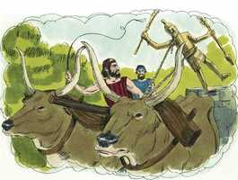

# Números Cap 33

**1** 	ESTAS são as jornadas dos filhos de Israel, que saíram da terra do Egito, segundo os seus exércitos, sob a direção de Moisés e Arão.

> **Cmt MHenry**: *Versículos 1-49* Este é um olhar breve das viagens dos filhos de Israel pelo deserto. História memorável. Estiveram movimentando-se continuamente em suas jornadas rumo a Canaã. Tal é o nosso estado neste mundo; aqui não temos cidade permanente, e todas nossas mudanças neste mundo não são senão de uma parte a outra do deserto. Foram levados daqui para lá, de diante para trás, porém sempre dirigidos pela coluna de nuvem e fogo. Deus os fez peregrinar mas, de todos modos, os dirigiu pelo caminho correto. O caminho que escolha Deus para atrair seu povo a Si mesmo sempre é o melhor caminho, embora nem sempre nos pareça o mais curto. Mencionam-se acontecimentos anteriores. Deste modo devemos lembrar as providências de Deus para conosco e nossa família, para conosco e nossa terra, e os muitos casos em que o cuidado divino nos tem conduzido, nos tem alimentado, e nos tem mantido todos nossos dias até agora. Poucos são os períodos de nossa vida em que se possa pensar sem que nos lembrem da bondade do Senhor e nossa própria ingratidão e desobediência: sua bondade nos deixa sem escusa por nossos pecados. Não gostaríamos de atravessar de novo pelas etapas que passamos, a menos que possamos, pela graça de Deus, evitar os pecados que então cometemos e abraçar as oportunidades de realizar o bom que deixamos passar. Logo terminará nossa peregrinação e nosso estado eterno será fixado além de toda memória; quão impressão é, então, 18A-Jo 46N-1Co 47N-2Co 62N-1Jo 63N-2Jo 64N-3Jo momento presente*! Felizes os que o Senhor guia agora com seu conselho e que, afinal, receberá na glória. O Evangelho nos chama a essa felicidade. Eis aqui, *agora*, o tempo aceitável; eia aqui, *agora*, o dia de salvação. Pecadores, aproveitem a oportunidade e corram a refugiar-se na esperança que é colocada diante de vocês. Redimamos nosso tempo para glorificar a Deus e servir a nossa geração, e Ele nos fará passar a salvo por todo até seu reino eterno.

**2** 	E escreveu Moisés as suas saídas, segundo as suas jornadas, conforme ao mandado do Senhor; e estas são as suas jornadas, segundo as suas saídas.

**3** 	Partiram, pois, de Ramessés no primeiro mês, no dia quinze do primeiro mês; no dia seguinte da páscoa saíram os filhos de Israel por alta mão, aos olhos de todos os egípcios,

**4** 	Enquanto os egípcios enterravam os que o Senhor tinha ferido entre eles, a todo o primogênito, e havendo o Senhor executado juízos também contra os seus deuses.

**5** 	Partiram, pois, os filhos de Israel de Ramessés, e acamparam-se em Sucote.

**6** 	E partiram de Sucote, e acamparam-se em Etã, que está no fim do deserto.

**7** 	E partiram de Etã, e voltaram a Pi-Hairote, que está defronte de Baal-Zefom, e acamparam-se diante de Migdol.

**8** 	E partiram de Pi-Hairote, e passaram pelo meio do mar ao deserto, e andaram caminho de três dias no deserto de Etã, e acamparam-se em Mara.

**9** 	E partiram de Mara, e vieram a Elim, e em Elim havia doze fontes de águas e setenta palmeiras, e acamparam-se ali.

**10** 	E partiram de Elim, e acamparam-se junto ao Mar Vermelho.

**11** 	E partiram do Mar Vermelho, e acamparam-se no deserto de Sim.

**12** 	E partiram do deserto de Sim, e acamparam-se em Dofca.

**13** 	E partiram de Dofca, e acamparam-se em Alus.

**14** 	E partiram de Alus, e acamparam-se em Refidim; porém não havia ali água, para que o povo bebesse.

**15** 	Partiram, pois, de Refidim, e acamparam-se no deserto de Sinai.

**16** 	E partiram do deserto de Sinai, e acamparam-se em Quibrote-Taavá.

**17** 	E partiram de Quibrote-Taavá, e acamparam-se em Hazerote.

**18** 	E partiram de Hazerote, e acamparam-se em Ritmá.

**19** 	E partiram de Ritmá, e acamparam-se em Rimom-Perez.

**20** 	E partiram de Rimom-Perez, e acamparam-se em Libna.

**21** 	E partiram de Libna, e acamparam-se em Rissa.

**22** 	E partiram de Rissa, e acamparam-se em Queelata.

**23** 	E partiram de Queelata, e acamparam-se no monte de Séfer.

**24** 	E partiram do monte de Séfer, e acamparam-se em Harada.

**25** 	E partiram de Harada, e acamparam-se em Maquelote.

**26** 	E partiram de Maquelote, e acamparam-se em Taate.

**27** 	E partiram de Taate, e acamparam-se em Tara.

**28** 	E partiram de Tara, e acamparam-se em Mitca.

**29** 	E partiram de Mitca, e acamparam-se em Hasmona.

**30** 	E partiram de Hasmona, e acamparam-se em Moserote.

**31** 	E partiram de Moserote, e acamparam-se em Bene-Jaacã.

**32** 	E partiram de Bene-Jaacã, e acamparam-se em Hor-Hagidgade.

**33** 	E partiram de Hor-Hagidgade, e acamparam-se em Jotbatá.

> **Cmt MHenry**: *CAPÍTULO 33A-Mq

**34** 	E partiram de Jotbatá, e acamparam-se em Abrona.

**35** 	E partiram de Abrona, e acamparam-se em Ezion-Geber.

**36** 	E partiram de Ezion-Geber, e acamparam-se no deserto de Zim, que é Cades.

**37** 	E partiram de Cades, e acamparam-se no monte Hor, no fim da terra de Edom.

**38** 	Então Arão, o sacerdote, subiu ao monte Hor, conforme ao mandado do Senhor; e morreu ali no quinto mês do ano quadragésimo da saída dos filhos de Israel da terra do Egito, no primeiro dia do mês.

**39** 	E era Arão da idade de cento e vinte e três anos, quando morreu no monte Hor.

**40** 	E ouviu o cananeu, rei de Harade, que habitava o sul na terra de Canaã, que chegavam os filhos de Israel.

**41** 	E partiram do monte Hor, e acamparam-se em Zalmona.

**42** 	E partiram de Zalmona, e acamparam-se em Punom.

**43** 	E partiram de Punom, e acamparam-se em Obote.

**44** 	E partiram de Obote, e acamparam-se em Ije-Abarim, no termo de Moabe.

**45** 	E partiram de Ije-Abarim, e acamparam-se em Dibom-Gade.

**46** 	E partiram de Dibom-Gade, e acamparam-se em Almom-Diblataim.

**47** 	E partiram de Almom-Diblataim, e acamparam-se nos montes de Abarim, defronte de Nebo.

**48** 	E partiram dos montes de Abarim, e acamparam-se nas campinas de Moabe, junto ao Jordão, na direção de Jericó.

**49** 	E acamparam-se junto ao Jordão, desde Bete-Jesimote até Abel-Sitim, nas campinas de Moabe.

**50** 	E falou o Senhor a Moisés, nas campinas de Moabe junto ao Jordão na direção de Jericó, dizendo:

> **Cmt MHenry**: *Versículos 50-56* Agora que deviam cruzar o Jordão, estavam entrando outra vez na tentação de seguir ídolos; e são ameaçados que se respeitassem os ídolos ou os idólatras, o pecado deles será certamente castigo. Criarão víboras em seus próprios colos. O remanescente dos cananeus seriam espinhas em seus olhos e aguilhoes em seus lados, se fizessem a paz com eles, ainda que fosse durante algum tempo. devemos esperar problemas e aflição a causa de qualquer pecado que alberguemos; aquilo em que estamos dispostos a deixar-nos tentar, será o que nos abrume. O objetivo era que os cananeus fossem expulsos da terra, mas se os israelitas aprendiam seus maus caminhos, também eles seriam expulsos. Ouçamos isto e temamos. Se não expulsamos o pecado, o pecado nos expulsará a nós. Se não formos a morte para as nossas concupiscências, nossa luxúria será a morte de nossa alma.

**51** 	Fala aos filhos de Israel, e dize-lhes: Quando houverdes passado o Jordão para a terra de Canaã,

**52** 	Lançareis fora todos os moradores da terra de diante de vós, e destruireis todas as suas pinturas; também destruireis todas as suas imagens de fundição, e desfareis todos os seus altos;

 

**53** 	E tomareis a terra em possessão, e nela habitareis; porquanto vos tenho dado esta terra, para possuí-la.

**54** 	E por sortes herdareis a terra, segundo as vossas famílias; aos muitos multiplicareis a herança, e aos poucos diminuireis a herança; conforme a sorte sair a alguém, ali a possuirá; segundo as tribos de vossos pais recebereis as heranças.

**55** 	Mas se não lançardes fora os moradores da terra de diante de vós, então os que deixardes ficar vos serão por espinhos nos vossos olhos, e por aguilhões nas vossas virilhas, e apertar-vos-ão na terra em que habitardes,

**56** 	E será que farei a vós como pensei fazer-lhes a eles.

> **Cmt MHenry** Intro: *• Versículos 1-49*> *Acampamentos dos israelitas*> *• Versículos 50-56*> 28A-Os cananeus devem ser destruídos*