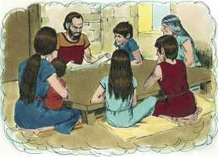

# Deuteronomio Cap 06

**1** 	ESTES, pois, são os mandamentos, os estatutos e os juízos que mandou o Senhor vosso Deus para ensinar-vos, para que os cumprísseis na terra a que passais a possuir;

> **Cmt MHenry**: *Versículos 1-3* Nesta passagem e em outras similares, os "mandamentos" parecem denotar a lei moral; os "estatutos", a lei cerimonial, e os "decretos", a lei pela qual decidiam os juízes. Moisés ensinou ao povo tudo aquilo, e unicamente aquilo que Deus lhe mandou ensinar. De modo semelhante, os ministros de Cristo devem ensinar a suas igrejas tudo o que Ele lhes mandou, nem mais nem menos ([Mt 28.20](../40N-Mt/28.md#20)). O temor de Deus no coração será o princípio mais poderoso para a obediência. É altamente desejável que não só nós, senão também nossos filhos e os filhos de nossos filhos, tenham temor do Senhor. a religião e a justiça fazem progredir e asseguram a prosperidade de qualquer povo.

**2** 	Para que temas ao Senhor teu Deus, e guardes todos os seus estatutos e mandamentos, que eu te ordeno, tu, e teu filho, e o filho de teu filho, todos os dias da tua vida, e que teus dias sejam prolongados.

**3** 	Ouve, pois, ó Israel, e atenta em os guardares, para que bem te suceda, e muito te multipliques, como te disse o Senhor Deus de teus pais, na terra que mana leite e mel.

**4** 	Ouve, Israel, o Senhor nosso Deus é o único Senhor.

> **Cmt MHenry**: *Versículos 4-5* Eis aqui um breve resumo da religião que contém os primeiros princípios da fé e a obediência. Jeová nosso Deus é o único Deus vivo e verdadeiro; Ele só é Deus e é somente um Deus. Não desejemos ter outro. A menção tripla dos nomes divinos, e o número plural da palavra que se traduz por "Deus", parecem claramente aludir a uma Trindade de pessoas, até nesta declaração expressa da unidade da divindade. Bem-aventurados os que têm a este só Senhor como seu Deus. Melhor é ter uma fonte que mil cisternas; um só Deus todo-suficiente que um milhar de amigos insuficientes. Este é o primeiro e grande mandamento da lei de Deus, que O amemos; e que cumpramos cada parte de nosso dever para com Ele a partir de um princípio de amor: Filho meu, dá-me teu coração. Temos que amar a Deus com todo nosso coração, e com toda a nossa alma e com toda a nossa força. Isto é: 1) Com um amor *sincero*, que não seja de palavra nem de língua, senão interiormente, de verdade. 2) Com um amor *forte*. Ele, que é o nosso Todo, deve ter nosso tudo, e ninguém senão Ele. 3) Com um amor *superlativo*; devemos amar a Deus por acima de toda criatura e não amar senão o que amamos por Ele. 4) Com um amor *inteligente*. Amá-lo com todo o coração, e com toda a inteligência requer que vejamos uma boa causa para amá-lo. 5) Com um amor *inteiro*; Ele é UM, nosso coração deve estar unido neste amor. Oh, que este amor de Deus possa ser derramado em nossos corações!

**5** 	Amarás, pois, o Senhor teu Deus de todo o teu coração, e de toda a tua alma, e de todas as tuas forças.

**6** 	E estas palavras, que hoje te ordeno, estarão no teu coração;

> **Cmt MHenry**: *Versículos 6-16* Eis aqui os médios para manter e guardar a religião em nosso coração e em nosso lar. 1) *Meditação*. Devemos pôr a palavra de Deus em nosso coração para que nossos pensamentos estejam diariamente nela.

> **Cmt MHenry**: *CAPÍTULO 60N-1Pe 61N-2Pe 62N-1Jo 63N-2Jo 64N-3Jo 65N-Jd 66N-Ap

**7** 	E as ensinarás a teus filhos e delas falarás assentado em tua casa, e andando pelo caminho, e deitando-te e levantando-te.

 

**8** 	Também as atarás por sinal na tua mão, e te serão por frontais entre os teus olhos.

**9** 	E as escreverás nos umbrais de tua casa, e nas tuas portas.

**10** 	Quando, pois, o Senhor teu Deus te introduzir na terra que jurou a teus pais, Abraão, Isaque e Jacó, que te daria, com grandes e boas cidades, que tu não edificaste,

**11** 	E casas cheias de todo o bem, que tu não encheste, e poços cavados, que tu não cavaste, vinhas e olivais, que tu não plantaste, e comeres, e te fartares,

**12** 	Guarda-te, que não te esqueças do Senhor, que te tirou da terra do Egito, da casa da servidão.

**13** 	O Senhor teu Deus temerás e a ele servirás, e pelo seu nome jurarás.

**14** 	Não seguireis outros deuses, os deuses dos povos que houver ao redor de vós;

**15** 	Porque o Senhor teu Deus é um Deus zeloso no meio de ti, para que a ira do Senhor teu Deus se não acenda contra ti e te destrua de sobre a face da terra.

**16** 	Não tentareis o Senhor vosso Deus, como o tentastes em Massá;

**17** 	Diligentemente guardareis os mandamentos do Senhor vosso Deus, como também os seus testemunhos, e seus estatutos, que te tem mandado.

> **Cmt MHenry**: *Versículos 17-25* Moisés encarrega guardar os mandamentos de Deus. A negligência nos destruirá, pois não podemos ser salvos sem diligência. Para nosso interesse e para nosso dever convém sermos religiosos. Será nossa *vida*. A piedade tem promessa de continuidade e consolo para a vida presente em tanto que seja para a glória de Deus. Será nossa *justiça*. Unicamente através do Mediador podemos ser justos ante Deus. O conhecimento da espiritualidade e excelência da santa lei de Deus é útil para mostrar ao pecador sua necessidade de um Salvador, e para que prepare seu coração para receber a salvação grátis. O evangelho honra a lei não só na perfeita obediência do Filho de Deus, o Senhor Jesus Cristo, senão em que é um plano para levar outra vez os rebeldes e inimigos apóstatas, pelo arrependimento, à fé, o perdão e a graça renovadora, a que amem a Deus por sobre todas as coisas, até neste mundo; e no mundo vindouro, a que O amem perfeitamente, como o amam os anjos. "

**18** 	E farás o que é reto e bom aos olhos do Senhor, para que bem te suceda, e entres, e possuas a boa terra, a qual o Senhor jurou dar a teus pais.

**19** 	Para que lance fora a todos os teus inimigos de diante de ti, como o Senhor tem falado.

**20** 	Quando teu filho te perguntar no futuro, dizendo: Que significam os testemunhos, e estatutos e juízos que o Senhor nosso Deus vos ordenou?

**21** 	Então dirás a teu filho: Éramos servos de Faraó no Egito; porém o Senhor, com mão forte, nos tirou do Egito;

**22** 	E o Senhor, aos nossos olhos, fez sinais e maravilhas, grandes e terríveis, contra o Egito, contra Faraó e toda sua casa;

**23** 	E dali nos tirou, para nos levar, e nos dar a terra que jurara a nossos pais.

**24** 	E o Senhor nos ordenou que cumpríssemos todos estes estatutos, que temêssemos ao Senhor nosso Deus, para o nosso perpétuo bem, para nos guardar em vida, como no dia de hoje.

**25** 	E será para nós justiça, quando tivermos cuidado de cumprir todos estes mandamentos perante o Senhor nosso Deus, como nos tem ordenado.

> **Cmt MHenry** Intro: *• Versículos 1-3*> *Persuasão à obediência*> *• Versículos 4-5*> *Exortação à obediência*> *• Versículos 6-16*> *Ensina-se obediência*> *• Versículos 17-25*> *Preceitos gerais – Instruções para dar aos filhos próprios*> *2) A educação religiosa das crianças*. Repitam-lhes com freqüência estas coisas. Sejam cuidadosos e exatos no ensino de seus filhos. Ensinem estas verdades a todos os que estejam sob seu cuidado em alguma forma. 3\) *Fala piedosa*. Falem destas coisas com a devida reverência e seriedade para benefício não só de seus filhos, senão de seus servos, amigos e companheiros. Usem toda ocasião para discorrer com os que os rodeiam, não de assuntos duvidosos e discutíveis, senão das claras verdades e leis de Deus, e das coisas que correspondem a nossa paz. 4\) *Leitura freqüente da Palavra*. Deus mandou a seu povo que escrevesse as palavras da lei em suas paredes, e nos rolos de pergaminho que deviam levar pendurados de seus pulsos. Isto era obrigatório ao pé da letra para os judeus, como é o plano para nós, a saber, que por todos os médios devemos familiarizar-nos com a palavra de Deus para usá-la em todas as ocasiões, para prevenir o pecado e para conduzir-nos no dever. Nunca devemos envergonhar-nos de nossa religião nem de reconhecer-nos sob seu controle e governo. Aqui há uma advertência: não esquecer a Deus no dia da prosperidade e da abundância. Quando lhes facilitava todo por dádiva, eram dados a sentir-se seguros de si mesmos e a esquecer a Deus. Portanto, cuidem-se de não deslembrar-se do Senhor quando estejam sãos e salvos. Quando o mundo sorri, somos propensos a cortejá-lo e a esperar sermos felizes nele, e esquecemos Àquele que é nossa única porção e repouso. É necessário muito cuidado e cautela num momento assim. Então, cuidem-se: estejam alertas, tendo sido advertidos do perigo.\ Não tentarás o Senhor teu Deus, desesperando de seu poder e bondade, enquanto seguimos na senda de nosso dever, nem presumindo disso quando sairmos desse caminho.