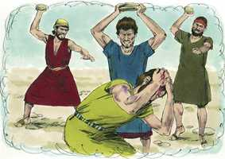

# Deuteronomio Cap 17

**1** 	NÃO sacrificarás ao Senhor teu Deus, boi ou gado miúdo em que haja defeito ou alguma coisa má; pois abominação é ao Senhor teu Deus.

> **Cmt MHenry**: *Versículos 1-7* Nenhuma criatura que tiver algum defeito podia ser oferecida como sacrifício a Deus. Assim se nos pede que lembremos do sacrifício perfeito, puro e imaculado de Cristo, e somos lembrados que sirvamos a Deus com o melhor de nossas capacidades, tempo e possessões, ou nossa obediência fingida será aborrecível para Ele. Ao idólatra judeu deve infligir-se um castigo tão grande como a morte, uma morte tão notável como a de morrer apedrejado. Que todos os que em nossa época se fazem ídolos em seus corações, lembrem como castigava Deus este crime em Israel. Versículos 8-13 Em cada cidade havia que estabelecer tribunais de justiça. embora seu juízo não tiver a autoridade divina de um oráculo, era o juízo de homens experimentados, prudentes e sábios, e tinha a vantagem de uma promessa divina.

**2** 	Quando no meio de ti, em alguma das tuas portas que te dá o Senhor teu Deus, se achar algum homem ou mulher que fizer mal aos olhos do Senhor teu Deus, transgredindo a sua aliança,

**3** 	Que se for, e servir a outros deuses, e se encurvar a eles ou ao sol, ou à lua, ou a todo o exército do céu, o que eu não ordenei,

**4** 	E te for denunciado, e o ouvires; então bem o inquirirás; e eis que, sendo verdade, e certo que se fez tal abominação em Israel,

**5** 	Então tirarás o homem ou a mulher que fez este malefício, às tuas portas, e apedrejarás o tal homem ou mulher, até que morra.

 

**6** 	Por boca de duas testemunhas, ou três testemunhas, será morto o que houver de morrer; por boca de uma só testemunha não morrerá.

**7** 	As mãos das testemunhas serão primeiro contra ele, para matá-lo; e depois as mãos de todo o povo; assim tirarás o mal do meio de ti.

**8** 	Quando alguma coisa te for difícil demais em juízo, entre sangue e sangue, entre demanda e demanda, entre ferida e ferida, em questões de litígios nas tuas portas, então te levantarás, e subirás ao lugar que escolher o Senhor teu Deus;

**9** 	E virás aos sacerdotes levitas, e ao juiz que houver naqueles dias, e inquirirás, e te anunciarão a sentença do juízo.

**10** 	E farás conforme ao mandado da palavra que te anunciarem no lugar que escolher o Senhor; e terás cuidado de fazer conforme a tudo o que te ensinarem.

**11** 	Conforme ao mandado da lei que te ensinarem, e conforme ao juízo que te disserem, farás; da palavra que te anunciarem te não desviarás, nem para a direita nem para a esquerda.

**12** 	O homem, pois, que se houver soberbamente, não dando ouvidos ao sacerdote, que está ali para servir ao Senhor teu Deus, nem ao juiz, esse homem morrerá; e tirarás o mal de Israel;

**13** 	Para que todo o povo o ouça, e tema, e nunca mais se ensoberbeça.

**14** 	Quando entrares na terra que te dá o Senhor teu Deus, e a possuíres, e nela habitares, e disseres: Porei sobre mim um rei, assim como têm todas as nações que estão em redor de mim;

> **Cmt MHenry**: *Versículos 14-20* Deus mesmo era em particular o Rei de Israel, e se eles colocavam outro rei sobre eles, era necessário que Ele escolhesse a pessoa. Conseqüentemente, quando o povo quis ter rei, recorreram a Samuel, profeta do Senhor. Em todos os casos, a eleição de Deus, se pudermos conhecê-la, deve dirigir, determinar e sobrepor-se à nossa. São dadas leis para o príncipe que seja escolhido. Ele deve evitar cuidadosamente roda coisa que o afaste de Deus e da religião. Riquezas, honras e prazeres são os três grandes estorvos da santidade (a concupiscência da carne, a concupiscência dos olhos e a soberba da vida), especialmente para os que estão em níveis elevados; aqui se adverte ao rei em contra de tudo isso. o rei deve estudar cuidadosamente a lei de Deus e fazê-la sua regra; e tendo uma cópia das Escrituras de próprio punho e letra, deve lê-la todos os dias de sua vida. Não basta com ter Bíblias, além disso devemos usá-las, e usá-las a diário enquanto vivamos. Os eruditos de Cristo nunca aprendem mais que suas Bíblias, mas terão ocasião constante para usá-la, até que cheguem a esse mundo onde serão aperfeiçoados o conhecimento e o amor. A escritura e leitura do rei eram como nada se não praticasse o que escrevia e lia. Os que temem a Deus e guardam seus mandamentos, farão o melhor ainda neste mundo.

**15** 	Porás certamente sobre ti como rei aquele que escolher o Senhor teu Deus; dentre teus irmãos porás rei sobre ti; não poderás pôr homem estranho sobre ti, que não seja de teus irmãos.

**16** 	Porém ele não multiplicará para si cavalos, nem fará voltar o povo ao Egito para multiplicar cavalos; pois o Senhor vos tem dito: Nunca mais voltareis por este caminho.

**17** 	Tampouco para si multiplicará mulheres, para que o seu coração não se desvie; nem prata nem ouro multiplicará muito para si.

> **Cmt MHenry**: *CAPÍTULO 17A-Et

**18** 	Será também que, quando se assentar sobre o trono do seu reino, então escreverá para si num livro, um traslado desta lei, do original que está diante dos sacerdotes levitas.

**19** 	E o terá consigo, e nele lerá todos os dias da sua vida, para que aprenda a temer ao Senhor seu Deus, para guardar todas as palavras desta lei, e estes estatutos, para cumpri-los;

**20** 	Para que o seu coração não se levante sobre os seus irmãos, e não se aparte do mandamento, nem para a direita nem para a esquerda; para que prolongue os seus dias no seu reino, ele e seus filhos no meio de Israel.

> **Cmt MHenry** Intro: *• Versículos 1-7*> *Todos os sacrifícios devem ser perfeitos – Morte dos idólatras*> *• Versículos 8-13*> *Controvérsias difíceis*> *• Versículos 14-20*> *Eleição de um rei – Seus deveres*