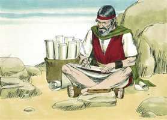
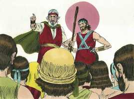
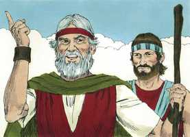
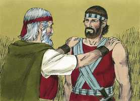
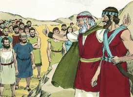

# Deuteronomio Cap 31

**1** 	DEPOIS foi Moisés, e falou estas palavras a todo o Israel,

> **Cmt MHenry**: *Versículos 1-8* Moisés assegura a Israel da presença constante de Deus com eles. Isto é aplicado pelo apóstolo a todo o Israel espiritual, para animar sua fé e esperança; a nós nos é predicado este Evangelho, assim como a eles; não te deixará nem te desamparará ([Hb 13.5](../58N-Hb/13.md#5)). Moisés lhes recomenda como líder a Josué, cuja sabedoria, valor e afeto haviam conhecido desde muito tempo atrás, a quem Deus tinha nomeado para ser seu chefe, a quem reconheceria e abençoaria. Josué se sente muito comprazido ao ser admoestado por Moisés para ser firme e valente. Irá bem aos que tiverem a Deus com eles, portanto, devem ter valor. Em Deus faremos proezas, pois nEle teremos a vontade; se resistirmos ao diabo, de nós fugirá.

**2** 	E disse-lhes: Da idade de cento e vinte anos sou eu hoje; já não poderei mais sair e entrar; além disto o Senhor me disse: Não passarás o Jordão.

**3** 	O Senhor teu Deus passará adiante de ti; ele destruirá estas nações de diante de ti, para que as possuas; Josué passará adiante de ti, como o Senhor tem falado.

**4** 	E o Senhor lhes fará como fez a Siom e a Ogue, reis dos amorreus, e à sua terra, os quais destruiu.

**5** 	Quando, pois, o Senhor vo-los der diante de vós, então com eles fareis conforme a todo o mandamento que vos tenho ordenado.

**6** 	Esforçai-vos, e animai-vos; não temais, nem vos espanteis diante deles; porque o Senhor teu Deus é o que vai contigo; não te deixará nem te desamparará.

**7** 	E chamou Moisés a Josué, e lhe disse aos olhos de todo o Israel: Esforça-te e anima-te; porque com este povo entrarás na terra que o Senhor jurou a teus pais lhes dar; e tu os farás herdá-la.

**8** 	O Senhor, pois, é aquele que vai adiante de ti; ele será contigo, não te deixará, nem te desamparará; não temas, nem te espantes.

**9** 	E Moisés escreveu esta lei, e a deu aos sacerdotes, filhos de Levi, que levavam a arca da aliança do Senhor, e a todos os anciãos de Israel.

> **Cmt MHenry**: *Versículos 9-13* Ainda que leiamos a palavra em privado, não devemos pensar que seja desnecessário ouvi-la quando se lê em público. A leitura solene da lei devia fazer-se no ano da remissão. O ano de remissão era tipo da graça do Evangelho, chamado de "ano aceitável do ah", porque nosso perdão e liberdade graças a Cristo nos comprometem a obedecer a seus mandamentos. Deve ser lida ante todo Israel, homens, mulheres, crianças e os estrangeiros. Vontade de Deus é que toda a gente se familiarize com sua Palavra. É regra para todos; portanto, devem lê-la a todos. quem tenha lido os trabalhos que suportam muitas pessoas para conseguir pedaços da Escritura, quando não se pode obter ou não é possível ter sem perigo uma cópia inteira, verá quão agradecidos deveríamos estar pelos milhares de exemplares que temos. Também entenderão a situação especial em que estiveram os israelitas por muito tempo. Mas o coração do homem é tão negligente, que se achará que todo é demasiado pouco para conservar o conhecimento das verdades, preceitos e adoração de Deus. Versículos 14-22 Moisés e Josué atendiam a majestade divina na porta do tabernáculo. A Moisés lhe é novamente dito que deve morrer em breve; até os mais preparados e dispostos a morrer devem ser lembrados freqüentemente da chegada deste dia. O Senhor diz a Moisés que a aliança pela qual ele tinha-se esforçado tanto para concretizar entre Israel e Deus, seria quebrantada depois de sua morte. Israel abandonaria a Deus; então, Deus abandonaria a Israel. Ele com justiça rejeita os que com injustiça o rejeitam. Ordena-se a Moisés que lhes entregue um cântico que deve ficar como testemunho permanente Notas Bíblia de Estudo NVI-out_images.txt Simple_Bible_Reader_v2.9-bible_converter.exe Deus, como que é fiel a eles ao preveni-los e, *contra* eles, como pessoas falsas consigo mesmas, ao não aceitarem a advertência. A palavra de Deus discerne os pensamentos e intenções do coração dos homens e lhes sai ao encontro com repreensões e corretivos. Os ministros que predicam a Palavra não conhecem o pensamento dos homens, porém Deus, Deus quem é a Palavra, o sabe perfeitamente.

 

**10** 	E ordenou-lhes Moisés, dizendo: Ao fim de cada sete anos, no tempo determinado do ano da remissão, na festa dos tabernáculos,

 

**11** 	Quando todo o Israel vier a comparecer perante o Senhor teu Deus, no lugar que ele escolher, lerás esta lei diante de todo o Israel aos seus ouvidos.

**12** 	Ajunta o povo, os homens e as mulheres, os meninos e os estrangeiros que estão dentro das tuas portas, para que ouçam e aprendam e temam ao Senhor vosso Deus, e tenham cuidado de fazer todas as palavras desta lei;

**13** 	E que seus filhos, que não a souberem, ouçam e aprendam a temer ao Senhor vosso Deus, todos os dias que viverdes sobre a terra a qual ides, passando o Jordão, para a possuir.

**14** 	E disse o Senhor a Moisés: Eis que os teus dias são chegados, para que morras; chama a Josué, e apresentai-vos na tenda da congregação, para que eu lhe dê ordens. Assim foram Moisés e Josué, e se apresentaram na tenda da congregação.

**15** 	Então o Senhor apareceu na tenda, na coluna de nuvem; e a coluna de nuvem estava sobre a porta da tenda.

**16** 	E disse o Senhor a Moisés: Eis que dormirás com teus pais; e este povo se levantará, e prostituir-se-á indo após os deuses estranhos na terra, para cujo meio vai, e me deixará, e anulará a minha aliança que tenho feito com ele.

**17** 	Assim se acenderá a minha ira naquele dia contra ele, e desampará-lo-ei, e esconderei o meu rosto dele, para que seja devorado; e tantos males e angústias o alcançarão, que dirá naquele dia: Não me alcançaram estes males, porque o meu Deus não está no meio de mim?

**18** 	Esconderei, pois, totalmente o meu rosto naquele dia, por todo o mal que tiver feito, por se haverem tornado a outros deuses.

**19** 	Agora, pois, escrevei-vos este cântico, e ensinai-o aos filhos de Israel; ponde-o na sua boca, para que este cântico me seja por testemunha contra os filhos de Israel.

**20** 	Porque introduzirei o meu povo na terra que jurei a seus pais, que mana leite e mel; e comerá, e se fartará, e se engordará; então se tornará a outros deuses, e os servirá, e me irritarão, e anularão a minha aliança.

**21** 	E será que, quando o alcançarem muitos males e angústias, então este cântico responderá contra ele por testemunha, pois não será esquecido da boca de sua descendência; porquanto conheço a sua imaginação, o que ele faz hoje, antes que o introduza na terra que tenho jurado.

**22** 	Assim Moisés escreveu este cântico naquele dia, e o ensinou aos filhos de Israel.

 

**23** 	E ordenou a Josué, filho de Num, e disse: Esforça-te e anima-te; porque tu introduzirás os filhos de Israel na terra que lhes jurei; e eu serei contigo.

> **Cmt MHenry**: *Versículos 23-30* Narra-se novamente a entrega solene do livro da lei aos levitas para colocá-lo na arca, ou mulher dito, a um lado dela. O cântico que se segue no próximo capítulo se entrega a Moisés e ele o dá ao povo. primeiro o escrevei segundo o ensinou o Espírito Santo; e depois o disse a ouvidos de todo o povo. Moisés lhes diz claramente: Sei que, depois de minha morte, certamente se corromperão. Isto sem dúvida ocasionou mais de um pensamento triste a este bom homem, porém seu consolo era que tinha cumprido seu dever e que Deus seria glorificado na dispersão deles, se não na ocupação da terra, porque o fundamento de Deus está firme. "

 

**24** 	E aconteceu que, acabando Moisés de escrever num livro, todas as palavras desta lei,

**25** 	Deu ordem aos levitas, que levavam a arca da aliança do Senhor, dizendo:

**26** 	Tomai este livro da lei, e ponde-o ao lado da arca da aliança do Senhor vosso Deus, para que ali esteja por testemunha contra ti.

**27** 	Porque conheço a tua rebelião e a tua dura cerviz; eis que, vivendo eu ainda hoje convosco, rebeldes fostes contra o Senhor; e quanto mais depois da minha morte?

**28** 	Ajuntai perante mim todos os anciãos das vossas tribos, e vossos oficiais, e aos seus ouvidos falarei estas palavras, e contra eles por testemunhas tomarei o céu e a terra.

**29** 	Porque eu sei que depois da minha morte certamente vos corrompereis, e vos desviareis do caminho que vos ordenei; então este mal vos alcançará nos últimos dias, quando fizerdes mal aos olhos do Senhor, para o provocar à ira com a obra das vossas mãos.

**30** 	Então Moisés falou as palavras deste cântico aos ouvidos de toda a congregação de Israel, até se acabarem.

 

> **Cmt MHenry** Intro: *CAPÍTULO 31A-Ob> *• Versículos 1-8*> *Moisés anima o povo e a Josué*> *• Versículos 9-13*> *A lei deve ler-se a cada sétimo ano*> *• Versículos 14-22*> *Anúncio da apostasia dos israelitas – Um cântico que é*> *testemunho contra eles*> *• Versículos 23-30*> *A lei entregada aos levitas*