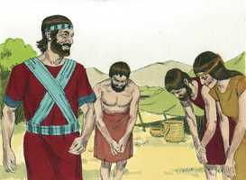

# Josué Cap 01

**1** 	E SUCEDEU depois da morte de Moisés, servo do Senhor, que o Senhor falou a Josué, filho de Num, servo de Moisés, dizendo:

> **Cmt MHenry**: *Versículos 1-4* Josué tinha atendido a Moisés. Ele era chamado para ser honrado , tinha sido usado por muito tempo pela empresa. Nosso Senhor Jesus assumiu a forma de servo. Josué estava treinado para obedecer ordens. Os mais aptos para governar são os que têm aprendido a obedecer. A mudança de situação dos homens úteis deve estimular os sobreviventes para ser mais diligentes em fazer o bem. Levantem-se e vão a cruzar o Jordão. Os baixios da zona estavam naquele momento alagados. Josué não tinha ponte nem barcas, mas devia crer que Deus abriria um caminho ao ter ordenado que o povo passasse para o outro lado.

> **Cmt MHenry**: *CAPÍTULO 10A-2Sm 11A-1Rs 12A-2Rs 13A-1Cr 14A-2Cr 15A-Es 16A-Ne 17A-Et 18A-Jo 19A-Sl

**2** 	Moisés, meu servo, é morto; levanta-te, pois, agora, passa este Jordão, tu e todo este povo, à terra que eu dou aos filhos de Israel.

 

**3** 	Todo o lugar que pisar a planta do vosso pé, vo-lo tenho dado, como eu disse a Moisés.

**4** 	Desde o deserto e do Líbano, até ao grande rio, o rio Eufrates, toda a terra dos heteus, e até o grande mar para o poente do sol, será o vosso termo.

**5** 	Ninguém te poderá resistir, todos os dias da tua vida; como fui com Moisés, assim serei contigo; não te deixarei nem te desampararei.

> **Cmt MHenry**: *Versículos 5-9* Josué vai fazer que a Lei de Deus seja seu governo. É-lhe ordenado meditar nela dia e noite para que possa compreendê-la. Quaisquer que sejam os assuntos do mundo que tenhamos em mente, não devemos deixar de lado a única coisa necessária. Todas as ordens de Josué ao povo, e seus juízos, devem estar conforme com a lei de Deus. Ele mesmo deve submeter-se aos mandamentos; a dignidade ou o domínio de nenhum homem o coloca por acima da Lei de Deus. Ele deve alentar a si mesmo com a promessa e a presença de Deus. Que o sentir suas próprias doenças não desanimem a você; Deus é todo-suficiente. Eu te mandei, chamei e comissionei para fazê-lo, e podes ter a certeza que *te sustentarei em*, e *te tirarei de*, isso. Quando estamos na senda do dever, temos razão para sermos fortes e muito ousados. Nosso Senhor Jesus, como aqui Josué, foi sustentado em seus sofrimentos por considerar a vontade de Deus e o mandamento de seu Pai.

**6** 	Esforça-te, e tem bom ânimo; porque tu farás a este povo herdar a terra que jurei a seus pais lhes daria.

**7** 	Tão-somente esforça-te e tem mui bom ânimo, para teres o cuidado de fazer conforme a toda a lei que meu servo Moisés te ordenou; dela não te desvies, nem para a direita nem para a esquerda, para que prudentemente te conduzas por onde quer que andares.

**8** 	Não se aparte da tua boca o livro desta lei; antes medita nele dia e noite, para que tenhas cuidado de fazer conforme a tudo quanto nele está escrito; porque então farás prosperar o teu caminho, e serás bem sucedido.

**9** 	Não to mandei eu? Esforça-te, e tem bom ânimo; não temas, nem te espantes; porque o Senhor teu Deus é contigo, por onde quer que andares.

**10** 	Então Josué deu ordem aos príncipes do povo, dizendo:

> **Cmt MHenry**: *Versículos 10-15* Josué diz ao povo que cruzarão o Jordão e possuirão a terra porque Deus o tinha dito. Nós honramos a verdade de Deus quando não vacilamos na promessa de Deus. as duas tribos e meia deviam cruzar o Jordão com seus irmãos. Quando Deus nos deu repouso, por Sua Providência, devemos considerar que serviço podemos fazer a nossos irmãos.

**11** 	Passai pelo meio do arraial e ordenai ao povo, dizendo: Provede-vos de comida, porque dentro de três dias passareis este Jordão, para que entreis a possuir a terra que vos dá o Senhor vosso Deus, para a possuirdes.

 

**12** 	E falou Josué aos rubenitas, e aos gaditas, e à meia tribo de Manassés, dizendo:

**13** 	Lembrai-vos da palavra que vos mandou Moisés, o servo do Senhor, dizendo: O Senhor vosso Deus vos dá descanso, e vos dá esta terra.

**14** 	Vossas mulheres, vossos meninos e vosso gado fiquem na terra que Moisés vos deu deste lado do Jordão; porém vós passareis armados na frente de vossos irmãos, todos os valentes e valorosos, e ajudá-los-eis;

**15** 	Até que o Senhor dê descanso a vossos irmãos, como a vós, e eles também possuam a terra que o Senhor vosso Deus lhes dá; então tornareis à terra da vossa herança, e possuireis a que vos deu Moisés, o servo do Senhor, deste lado do Jordão, para o nascente do sol.

**16** 	Então responderam a Josué, dizendo: Tudo quanto nos ordenaste faremos, e onde quer que nos enviares iremos.

> **Cmt MHenry**: *Versículos 16-18* O povo de Israel se compromete a obedecer a Josué: Faremos todo o que nos ordenas, sem murmurar nem brigar, e para onde quer que nos envies, ali iremos. O melhor que podemos pedir a Deus para nossos magistrados é que eles possam ter a presença de Deus; isso fará que eles sejam bênçãos para nós, de modo que ao pedirmos isso para eles, levamos em conta nosso próprio interesse. Que sejamos capacitados para enrolar-nos sob a bandeira do Capitão de nossa salvação, que sejamos obedientes a seus mandamentos e que pelejemos o bom combate da fé, com toda essa confiança e amor em e por Seu nome, contra todo o que se oponha a Sua autoridade; pois quem quiser que se recusar a obedecê-lo, deve ser destruído.

**17** 	Como em tudo ouvimos a Moisés, assim te ouviremos a ti, tão-somente que o Senhor teu Deus seja contigo, como foi com Moisés.

**18** 	Todo o homem, que for rebelde às tuas ordens, e não ouvir as tuas palavras em tudo quanto lhe mandares, morrerá. Tão-somente esforça-te, e tem bom ânimo.

> **Cmt MHenry** Intro: *• Versículos 1-4*> *O Senhor nomeia a Josué para sucessor de Moisés*> *• Versículos 5-9*> *Deus promete assistir a Josué*> *• Versículos 10-15*> *Preparativos para cruzar o Jordão*> *• Versículos 16-18*> *O povo promete obedecer a Josué*