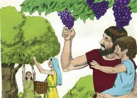
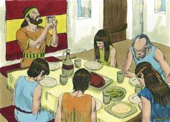

# Josué Cap 05

**1** 	E SUCEDEU que, ouvindo todos os reis dos amorreus, que habitavam deste lado do Jordão, ao ocidente, e todos os reis dos cananeus, que estavam ao pé do mar, que o Senhor tinha secado as águas do Jordão, de diante dos filhos de Israel, até que passassem, desfaleceu-se-lhes o coração, e não houve mais ânimo neles, por causa dos filhos de Israel.

> **Cmt MHenry**: *Versículos 1-9* Quão espantoso é o caso deles, ver a ira de Deus que vem deles sem poder evitá-la nem escapar! Tal será a situação horrível dos ímpios; as palavras não podem expressar a angústia de seu sentir nem a grandeza de seu terror. Oh, que *agora* eles aceitem a advertência e, antes que seja demasiado tarde, fujam a refugiar-se e se aferrem da esperança colocada diante deles no Evangelho! Deus imprimiu este temor nos cananeus e os desesperançou. Isto deu um breve repouso aos israelitas, e a circuncisão tirou o opróbrio do Egito. Como conseqüência, foram reconhecidos como filhos legítimos de Deus, que têm o selo da aliança. Quando Deus se glorifica ao aperfeiçoar a salvação de seu povo, não somente silencia a todos os inimigos, senão que lhes tira seu opróbrio.

**2** 	Naquele tempo disse o Senhor a Josué: Faze facas de pedra, e torna a circuncidar segunda vez aos filhos de Israel.

**3** 	Então Josué fez para si facas de pedra, e circuncidou aos filhos de Israel no monte dos prepúcios.

**4** 	E foi esta a causa por que Josué os circuncidou: todo o povo que tinha saído do Egito, os homens, todos os homens de guerra, já haviam morrido no deserto, pelo caminho, depois que saíram do Egito.

**5** 	Porque todos os do povo que saíram estavam circuncidados, mas a nenhum dos que nasceram no deserto, pelo caminho, depois de terem saído do Egito, haviam circuncidado.

> **Cmt MHenry**: *CAPÍTULO 50N-Fp 51N-Cl 52N-1Ts 53N-2Ts 54N-1Tm 55N-2Tm 56N-Tt 57N-Fm 58N-Hb 59N-Tg

**6** 	Porque quarenta anos andaram os filhos de Israel pelo deserto, até se acabar toda a nação, os homens de guerra, que saíram do Egito, e não obedeceram à voz do Senhor; aos quais o Senhor tinha jurado que lhes não havia de deixar ver a terra que o Senhor jurara a seus pais dar-nos; terra que mana leite e mel.

**7** 	Porém em seu lugar pôs a seus filhos; a estes Josué circuncidou, porquanto estavam incircuncisos, porque os não circuncidaram no caminho.

**8** 	E aconteceu que, acabando de circuncidar a toda a nação, ficaram no seu lugar no arraial, até que sararam.

**9** 	Disse mais o Senhor a Josué: Hoje retirei de sobre vós o opróbrio do Egito; por isso o nome daquele lugar se chamou Gilgal, até ao dia de hoje.

**10** 	Estando, pois, os filhos de Israel acampados em Gilgal, celebraram a páscoa no dia catorze do mês, à tarde, nas campinas de Jericó.

> **Cmt MHenry**: *Versículos 10-12* Foi guardada uma Páscoa solene no tempo indicado pela lei, e nas planícies de Jericó, como desafio aos cananeus que os rodeavam. Era o cumprimento da promessa de que quando fossem a celebrar as festas, sua terra estaria sob a proteção especial da providência divina ([Êx 34.24](../02A-Ex/34.md#24)). Destaca-se o fato de que o maná cessou tão logo como eles comeram do trigo da terra. Porque assim como veio quando o necessitaram, assim continuou enquanto o necessitaram. Isto nos ensina a não esperar provisões miraculosas quando podem obter-se de maneira corriqueira. A Palavra e as ordenanças de Deus são maná espiritual com o qual Deus alimenta a Seu povo neste deserto. Embora freqüentemente abandonadas, contudo, continuam enquanto estejamos aqui; todavia, quando cheguemos na Canaã celestial, este maná cesará, pois já não o necessitaremos.

**11** 	E, ao outro dia depois da páscoa, nesse mesmo dia, comeram, do fruto da terra, pães ázimos e espigas tostadas.

 

**12** 	E cessou o maná no dia seguinte, depois que comeram do fruto da terra, e os filhos de Israel não tiveram mais maná; porém, no mesmo ano comeram dos frutos da terra de Canaã.

 

**13** 	E sucedeu que, estando Josué perto de Jericó, levantou os seus olhos e olhou; e eis que se pôs em pé diante dele um homem que tinha na mão uma espada nua; e chegou-se Josué a ele, e disse-lhe: És tu dos nossos, ou dos nossos inimigos?

> **Cmt MHenry**: *Versículos 13-15* Não lemos de nenhuma aparição da glória de Deus a Josué até agora. Aí se apareceu a ele como homem, para que se notasse. Este Homem era o Filho de Deus, o Verbo eterno. Josué lhe rendeu honras divinas: Ele as aceitou, coisa que um anjo criado não teria feito, e Ele é chamado Jeová (capítulo 6.2). Apareceu como viajante a Abraão/ a Josué, como guerreiro. Cristo será para sua gente segundo o necessitar a fé deles. Cristo tinha sua espada na mão, desembainhada, denotando que estava prestes para a defesa e salvação de seu povo. a espada girava em todo sentido. Josué saberá se Ele é amigo ou inimigo. A causa entre israelitas e cananeus, entre Cristo e Belzebu, não permite que nenhum homem recuse pôr-se a favor de um ou de outro bando, como poderia fazer nas contendas do mundo. A pergunta de Josué demonstra um desejo fervoroso de conhecer a vontade de Cristo e uma grata disposição e resolução para fazê-la. Todos os cristãos verdadeiros devem pelejar sob a bandeira de Cristo, e vencerão por sua presença e ajuda.

**14** 	E disse ele: Não, mas venho agora como príncipe do exército do Senhor. Então Josué se prostrou com o seu rosto em terra e o adorou, e disse-lhe: Que diz meu senhor ao seu servo?

**15** 	Então disse o príncipe do exército do Senhor a Josué: Descalça os sapatos de teus pés, porque o lugar em que estás é santo. E fez Josué assim.

> **Cmt MHenry** Intro: *• Versículos 1-9*> 28A-Os cananeus temem – A circuncisão renovada*> *• Versículos 10-12*> *Páscoa em Canaã – Cessa o maná*> *• Versículos 13-15*> *O Príncipe do exército de Jeová se aparece a Josué*