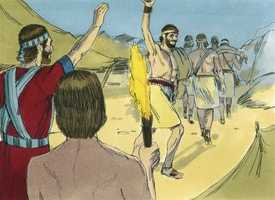

# Josué Cap 07

**1** 	E TRANSGREDIRAM os filhos de Israel no anátema; porque Acã filho de Carmi, filho de Zabdi, filho de Zerá, da tribo de Judá, tomou do anátema, e a ira do Senhor se acendeu contra os filhos de Israel.
\n> **Cmt MHenry**: *Versículos 1-5* Acã tomou ZXSA\\algo do botim de Jericó. O amor pelo mundo é a raiz de amargura mais difícil de ser arrancada. Devemos cuidar-nos do pecado, não seja que por ele muitos sejam estorvados e contaminados ([Hb 12.15](../58N-Hb/12.md#15)); e cuidado de confraternizar com os pecadores, não seja que participemos de sua culpa. É dever nosso vigiar-nos mutuamente para impedir o pecado, porque os pecados alheios podem ser para nosso mal. A fácil conquista de Jericó suscitou desprezo pelo inimigo, e uma disposição a esperar que o Senhor fizesse todo por eles, sem que eles usassem os médios corretos. Deste modo os homens abusam das doutrinas da graça divina e das promessas de Deus, e as usam como escusa para sua preguiça e capricho. Devemos ocupar-nos de nossa salvação, embora seja Deus quem opera em nós.\ Foi uma vitória custosa para os cananeus, porque devido a ela Israel despertou, fez reformas e reconciliou-se com seu Deus, e o povo de Canaã se endureceu para sua própria ruína.

**2** 	Enviando, pois, Josué, de Jericó, alguns homens a Ai, que está junto a Bete-Áven do lado do oriente de Betel, falou-lhes dizendo: Subi, e espiai a terra. Subiram, pois, aqueles homens, e espiaram a Ai.

 

**3** 	E voltaram a Josué, e disseram-lhe: Não suba todo o povo; subam uns dois mil, ou três mil homens, a ferir a Ai; não fatigueis ali a todo o povo, porque poucos são.

 

**4** 	Assim, subiram lá, do povo, uns três mil homens, os quais fugiram diante dos homens de Ai.

 

**5** 	E os homens de Ai feriram deles uns trinta e seis, e os perseguiram desde a porta até Sebarim, e os feriram na descida; e o coração do povo se derreteu e se tornou como água.

 

**6** 	Então Josué rasgou as suas vestes, e se prostrou em terra sobre o seu rosto perante a arca do Senhor até à tarde, ele e os anciãos de Israel; e deitaram pó sobre as suas cabeças.

> **Cmt MHenry**: *Versículos 6-9* O interesse de Josué pela honra de Deus, mais que pelo destino de Israel, era a linguagem do Espírito de adoção. Suplica a Deus. Lamenta a derrota, porque teme que denigre a sabedoria e o poder de Deus, sua bondade e fidelidade. Em nenhum momento podemos apresentar um melhor depoimento que este: Senhor, que farás por teu grande Nome? Que Deus seja glorificado em tudo, e então recebamos toda Sua vontade.

 

**7** 	E disse Josué: Ah! Senhor Deus! Por que, com efeito, fizeste passar a este povo o Jordão, para nos entregares nas mãos dos amorreus para nos fazerem perecer? Antes nos tivéssemos contentado em ficar além do Jordão!

> **Cmt MHenry**: *CAPÍTULO 7*

 

**8** 	Ah, Senhor! Que direi? Pois Israel virou as costas diante dos inimigos!

**9** 	Ouvindo isto, os cananeus, e todos os moradores da terra, nos cercarão e desarraigarão o nosso nome da terra; e então que farás ao teu grande nome?

**10** 	Então disse o Senhor a Josué: Levanta-te; por que estás prostrado assim sobre o teu rosto?

> **Cmt MHenry**: *Versículos 10-15* Deus acorda a Josué para que faça uma investigação, e lhe diz que quando o anátema for tirado, tudo estará bem. Os tempos de perigo e tribulação devem ser tempos de reforma. Devemos examinar nosso lar, nosso coração, nossa casa, e fazer uma busca diligente para achar se não há uma anátema, que Deus vê a aborrece; uma luxúria secreta, lucro ilícito, algum secreto indevido com Deus ou com outras pessoas. Não podemos prosperar até que o anátema seja destruído, e arrancado de nosso coração e tirado de nossas habitações e de nossa família, e eliminado de nossa vida. Quando o pecado dos pecadores fica ao descoberto, deve dar-se a Deus seu reconhecimento. Com juízo seguro e sem erro, o Deus justo discerne e fará distinção entre o inocente e o culpável; de modo que, embora os justos sejam da mesma tribo, família ou lar que os maus, nunca serão tratados como o ímpio.

 

**11** 	Israel pecou, e transgrediram a minha aliança que lhes tinha ordenado, e tomaram do anátema, e furtaram, e mentiram, e debaixo da sua bagagem o puseram.

**12** 	Por isso os filhos de Israel não puderam subsistir perante os seus inimigos; viraram as costas diante dos seus inimigos; porquanto estão amaldiçoados; não serei mais convosco, se não desarraigardes o anátema do meio de vós.

**13** 	Levanta-te, santifica o povo, e dize: Santificai-vos para amanhã, porque assim diz o Senhor Deus de Israel: Anátema há no meio de ti, Israel; diante dos teus inimigos não poderás suster-te, até que tireis o anátema do meio de vós.

**14** 	Amanhã, pois, vos chegareis, segundo as vossas tribos; e será que a tribo que o Senhor tomar se chegará, segundo as famílias; e a família que o Senhor tomar se chegará por casas; e a casa que o Senhor tomar se chegará homem por homem.

**15** 	E será que aquele que for tomado com o anátema será queimado a fogo, ele e tudo quanto tiver; porquanto transgrediu a aliança do Senhor, e fez uma loucura em Israel.

**16** 	Então Josué se levantou de madrugada, e fez chegar a Israel, segundo as suas tribos; e a tribo de Judá foi tomada;

> **Cmt MHenry**: *Versículos 16-26* Veja-se a tolice dos que prometem guardar o segredo no pecar. O Deus justo tem muitas formas de tirar à luz as obras ocultas das trevas. Também veja-se até que ponto é nosso dever buscar a causa de nossa tribulação, quando Deus contende contra nós. devemos orar com o santo Jó: Senhor, faze-me entender por que contendes comigo. O pecado de Acã começou no olho. Viu todas essas coisas formosas, como Eva viu o fruto proibido. Veja-se o que resulta de tolerar que o coração ande na vista dos olhos, e a necessidade que temos de fazer aliança com nossos olhos, que se vagueiam, certamente chorarão por isso. isto saiu do coração. Os que queiram evitar as ações pecaminosas, devem mortificar e controlar dentro de si os desejos pecaminosos, particularmente a cobiça de riquezas mundanas. Se Acã tivesse olhado essas coisas com o olho da fé, as teria visto como anátema e as teria rejeitado com temor; mas ao olhá-las com o olho dos sentidos unicamente, as viu como coisas valiosas e as cobiçou. Quando teve cometido o pecado, tratou de ocultá-lo. tão logo como obteve seu botim, isso se converteu em carga, e não se atreveu a usar seu tesouro mal conseguido. Quão diferentes se vêem de longe os objetos de tentação de quando já se têm conseguido. Veja-se aqui o enganoso do pecado; o que é agradável ao cometê-lo, é amargo em sua conseqüência. Observe-se como se enganam os que roubam a Deus. o pecado é coisa muito *perturbadora*, não só para o pecador mesmo, senão para todos os que o rodeiam. O Deus justo certamente recompensará com tribulação aos que transtornam a seu povo. Acã não pereceu sozinho em seu pecado. Levam os seus à perdição os que tomam o que não é deles. Seus filhos e filhas morreram com ele. provavelmente o tenham ajudado a esconder as coisas; devem ter sabido delas. Que fatais conseqüências se seguem, ainda neste mundo, ao pecador mesmo e que tudo quanto lhe pertence! Um pecador destrói muito do bom. Então, que será com a ira vindoura? Fujamos dela a Cristo Jesus como ao Amigo do pecador. Há circunstâncias na confissão de Acã que marcam o desenvolvimento do pecado, desde sua entrada no coração até sua perpetração, o qual deve servir como a história de quase cada ofensa contra a lei de Deus, e o sacrifício de Jesus Cristo.

 

**17** 	E, fazendo chegar a tribo de Judá, tomou a família dos zeraítas; e fazendo chegar a família dos zeraítas homem por homem, foi tomado Zabdi;

**18** 	E, fazendo chegar a sua casa, homem por homem, foi tomado Acã, filho de Carmi, filho de Zabdi, filho de Zerá, da tribo de Judá.

 

**19** 	Então disse Josué a Acã: Filho meu, dá, peço-te, glória ao Senhor Deus de Israel, e faze confissão perante ele; e declara-me agora o que fizeste, não mo ocultes.

**20** 	E respondeu Acã a Josué, e disse: Verdadeiramente pequei contra o Senhor Deus de Israel, e fiz assim e assim.

 

**21** 	Quando vi entre os despojos uma boa capa babilônica, e duzentos siclos de prata, e uma cunha de ouro, do peso de cinqüenta siclos, cobicei-os e tomei-os; e eis que estão escondidos na terra, no meio da minha tenda, e a prata por baixo dela.

**22** 	Então Josué enviou mensageiros, que foram correndo à tenda; e eis que tudo estava escondido na sua tenda, e a prata por baixo.

 

**23** 	Tomaram, pois, aquelas coisas do meio da tenda, e as trouxeram a Josué e a todos os filhos de Israel; e as puseram perante o Senhor.

**24** 	Então Josué, e todo o Israel com ele, tomaram a Acã filho de Zerá, e a prata, e a capa, e a cunha de ouro, e seus filhos, e suas filhas, e seus bois, e seus jumentos, e suas ovelhas, e sua tenda, e tudo quanto ele tinha; e levaram-nos ao vale de Acor.

**25** 	E disse Josué: Por que nos perturbaste? O Senhor te perturbará neste dia. E todo o Israel o apedrejou; e os queimaram a fogo depois de apedrejá-los.

 

**26** 	E levantaram sobre ele um grande montão de pedras, até o dia de hoje; assim o Senhor se apartou do ardor da sua ira; pelo que aquele lugar se chama o vale de Acor, até ao dia de hoje.

 

> **Cmt MHenry** Intro: *• Versículos 1-5*> *Derrota dos israelitas em Ai*> *• Versículos 6-9*> *A humilhação de Josué e sua oração*> *• Versículos 10-15*> *Deus ordena a Josué o que deve fazer*> *• Versículos 16-26*> *Acã é descoberto – É destruído*