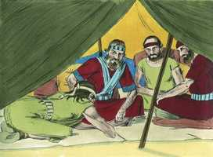
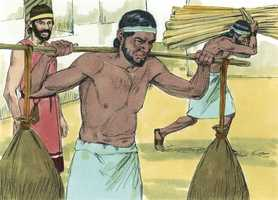

# Josué Cap 09

**1** 	E SUCEDEU que, ouvindo isto todos os reis, que estavam aquém do Jordão, nas montanhas, e nas campinas, em toda a costa do grande mar, em frente do Líbano, os heteus, e os amorreus, os cananeus, os perizeus, os heveus, e os jebuseus,

> **Cmt MHenry**: *Versículos 1-2* Até agora os cananeus tinham-se defendido, mas aqui se confabulam para atacar a Israel. Tinham a mente cegada e endurecido o coração, para sua destruição. Embora amiúde inimizados uns com outros, uniram-se contra Israel. Oh, que Israel aprendesse dos cananeus a sacrificar seus interesses privados em arras do bem público, e deixassem de lado todas as brigas entre eles, e se unissem contra os inimigos do Reino de Deus!

**2** 	Se ajuntaram eles de comum acordo, para pelejar contra Josué e contra Israel.

**3** 	E os moradores de Gibeom, ouvindo o que Josué fizera com Jericó e com Ai,

> **Cmt MHenry**: *Versículos 3-13* Outro povo ouviu estas notícias e foram estimulados por elas a declarar a guerra a Israel, mas os gabaonitas foram levados a fazer as pazes com eles. Assim, o descobrimento da glória e da graça de Deus no evangelho é, para alguns, cheiro de vida para a vida; para outros, cheiro de morte para a morte ([2 Co 2.16](../47N-2Co/02.md#16)). O mesmo sol amolece a cera e endurece o barro. A falsidade dos gabaonitas não tem justificativo. Não devemos fazer mal para que venha o bem. Se eles tivessem reconhecido seu país, deixado a idolatria, e tivessem se entregado ao Deus de Israel, temos razão para pensar que Josué teria sido dirigido pelo oráculo de Deus a perdoá-lhes a vida. Porém quando disseram uma vez "viemos de terras longínquas", tiveram de dizê-lo de novo, e além disso dizer o que era completamente falso acerca de seu pão, seu vinho e sua roupa: uma mentira após outra, e depois dessa, uma terceira e assim sucessivamente. O caminho desse pecado vai especialmente rumo a queda. Todavia, a fé e a prudência deles é digna de elogio. Ao submeter-se a Israel se submeteram ao Deus de Israel, o qual significava abandonar a idolatria. Como poderíamos estar melhor que lançando-nos na misericórdia do Deus de toda bondade? A forma de evitar o juízo é confrontá-lo com arrependimento. Façamos como aqueles gabaonitas, busquemos a paz com Deus nos farrapos da humilhação, e com santa tristeza, para que nosso pecado não seja nossa ruína. Sejamos servos de Jesus, nosso bendito Josué, e viveremos.

**4** 	Usaram de astúcia, e foram e se fingiram embaixadores, e levando sacos velhos sobre os seus jumentos, e odres de vinho, velhos, e rotos, e remendados;

**5** 	E nos seus pés sapatos velhos e remendados, e roupas velhas sobre si; e todo o pão que traziam para o caminho era seco e bolorento.

**6** 	E vieram a Josué, ao arraial, a Gilgal, e disseram a ele e aos homens de Israel: Viemos de uma terra distante; fazei, pois, agora, acordo conosco.

 

**7** 	E os homens de Israel responderam aos heveus: Porventura habiteis no meio de nós; como pois faremos acordo convosco?

**8** 	Então disseram a Josué: Nós somos teus servos. E disse-lhes Josué: Quem sois vós, e de onde vindes?

**9** 	E lhe responderam: Teus servos vieram de uma terra mui distante, por causa do nome do Senhor teu Deus, porquanto ouvimos a sua fama, e tudo quanto fez no Egito;

> **Cmt MHenry**: *CAPÍTULO 9*

**10** 	E tudo quanto fez aos dois reis dos amorreus, que estavam além do Jordão, a Siom rei de Hesbom, e a Ogue, rei de Basã, que estava em Astarote.

**11** 	Por isso nossos anciãos e todos os moradores da nossa terra nos falaram, dizendo: Tomai em vossas mãos provisão para o caminho, e ide-lhes ao encontro e dizei-lhes: Nós somos vossos servos; fazei, pois, agora acordo conosco.

**12** 	Este nosso pão tomamos quente das nossas casas para nossa provisão, no dia em que saímos para vir a vós; e ei-lo aqui agora já seco e bolorento;

**13** 	E estes odres, que enchemos de vinho, eram novos, e ei-los aqui já rotos; e estas nossas roupas e nossos sapatos já se têm envelhecido, por causa do mui longo caminho.

**14** 	Então os homens de Israel tomaram da provisão deles e não pediram conselho ao Senhor.

> **Cmt MHenry**: *Versículos 14-21* Os israelitas concluíram apressadamente, depois de examiná-las, que as provisões dos gabaonitas confirmavam o que eles falavam. Nós nos precipitamos, não aceleramos, quando não esperamos que Deus vá conosco, e não o consultamos pela Palavra e a oração. Logo se descobriu a fraude. A língua mentirosa vale somente um instante. Se o juramento tiver sido ilícito em si mesmo, não teria sido obrigatório; porque nenhuma obrigação pode fazer que seja nosso dever cometer um pecado. mas não era ilícito salvar os cananeus que se submetiam e deixavam a idolatria, e que somente desejavam salvar sua vida. Um cidadão de Sião Judá dano seu e não por isso muda ([Sl 15.4](../19A-Sl/15.md#4)). Quando descobriram que tinham sido enganados, Josué e os príncipes não apelaram a Eleazar, o sumo sacerdote, para serem liberados do compromisso, nem pretenderam que tinham razões para não conservar sua palavra com aqueles aos que tinham jurado. Que isto nos convença de que devemos cumprir nossas promessas, honrar nossos acordos e ter consciência do valor de nossa palavra.

**15** 	E Josué fez paz com eles, e fez um acordo com eles, que lhes daria a vida; e os príncipes da congregação lhes prestaram juramento.

**16** 	E sucedeu que, ao fim de três dias, depois de fazerem acordo com eles, ouviram que eram seus vizinhos, e que moravam no meio deles.

**17** 	Porque, partindo os filhos de Israel, chegaram às cidades deles ao terceiro dia; e suas cidades eram Gibeom e Cefira, e Beerote, e Quiriate-Jearim.

**18** 	E os filhos de Israel não os feriram; porquanto os príncipes da congregação lhes juraram pelo Senhor Deus de Israel; por isso toda a congregação murmurava contra os príncipes.

**19** 	Então todos os príncipes disseram a toda a congregação: Nós juramos-lhes pelo Senhor Deus de Israel, pelo que não lhes podemos tocar.

**20** 	Isto, porém, lhes faremos: conservar-lhes-emos a vida, para que não haja grande ira sobre nós, por causa do juramento que já lhes fizemos.

**21** 	Disseram-lhes, pois, os príncipes: Vivam, e sejam rachadores de lenha e tiradores de água para toda a congregação, como os príncipes lhes disseram.

**22** 	E Josué os chamou, e falou-lhes dizendo: Por que nos enganastes dizendo: Mui longe de vós habitamos, morando vós no meio de nós?

> **Cmt MHenry**: *Versículos 22-27* Os gabaonitas não justificam sua mentira, mas alegam que o fizeram para salvar a vida. O medo não era somente do poder do homem, do qual pode-se fugir à proteção divina, senão do mesmo poder de Deus, que viram comprometidos em sua contra. Josué os sentencia à escravidão perpétua. Devem ser servos, mas toda tarefa se torna honrosa quando se faz para a casa do Senhor, e seus ofícios. De igual modo, submetamo-nos a nosso Senhor Jesus, dizendo: É-nos aqui em tua mão; o que te pareça bom e reto fazer conosco, faze-o; somente salva a nossa alma; não nos arrependeremos disso. Se Ele nos mandar carregar sua cruz e servi-lo, isso não nos será vergonhoso nem penoso, porque até o humilde ofício no serviço de Deus nos dá direito a uma morada na casa de Jeová, todos os dias de nossa vida. Ao acudir ao Salvador não procedemos por ventura. Somos convidados a ir a Ele, e nos assegura que "o que a vem a mi, não o lanço fora". Até as coisas que soam rudes e humilhantes, e são uma dura prova para nossa sinceridade, resultarão numa verdadeira vantagem. "

**23** 	Agora, pois, sereis malditos; e dentre vós não deixará de haver servos, nem rachadores de lenha, nem tiradores de água, para a casa do meu Deus.

**24** 	Então responderam a Josué, e disseram: Porquanto com certeza foi anunciado aos teus servos que o Senhor teu Deus ordenou a Moisés, seu servo, que a vós daria toda esta terra, e destruiria todos os moradores da terra diante de vós, tememos muito por nossas vidas por causa de vós; por isso fizemos assim.

**25** 	E eis que agora estamos na tua mão; faze-nos aquilo que te pareça bom e reto.

**26** 	Assim pois lhes fez, e livrou-os das mãos dos filhos de Israel, e não os mataram.

**27** 	E naquele dia, Josué os fez rachadores de lenha e tiradores de água para a congregação e para o altar do Senhor, até ao dia de hoje, no lugar que ele escolhesse.

 

> **Cmt MHenry** Intro: *• Versículos 1-2*> 28A-Os reis se unem contra Israel*> *• Versículos 3-13*> 28A-Os gabaonitas solicitam a paz*> *• Versículos 14-21*> *Obtêm a paz, mas são logo descobertos*> *• Versículos 22-27*> 28A-Os gabaonitas serão escravos*