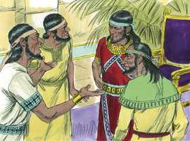
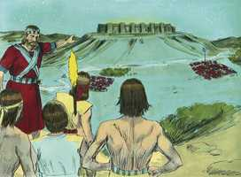
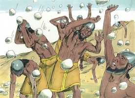
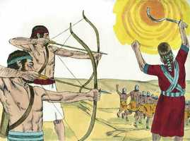
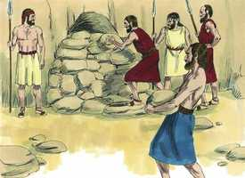
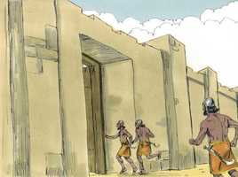
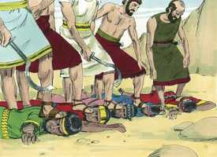
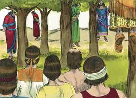

# Josué Cap 10

**1** 	E SUCEDEU que, ouvindo Adoni-Zedeque, rei de Jerusalém, que Josué tomara a Ai, e a tinha destruído totalmente, e fizera a Ai, e ao seu rei, como tinha feito a Jericó e ao seu rei, e que os moradores de Gibeom fizeram paz com os israelitas, e estavam no meio deles,

> **Cmt MHenry**: *Versículos 1-6* Quando os pecadores deixam o serviço de Satanás e a amizade com o mundo, para fazer a paz com Deus e unir-se a Israel, não devem assombrar-se se o mundo os odeia, se seus anteriores amigos se tornam seus inimigos. Com tais métodos, Satanás desencoraja a muitos que estão convencidos de seu perigo e quase persuadidos de serem cristãos, mas temem a cruz. Estas coisas devem avivar-nos para apelar a Deus em busca de proteção, socorro e liberação.

 

**2** 	Temeram muito, porque Gibeom era uma cidade grande, como uma das cidades reais, e ainda maior do que Ai, e todos os seus homens valentes.

**3** 	Pelo que Adoni-Zedeque, rei de Jerusalém, enviou a Hoão, rei de Hebrom, e a Pirão, rei de Jarmute, e a Jafia, rei de Laquis e a Debir, rei de Eglom, dizendo:

**4** 	Subi a mim, e ajudai-me, e firamos a Gibeom, porquanto fez paz com Josué e com os filhos de Israel.

**5** 	Então se ajuntaram, e subiram cinco reis dos amorreus, o rei de Jerusalém, o rei de Hebrom, o rei de Jarmute, o rei de Laquis, o rei de Eglom, eles e todos os seus exércitos; e sitiaram a Gibeom e pelejaram contra ela.

**6** 	Enviaram, pois, os homens de Gibeom a Josué, ao arraial de Gilgal, dizendo: Não retires as tuas mãos de teus servos; sobe apressadamente a nós, e livra-nos e ajuda-nos, porquanto todos os reis dos amorreus, que habitam na montanha, se ajuntaram contra nós.

**7** 	Então subiu Josué, de Gilgal, ele e toda a gente de guerra com ele, e todos os homens valorosos.

> **Cmt MHenry**: *Versículos 7-14* Os mais humildes e fracos que somente começam a confiar no Senhor têm tanto direito a serem protegidos como os que faz muito tempo são seus servos fiéis. Nosso dever é defender o afligido que, como os gabaonitas, estão encrencados por nossa conta, ou por causa do evangelho. Josué não iria abandonar seus novos vassalos. Quanto menos nosso verdadeiro Josué vai falhar aos que confiam nEle! Podemos ser faltos em nossa fé, mas a nossa confiança nunca pode faltar ao êxito. Mas as promessas de Deus não são para afrouxar ou suprimir nossas empresas, senão para avivá-las e estimulá-las. Observe-se a grande fé de Josué e o poder de Deus que lhe responde detendo miraculosamente o sol, para que o dia da vitória de Israel seja mais longo. Josué agiu nesta ocasião por impulso do Espírito de Deus em sua mente. Não era necessário que Josué falasse ou que o milagre ficasse registrado segundo o vocabulário moderno da astronomia. Para os israelitas, o sol sais por sobre Gibeom (ou Gibeão), e a lua, por acima do vale de Ajalom (ou Aijalom), e o curso deles pareceu deter-se por todo um dia. Há algo demasiadamente difícil para o Senhor? Esta é a resposta suficiente a dez mil dificuldades, que os contraditores de toda época tem esgrimido contra a verdade de Deus revelada em Sua Palavra escrita. Por isto se proclama às nações vizinhas: "Olhem as obras de Jeová" e digam, que nação grande há que tenha a Deus tão perto, como Israel?

**8** 	E o Senhor disse a Josué: Não os temas, porque os tenho dado na tua mão; nenhum deles te poderá resistir.

**9** 	E Josué lhes sobreveio de repente, porque toda a noite veio subindo desde Gilgal.

 

**10** 	E o Senhor os conturbou diante de Israel, e os feriu com grande matança em Gibeom; e perseguiu-os pelo caminho que sobe a Bete-Horom, e feriu-os até Azeca e a Maquedá.

> **Cmt MHenry**: *CAPÍTULO 10A-2Sm

**11** 	E sucedeu que fugindo eles de diante de Israel, à descida de Bete-Horom, o Senhor lançou sobre eles, do céu, grandes pedras, até Azeca, e morreram; e foram muitos mais os que morreram das pedras da saraiva do que os que os filhos de Israel mataram à espada.

 

**12** 	Então Josué falou ao Senhor, no dia em que o Senhor deu os amorreus nas mãos dos filhos de Israel, e disse na presença dos israelitas: Sol, detém-te em Gibeom, e tu, lua, no vale de Ajalom.

 

**13** 	E o sol se deteve, e a lua parou, até que o povo se vingou de seus inimigos. Isto não está escrito no livro de Jasher? O sol, pois, se deteve no meio do céu, e não se apressou a pôr-se, quase um dia inteiro.

**14** 	E não houve dia semelhante a este, nem antes nem depois dele, ouvindo o Senhor assim a voz de um homem; porque o Senhor pelejava por Israel.

**15** 	E voltou Josué, e todo o Israel com ele, ao arraial, em Gilgal.

> **Cmt MHenry**: *Versículos 15-27* Ninguém moveu sua língua contra nenhum dos filhos de Israel. Isto mostra sua perfeita seguridade. Os reis foram chamados a render contas como rebeldes contra o Israel de Deus. os refúgios de mentiras somente podem assegurar o juízo de Deus contra eles. Deus castigou a abominável iniqüidade destes reis, cuja medida de iniqüidade estava agora completa. Por este ato público de justiça, executado nos líderes dos cananeus em pecado, Ele fez que seu povo tivesse maior terror e ódio ao pecado das nações que Deus expulsava de diante deles. Aqui há um tipo e figura da vitória de Cristo sobre as potestades das trevas e da vitória dos crentes por meio dEle. Não devemos satisfazer-nos com alguma vitória importante em nossos conflitos espirituais. Devemos perseguir a nossos inimigos dispersos, buscando os restos de pecado a medida que surjam em nosso coração e, assim, prosseguir a conquista. Ao fazê-lo assim, o Senhor permitirá que haja luz até que se complete a guerra.

**16** 	Aqueles cinco reis, porém, fugiram, e se esconderam numa cova em Maquedá.

**17** 	E foi anunciado a Josué, dizendo: Acharam-se os cinco reis escondidos numa cova em Maquedá.

**18** 	Disse, pois, Josué: Arrastai grandes pedras à boca da cova, e ponde sobre ela homens que os guardem;

 

**19** 	Porém vós não vos detenhais; persegui os vossos inimigos, e atacai os que vão ficando atrás; não os deixeis entrar nas suas cidades, porque o Senhor vosso Deus já vo-los deu na vossa mão.

**20** 	E sucedeu que, acabando Josué e os filhos de Israel de os ferir com grande matança, até consumi-los, e os que ficaram deles se retiraram às cidades fortificadas,

 

**21** 	Todo o povo voltou em paz a Josué, ao arraial em Maquedá; não havendo ninguém que movesse a sua língua contra os filhos de Israel.

**22** 	Depois disse Josué: Abri a boca da cova, e trazei-me para fora aqueles cinco reis.

**23** 	Fizeram, pois, assim, e trouxeram-lhe aqueles cinco reis para fora da cova: o rei de Jerusalém, o rei de Hebrom, o rei de Jarmute, o rei de Laquis e o rei de Eglom.

**24** 	E sucedeu que, trazendo aqueles reis a Josué, este chamou todos os homens de Israel, e disse aos capitães dos homens de guerra, que foram com ele: Chegai, ponde os vossos pés sobre os pescoços destes reis. E chegaram, e puseram os seus pés sobre os pescoços deles.

 

**25** 	Então Josué lhes disse: Não temais, nem vos espanteis; esforçai-vos e animai-vos; porque assim o fará o Senhor a todos os vossos inimigos, contra os quais pelejardes.

**26** 	E, depois disto, Josué os feriu, e os matou, e os enforcou em cinco madeiros; e ficaram enforcados nos madeiros até à tarde.

 

**27** 	E sucedeu que, ao pôr do sol, deu Josué ordem que os tirassem dos madeiros; e lançaram-nos na cova onde se esconderam; e puseram grandes pedras à boca da cova, que ainda ali estão até o dia de hoje.

 

**28** 	E naquele mesmo dia tomou Josué a Maquedá, e feriu-a a fio de espada, bem como ao seu rei; totalmente a destruiu com todos que nela havia, sem nada deixar; e fez ao rei de Maquedá como fizera ao rei de Jericó.

> **Cmt MHenry**: *Versículos 28-43* Josué se apressou a tomar essas cidades. Note-se que grande é a quantidade de trabalho que se pode realizar em pouco tempo, se formos diligentes e melhorarmos nossas oportunidades. Aqui Deus demonstra seu ódio pela idolatria e outras abominações das quais eram culpáveis os cananeus, e pela enormidade da destruição que caiu sobre eles nos ensina quão grande foi a provocação. Também aqui se tipifica a destruição de todos os inimigos do Senhor Jesus, os que, tendo desprezado as riquezas de Sua graça, devem sentir para sempre o peso de Sua ira. O Senhor lutou por Israel. Não poderia ter obtido a vitória se Deus não tiver dado a batalha. Nós vencemos quando Deus peleja por nós; se Ele é por nós, quem contra nós? "

**29** 	Então Josué, e todo o Israel com ele, passou de Maquedá a Libna e pelejou contra ela.

 

**30** 	E também o Senhor a deu na mão de Israel, a ela e a seu rei, e a feriu a fio de espada, a ela e a todos que nela estavam; sem nada deixar; e fez ao seu rei como fizera ao rei de Jericó.

**31** 	Então Josué, e todo o Israel com ele, passou de Libna a Laquis; e a sitiou, e pelejou contra ela;

**32** 	E o Senhor deu a Laquis nas mãos de Israel, e tomou-a no dia seguinte e a feriu a fio de espada, a ela e a todos os que nela estavam, conforme a tudo o que fizera a Libna.

**33** 	Então Horão, rei de Gezer, subiu a ajudar a Laquis, porém Josué o feriu, a ele e ao seu povo, até não lhe deixar nem sequer um.

**34** 	E Josué, e todo o Israel com ele, passou de Laquis a Eglom, e a sitiaram, e pelejaram contra ela.

 

**35** 	E no mesmo dia a tomaram, e a feriram a fio de espada; e a todos os que nela estavam, destruiu totalmente no mesmo dia, conforme a tudo o que fizera a Laquis.

**36** 	Depois Josué, e todo o Israel com ele, subiu de Eglom a Hebrom, e pelejaram contra ela.

**37** 	E a tomaram, e a feriram ao fio de espada, assim ao seu rei como a todas as suas cidades; e a todos os que nelas estavam, a ninguém deixou com vida, conforme a tudo o que fizera a Eglom; e a destruiu totalmente, a ela e a todos os que nela estavam.

**38** 	Então Josué, e todo o Israel com ele, tornou a Debir, e pelejou contra ela.

**39** 	E tomou-a com o seu rei, e a todas as suas cidades, e as feriu a fio de espada, e a todos os que nelas estavam destruiu totalmente; nada deixou; como fizera a Hebrom, assim fez a Debir e ao seu rei, e como fizera a Libna e ao seu rei.

**40** 	Assim feriu Josué toda aquela terra, as montanhas, o sul, e as campinas, e as descidas das águas, e a todos os seus reis; nada deixou; mas tudo o que tinha fôlego destruiu, como ordenara o Senhor Deus de Israel.

**41** 	E Josué os feriu desde Cades-Barnéia, até Gaza, como também toda a terra de Gósen, e até Gibeom.

**42** 	E de uma vez tomou Josué todos estes reis, e as suas terras; porquanto o Senhor Deus de Israel pelejava por Israel.

**43** 	Então Josué, e todo o Israel com ele, voltou ao arraial em Gilgal.

> **Cmt MHenry** Intro: *• Versículos 1-6*> *Cinco reis guerreiam contra Gibeom (ou Gibeão)*> *• Versículos 7-14*> *Josué socorre a Gibeom (ou Gibeão) – Detenção do sol e a*> *• Versículos 15-27*> 28A-Os reis são capturados, seus exércitos derrotados, e a eles se*> *• Versículos 28-43*> *Derrota e morte de outros sete reis*