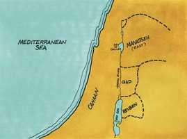

# Josué Cap 13

**1** 	ERA, porém, Josué já velho, entrado em dias; e disse-lhe o Senhor: Já estás velho, entrado em dias; e ainda muitíssima terra ficou para possuir.

> **Cmt MHenry**: *Versículos 1-6* Neste capítulo começa o relato do reparto da terra de Canaã entre as tribos de Israel por sorteio, narração que mostra o cumprimento da promessa feita aos pais de que esta terra seria dada à semente de Jacó. Não temos que passar por alto estes capítulos de nomes difíceis considerando-os inúteis. Onde Deus tenha uma boca para falar e uma mão para escrever, devemos encontrar ouvido para escutar e olho para ler; e que Deus nos dê um coração que ganhe! Supõe-se que Josué teria por volta dos cem anos de idade nesta época. Bom é para os que são velhos e entrados em anos que se lembrem o que são. Deus considera a estrutura de seu povo e não os sobrecarrega com obras superiores a suas forças. Todas as pessoas, especialmente os velhos, devem dispor-se a realizar prontamente o que lhes corresponde fazer antes de morrer, não seja que a morte os impeça ([Ec 9.10](../21A-Ec/09.md#10)). Deus promete que fará aos israelitas donos de todos os países ainda não subjugados, embora Josué estava velho e era incapaz de fazê-lo, e provavelmente não viveria para vê-lo realizado. Seja o que for que aconteça conosco, e ainda que sejamos deixados de lado como vasos rotos e desprezados, Deus fará sua obra a seu devido tempo. Devemos trabalhar em nossa salvação, e então Deus operará em nós e operará conosco; devemos resistir a nossos inimigos espirituais, e então Deus os colocará embaixo de nossos pés; devemos ir adiante em nossa tarefa e guerra cristã, então Deus ira diante de nós.

**2** 	A terra que ainda fica é esta: Todos os termos dos filisteus e toda a Gesur;

**3** 	Desde Sior, que está em frente ao Egito, até ao termo de Ecrom para o norte, que se diz ser dos cananeus; cinco príncipes dos filisteus; o gazeu, e o asdodeu, o asqueloneu, o giteu, e o ecroneu, e os aveus;

**4** 	Desde o sul, toda a terra dos cananeus, e Meara, que é dos sidônios; até Afeca, até ao termo dos amorreus;

**5** 	Como também a terra dos gebalitas, e todo o Líbano, para o nascente do sol, desde Baal-Gade, ao pé do monte Hermom, até a entrada de Hamate;

**6** 	Todos os que habitam nas montanhas desde o Líbano até Misrefote-Maim, todos os sidônios; eu os lançarei de diante dos filhos de Israel; tão-somente reparte a terra em herança a Israel, como já te mandei.

**7** 	Reparte, pois, agora esta terra por herança às nove tribos, e à meia tribo de Manassés,

> **Cmt MHenry**: *Versículos 7-33* A terra devia ser repartida entre as tribos. A vontade de Deus é que cada homem conheça o seu e não tome o que é de outrem. O mundo deve ser governado, não pela força, senão pelo direito. Onde quer que fique nossa habitação, e seja qual for a forma honesta de designar nossa porção, devemos considerá-la dada por Deus; devemos estar agradecidos por isso, e usá-la como corresponde, enquanto deva usar-se todo método prudente para impedir disputas pela propriedade, tanto no presente como no futuro. Josué deve ser aqui um tipo de Cristo que não somente venceu as portas do inferno por nós; também nos abriu as portas do céu e, tendo adquirido a herança eterna para todos os crentes, os colocará em possessão dela. Aqui há uma descrição geral do país dado às duas tribos de Levi: veja [Nm 18.20](../04A-Nm/18.md#20). O mantimento deles deviam tomá-lo de todas as outras tribos. Os ministros do Senhor devem mostrar-se indiferentes aos interesses mundanos, e a gente deve cuidar de que não lhes falte nada necessário. Bem-aventurados os que têm ao Senhor Deus de Israel por herança, embora seja pouco o deste mundo que tenham como sorte. Suas providências suprirão suas necessidades, suas consolações sustentarão sua alma até que recebam gozo celestial e prazeres eternos.

 

**8** 	Com a qual os rubenitas e os gaditas já receberam a sua herança, além do Jordão para o oriente, assim como já lhes tinha dado Moisés, servo do Senhor.

**9** 	Desde Aroer, que está à beira do ribeiro de Arnom, e a cidade que está no meio do vale, e toda a campina de Medeba até Dibom;

**10** 	E todas as cidades de Siom, rei dos amorreus, que reinou em Hesbom, até ao termo dos filhos de Amom;

**11** 	E Gileade, e o termo dos gesureus, e dos maacateus, e todo o monte Hermom, e toda a Basã até Salcá;

**12** 	Todo o reino de Ogue em Basã, que reinou em Astarote e em Edrei; este ficou do restante dos gigantes que Moisés feriu e expulsou.

**13** 	Porém os filhos de Israel não expulsaram os gesureus, nem os maacateus; antes Gesur e Maacate ficaram habitando no meio de Israel até ao dia de hoje.

> **Cmt MHenry**: *CAPÍTULO 13A-1Cr

**14** 	Tão-somente à tribo de Levi não deu herança; os sacrifícios queimados do Senhor Deus de Israel são a sua herança, como já lhe tinha falado.

**15** 	Assim Moisés deu à tribo dos filhos de Rúben, conforme as suas famílias.

**16** 	E foi o seu limite desde Aroer, que está à beira do ribeiro de Arnom, e a cidade que está no meio do vale, e toda a campina até Medeba;

**17** 	Hesbom e todas as suas cidades, que estão na campina; Dibom, e Bamote-Baal, e Bete-Baal-Meom;

**18** 	E Jasa e Quedemote, e Mefaate;

**19** 	E Quiriataim e Sibma, e Zerete-Saar, no monte do vale;

**20** 	Bete-Peor, e Asdote-Pisga, Bete-Jesimote;

**21** 	E todas as cidades da campina, e todo o reino de Siom, rei dos amorreus, que reinou em Hesbom, a quem Moisés feriu, como também aos príncipes de Midiã, Evi, e Requém, e Zur, e Hur, e Reba, príncipes de Siom, moradores da terra.

**22** 	Também os filhos de Israel mataram à espada a Balaão, filho de Beor, o adivinho, com os outros que por eles foram mortos.

**23** 	E o termo dos filhos de Rúben ficou sendo o Jordão e os seus limites; esta foi a herança dos filhos de Rúben, segundo as suas famílias, as cidades, e as suas aldeias.

 

**24** 	E deu Moisés à tribo de Gade, aos filhos de Gade, segundo as suas famílias.

**25** 	E foi o seu termo Jazer, e todas as cidades de Gileade, e metade da terra dos filhos de Amom, até Aroer, que está em frente de Rabá.

**26** 	E desde Hesbom até Ramate-Mizpá e Betonim, e desde Maanaim até ao termo de Debir;

**27** 	E no vale Bete-Arã, e Bete-Nimra, e Sucote, Zafom, que ficara do restante do reino de Siom, em Hesbom, o Jordão e o seu termo, até a extremidade do mar de Quinerete além do Jordão para o oriente.

**28** 	Esta é a herança dos filhos de Gade segundo as suas famílias, as cidades e as suas aldeias.

**29** 	Deu também Moisés herança à meia tribo de Manassés; e deu à meia tribo dos filhos de Manassés, segundo as suas famílias.

**30** 	De maneira que o seu termo foi desde Maanaim, todo o Basã, todo o reino de Ogue, rei de Basã, e todas as aldeias de Jair, que estão em Basã, sessenta cidades,

**31** 	E metade de Gileade, e Astarote, e Edrei, cidades do reino de Ogue em Basã, deu aos filhos de Maquir, filho de Manassés, a saber, à metade dos filhos de Maquir, segundo as suas famílias.

**32** 	Isto é o que Moisés repartiu em herança nas campinas de Moabe, além do Jordão para o oriente de Jericó.

**33** 	Porém, à tribo de Levi, Moisés não deu herança; o Senhor Deus de Israel é a sua herança, como já lhe tinha falado.

> **Cmt MHenry** Intro: *• Versículos 1-6*> *Limites da terra ainda sem conquistar*> *• Versículos 7-33*> *Herdade de Rubem*