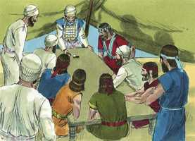
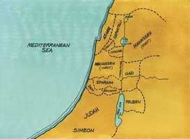

# Josué Cap 18

**1** 	E TODA a congregação dos filhos de Israel se reuniu em Siló, e ali armaram a tenda da congregação, depois que a terra lhes foi sujeita.

> **Cmt MHenry**: *Versículo 10A-2Sm 11A-1Rs 12A-2Rs 13A-1Cr 14A-2Cr 15A-Es 16A-Ne 17A-Et 18A-Jo 19A-Sl Siló estava na sorte de Efraim, a tribo à qual pertencia Josué, e era apropriado que o tabernáculo estivesse perto da residência do governante principal. O nome desta cidade é o mesmo com o qual Jacó profetizou do Messias ([Gn 49.10](../01A-Gn/49.md#10)). Alguns supõem que a cidade se chamava assim quando foi escolhida para lugar de repouso da arca, o qual tipificava a nosso grande Pacificador e o caminho a um Deus reconciliado através dEle.

**2** 	E dentre os filhos de Israel ficaram sete tribos que ainda não tinham repartido a sua herança.

> **Cmt MHenry**: *Versículos 2-10* Depois de um ano ou mais, Josué os culpou por sua negligência e lhes disse como deviam proceder. Deus, por sua graça, nos tem dado a possessão de uma boa terra, a Canaã celestial, mas nós somos negligentes para tomar possessão dela; não entramos no descanso, como poderíamos, pela fé, esperança e gozo santo. Quanto tempo mais será assim conosco? Quanto tempo mais continuaremos em nossa própria luz, abandonando nossas misericórdias por vaidades mentirosas? Josué anima aos israelitas a tomar possessão de sua porção. Ele está preste a fazer sua parte, se eles fazem a deles.

**3** 	E disse Josué aos filhos de Israel: Até quando sereis negligentes em chegardes para possuir a terra que o Senhor Deus de vossos pais vos deu?

**4** 	De cada tribo escolhei vós três homens, para que eu os envie, e eles se levantem e percorram a terra, e a demarquem segundo as suas heranças, e voltem a mim.

**5** 	E dividi-la-ão em sete partes: Judá ficará no seu termo para o sul, e a casa de José ficará no seu termo para o norte.

**6** 	E vós demarcareis a terra em sete partes, e me trareis a mim aqui descrita, para que eu aqui lance as sortes perante o Senhor nosso Deus,

**7** 	Porquanto os levitas não têm parte no meio de vós, porque o sacerdócio do Senhor é a sua parte; e Gade, e Rúben, e a meia tribo de Manassés, receberam a sua herança além do Jordão para o oriente, a qual lhes deu Moisés, o servo do Senhor.

**8** 	Então aqueles homens se levantaram e se foram; e Josué deu ordem aos que iam demarcar a terra, dizendo: Ide, e percorrei a terra, e demarcai-a, e então voltai a mim, e aqui vos lançarei as sortes perante o Senhor, em Siló.

**9** 	Foram, pois, aqueles homens, e passaram pela terra, e a demarcaram, em sete partes segundo as cidades, descrevendo-a num livro; e voltaram a Josué, ao arraial em Siló.

**10** 	Então Josué lhes lançou as sortes em Siló, perante o Senhor; e ali repartiu Josué a terra aos filhos de Israel, conforme às suas divisões.

 

**11** 	E tirou a sorte da tribo dos filhos de Benjamim, segundo as suas famílias; e coube-lhe o termo da sua sorte entre os filhos de Judá e os filhos de José.

> **Cmt MHenry**: *Versículos 11-28* As fronteiras de cada porção foram claramente delimitadas e se estabeleceu a herança de cada tribo. Todas as queixas e reclamos egoístas foram evitados pela sábia disposição de Deus que designou a colina e o vale, o trigo e a pastagens, as quebradas e os rios, as aldeias e as cidades. A sorte de um servo de Cristo, é lançada em aflição e tristeza? É o Senhor, faça o que bem lhe parecer. Estamos com prosperidade e paz? É do alto. Sejam humildes quando comparem a dádiva com sua indignidade. Não se esqueçam dAquele que deu o bom, e estejam sempre dispostos a renunciarem a isso quando Ele o ordenar.

 

**12** 	E o seu termo foi para o lado do norte, desde o Jordão; e sobe aquele termo ao lado de Jericó para o norte, e sobe pela montanha para o ocidente, terminando no deserto de Bete-Áven.

**13** 	E dali passa este termo a Luz, ao lado de Luz (que é Betel), para o sul; e desce a Atarote-Adar, ao pé do monte que está do lado do sul de Bete-Horom de baixo;

**14** 	E vai este termo e volta ao lado do ocidente para o sul do monte que está defronte de Bete-Horom, para o sul, terminando em Quiriate-Baal (que é Quiriate-Jearim), cidade dos filhos de Judá; esta é a sua extensão para o ocidente.

**15** 	E a sua extensão para o sul começa na extremidade de Quiriate-Jearim; e vai este termo ao ocidente e segue até à fonte das águas de Neftoa.

**16** 	E desce este termo até à extremidade do monte que está defronte do vale do filho de Hinom, que no vale dos refains para o norte, e desce pelo vale de Hinom do lado dos jebuseus para o sul; e então desce a En-Rogel;

**17** 	E vai desde o norte, e chega a En-Semes; e dali sai a Gelilote, que está defronte da subida de Adumim, e desce à pedra de Boã, filho de Rúben;

**18** 	E passa até ao lado, defronte de Arabá, para o norte, e desce a Arabá.

> **Cmt MHenry**: *CAPÍTULO 18A-Jo

**19** 	Passa mais este termo até ao lado de Bete-Hogla, para o norte, saindo esse termo na baía do Mar Salgado, para o norte, na extremidade do Jordão, para o sul; este é o termo do sul.

**20** 	E o Jordão será seu termo do lado do oriente; esta é a herança dos filhos de Benjamim, nos seus termos em redor, segundo as suas famílias.

**21** 	E as cidades da tribo dos filhos de Benjamim, segundo as suas famílias, são: Jericó, e Bete-Hogla, e Emeque-Queziz,

**22** 	E Bete-Arabá, e Zemaraim, e Betel,

**23** 	E Avim, e Pará, e Ofra,

**24** 	E Quefar-Amonai, e Ofni e Gaba: doze cidades e as suas aldeias;

**25** 	Gibeão, e Ramá e Beerote,

**26** 	E Mizpá, e Cefira e Moza,

**27** 	E Requém e Irpeel, e Tarala,

**28** 	E Zela, Elefe, e Jebus (esta é Jerusalém), Gibeá e Quiriate: catorze cidades com as suas aldeias; esta é a herança dos filhos de Benjamim, segundo as suas famílias.

> **Cmt MHenry** Intro: *• Versículo 10A-2Sm 11A-1Rs 12A-2Rs 13A-1Cr 14A-2Cr 15A-Es 16A-Ne 17A-Et 18A-Jo 19A-Sl> *O tabernáculo instalado em Siló*> *• Versículos 2-10*> *Descrição e repartição do resto da terra*> *• Versículos 11-28*> *As fronteiras de Benjamim*