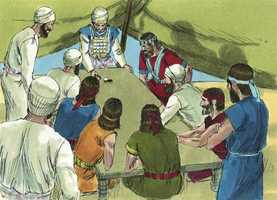
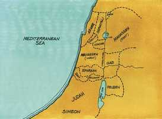

# Josué Cap 19

**1** 	E SAIU a segunda sorte a Simeão, para a tribo dos filhos de Simeão, segundo as suas famílias; e foi a sua herança no meio da herança dos filhos de Judá.

> **Cmt MHenry**: *Versículos 1-9* Os homens de Judá não se opuseram a devolver cidades de dentro de seus limites quando se convenceram de que tinham mais do que lhes correspondia. Se um crente verdadeiro tem obtido uma vantagem inesperada e incorreta em qualquer coisa, ele a entregará sem murmurar. O amor não busca o seu próprio, e não se conduz em forma inconveniente; induzirá, em aqueles nos que mora em abundância, a dar o próprio para suprir o que falta a seus irmãos.

 

**2** 	E tiveram na sua herança: Berseba, e Seba e Moladá.

 

**3** 	E Hazar-Sual, e Balá, e Azem,

**4** 	E Eltolade, e Betul, e Hormá,

**5** 	E Ziclague, e Bete-Marcabote, e Hazar-Susa,

**6** 	E Bete-Lebaote, e Saruém; treze cidades e as suas aldeias.

**7** 	E Aim, e Rimom, e Eter, e Asã; quatro cidades e as suas aldeias.

**8** 	E todas as aldeias que havia em redor destas cidades, até Baalate-Ber (que é Ramá), do sul; esta é a herança da tribo dos filhos de Simeão, segundo as suas famílias.

**9** 	A herança dos filhos de Simeão foi tirada do quinhão dos de Judá, porquanto a herança dos filhos de Judá era demasiadamente grande para eles; pelo que os filhos de Simeão tiveram a sua herança no meio deles.

**10** 	E saiu a terceira sorte pelos filhos de Zebulom, segundo as suas famílias; e foi o termo da sua herança até Saride.

> **Cmt MHenry**: *Versículos 10-16* As bênçãos proféticas de Jacó se cumpriram no reparto a cada tribo de Israel. Eles escolheram por si mesmos o que lhes foi repartido lançando sortes, na forma e lugares que ele previra. Regra tão segura é a palavra profética para guiar-se: por ela vemos o que cremos e demonstra sem discussão que as coisas são de Deus.

**11** 	E sobe o seu termo pelo ocidente a Maralá, e vai até Dabesete, e chega também até ao ribeiro que está defronte de Jocneão.

**12** 	E de Saride volta para o oriente, para o nascente do sol, até ao termo de Quislote-Tabor, sai a Daberate, e vai subindo a Jafia.

**13** 	E dali passa pelo oriente, para o nascente, a Gate-Hefer, em Ete-Cazim, chegando a Rimom-Metoar, que vai até Neá;

**14** 	E rodeando-a, passa o termo para o norte a Hanatom, chegando ao vale de Iftá-El,

**15** 	E Catate, Naalal, e Sinrom, e Idala, e Belém; doze cidades e as suas aldeias.

**16** 	Esta é a herança dos filhos de Zebulom, segundo as suas famílias; estas cidades e as suas aldeias.

**17** 	A quarta sorte saiu para Issacar; aos filhos de Issacar, segundo as suas famílias.

> **Cmt MHenry**: *Versículos 17-51* Josué esperou até que todas as tribos ficaram estabelecidas antes de pedir algo para sim. Se contentou com estar sem estabelecer-se até vê-los a todos colocados. Aqui há um exemplo para todos es que estão em cargos públicos: preferir o bem comum antes da vantagem particular. Os que se esforçam ao máximo para fazer o bem aos outros, procuram herança na Canaã do alto; porém logo deverão entrar lá, quando tenham feito todo o serviço de que sejam capazes a seus irmãos. Tampouco nada pode assegurá-lhes mais efetivamente seu direito a ela, que esforçar-se por levar os outros a desejá-la, a buscá-la e a obtê-la. Nosso Senhor Jesus veio e morou na terra, não com pompas, senão em pobreza, dando descanso ao homem e ainda sem ter Ele onde reclinar sua cabeça; porque Cristo não se agradou de si mesmo. nem tampouco entraria Ele a possuir sua herança, até que, por sua obediência até a morte, obtivesse a herança eterna para todo seu povo; nem considerará completa sua própria glória, até que cada pecador resgatado seja colocado em possessão de seu repouso celestial.

**18** 	E foi o seu termo Jizreel, e Quesulote e Suném,

**19** 	E Hafaraim, e Siom, e Anaarate,

> **Cmt MHenry**: *CAPÍTULO 19A-Sl

**20** 	E Rabite e Quisiom, e Ebes,

**21** 	E Remete, e En-Ganim, e En-Hadá, e Bete-Pazez.

**22** 	E chega este termo até Tabor, e Saazima, e Bete-Semes; e vai terminar no Jordão; dezesseis cidades e as suas aldeias.

**23** 	Esta é a herança da tribo dos filhos de Issacar, segundo as suas famílias; estas cidades e as suas aldeias.

**24** 	E saiu a quinta sorte para a tribo dos filhos de Aser, segundo as suas famílias.

**25** 	E foi o seu termo Helcate, e Hali, e Béten, e Acsafe,

**26** 	E Alameleque, e Amade, e Misal; e chega ao Carmelo para o ocidente, e a Sior-Libnate;

**27** 	E volta para o nascente do sol a Bete-Dagom, e chega a Zebulom e ao vale de Iftá-El, ao norte de Bete-Emeque e de Neiel, e vem sair a Cabul, pela esquerda,

**28** 	E Hebrom, e Reobe, e Hamom, e Caná, até à grande Sidom.

**29** 	E volta este termo a Ramá, e até à forte cidade de Tiro; então torna este termo a Hosa, para terminar no mar, na região de Aczibe.

**30** 	E Umá, e Afeque, e Reobe; vinte e duas cidades e as suas aldeias.

**31** 	Esta é a herança da tribo dos filhos de Aser, segundo as suas famílias; estas cidades e as suas aldeias.

**32** 	E saiu a sexta sorte para os filhos de Naftali, segundo as suas famílias.

**33** 	E foi o seu termo desde Helefe e desde Alom em Zaananim, e Adami-Neguebe, e Jabneel, até Lacum, terminando no Jordão.

**34** 	E volta este termo pelo ocidente a Aznote-Tabor, e dali passa a Hucoque; e chega a Zebulom ao sul, e chega a Aser ao ocidente, e a Judá pelo Jordão, ao nascente do sol.

**35** 	E são as cidades fortificadas: Zidim, Zer, e Hamate, Racate e Quinerete,

**36** 	E Adama, e Ramá, e Hazor,

**37** 	E Quedes, e Edrei, e En-Hazor,

**38** 	E Irom, e Migdal-El, Horém e Bete-Anate, e Bete-Semes; dezenove cidades e as suas aldeias.

**39** 	Esta é a herança da tribo dos filhos de Naftali, segundo as suas famílias; estas cidades e as suas aldeias.

**40** 	A sétima sorte saiu para a tribo dos filhos de Dã, segundo as suas famílias.

**41** 	E foi o termo da sua herança, Sora, e Estaol, e Ir-Semes,

**42** 	E Saalabim, e Aijalom, e Itla,

**43** 	E Elom, e Timna, e Ecrom,

**44** 	E Elteque, e Gibetom, e Baalate,

**45** 	E Jeúde, e Bene-Beraque, e Gate-Rimom,

**46** 	E Me-Jarcom, e Racom, com o termo defronte de Jafo;

**47** 	Saiu, porém, pequeno termo aos filhos de Dã, pelo que subiram os filhos de Dã, e pelejaram contra Lesém, e a tomaram, e a feriram ao fio da espada, e a possuíram e habitaram nela; e a Lesém chamaram Dã, conforme ao nome de Dã seu pai.

**48** 	Esta é a herança da tribo dos filhos de Dã, segundo as suas famílias; estas cidades e as suas aldeias.

**49** 	Acabando, pois, de repartir a terra em herança segundo os seus termos, deram os filhos de Israel a Josué, filho de Num, herança no meio deles.

**50** 	Segundo o mandado do Senhor lhe deram a cidade que pediu, a Timnate-Sera, na montanha de Efraim; e reedificou aquela cidade, e habitou nela.

**51** 	Estas são as heranças que Eleazar, o sacerdote, e Josué, filho de Num, e os cabeças dos pais das famílias repartiram às tribos dos filhos de Israel, em herança, por sorte, em Siló, perante o Senhor, à porta da tenda da congregação. E assim acabaram de repartir a terra.

> **Cmt MHenry** Intro: *• Versículos 1-9*> *A sorte de Simeão*> *• Versículos 10-16*> *A sorte de Zebulom*> *• Versículos 17-51*> *A sorte de Issacar, Aser, Naftali e Dã*