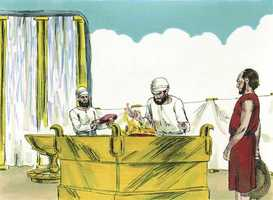
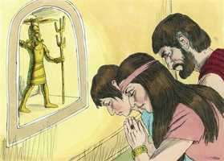

# Juízes Cap 02

**1** 	E SUBIU o anjo do Senhor de Gilgal a Boquim, e disse: Do Egito vos fiz subir, e vos trouxe à terra que a vossos pais tinha jurado e disse: Nunca invalidarei a minha aliança convosco.

> **Cmt MHenry**: *Versículos 1-5* Era o grande Anjo da aliança, o Verbo, o Filho de Deus, quem falou com autoridade divina como Jeová e que agora os chama a render contas de sua desobediência. Deus expõe o que tem feito por Israel e o que havia prometido. Os que rejeitam a comunhão com Deus e têm comunhão com as obras infrutíferas das trevas não sabem o que fazem, e nada terão a dizer em seu favor no próximo dia da rendição de contas. Devem esperar sofrimentos em troca de sua estultícia. Enganam a si mesmos os que esperam obter vantagem de sua amizade com os inimigos de Deus. Amiúde Deus faz que o pecado dos homens seja seu castigo; há espinhos e armadilhas no caminho do obstinado que anda em contra de Deus. O povo chorou, queixando-se de sua própria insensatez e ingratidão. Tremeram ante a palavra e não sem causa. É um prodígio que os pecadores possam até ler a Bíblia com os olhos secos. Se não se tivessem mantido perto de Deus e de seu dever, nenhuma voz senão a dos cânticos se teria ouvidos mas, por seu pecado e estultícia, fizeram outra obra para si mesmos e nada se ouvirá senão a voz do pranto. A adoração de Deus, em sua própria natureza, é gozo, louvor e ação de graças; nossos pecados somente fazem necessário o choro. Agrada ver que os homens chorem por seus pecados, porém as nossas lágrimas e orações, e nem sequer as emendas podem expiar o pecado.

**2** 	E, quanto a vós, não fareis acordo com os moradores desta terra, antes derrubareis os seus altares; mas vós não obedecestes à minha voz. Por que fizestes isso?

> **Cmt MHenry**: *CAPÍTULO 20A-Pv 21A-Ec 22A-Ct 23A-Is 24A-Jr 25A-Lm 26A-Ez 27A-Dn 28A-Os 29A-Jl

**3** 	Assim também eu disse: Não os expulsarei de diante de vós; antes estarão como espinhos nas vossas ilhargas, e os seus deuses vos serão por laço.

**4** 	E sucedeu que, falando o anjo do Senhor estas palavras a todos os filhos de Israel, o povo levantou a sua voz e chorou.

**5** 	Por isso chamaram àquele lugar, Boquim; e sacrificaram ali ao Senhor.

 

**6** 	E havendo Josué despedido o povo foram-se os filhos de Israel, cada um à sua herança, para possuírem a terra.

> **Cmt MHenry**: *Versículos 6-23* Temos uma idéia geral do curso das coisas em Israel durante a época dos Juízes. A nação se tornou tão miserável e desgraçada por abandonar a Deus, como teriam sido grandes e felizes se tivessem continuado sendo fiéis a Ele. o castigo correspondeu ao mal que tinham feito. Serviram aos deuses das nações que os rodeavam, até o menor, e Deus fez com que servissem os príncipes das nações de suas redondezas, até a menor delas. Os que têm descoberto que Deus é fiel a suas promessas, podem estar seguros que será igualmente fiel com suas ameaças. Com justiça, poderia tê-los abandonado, mas por compaixão não o fez. O Senhor estava com os juízes que levantava, e desse modo chegaram a ser salvadores. Nos dias das maiores tribulações da igreja, haverá alguns aos que Deus achará ou fará aptos para ajudá-la. Os israelitas não foram cabalmente reformados; porque estavam tão enlouquecidos por seus ídolos e tão obstinadamente inclinados a descaminhar-se. Assim também, os que abandonaram os bons caminhos de Deus, que uma vez conheceram e professaram, geralmente ficam mais atrevidos e desesperados no pecado, e seus corações se endurecem. Seu castigo foi que os cananeus foram perdoados e, desse jeito, eles foram golpeados com sua própria vara. Os homens abrigam e toleram seus corruptos apetites e paixões; em conseqüência, Deus os deixa justamente livrados a sua sorte, sob o poder de seus pecados, o que será sua ruína. Deus nos disse quão enganoso e desesperadamente perverso é nosso coração, mas não estamos dispostos a acreditar nisso até que, fazendo-nos ousados pela tentação, descobrimos por triste experiência que é verdade. devemos examinar-nos a nós mesmos e orar sem cessar para que habite Cristo pela fé em nossos corações, arraigados e cimentados em amor. Declaremos a guerra a todo pecado e prossigamos na santidade todos os nossos dias.

**7** 	E serviu o povo ao Senhor todos os dias de Josué, e todos os dias dos anciãos que ainda sobreviveram depois de Josué, e viram toda aquela grande obra do Senhor, que fizera a Israel.

**8** 	Faleceu, porém, Josué, filho de Num, servo do Senhor, com a idade de cento e dez anos;

**9** 	E sepultaram-no no termo da sua herança, em Timnate-Heres, no monte de Efraim, para o norte do monte de Gaás.

**10** 	E foi também congregada toda aquela geração a seus pais, e outra geração após ela se levantou, que não conhecia ao Senhor, nem tampouco a obra que ele fizera a Israel.

**11** 	Então fizeram os filhos de Israel o que era mau aos olhos do Senhor; e serviram aos baalins.

**12** 	E deixaram ao Senhor Deus de seus pais, que os tirara da terra do Egito, e foram-se após outros deuses, dentre os deuses dos povos, que havia ao redor deles, e adoraram a eles; e provocaram o Senhor à ira.

 

**13** 	Porquanto deixaram ao Senhor, e serviram a Baal e a Astarote.

**14** 	Por isso a ira do Senhor se acendeu contra Israel, e os entregou na mão dos espoliadores que os despojaram; e os entregou na mão dos seus inimigos ao redor; e não puderam mais resistir diante dos seus inimigos.

**15** 	Por onde quer que saíam, a mão do Senhor era contra eles para mal, como o Senhor tinha falado, e como o Senhor lhes tinha jurado; e estavam em grande aflição.

**16** 	E levantou o Senhor juízes, que os livraram da mão dos que os despojaram.

**17** 	Porém tampouco ouviram aos juízes, antes prostituíram-se após outros deuses, e adoraram a eles; depressa se desviaram do caminho, por onde andaram seus pais, obedecendo os mandamentos do Senhor; mas eles assim não fizeram.

**18** 	E, quando o Senhor lhes levantava juízes, o Senhor era com o juiz, e os livrava da mão dos seus inimigos, todos os dias daquele juiz; porquanto o Senhor se compadecia deles pelo seu gemido, por causa dos que os oprimiam e afligiam.

**19** 	Porém sucedia que, falecendo o juiz, reincidiam e se corrompiam mais do que seus pais, andando após outros deuses, servindo-os, e adorando-os; nada deixavam das suas obras, nem do seu obstinado caminho.

**20** 	Por isso a ira do Senhor se acendeu contra Israel, e disse: Porquanto este povo transgrediu a minha aliança, que tinha ordenado a seus pais, e não deram ouvidos à minha voz,

**21** 	Tampouco desapossarei mais de diante deles a nenhuma das nações, que Josué deixou, quando morreu;

**22** 	Para por elas provar a Israel, se há de guardar, ou não, o caminho do Senhor, como seus pais o guardaram, para nele andar.

**23** 	Assim o Senhor deixou ficar aquelas nações, e não as desterrou logo, nem as entregou na mão de Josué.

> **Cmt MHenry** Intro: *• Versículos 1-5*> *O anjo do Senhor repreende ao povo*> *• Versículos 6-23*> *A maldade da nova geração posterior a Josué*