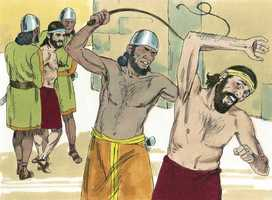
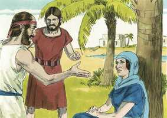
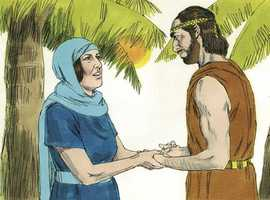
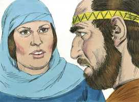
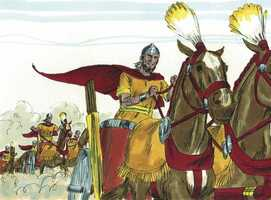
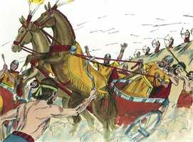
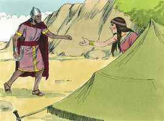

# Juízes Cap 04

**1** 	PORÉM os filhos de Israel tornaram a fazer o que era mau aos olhos do Senhor, depois de falecer Eúde.

> **Cmt MHenry**: *Versículos 1-3* A terra teve seus oitenta anos de descanso, o que devia confirmá-los em sua religião; porém, os fez sentir-se seguros e se renderam a suas concupiscências. Assim, a prosperidade dos néscios os destrói. Jabim e seu general Sísera oprimiram fortemente a Israel. Este inimigo estava mais perto que os anteriores. Israel clamou ao Senhor quando a aflição os levou a Ele, e não viam outra forma de alívio. Os que esquecem a Deus na prosperidade, terão de buscá-lo na aflição.

**2** 	E vendeu-os o Senhor na mão de Jabim, rei de Canaã, que reinava em Hazor; e Sísera era o capitão do seu exército, o qual então habitava em Harosete dos gentios.

**3** 	Então os filhos de Israel clamaram ao Senhor, porquanto ele tinha novecentos carros de ferro, e por vinte anos oprimia violentamente os filhos de Israel.

 

**4** 	E Débora, mulher profetisa, mulher de Lapidote, julgava a Israel naquele tempo.

> **Cmt MHenry**: *Versículos 4-9* Débora era profetisa, instruída no conhecimento divino pela instrução do Espírito de Deus. julgava em Israel como boca de Deus para eles; corrigia os abusos e resolvia as queixas. Por ordem de Deus, ela mandou a Baraque a organizar um exército e que atacasse as forças de Jabim. Baraque insistiu muito em que ela estivesse presente. Débora prometeu ir com ele. não o enviaria aonde ela mesma não iria. Os que em nome de Deus chamam a seu dever aos outros, devem estar dispostos a assisti-los. Baraque aprecia mais a satisfação de sua mente, e o bom êxito de sua empresa, que a simples honra.

> **Cmt MHenry**: *CAPÍTULO 40N-Mt 41N-Mc 42N-Lc 43N-Joa 44N-At 45N-Rm 46N-1Co 47N-2Co 48N-Gl 49N-Ef

**5** 	Ela assentava-se debaixo das palmeiras de Débora, entre Ramá e Betel, nas montanhas de Efraim; e os filhos de Israel subiam a ela a juízo.

 

**6** 	E mandou chamar a Baraque, filho de Abinoão de Quedes de Naftali, e disse-lhe: Porventura o Senhor Deus de Israel não deu ordem, dizendo: Vai, e atrai gente ao monte Tabor, e toma contigo dez mil homens dos filhos de Naftali e dos filhos de Zebulom?

 

**7** 	E atrairei a ti para o ribeiro de Quisom, a Sísera, capitão do exército de Jabim, com os seus carros, e com a sua multidão; e o darei na tua mão.

**8** 	Então lhe disse Baraque: Se fores comigo, irei; porém, se não fores comigo, não irei.

 

**9** 	E disse ela: Certamente irei contigo, porém não será tua a honra da jornada que empreenderes; pois à mão de uma mulher o Senhor venderá a Sísera. E Débora se levantou, e partiu com Baraque para Quedes.

**10** 	Então Baraque convocou a Zebulom e a Naftali em Quedes, e subiu com dez mil homens após ele; e Débora subiu com ele.

> **Cmt MHenry**: *Versículos 10-16* A confiança de Sísera estava em seus carros. Todavia, se temos base para esperar que Deus vá a nossa frente, podemos ir com valor e júbilo. Não desmaiem pelas dificuldades que encontrem ao resistir a Satanás, servir a Deus ou ao sofrer por Ele, porque, não foi o Senhor diante de vocês? Sigam-no em tudo. Baraque desceu, ainda que na planície os carros de ferro teriam vantagem sobre ele; deixou a montanha, dependendo do poder divino; porque somente no Senhor está a salvação de seu povo ([Jr 3.23](../24A-Jr/03.md#23)). Ele não foi defraudado em sua confiança. Quando Deus vai a nossa frente nos conflitos espirituais, devemos entrar em ação e, quando por Sua graça nos dá algum triunfo sobre os inimigos de nossas almas, devemos melhorá-lo estando alertas e resolvidos.

**11** 	E Héber, queneu, se tinha apartado dos queneus, dos filhos de Hobabe, sogro de Moisés; e tinha estendido as suas tendas até ao carvalho de Zaanaim, que está junto a Quedes,

**12** 	E anunciaram a Sísera que Baraque, filho de Abinoão, tinha subido ao monte Tabor.

**13** 	E Sísera convocou todos os seus carros, novecentos carros de ferro, e todo o povo que estava com ele, desde Harosete dos gentios até ao ribeiro de Quisom.

 

**14** 	Então disse Débora a Baraque: Levanta-te, porque este é o dia em que o Senhor tem dado a Sísera na tua mão; porventura o Senhor não saiu adiante de ti? Baraque, pois, desceu do monte Tabor, e dez mil homens após ele.

**15** 	E o Senhor derrotou a Sísera, e a todos os seus carros, e a todo o seu exército ao fio da espada, diante de Baraque; e Sísera desceu do carro, e fugiu a pé.

 

**16** 	E Baraque perseguiu os carros, e o exército, até Harosete dos gentios; e todo o exército de Sísera caiu ao fio da espada, até não ficar um só.

**17** 	Porém Sísera fugiu a pé à tenda de Jael, mulher de Héber, queneu; porquanto havia paz entre Jabim, rei de Hazor, e a casa de Héber, queneu.

> **Cmt MHenry**: *Versículos 17-24* Os carros de Sísera eram seu orgulho e sua confiança. Deste modo, se frustram os que descansam na criatura; assim como o caniço rachado não só se quebra, senão são atravessados por muitas dores. O ídolo se torna rapidamente uma carga ([Is 46.1](../23A-Is/46.md#1)); Deus pode fazer que aquilo pelo qual enlouquecíamos, nos enlouqueça de verdade. Provavelmente Jael tenha realmente tentado ser amável com Sísera; mas por um impulso divino, depois foi levado a considerá-lo como o inimigo juramentado do Senhor e de seu povo, e decidiu destruí-lo. devemos romper todas nossas relações com os inimigos de Deus se temos o Senhor como nosso Deus e seu povo como nosso povo. o que tinha pensado destruir Israel com seus muitos carros de ferro, é destruído com um prego de ferro. Assim, o fraco do mundo confunde ao poderoso. Os israelitas teriam evitado muita maldade se tivessem destruído mais pronto os cananeus, como Deus lhes ordenara e os capacitara; contudo, vale mais ser sábios tarde do que nunca, e adquirir sabedoria pela experiência.

 

**18** 	E Jael saiu ao encontro de Sísera, e disse-lhe: Entra, senhor meu, entra aqui, não temas. Ele entrou na sua tenda, e ela o cobriu com uma coberta.

**19** 	Então ele lhe disse: Dá-me, peço-te, de beber um pouco de água, porque tenho sede. Então ela abriu um odre de leite, e deu-lhe de beber, e o cobriu.

**20** 	E ele lhe disse: Põe-te à porta da tenda; e há de ser que se alguém vier e te perguntar: Há aqui alguém? Responderás então: Não.

**21** 	Então Jael, mulher de Héber, tomou uma estaca da tenda, e lançou mão de um martelo, e chegou-se mansamente a ele, e lhe cravou a estaca na fonte, de sorte que penetrou na terra, estando ele, porém, num profundo sono, e já muito cansado; e assim morreu.

 

**22** 	E eis que, seguindo Baraque a Sísera, Jael lhe saiu ao encontro, e disse-lhe: Vem, e mostrar-te-ei o homem que buscas. E foi a ela, e eis que Sísera jazia morto, com a estaca na fonte.

 

**23** 	Assim Deus naquele dia sujeitou a Jabim, rei de Canaã, diante dos filhos de Israel.

**24** 	E continuou a mão dos filhos de Israel a pesar e a endurecer-se sobre Jabim, rei de Canaã; até que exterminaram a Jabim, rei de Canaã.

> **Cmt MHenry** Intro: *• Versículos 1-3*> *Israel volta a rebelar-se e é oprimido por Jabim*> *• Versículos 4-9*> *Débora fica de acordo com Baraque para libertá-los*> *• Versículos 10-16*> *Derrota de Sísera*> *• Versículos 17-24*> *Jael mata a Sísera*