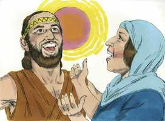

# Juízes Cap 05

**1** 	E CANTOU Débora e Baraque, filho de Abinoão, naquele mesmo dia, dizendo:

> **Cmt MHenry**: *Versículos 1-5* Não deve haver perda de tempo para agradecer ao Senhor suas misericórdias; porque nossos louvores são mais aceitáveis, agradáveis e proveitosos quando fluem de um coração satisfeito. Por isso, deve estimular-se mais o amor e o agradecimento, e fixá-los mais profundamente no coração do crente; os acontecimentos serão mais conhecidos e lembrados por mais tempo. O Senhor é quem deve ter todo o louvor, não importa quanto tenham feito Débora, Baraque ou o exército. A vontade, o poder e o êxito foram todos de Deus.

 

**2** 	Louvai ao Senhor pela vingança de Israel, quando o povo se ofereceu voluntariamente.

**3** 	Ouvi, reis; dai ouvidos, príncipes; eu, eu cantarei ao Senhor; salmodiarei ao Senhor Deus de Israel.

**4** 	Ó Senhor, saindo tu de Seir, caminhando tu desde o campo de Edom, a terra estremeceu; até os céus gotejaram; até as nuvens gotejaram águas.

**5** 	Os montes se derreteram diante do Senhor, e até Sinai diante do Senhor Deus de Israel.

> **Cmt MHenry**: *CAPÍTULO 50N-Fp 51N-Cl 52N-1Ts 53N-2Ts 54N-1Tm 55N-2Tm 56N-Tt 57N-Fm 58N-Hb 59N-Tg

**6** 	Nos dias de Sangar, filho de Anate, nos dias de Jael cessaram os caminhos; e os que andavam por veredas iam por caminhos torcidos.

> **Cmt MHenry**: *Versículos 6-11* Débora descreve o estado aflito de Israel sob a tirania de Jabim, para destacar que sua salvação era pura graça. Mostra a causa de sua miséria. Foi sua idolatria. Escolheram novos deuses com novos nomes. Todavia, por trás de todas essas imagens era a Satanás a quem adoravam. Débora foi uma mãe para Israel ao fomentar diligentemente a salvação de suas almas. Chama aos que partilharam as vantagens desta grande salvação para que ofereçam sua gratidão a Deus. Àqueles que foram restaurados, não só a sua liberdade como ao resto dos israelitas, senão também a sua dignidade, que louvem a Deus. Esta é a obra do Senhor. Nos seus atos fez justiça sobre seus inimigos. Em épocas de perseguição se recorre às ordenanças de Deus, às fontes de salvação, de onde se extrai a água de vida, com perigo para a vida dos que lhe prestam atenção. Em todo momento Satanás tentará impedir que o crente se aproxime ao trono da graça. Atentem na bondade de Deus para seu povo que treme. A glória de Deus é proteger os que estão mais expostos e ajudar o mais fraco. Notemos o benefício que temos pela paz pública, especialmente os habitantes das aldeias, e demos louvor a Deus.

**7** 	Cessaram as aldeias em Israel, cessaram; até que eu, Débora, me levantei, por mãe em Israel me levantei.

**8** 	E se escolhia deuses novos, logo a guerra estava às portas; via-se por isso escudo ou lança entre quarenta mil em Israel?

**9** 	Meu coração é para os legisladores de Israel, que voluntariamente se ofereceram entre o povo; bendizei ao Senhor.

**10** 	Vós os que cavalgais sobre jumentas brancas, que vos assentais em juízo, que andais pelo caminho, falai disto.

**11** 	Donde se ouve o estrondo dos flecheiros, entre os lugares onde se tiram águas, ali falai das justiças do Senhor, das justiças que fez às suas aldeias em Israel; então o povo do Senhor descia às portas.

**12** 	Desperta, desperta, Débora, desperta, desperta, entoa um cântico; levanta-te, Baraque, e leva presos os teus cativos, tu, filho de Abinoão.

> **Cmt MHenry**: *Versículos 12-23* Débora invoca a sua própria alma para que seja a mais fervorosa. O que acende o fogo nos corações de outros homens com o amor de Cristo, deve arder primeiro com o mesmo amor. Louvar a Deus é uma tarefa para a qual devemos despertar, e despertar-nos para ela. Se percebe quem pelejou contra Israel, quem pelejou por eles e quem se manteve longe. 28A-Os que pelejaram contra eles* eram inimigos obstinados do Povo de Deus, portanto, os mais perigosos. 28A-Os que pelejaram por eles*: as diversas tribos que os ajudaram são mencionadas aqui com honra; porque ainda que Deus deva ser glorificado por acima de tudo, os que são utilizados devem receber seu devido elogio para estímulo dos outros. Todavia, toda a criação está em guerra contra os que têm a Deus por inimigo. O rio Quisom pelejou contra seus inimigos. A maior parte das vezes era pouco profundo, mas agora, provavelmente pela grande chuva que cairá, estava tão crescido e a correnteza era tão profunda e forte, que os que trataram de cruzá-lo se afogaram. A alma da própria Débora pelejou contra eles. Quando se emprega a alma em piedosos exercícios e se realiza obra de coração, pela graça de Deus, a força de nossos inimigos espirituais será pisoteada e cairão diante de nós. Observe os que se *mantiveram à distância* e não ficaram do lado de Israel, como poderia ter-se esperado. Assim, muitos não cumprem seu dever por medo aos problemas, o amor à comodidade e o indevido afeto por seus negócios e vantagens mundanas. Os espíritos estreitos e egoístas não se cuidam pelo que aconteça a igreja de Deus, com tal de conseguir, guardar e poupar dinheiro. Todos buscam o seu próprio ([Fp 2.21](../50N-Fp/02.md#21)). algo pequeno lhes servirá de pretexto para ficar em casa aos que não têm a intenção de comprometer-se em serviços necessários, porque apresentam dificuldades e perigos. Pois não podemos manter-nos fora da luta entre o Senhor e seus inimigos; e se não nos metemos *ativamente* a fomentar Sua causa neste mundo mau, cairemos sob a maldição contra os operários da maldade. Ainda que não necessite de ajuda humana, contudo, Deus se agrada em aceitar os serviços dos que melhoram seus talentos para o progresso de Sua causa. Ele requer que cada homem faça isto.

**13** 	Então fez dominar sobre os nobres entre o povo, aos que restaram; fez-me o Senhor dominar sobre os poderosos.

**14** 	De Efraim saiu a sua raiz contra Amaleque; e depois de ti vinha Benjamim dentre os teus povos; de Maquir desceram os legisladores, e de Zebulom os que levaram a cana do escriba.

**15** 	Também os principais de Issacar foram com Débora; e como Issacar, assim também Baraque, foi enviado a pé para o vale; nas divisões de Rúben foram grandes as resoluções do coração.

**16** 	Por que ficaste tu entre os currais para ouvires os balidos dos rebanhos? Nas divisões de Rúben tiveram grandes esquadrinhações do coração.

**17** 	Gileade ficou além do Jordão, e Dã por que se deteve nos navios? Aser se assentou na beira dos mares, e ficou junto às suas baías.

**18** 	Zebulom é um povo que expôs a sua vida à morte, como também Naftali, nas alturas do campo.

**19** 	Vieram reis, pelejaram; então pelejaram os reis de Canaã em Taanaque, junto às águas de Megido; não tomaram despojo de prata.

**20** 	Desde os céus pelejaram; até as estrelas desde os lugares dos seus cursos pelejaram contra Sísera.

**21** 	O ribeiro de Quisom os arrastou, aquele antigo ribeiro, o ribeiro de Quisom. Pisaste, ó minha alma, à força.

**22** 	Então os cascos dos cavalos se despedaçaram; pelo galopar, o galopar dos seus valentes.

**23** 	Amaldiçoai a Meroz, diz o anjo do Senhor, acremente amaldiçoai aos seus moradores; porquanto não vieram ao socorro do Senhor, ao socorro do Senhor com os valorosos.

**24** 	Bendita seja entre as mulheres, Jael, mulher de Héber, o queneu; bendita seja entre as mulheres nas tendas.

> **Cmt MHenry**: *Versículos 24-31* Jael teve uma bênção especial. Os que lançam sua sorte na tenda, numa esfera baixa e estreita, se servem a Deus segundo os poderes que lhes deu, não perderão sua recompensa. A mãe de Sísera esperava seu regresso, não temendo nem minimamente por seu êxito. Cuidemo-nos de abrigar desejos ardentes por algum bem temporal, particularmente em quanto a acariciar a vanglória, pois isso era o que aqui ela desejava. Que quadro apresenta ela, de um coração ímpio e sensual! Quão vergonhosos e infantis são os desejos de uma mãe anciã e de seus assistentes para seu filho! Deste modo, Deus freqüentemente arruína seus inimigos quando mais enchidos estão de orgulho. Débora conclui com uma oração a Deus pela destruição de todos os inimigos e pelo consolo de todos seus amigos. Tal será a honra e o gozo de todos os que amam a Deus com sinceridade; para sempre brilharão como o sol no firmamento.

**25** 	Água pediu ele, leite lhe deu ela; em prato de nobres lhe ofereceu manteiga.

**26** 	À estaca estendeu a sua mão esquerda, e ao martelo dos trabalhadores a sua direita; e matou a Sísera, e rachou-lhe a cabeça, quando lhe pregou e atravessou as fontes.

**27** 	Entre os seus pés se encurvou, caiu, ficou estirado; entre os seus pés se encurvou, caiu; onde se encurvou, ali ficou abatido.

**28** 	A mãe de Sísera olhava pela janela, e exclamava pela grade: Por que tarda em vir o seu carro? Por que se demoram os ruídos dos seus carros?

**29** 	As mais sábias das suas damas responderam; e até ela respondia a si mesma:

**30** 	Porventura não achariam e repartiriam despojos? Uma ou duas moças a cada homem? Para Sísera despojos de estofos coloridos, despojos de estofos coloridos bordados; de estofos coloridos bordados de ambos os lados como despojo para os pescoços.

**31** 	Assim, ó Senhor, pereçam todos os teus inimigos! Porém os que te amam sejam como o sol quando sai na sua força. (5:32)E sossegou a terra quarenta anos.

> **Cmt MHenry** Intro: *• Versículos 1-5*> *Louvor e glória atribuídos a Deus*> *• Versículos 6-11*> *Aflição e libertação de Israel*> *• Versículos 12-23*> *Alguns elogiados, outros censurados*> *• Versículos 24-31*> *A mãe de Sísera se desengana*