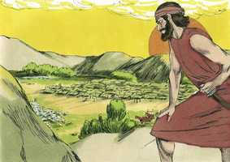
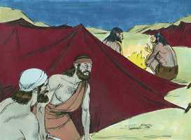

# Juízes Cap 07

**1** 	ENTÃO Jerubaal (que é Gideão) se levantou de madrugada, e todo o povo que com ele havia, e se acamparam junto à fonte de Harode, de maneira que tinha o arraial dos midianitas para o norte, no vale, perto do outeiro de Moré.

> **Cmt MHenry**: *Versículos 1-8* Deus faz provisão para que o louvor da vitória seja totalmente seu, indicando somente trezentos homens para a luta. A atividade e a prudência vão junto com a dependência de Deus para que nos socorra em nossas justas empresas. Quando o Senhor vê que os homens vão se desentender dEle e, por incredulidade, vão evitar os serviços perigosos ou que, por orgulho, quereriam colocar-se em Sua contra, os deixa de lado e realiza sua obra com outros instrumentos. Muitos acharão pretextos para desertar da causa e fugir da cruz. Porém, embora uma sociedade religiosa possa, assim, reduzir-se em número, ganhará, contudo, em pureza, e pode esperar uma bênção acrescentada de parte do Senhor. Deus escolhe empregar os que não somente estão bem afetados, senão zelosamente afetados por uma coisa boa. Não murmuraram pela liberdade dos outros que foram dispensados. Ao cumprir os deveres requeridos por Deus, não devemos considerar o progresso ou retraso dos outros, nem o que fazem, senão o que Deus espera de nossas mãos. É raro encontrar uma pessoa que possa tolerar que os outros a superem em dons, bênçãos ou liberdade; de modo que podemos dizer que é pela graça especial de Deus que consideramos o que Deus nos diz e não atentamos para o que fazem os homens.

 

**2** 	E disse o Senhor a Gideão: Muito é o povo que está contigo, para eu dar aos midianitas em sua mão; a fim de que Israel não se glorie contra mim, dizendo: A minha mão me livrou.

**3** 	Agora, pois, apregoa aos ouvidos do povo, dizendo: Quem for medroso e tímido, volte, e retire-se apressadamente das montanhas de Gileade. Então voltaram do povo vinte e dois mil, e dez mil ficaram.

 

**4** 	E disse o Senhor a Gideão: Ainda há muito povo; faze-os descer às águas, e ali os provarei; e será que, daquele de que eu te disser: Este irá contigo, esse contigo irá; porém de todo aquele, de que eu te disser: Este não irá contigo, esse não irá.

**5** 	E fez descer o povo às águas. Então o Senhor disse a Gideão: Qualquer que lamber as águas com a sua língua, como as lambe o cão, esse porás à parte; como também a todo aquele que se abaixar de joelhos a beber.

 

**6** 	E foi o número dos que lamberam, levando a mão à boca, trezentos homens; e todo o restante do povo se abaixou de joelhos a beber as águas.

**7** 	E disse o Senhor a Gideão: Com estes trezentos homens que lamberam as águas vos livrarei, e darei os midianitas na tua mão; portanto, todos os demais se retirem, cada um ao seu lugar.

> **Cmt MHenry**: *CAPÍTULO 7*

**8** 	E o povo tomou na sua mão a provisão e as suas buzinas, e enviou a todos os outros homens de Israel cada um à sua tenda, porém os trezentos homens reteve; e estava o arraial dos midianitas embaixo, no vale.

**9** 	E sucedeu que, naquela mesma noite, o Senhor lhe disse: Levanta-te, e desce ao arraial, porque o tenho dado na tua mão.

> **Cmt MHenry**: *Versículos 9-15* O sonho parecia ter pouco significado em si mesmo, mas a interpretação demonstrou evidentemente que todo era do Senhor, e descobriu que o nome de Gideão tinha enchido de terror os midianitas. Gideão tomou isto como sinal seguro do êxito; sem demora adorou e louvou a Deus, e regressou com confiança a seus trezentos homens. onde quer que estejamos, podemos falar a Deus e adorá-lo. Deus deve ter o louvor pelo que estimula nossa fé. deve reconhecer-se sua providência nos sucessos, embora sejam pequenos e aparentemente acidentais.

**10** 	E, se ainda temes descer, desce tu e teu moço Purá, ao arraial;

**11** 	E ouvirás o que dizem, e então, fortalecidas as tuas mãos descerás ao arraial. Então desceu ele com o seu moço Purá até ao extremo das sentinelas que estavam no arraial.

**12** 	E os midianitas, os amalequitas, e todos os filhos do oriente jaziam no vale como gafanhotos em multidão; e eram inumeráveis os seus camelos, como a areia que há na praia do mar.

**13** 	Chegando, pois, Gideão, eis que estava contando um homem ao seu companheiro um sonho, e dizia: Eis que tive um sonho, eis que um pão de cevada torrado rodava pelo arraial dos midianitas, e chegava até à tenda, e a feriu, e caiu, e a transtornou de cima para baixo; e ficou caída.

 

**14** 	E respondeu o seu companheiro, e disse: Não é isto outra coisa, senão a espada de Gideão, filho de Joás, varão israelita. Deus tem dado na sua mão aos midianitas, e todo este arraial.

**15** 	E sucedeu que, ouvindo Gideão a narração deste sonho, e a sua explicação, adorou; e voltou ao arraial de Israel, e disse: Levantai-vos, porque o Senhor tem dado o arraial dos midianitas nas nossas mãos.

**16** 	Então dividiu os trezentos homens em três companhias; e deu-lhes a cada um, nas suas mãos, buzinas, e cântaros vazios, com tochas neles acesas.

> **Cmt MHenry**: *Versículos 16-22* O método para derrotar os midianitas pode ser tomado como exemplo da destruição do reino do diabo no mundo, pela predicação do evangelho eterno, o tocar a trombeta, e o mostrar a luz que sai dos vasos de barro, pois tais são os ministros do Evangelho ([2 Co 4.6-7](../47N-2Co/04.md#6)). Deus escolheu o néscio do mundo para confundir o sábio, um pão de cevada para derrotar as tendas de Midiã, para que a excelência do poder seja somente de Deus. o evangelho é uma espada, não na mão, senão na boca: a espada do Senhor e de Gideão, de Deus e de Jesus Cristo, dAquele que se assenta no trono e o Cordeiro. Os ímpios costumam ser levados a vingarem a causa de Deus sobre outrem, sob o poder de seus enganos e a fúria de suas paixões. Veja-se também como Deus, freqüentemente, faz que os inimigos da igreja sejam instrumento para que se destruam uns aos outros; é uma pena que os amigos da igreja devam às vezes agir como eles.

 

**17** 	E disse-lhes: Olhai para mim, e fazei como eu fizer; e eis que, chegando eu à extremidade do arraial, será que, como eu fizer, assim fareis vós.

**18** 	Tocando eu a buzina, eu e todos os que comigo estiverem, então também vós tocareis a buzina ao redor de todo o arraial, e direis: Espada do Senhor, e de Gideão.

**19** 	Chegou, pois, Gideão, e os cem homens que com ele iam, ao extremo do arraial, ao princípio da vigília da meia-noite, havendo sido de pouco trocadas as guardas; então tocaram as buzinas, e quebraram os cântaros, que tinham nas mãos.

 

**20** 	Assim tocaram as três companhias as buzinas, e quebraram os cântaros; e tinham nas suas mãos esquerdas as tochas acesas, e nas suas mãos direitas as buzinas, para tocarem, e clamaram: Espada do Senhor, e de Gideão.

**21** 	E conservou-se cada um no seu lugar ao redor do arraial; então todo o exército pôs-se a correr e, gritando, fugiu.

**22** 	Tocando, pois, os trezentos as buzinas, o Senhor tornou a espada de um contra o outro, e isto em todo o arraial, que fugiu para Zererá, até Bete-Sita, até aos limites de Abel-Meolá, acima de Tabate.

 

**23** 	Então os homens de Israel, de Naftali, de Aser e de todo o Manassés foram convocados, e perseguiram aos midianitas.

> **Cmt MHenry**: *Versículos 23-25* Dois comandantes principais das hostes de Midiã foram capturados e mortos pelos homens de Efraim. Resultaria desejável que todos nós fizéssemos como eles, e que onde se necessitar ajuda, que esta fosse pronta e voluntariamente dada por outro. E que, quando começamos algo excelente e proveitoso, estivéssemos dispostos a termos colaboradores para terminar e aperfeiçoar aquilo e não, como comumente acontece, estorvar-nos uns a outros.

 

**24** 	Também Gideão enviou mensageiros a todas as montanhas de Efraim, dizendo: Descei ao encontro dos midianitas, e tomai-lhes as águas até Bete-Bara, e também o Jordão. Convocados, pois, todos os homens de Efraim, tomaram-lhes as águas até Bete-Bara e o Jordão.

**25** 	E prenderam a dois príncipes dos midianitas, a Orebe e a Zeebe; e mataram a Orebe na penha de Orebe, e a Zeebe mataram no lagar de Zeebe, e perseguiram aos midianitas; e trouxeram as cabeças de Orebe e de Zeebe a Gideão, além do Jordão.

> **Cmt MHenry** Intro: *• Versículos 1-8*> *Redução do exército de Gideão*> *• Versículos 9-15*> *Gideão é alentado*> *• Versículos 16-22*> *Derrota dos midianitas*> *• Versículos 23-25*> 28A-Os de Efraim tomam a Orebe e Zeebe*