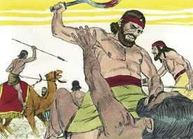

# Juízes Cap 08

**1** 	ENTÃO os homens de Efraim lhe disseram: Que é isto que nos fizeste, que não nos chamaste, quando foste pelejar contra os midianitas? E contenderam com ele fortemente.

> **Cmt MHenry**: *Versículos 1-3* Os que não tentam nem se aventuram em nada para a causa de Deus, são os mais prestes a censurar e disputar com os que são de espírito mais zeloso e empreendedor. Os mais preguiçosos para os serviços difíceis, são os que mais se iram por não receber reconhecimento. Gideão surge aqui como grande exemplo de abnegação e nos demonstra que a inveja se elimina melhor com a humildade. Os homens de Efraim expressaram suas paixões com uma liberdade muito errada para falar, sinal certo de uma causa fraca: a razão voa baixo quando a repreensão voa alto.

 

**2** 	Porém ele lhes disse: Que mais fiz eu agora do que vós? Não são porventura os rabiscos de Efraim melhores do que a vindima de Abiezer?

**3** 	Deus vos deu na vossa mão os príncipes dos midianitas, Orebe e Zeebe; que mais pude eu fazer do que vós? Então a sua ira se abrandou para com ele, quando falou esta palavra.

**4** 	E, como Gideão veio ao Jordão, passou com os trezentos homens que com ele estavam, já cansados, mas ainda perseguindo.

> **Cmt MHenry**: *Versículos 4-12* Os homens de Gideão estavam esgotados, mas prosseguiram; fatigados com o que tinham feito, porém ansiosos por fazer mais contra seus inimigos. Muitas vezes é assim o caso do cristão verdadeiro, desfalecente, mas continua avançando. O mundo muito pouco sabe da luta perseverante e bem-sucedida que livra o crente verdadeiro com seu coração pecador. Mas ele se remete a essa força divina em cuja fé começou seu conflito, e por cuja só convicção pode terminar com triunfo.

**5** 	E disse aos homens de Sucote: Dai, peço-vos, alguns pedaços de pão ao povo, que segue as minhas pisadas; porque estão cansados, e eu vou ao encalço de Zeba e Salmuna, reis dos midianitas.

**6** 	Porém os príncipes de Sucote disseram: Estão já, Zeba e Salmuna, em tua mão, para que demos pão ao teu exército?

**7** 	Então disse Gideão: Pois quando o Senhor der na minha mão a Zeba e a Salmuna, trilharei a vossa carne com os espinhos do deserto, e com os abrolhos.

**8** 	E dali subiu a Penuel, e falou-lhes da mesma maneira; e os homens de Penuel lhe responderam como os homens de Sucote lhe haviam respondido.

> **Cmt MHenry**: *CAPÍTULO 8*

**9** 	Por isso também falou aos homens de Penuel, dizendo: Quando eu voltar em paz, derribarei esta torre.

**10** 	Estavam, pois, Zeba e Salmuna em Carcor, e os seus exércitos com eles, uns quinze mil homens, todos os que restaram do exército dos filhos do oriente; e os que caíram foram cento e vinte mil homens, que puxavam da espada.

**11** 	E subiu Gideão pelo caminho dos que habitavam em tendas, para o oriente de Nobá e Jogbeá; e feriu aquele exército, porquanto o exército estava descuidado.

 

**12** 	E fugiram Zeba e Salmuna; porém ele os perseguiu, e tomou presos a ambos os reis dos midianitas, a Zeba e a Salmuna, e afugentou a todo o exército.

**13** 	Voltando, pois, Gideão, filho de Joás, da peleja, antes do nascer do sol,

> **Cmt MHenry**: *Versículos 13-17* Os servos ativos do Senhor enfrentam-se com uma oposição mais perigosa de parte dos falsos mestres que dos inimigos francos; contudo, não devem preocupar-se pela conduta dos que são israelitas de nome, porém midianitas de coração. Devem perseguir os inimigos de sua alma e da causa de Deus, embora estejam a ponto de desmaiar pelos conflitos internos e pelas dificuldades externas. E serão capacitados para perseverar. Quanto menos ajudem os homens e mais procurem estorvar, mais ajudará o Senhor. Sendo desprezada a advertência de Gideão, o castigo foi justo. Muitos aprendem com os abrolhos e espinhos da aflição o que não aprenderam de outro jeito.

**14** 	Tomou preso a um moço dos homens de Sucote, e lhe fez perguntas; o qual lhe deu por escrito os nomes dos príncipes de Sucote, e dos seus anciãos, setenta e sete homens.

**15** 	Então veio aos homens de Sucote, e disse: Vede aqui a Zeba e a Salmuna, a respeito dos quais desprezivelmente me escarnecestes, dizendo: Estão já, Zeba e Salmuna, na tua mão, para que demos pão aos teus homens, já cansados?

**16** 	E tomou os anciãos daquela cidade, e os espinhos do deserto, e os abrolhos; e com eles ensinou aos homens de Sucote.

 

**17** 	E derrubou a torre de Penuel, e matou os homens da cidade.

**18** 	Depois perguntou a Zeba e a Salmuna: Que homens eram os que matastes em Tabor? E disseram: Como és tu, assim eram eles; cada um parecia filho de rei.

> **Cmt MHenry**: *Versículos 18-21* Era necessário enfrentar os reis de Midiã. Quando se confessaram culpáveis do assassinato, Gideão agiu como o vingador do sangue, já que era o parente mais próximo das pessoas assassinadas. Não pensaram eles que tinham ouvido disto fazia muito tempo, já que o homicídio rara vez fica impune nesta vida. Deve-se render conta a Deus dos pecados que o homem tem esquecido há muito tempo. que pobre consolo existe em esperar sofrer menos dor na morte, e morrer com menos desgraça que outros! Mas muitos estão mais ansiosos por estes aspectos que pelo futuro juízo e o que se seguirá.

**19** 	Então disse ele: Meus irmãos eram, filhos de minha mãe; vive o Senhor, que, se os tivésseis deixado com vida, eu não vos mataria.

**20** 	E disse a Jeter, seu primogênito: Levanta-te, mata-os. Porém o moço não puxou da sua espada, porque temia; porquanto ainda era jovem.

**21** 	Então disseram Zeba e Salmuna: Levanta-te, e acomete-nos; porque, qual o homem, tal a sua valentia. Levantou-se, pois, Gideão, e matou a Zeba e a Salmuna, e tomou os ornamentos que estavam nos pescoços dos seus camelos.

**22** 	Então os homens de Israel disseram a Gideão: Domina sobre nós, tanto tu, como teu filho e o filho de teu filho; porquanto nos livraste da mão dos midianitas.

> **Cmt MHenry**: *Versículos 22-28* Gideão recusou o governo que o povo lhe ofereceu. Nenhum homem bom se agradaria com alguma honra conferida a ele, daquela que só pertence a Deus. Gideão pensou conservar a lembrança desta vitória com um éfode feito do melhor dos despojos. Provavelmente este éfode tinha colado, como era habitual, um terafim, e Gideão pretendeu que isso seria um oráculo para consulta. Muitos são levados por caminhos errados por um único mau passo de um homem bom. Se tornou em armadilha para o próprio Gideão, e resultou ser a ruína da família. Com quanta rapidez os ornamentos que alimentam a concupiscência dos olhos e formam a soberba da vida, tendem assim também às concupiscências da carne, envergonhando os que os apreciam!

 

**23** 	Porém Gideão lhes disse: Sobre vós eu não dominarei, nem tampouco meu filho sobre vós dominará; o Senhor sobre vós dominará.

**24** 	E disse-lhes mais Gideão: Uma petição vos farei: Dá-me, cada um de vós, os pendentes do seu despojo (porque tinham pendentes de ouro, porquanto eram ismaelitas).

**25** 	E disseram eles: De boa vontade os daremos. E estenderam uma capa, e cada um deles deitou ali um pendente do seu despojo.

 

**26** 	E foi o peso dos pendentes de ouro, que pediu, mil e setecentos siclos de ouro, afora os ornamentos, e as cadeias, e as vestes de púrpura que traziam os reis dos midianitas, e afora as coleiras que os camelos traziam ao pescoço.

**27** 	E fez Gideão dele um éfode, e colocou-o na sua cidade, em Ofra; e todo o Israel prostituiu-se ali após ele; e foi por tropeço a Gideão e à sua casa.

 

**28** 	Assim foram abatidos os midianitas diante dos filhos de Israel, e nunca mais levantaram a sua cabeça; e sossegou a terra quarenta anos nos dias de Gideão.

**29** 	E foi Jerubaal, filho de Joás, e habitou em sua casa.

> **Cmt MHenry**: *Versículos 29-35* Assim que morreu Gideão, que manteve o povo adorando o Deus de Israel, estes se viram sem restrições; então, foram após os baalins, e não se mostraram bondosos com a família de Gideão. Não surpreende que os que esquecem a seu Deus olvidem também seus amigos. Todavia, cientes de nossa própria ingratidão para com o Senhor, e observando a da humanidade em geral, devemos aprender a sermos pacientes em qualquer classe de repercussões perversas que achemos por nossos maus serviços e resolver, conforme ao exemplo divino, não sermos derrotados pelo mal, senão vencer o mal com o bem.

**30** 	E teve Gideão setenta filhos, que procederam dele, porque tinha muitas mulheres.

**31** 	E sua concubina, que estava em Siquém, lhe deu à luz também um filho; e pôs-lhe por nome Abimeleque.

**32** 	E faleceu Gideão, filho de Joás, numa boa velhice; e foi sepultado no sepulcro de seu pai Joás, em Ofra dos abiezritas.

**33** 	E sucedeu que, como Gideão faleceu, os filhos de Israel tornaram a se prostituir após os baalins; e puseram a Baal-Berite por deus.

 

**34** 	E assim os filhos de Israel não se lembraram do Senhor seu Deus, que os livrara da mão de todos os seus inimigos ao redor.

**35** 	Nem usaram de beneficência com a casa de Jerubaal, a saber, de Gideão, conforme a todo o bem que ele havia feito a Israel.

> **Cmt MHenry** Intro: *• Versículos 1-3*> *Gideão pacifica a Efraim*> *• Versículos 4-12*> *Sucote e Peniel recusam aliviar a Gideão*> *• Versículos 13-17*> *Sucote e Peniel castigados*> *• Versículos 18-21*> *Gideão vinga a seus irmãos*> *• Versículos 22-28*> *Gideão não aceita o governo, porém dá ocasião à idolatria*> *• Versículos 29-35*> *A morte de Gideão – A ingratidão de Israel*> 00-Pref 01A-Gn 02A-Ex 03A-Lv 04A-Nm 05A-Dt 06A-Js 07A-Jz 08A-Rt 09A-1Sm 10A-2Sm 11A-1Rs 12A-2Rs 13A-1Cr 14A-2Cr 15A-Es 16A-Ne 17A-Et 18A-Jo 19A-Sl 20A-Pv 21A-Ec 22A-Ct 23A-Is 24A-Jr 25A-Lm 26A-Ez 27A-Dn 28A-Os 29A-Jl 30A-Am 31A-Ob 32A-Jn 33A-Mq 34A-Na 35A-Hc 36A-Sf 37A-Ag 38A-Zc 39A-Ml 40N-Mt 41N-Mc 42N-Lc 43N-Joa 44N-At 45N-Rm 46N-1Co 47N-2Co 48N-Gl 49N-Ef 50N-Fp 51N-Cl 52N-1Ts 53N-2Ts 54N-1Tm 55N-2Tm 56N-Tt 57N-Fm 58N-Hb 59N-Tg 60N-1Pe 61N-2Pe 62N-1Jo 63N-2Jo 64N-3Jo 65N-Jd 66N-Ap bible-acf2007.csv bible-ara_strongs.csv bible_markdown.sh biblia-sagrada-almeida-corrigida-fiel.pdf comment-AdamOT.csv comment-McArthur.csv comment-MHenry.csv comment-NVI.csv Images images-catalog.csv images-old_bible_pictures.csv Images.zip markdown2html.sh Notas Bíblia de Estudo NVI-out_images.txt Simple_Bible_Reader_v2.9-bible_converter.exe working-comment-nvi.csv working.csv working-imgs.txt