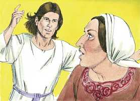
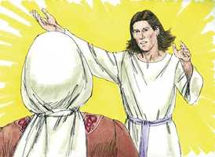
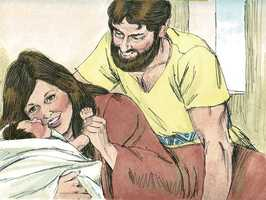

# Juízes Cap 13

**1** 	E OS filhos de Israel tornaram a fazer o que era mau aos olhos do Senhor, e o Senhor os entregou na mão dos filisteus por quarenta anos.

> **Cmt MHenry**: *Versículos 1-7* Israel fez o mal; então Deus os voltou a entregar em mãos dos filisteus. Sansão nasceu quando Israel estava afligida. Seus pais estavam sem filhos fazia muito tempo. muitas pessoas eminentes nasceram de tais mães. As misericórdias longamente esperadas costumam acabar sendo sinais de misericórdias; e por elas os outros podem cobrar ânimos para continuar esperando na misericórdia de Deus. O anjo adverte a aflição dela. Muitas vezes Deus envia consolo a seu povo muito oportunamente, quando eles sentem o máximo de seus problemas. O libertador de Israel deve ser consagrado a Deus. A esposa de Manoá ficou satisfeita de saber que o mensageiro era de Deus. deu a seu esposo um relato particular, juntamente com a promessa e o preceito. Os esposos e as esposas devem contar-se mutuamente suas experiências de comunhão com Deus e o crescimento no conhecimento dEle, para que possam ajudar-se no caminho do que é santo.

**2** 	E havia um homem de Zorá, da tribo de Dã, cujo nome era Manoá; e sua mulher, sendo estéril, não tinha filhos.

**3** 	E o anjo do Senhor apareceu a esta mulher, e disse-lhe: Eis que agora és estéril, e nunca tens concebido; porém conceberás, e terás um filho.

 

**4** 	Agora, pois, guarda-te de beber vinho, ou bebida forte, ou comer coisa imunda.

 

**5** 	Porque eis que tu conceberás e terás um filho sobre cuja cabeça não passará navalha; porquanto o menino será nazireu de Deus desde o ventre; e ele começará a livrar a Israel da mão dos filisteus.

**6** 	Então a mulher entrou, e falou a seu marido, dizendo: Um homem de Deus veio a mim, cuja aparência era semelhante a de um anjo de Deus, terribilíssima; e não lhe perguntei donde era, nem ele me disse o seu nome.

**7** 	Porém disse-me: Eis que tu conceberás e terás um filho; agora pois, não bebas vinho, nem bebida forte, e não comas coisa imunda; porque o menino será nazireu de Deus, desde o ventre até ao dia da sua morte.

**8** 	Então Manoá orou ao Senhor, e disse: Ah! Senhor meu, rogo-te que o homem de Deus, que enviaste, ainda venha para nós outra vez e nos ensine o que devemos fazer ao menino que há de nascer.

> **Cmt MHenry**: *Versículos 8-14* Bem-aventurados os que não o viram e, contudo, como Manoá, creram. Os homens bons têm mais cuidado e desejo de conhecer o dever que devem cumprir que saber os detalhes a respeito: o dever é nosso, os fatos são de Deus. Ele guiará por seu conselho aos que desejem conhecer seu dever e que apelam a Ele para que o ensine a eles. Os pais piedosos pedirão em forma especial a assistência divina. O anjo repete as instruções que tinha dado antes. Se precisa sumo cuidado para o correto ordenamento de nós e de nossos filhos, para que sejamos devidamente separados do mundo, e sejamos sacrifícios vivos para o Senhor.

**9** 	E Deus ouviu a voz de Manoá; e o anjo de Deus veio outra vez à mulher, e ela estava no campo, porém não estava com ela seu marido Manoá.

**10** 	Apressou-se, pois, a mulher, e correu, e noticiou-o a seu marido, e disse-lhe: Eis que aquele homem que veio a mim o outro dia me apareceu.

**11** 	Então Manoá levantou-se, e seguiu a sua mulher, e foi àquele homem, e disse-lhe: És tu aquele homem que falou a esta mulher? E disse: Eu sou.

**12** 	Então disse Manoá: Cumpram-se as tuas palavras; mas qual será o modo de viver e o serviço do menino?

**13** 	E disse o anjo do Senhor a Manoá: De tudo quanto eu disse à mulher se guardará ela.

> **Cmt MHenry**: *CAPÍTULO 13A-1Cr

**14** 	De tudo quanto procede da videira não comerá, nem vinho nem bebida forte beberá, nem coisa imunda comerá; tudo quanto lhe tenho ordenado guardará.

**15** 	Então Manoá disse ao anjo do Senhor: Ora deixa que te detenhamos, e te preparemos um cabrito.

> **Cmt MHenry**: *Versículos 15-23* A Manoá lhe foi dito prontamente o que perguntou como instrução para cumprir seu dever, mas lhe foi negado o que perguntou para satisfazer sua curiosidade. Deus dá em sua Palavra instruções completas acerca de nosso dever, porém nunca teve o propósito de responder outra classe de perguntas. Há coisas secretas que não nos correspondem, as quais devemos estar contentes de ignorar enquanto estejamos neste mundo. O nome de nosso Senhor é maravilhoso e secreto, porém por suas obras maravilhosas Ele se dá a conhecer na medida em que for necessário para nós. A oração é elevar a alma a Deus. Mas sem Cristo por fé no coração, nosso serviço é fumaça escandalosa; nEle, é chama aceitável. Podemos aplicar isto ao sacrifício de Cristo por nós; Ele ascendeu na chama de sua própria oferta, pois por seu sangue entrou de uma vez por todas no Lugar Santíssimo ([Hb 9.12](../58N-Hb/09.md#12)). Nas reflexões de Manoá há *grande temor*: seguramente morreremos. Na reflexão de sua esposa há *grande fé*. como sua ajuda idônea, ela lhe dá ânimo. Que os crentes que tiveram comunhão com Deus na Palavra e a oração, aos que Ele se manifestou bondosamente, e tiveram razão para pensar que Deus aceitou suas obras, se sintam animados num dia escuro e nublado. Deus não teria feito o que fez por minha alma, se seu desígnio fosse desamparar-me e deixar-me perecer afinal, porque sua obra é perfeita. Aprendam a arrazoar como a esposa de Manoá: se Deus quiser minha morte sob sua ira, não me daria sinais de Seu favor.

**16** 	Porém o anjo do Senhor disse a Manoá: Ainda que me detenhas, não comerei de teu pão; e se fizeres holocausto o oferecerás ao Senhor. Porque não sabia Manoá que era o anjo do Senhor.

**17** 	E disse Manoá ao anjo do Senhor: Qual é o teu nome, para que, quando se cumprir a tua palavra, te honremos?

**18** 	E o anjo do Senhor lhe disse: Por que perguntas assim pelo meu nome, visto que é maravilhoso?

**19** 	Então Manoá tomou um cabrito e uma oferta de alimentos, e os ofereceu sobre uma penha ao Senhor: e houve-se o anjo maravilhosamente, observando-o Manoá e sua mulher.

**20** 	E sucedeu que, subindo a chama do altar para o céu, o anjo do Senhor subiu na chama do altar; o que vendo Manoá e sua mulher, caíram em terra sobre seus rostos.

**21** 	E nunca mais apareceu o anjo do Senhor a Manoá, nem a sua mulher; então compreendeu Manoá que era o anjo do Senhor.

**22** 	E disse Manoá à sua mulher: Certamente morreremos, porquanto temos visto a Deus.

**23** 	Porém sua mulher lhe disse: Se o Senhor nos quisesse matar, não aceitaria da nossa mão o holocausto e a oferta de alimentos, nem nos mostraria tudo isto, nem nos deixaria ouvir tais coisas neste tempo.

**24** 	Depois teve esta mulher um filho, a quem pôs o nome de Sansão; e o menino cresceu, e o Senhor o abençoou.

> **Cmt MHenry**: *Versículos 24-25* O Espírito do Senhor começou a mover a Sansão quando era jovem. Isto era prova de que o Senhor o abençoava. Onde Deus dá sua bênção, dá seu Espírito para que capacite para sua bênção. São certamente bem-aventurados aqueles nos que o Espírito de graça começa a operar desde os dias de sua infância. Sansão não bebida vinho nem sidra, mas se destacava em força e valor, pois tinha Espírito de Deus que o movia; portanto, não se embriaguem com vinho, antes sejam cheios do Espírito.

 

**25** 	E o Espírito do Senhor começou a incitá-lo de quando em quando para o campo de Maané-Dã, entre Zorá e Estaol.

> **Cmt MHenry** Intro: *• Versículos 1-7*> 28A-Os filisteus – Sansão é anunciado*> *• Versículos 8-14*> *O anjo se aparece a Manoá*> *• Versículos 15-23*> *O sacrifício de Manoá*> *• Versículos 24-25*> *Nascimento de Sansão*