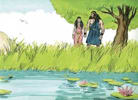
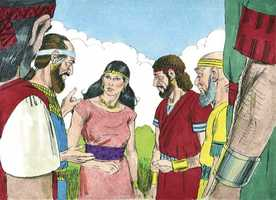
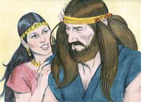
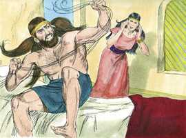
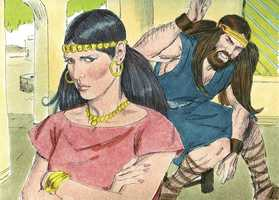
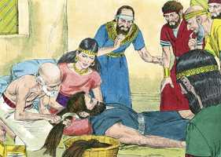
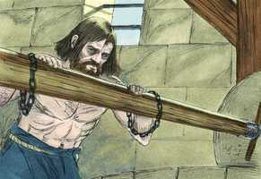
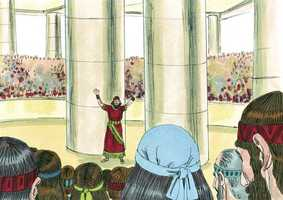
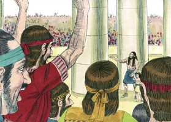
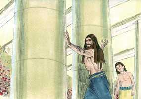

# Juízes Cap 16

**1** 	E FOI Sansão a Gaza, e viu ali uma mulher prostituta, e entrou a ela.

> **Cmt MHenry**: *Versículos 1-3* Até agora o caráter de Sansão tem parecido glorioso, embora pouco comum. Neste capítulo o achamos comportando-se em forma tão perversa que muitos se questionam se era ou não um homem santo. Mas o apóstolo tem dirimido esta questão em [Hb 11.32](../58N-Hb/11.md#32). ao dirigir nossa atenção às doutrinas e exemplos da Escritura, aos artifícios de Satanás, ao enganoso do coração humano e aos métodos com que freqüentemente o Senhor trata a seu povo, podemos aprender lições úteis desta história, na qual desnecessariamente tropeçam alguns, enquanto outros criticam e objetam. O tempo específico em que viveu Sansão pode dar razão de muitas coisas que, se forem feitas em nossa época, e sem o desígnio especial do Céu, seria altamente criminosas. Pode que Ele tenha feito muitos exercícios piedosos que, se registrados, tivessem lançado uma luz diferente a seu caráter. Observe-se o perigo de Sansão. Oh, que todos os que satisfazem seus apetites sensuais com bebedices ou qualquer outra luxúria sensual se vejam a si mesmos deste modo rodeados, vencidos e marcados para o desastre por seus inimigos espirituais! Quanto mais profundo durmam, mais seguros se sentem, porém maior é seu perigo. Esperamos que fosse com uma resolução piedosa de não tornar a seu pecado que ele se levantou por meio do perigo em que estava. Posso eu estar a salvo sob esta culpa? Foi mau que ele se deitasse a dormir sem controlar sua situação; porém, teriam sido pior se tiver permanecido tranqüilo.

**2** 	E foi dito aos gazitas: Sansão entrou aqui. Cercaram-no, e toda a noite lhe puseram espias à porta da cidade; porém toda a noite estiveram quietos, dizendo: Até à luz da manhã esperaremos; então o mataremos.

**3** 	Porém Sansão deitou-se até à meia-noite, e à meia-noite se levantou, e arrancou as portas da entrada da cidade com ambas as umbreiras, e juntamente com a tranca as tomou, pondo-as sobre os ombros; e levou-as para cima até ao cume do monte que está defronte de Hebrom.

**4** 	E depois disto aconteceu que se afeiçoou a uma mulher do vale de Soreque, cujo nome era Dalila.

> **Cmt MHenry**: *Versículos 4-17* Sansão tinha sido levado mais de uma vez à maldade e ao perigo por amor das mulheres,contudo, não aprendeu de tais advertências, e pela terceira vez caiu na mesma armadilha, que desta vez foi fatal. A libertinagem é uma das coisas que tira o coração. É um poço profundo em que muitos caíram, e do qual poucos escaparam, e esses por um milagre de misericórdia, com a perda de sua reputação e a inutilidade quase completa, exceto de sua alma. A angústia do sofrimento é dez mil vezes maior que todos os prazeres do pecado.

 

**5** 	Então os príncipes dos filisteus subiram a ela, e lhe disseram: Persuade-o, e vê em que consiste a sua grande força, e como poderíamos assenhorear-nos dele e amarrá-lo, para assim o afligirmos; e te daremos, cada um de nós, mil e cem moedas de prata.

 

**6** 	Disse, pois, Dalila a Sansão: Declara-me, peço-te, em que consiste a tua grande força, e com que poderias ser amarrado para te poderem afligir.

 

**7** 	Disse-lhe Sansão: Se me amarrassem com sete vergas de vimes frescos, que ainda não estivessem secos, então me enfraqueceria, e seria como qualquer outro homem.

**8** 	Então os príncipes dos filisteus lhe trouxeram sete vergas de vimes frescos, que ainda não estavam secos; e amarraram-no com elas.

**9** 	E o espia estava com ela na câmara interior. Então ela lhe disse: Os filisteus vêm sobre ti, Sansão. Então quebrou as vergas de vimes, como se quebra o fio da estopa ao cheiro do fogo; assim não se soube em que consistia a sua força.

 

**10** 	Então disse Dalila a Sansão: Eis que zombaste de mim, e me disseste mentiras; ora declara-me agora com que poderias ser amarrado.

 

**11** 	E ele disse: Se me amarrassem fortemente com cordas novas, que ainda não houvessem sido usadas, então me enfraqueceria, e seria como qualquer outro homem.

**12** 	Então Dalila tomou cordas novas, e o amarrou com elas, e disse-lhe: Os filisteus vêm sobre ti, Sansão. E o espia estava na recâmara interior. Então as quebrou de seus braços como a um fio.

**13** 	E disse Dalila a Sansão: Até agora zombaste de mim, e me disseste mentiras; declara-me pois, agora, com que poderias ser amarrado? E ele lhe disse: Se teceres sete tranças dos cabelos da minha cabeça com o liço da teia.

**14** 	E ela as fixou com uma estaca, e disse-lhe: Os filisteus vêm sobre ti, Sansão: Então ele despertou do seu sono, e arrancou a estaca das tranças tecidas, juntamente com o liço da teia.

**15** 	Então ela lhe disse: Como dirás: Tenho-te amor, não estando comigo o teu coração? Já três vezes zombaste de mim, e ainda não me declaraste em que consiste a tua força.

 

**16** 	E sucedeu que, importunando-o ela todos os dias com as suas palavras, e molestando-o, a sua alma se angustiou até a morte.

> **Cmt MHenry**: *CAPÍTULO 16A-Ne

**17** 	E descobriu-lhe todo o seu coração, e disse-lhe: Nunca passou navalha pela minha cabeça, porque sou nazireu de Deus desde o ventre de minha mãe; se viesse a ser rapado, ir-se-ia de mim a minha força, e me enfraqueceria, e seria como qualquer outro homem.

**18** 	Vendo, pois, Dalila que já lhe descobrira todo o seu coração, mandou chamar os príncipes dos filisteus, dizendo: Subi esta vez, porque agora me descobriu ele todo o seu coração. E os príncipes dos filisteus subiram a ter com ela, trazendo com eles o dinheiro.

> **Cmt MHenry**: *Versículos 18-21* Veja-se os efeitos fatais da fala seguridade. Satanás destrói os homens elogiando-os para que adquiram uma boa opinião de sua própria firmeza e, assim, os leva a que nada lhes importe e nada temam; e, então, lhes rouba sua força e honra, e os leva cativos a sua vontade. Quando dormimos, nossos inimigos espirituais não dormem. Os olhos de Sansão foram a entrada de seu pecado (versículo 1), e agora seu castigo começa pelos olhos. Os filisteus o deixaram cego e teve tempo para lembrar que sua própria luxúria o havia cegado antes. A melhor forma de preservar os olhos é tirá-los da vaidade que contempla. Aprendam de sua queda; vigiem cuidadosamente contra todas as concupiscências carnais; porque toda nossa glória se vai e nossa defesa nos abandona quando profanamos nossa separação para Deus, em nossa qualidade de nazireus espirituais.

**19** 	Então ela o fez dormir sobre os seus joelhos, e chamou a um homem, e rapou-lhe as sete tranças do cabelo de sua cabeça; e começou a afligi-lo, e retirou-se dele a sua força.

 

**20** 	E disse ela: Os filisteus vêm sobre ti, Sansão. E despertou ele do seu sono, e disse: Sairei ainda esta vez como dantes, e me sacudirei. Porque ele não sabia que já o Senhor se tinha retirado dele.

**21** 	Então os filisteus pegaram nele, e arrancaram-lhe os olhos, e fizeram-no descer a Gaza, e amarraram-no com duas cadeias de bronze, e girava ele um moinho no cárcere.

 

**22** 	E o cabelo da sua cabeça começou a crescer, como quando foi rapado.

> **Cmt MHenry**: *Versículos 22-24* As aflições de Sansão foram o médio de levá-lo ao arrependimento profundo. Ao perder sua visão corporal, se abriram os olhos de seu entendimento, e ao privá-lo de sua força corporal, aprouver a Deus renovar sua força espiritual. O Senhor permite que uns poucos se descaminhem longe e afundem profundamente, mas no final os recupera e os salva de afundarem no abismo da destruição, marcando seu desagrado pelo pecado com graves sofrimentos temporais. Os hipócritas podem abusar destes exemplos, e os infiéis podem zombar deles, porém os cristãos verdadeiros se farão por eles mais humildes, dispostos a vigiar e a serem prudentes, mais simples em sua confiança no Senhor, mais fervorosos para orar pedindo serem guardados de cair, e no louvor por terem sido preservados; e, se caírem, serão guardados para que não afundem no desespero.

**23** 	Então os príncipes dos filisteus se ajuntaram para oferecer um grande sacrifício ao seu deus Dagom, e para se alegrarem, e diziam: Nosso deus nos entregou nas mãos a Sansão, nosso inimigo.

 

**24** 	Semelhantemente, vendo-o o povo, louvava ao seu deus; porque dizia: Nosso deus nos entregou nas mãos o nosso inimigo, e ao que destruía a nossa terra, e ao que multiplicava os nossos mortos.

**25** 	E sucedeu que, alegrando-se-lhes o coração, disseram: Chamai a Sansão, para que brinque diante de nós. E chamaram a Sansão do cárcere, que brincava diante deles, e fizeram-no estar em pé entre as colunas.

> **Cmt MHenry**: *Versículos 25-31* Nada completa os pecados de uma pessoa ou um povo com maior velocidade que zombar dos servos de Deus e maltratá-los, embora a causa seja sua própria estultícia. Deus pôs no coração de Sansão, como personagem público, vingar deste modo neles a luta de Deus, de Israel e a sua. A força perdida pelo pecado foi recuperada pela oração. Isto não foi por paixão nem vingança pessoal, senão por santo zelo pela glória de Deus e Israel, o que fica claro pelo fato de que Deus aceita e responde a sua oração. O templo é derrubado, não pela força natural de Sansão, senão pela onipotência de Deus. em seu caso esteve bem que ele vindicasse a causa de Deus e Israel. Não deve ser acusado de suicida. Não procurava sua morte, senão a liberação de Israel e a destruição de seus inimigos. Sansão morreu acorrentado e entre os filisteus, como espantosa rejeição de seus pecados, porém morreu arrependido. Os efeitos de sua morte tipificam os da morte de Cristo que, por sua própria vontade, pôs sua vida entre transgressores e desse modo destruiu o fundamento do reino de Satanás, e proveu para a libertação de Sua gente. Embora foi grande o pecado de Sansão, e ainda que mereceu os juízos que se acarretou, finalmente achou misericórdia do Senhor; e todo penitente que fuja a refugiar-se no Salvador cujo sangue limpa de todo pecado, obterá misericórdia. Mas aqui nada há que estimule a ceder ao pecado: com a esperança eles finalmente se arrependerão e serão salvos.

 

**26** 	Então disse Sansão ao moço que o tinha pela mão: Guia-me para que apalpe as colunas em que se sustém a casa, para que me encoste a elas.

 

**27** 	Ora estava a casa cheia de homens e mulheres; e também ali estavam todos os príncipes dos filisteus; e sobre o telhado havia uns três mil homens e mulheres, que estavam vendo Sansão brincar.

**28** 	Então Sansão clamou ao Senhor, e disse: Senhor Deus, peço-te que te lembres de mim, e fortalece-me agora só esta vez, ó Deus, para que de uma vez me vingue dos filisteus, pelos meus dois olhos.

**29** 	Abraçou-se, pois, Sansão com as duas colunas do meio, em que se sustinha a casa, e arrimou-se sobre elas, com a sua mão direita numa, e com a sua esquerda na outra.

**30** 	E disse Sansão: Morra eu com os filisteus. E inclinou-se com força, e a casa caiu sobre os príncipes e sobre todo o povo que nela havia; e foram mais os mortos que matou na sua morte do que os que matara em sua vida.

 

**31** 	Então seus irmãos desceram, e toda a casa de seu pai, e tomaram-no, e subiram com ele, e sepultaram-no entre Zorá e Estaol, no sepulcro de Manoá, seu pai. Ele julgou a Israel vinte anos.

> **Cmt MHenry** Intro: *• Versículos 1-3*> *Fuga de Sansão desde Gaza*> *• Versículos 4-17*> *Sansão seduzido para que revele o segredo de sua força*> *• Versículos 18-21*> 28A-Os filisteus levam a Sansão e lhe tiram os olhos*> *• Versículos 22-24*> *Renovação da força de Sansão*> *• Versículos 25-31*> *Destruição de muitos filisteus*