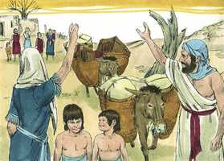
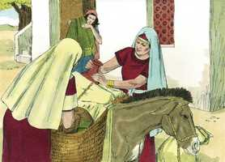
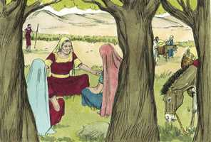
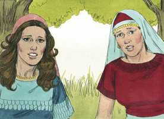
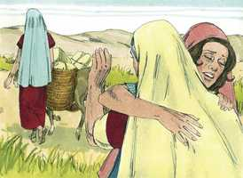
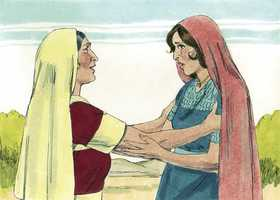
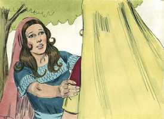
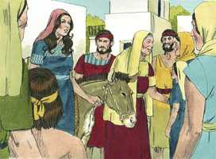
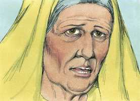

# Rute Cap 01

**1** 	E SUCEDEU que, nos dias em que os juízes julgavam, houve uma fome na terra; por isso um homem de Belém de Judá saiu a peregrinar nos campos de Moabe, ele e sua mulher, e seus dois filhos;

> **Cmt MHenry**: *Versículos 1-5* Não se pode culpar a Elimeleque de falta de cuidado para prover a sua família, mas não pode justificar que fosse a Moabe essa mudança terminou no desastre de sua família. É néscio pensar em escapar da cruz que se põe em nosso caminho para que a tomemos. Mudar de lugar não é consertar as coisas. Os que levam a gente jovem a más companhias e os desviam do caminho das ordenanças públicas, ainda que pensem que o fazem por boas razões, e armados contra a tentação, não sabem qual será o final. Não parece que as mulheres com que casaram os filhos de Elimeleque fossem prosélitos da religião judaica. As provações ou os prazeres terrenos são de breve duração. A morte se leva continuamente aos de toda idade e situação, e estraga todas nossas consolações externas: nunca preferiremos em excesso as vantagens que durarão eternamente.

> **Cmt MHenry**: *CAPÍTULO 10A-2Sm 11A-1Rs 12A-2Rs 13A-1Cr 14A-2Cr 15A-Es 16A-Ne 17A-Et 18A-Jo 19A-Sl

**2** 	E era o nome deste homem Elimeleque, e o de sua mulher Noemi, e os de seus dois filhos Malom e Quiliom, efrateus, de Belém de Judá; e chegaram aos campos de Moabe, e ficaram ali.

 

**3** 	E morreu Elimeleque, marido de Noemi; e ficou ela com os seus dois filhos,

**4** 	Os quais tomaram para si mulheres moabitas; e era o nome de uma Orfa, e o da outra Rute; e ficaram ali quase dez anos.

 

**5** 	E morreram também ambos, Malom e Quiliom, ficando assim a mulher desamparada dos seus dois filhos e de seu marido.

 

**6** 	Então se levantou ela com as suas noras, e voltou dos campos de Moabe, porquanto na terra de Moabe ouviu que o Senhor tinha visitado o seu povo, dando-lhe pão.

> **Cmt MHenry**: *Versículos 6-14* Depois da morte de seus dois filhos, Noemi começou a pensar em regressar. Quando chega a morte a uma família, deve reformar o que estiver errado. A terra se nos faz amarga para que amemos o céu. Noemi parece ter sido pessoa de fé e piedosa. Se despede de suas noras com oração. Muito apropriado para os amigos, quando se separam, separar-se com oração. Ela as despediu afetuosamente. Se os familiares devem separar-se, que o façam com amor. Fez bem Noemi em desanimar suas noras a que fossem com ela, quando poderia tê-las salvado da idolatria de Moabe e levá-las à fé e adoração do Deus de Israel? Noemi desejava sem dúvida fazer isso, mas se iam com ela, não as forçaria a irem por conta dela. Os que fazem profissão de fé somente para agradar a seus amigos ou para acompanhá-los, serão convertidos de pouco valor. Se a seguiam, seria por uma livre eleição, depois de sentar a calcular o custo, como corresponde aos que fazem uma profissão religiosa. Muitos desejam "descansar na casa de um marido" ou em algum estabelecimento mundano, ou satisfação terrena, antes que no repouso ao qual Cristo convida a nossa alma; portanto, quando são provados se distanciam de Cristo, ainda que talvez com certa tristeza.

 

**7** 	Por isso saiu do lugar onde estivera, e as suas noras com ela. E, indo elas caminhando, para voltarem para a terra de Judá,

**8** 	Disse Noemi às suas noras: Ide, voltai cada uma à casa de sua mãe; e o Senhor use convosco de benevolência, como vós usastes com os falecidos e comigo.

 

**9** 	O Senhor vos dê que acheis descanso cada uma em casa de seu marido. E, beijando-as ela, levantaram a sua voz e choraram.

**10** 	E disseram-lhe: Certamente voltaremos contigo ao teu povo.

 

**11** 	Porém Noemi disse: Voltai, minhas filhas. Por que iríeis comigo? Tenho eu ainda no meu ventre mais filhos, para que vos sejam por maridos?

**12** 	Voltai, filhas minhas, ide-vos embora, que já mui velha sou para ter marido; ainda quando eu dissesse: Tenho esperança, ou ainda que esta noite tivesse marido e ainda tivesse filhos,

**13** 	Esperá-los-íeis até que viessem a ser grandes? Deter-vos-íeis por eles, sem tomardes marido? Não, filhas minhas, que mais amargo me é a mim do que a vós mesmas; porquanto a mão do Senhor se descarregou contra mim.

**14** 	Então levantaram a sua voz, e tornaram a chorar; e Orfa beijou a sua sogra, porém Rute se apegou a ela.

 

**15** 	Por isso disse Noemi: Eis que voltou tua cunhada ao seu povo e aos seus deuses; volta tu também após tua cunhada.

> **Cmt MHenry**: *Versículos 15-18* Veja-se a resolução de rute e seu grande afeto por Noemi. Orfa se resistia a separar-se dela, mas não a amava tanto como para deixar Moabe. Deste modo, muitos apreciam a Cristo e lhe têm afeto, porém ficam destituídos de sua salvação porque não querem abandonar outras coisas por Ele. O amam, e ainda assim o deixam, porque não o amam tanto como amam as outras coisas. Rute é um exemplo da graça de Deus que inclina a alma a escolher a melhor parte. Noemi não podia desejar outra coisa que a declaração solene que fez Rute. Veja-se o poder da resolução; silencia a tentação. Os que recorrem os caminhos religiosos sem uma mente firme, são como uma porta entreaberta, que convida o ladrão; porém a resolução fecha e coloca ferrolho na porta, resiste ao diabo e o obriga a fugir.

 

**16** 	Disse, porém, Rute: Não me instes para que te abandone, e deixe de seguir-te; porque aonde quer que tu fores irei eu, e onde quer que pousares, ali pousarei eu; o teu povo é o meu povo, o teu Deus é o meu Deus;

 

**17** 	Onde quer que morreres morrerei eu, e ali serei sepultada. Faça-me assim o Senhor, e outro tanto, se outra coisa que não seja a morte me separar de ti.

**18** 	Vendo Noemi, que de todo estava resolvida a ir com ela, deixou de lhe falar.

**19** 	Assim, pois, foram-se ambas, até que chegaram a Belém; e sucedeu que, entrando elas em Belém, toda a cidade se comoveu por causa delas, e diziam: Não é esta Noemi?

> **Cmt MHenry**: *Versículos 19-22* Noemi e Rute chegaram a Belém. As aflições produzem grandes e assombrosas mudanças em pouco tempo; que Deus, por Sua graça, queira preparar-nos para todas essas mudanças, especialmente para a grande mudança! Noemi significa "prazerosa" ou "amigável". Mara, "amarga" ou "amargor". Agora era uma melhor de espírito amargurado. Ela tinha tornado a casa vazia, pobre, viúva e sem filhos. Mas há uma plenitude para os crentes da qual nunca podem ficar vazios; a boa parte que não será tirado dos que a têm. O copo da aflição é um copo "amargo", mas ela reconhece que a aflição provém de Deus. Convêm muito que nosso coração seja humilhado sob providências humilhantes. Não é a aflição mesma, senão a aflição bem levada a que nos faz bem. "

 

**20** 	Porém ela lhes dizia: Não me chameis Noemi; chamai-me Mara; porque grande amargura me tem dado o Todo-Poderoso.

 

**21** 	Cheia parti, porém vazia o Senhor me fez tornar; por que pois me chamareis Noemi? O Senhor testifica contra mim, e o Todo-Poderoso me tem feito mal.

**22** 	Assim Noemi voltou, e com ela Rute a moabita, sua nora, que veio dos campos de Moabe; e chegaram a Belém no princípio da colheita das cevadas.

> **Cmt MHenry** Intro: *• Versículos 1-5*> *Elimeleque e seus filhos morrem na terra de Moabe*> *• Versículos 6-14*> *Noemi regressa a sua pátria*> *• Versículos 15-18*> *Orfa fica, porém rute vai com Noemi*> *• Versículos 19-22*> *Chegada a Belém*