# Rute Cap 02

**1** 	E TINHA Noemi um parente de seu marido, homem valente e poderoso, da família de Elimeleque; e era o seu nome Boaz.

> **Cmt MHenry**: *Versículos 1-3* Observe-se a humildade de Rute. Quando a providência a deixou pobre, ela se submeteu de boa vontade a sua sorte. Os espíritos soberbos preferem morrer de fome antes que dobrar-se; não assim Rute. Ainda mais, é sua própria proposição. Ela fala humildemente de sua permissão para ir a espigar. Podemos não exigir bondade, como se nos fosse devida, porém podemos pedir, e tomá-la como favor, embora se trate de algo pequeno. Rute também foi um exemplo de diligência. Não gostava de comer o pão de graça. Este é um exemplo para a juventude. A diligência promete bem tanto para este mundo como para o outro. Não devemos envergonhar-nos de um emprego honesto. Nenhum trabalho é indigno. O pecado é uma coisa baixa para nós, porém não devemos pensar o mesmo de algo ao qual somos chamados pela providência. Ela foi um exemplo de consideração por sua sogra e de confiança na providência. Deus ordena sabiamente o que a nós parecem feitos pequenos; e os que se vêem totalmente incertos, também são dirigidos a servir Sua glória e o bem de seu povo.

**2** 	E Rute, a moabita, disse a Noemi: Deixa-me ir ao campo, e apanharei espigas atrás daquele em cujos olhos eu achar graça. E ela disse: Vai, minha filha.

> **Cmt MHenry**: *CAPÍTULO 20A-Pv 21A-Ec 22A-Ct 23A-Is 24A-Jr 25A-Lm 26A-Ez 27A-Dn 28A-Os 29A-Jl

**3** 	Foi, pois, e chegou, e apanhava espigas no campo após os segadores; e caiu-lhe em sorte uma parte do campo de Boaz, que era da família de Elimeleque.

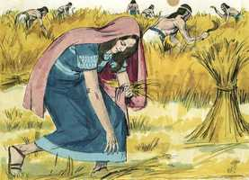 

**4** 	E eis que Boaz veio de Belém, e disse aos segadores: O Senhor seja convosco. E disseram-lhe eles: O Senhor te abençoe.

> **Cmt MHenry**: *Versículos 4-16* A linguagem piedosa e bondosa entre Boaz e seus segadores mostra que havia pessoas piedosas em Israel. Uma linguagem como esta rara vez se ouve em nossos campos; com demasiada freqüência, ao contrário, é imoral e corrupta. Um estrangeiro se formaria uma opinião muito diferente de nossa terra em comparação com a que Rute se formou de Israel a partir da conversação e conduta de Boaz e seus segadores. Mas a verdadeira religião ensina ao homem a comportar-se retamente em todos os estados e condições; forma amos amáveis e servos fiéis, e produz harmonia na família. A religião verdadeira produz amor e bondade mútuas entre pessoas de diferentes níveis. Teve estes efeitos sobre Boaz e seus homens. quando ele irmã com eles, orava por eles. Eles não o amaldiçoavam em quanto ele ficava fora do alcance de ouvi-los, como alguns servos de má natureza que odeiam o olho de seu amo, senão que retribuíam sua cortesia. O mais provável é que as coisas se dêem bem onde há uma boa vontade como esta entre amos e servos. Eles se expressavam sua bondade uns a outros, e oravam os uns pelos outros. Boaz perguntou pela estrangeira que viu e ordenou que fosse bem tratada. Os amos devem cuidar não somente de não danar a si mesmos; tampouco devem permitir que seus servos e os que estão sob seu mando façam o mal. Rute se reconheceu humildemente indigna de tais favores, considerando que tinha nascido e tinha sido criada como pagã. Nos convêm a todos pensar humildemente de nós mesmos, estimando melhor aos outros que a nós mesmos. Na bondade de Boaz com Rute, notemos a bondade do Senhor Jesus Cristo com os pobres pecadores.

**5** 	Depois disse Boaz a seu moço, que estava posto sobre os segadores: De quem é esta moça?

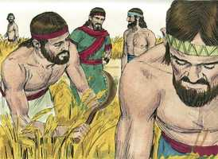 

**6** 	E respondeu o moço, que estava posto sobre os segadores, e disse: Esta é a moça moabita que voltou com Noemi dos campos de Moabe.

**7** 	Disse-me ela: Deixa-me colher espigas, e ajuntá-las entre as gavelas após os segadores. Assim ela veio, e desde pela manhã está aqui até agora, a não ser um pouco que esteve sentada em casa.

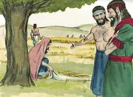 

**8** 	Então disse Boaz a Rute: Ouve, filha minha; não vás colher em outro campo, nem tampouco passes daqui; porém aqui ficarás com as minhas moças.

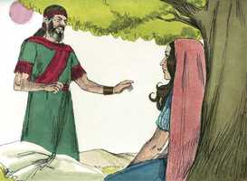 

**9** 	Os teus olhos estarão atentos no campo que segarem, e irás após elas; não dei ordem aos moços, que não te molestem? Tendo tu sede, vai aos vasos, e bebe do que os moços tirarem.

**10** 	Então ela caiu sobre o seu rosto, e se inclinou à terra; e disse-lhe: Por que achei graça em teus olhos, para que faças caso de mim, sendo eu uma estrangeira?

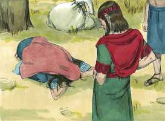 

**11** 	E respondeu Boaz, e disse-lhe: Bem se me contou quanto fizeste à tua sogra, depois da morte de teu marido; e deixaste a teu pai e a tua mãe, e a terra onde nasceste, e vieste para um povo que antes não conheceste.

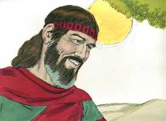 

**12** 	O Senhor retribua o teu feito; e te seja concedido pleno galardão da parte do Senhor Deus de Israel, sob cujas asas te vieste abrigar.

**13** 	E disse ela: Ache eu graça em teus olhos, senhor meu, pois me consolaste, e falaste ao coração da tua serva, não sendo eu ainda como uma das tuas criadas.

**14** 	E, sendo já hora de comer, disse-lhe Boaz: Achega-te aqui, e come do pão, e molha o teu bocado no vinagre. E ela se assentou ao lado dos segadores, e ele lhe deu do trigo tostado, e comeu, e se fartou, e ainda lhe sobejou.

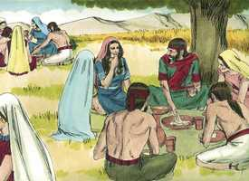 

**15** 	E, levantando-se ela a colher, Boaz deu ordem aos seus moços, dizendo: Até entre as gavelas deixai-a colher, e não a censureis.

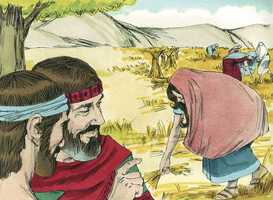 

**16** 	E deixai cair alguns punhados, e deixai-os ficar, para que os colha, e não a repreendais.

**17** 	E esteve ela apanhando naquele campo até à tarde; e debulhou o que apanhou, e foi quase um efa de cevada.

> **Cmt MHenry**: *Versículos 17-23* Estimula a diligência que em todo trabalho, ainda o de espigar, haja lucro. Rute se contentou com o que ganhava por sua laboriosidade, e se cuidou de reter o trabalho. Cuidemo-nos de não perder o que temos obtido, que ganhamos para bem de nossa alma ([2 João 8](../63N-2Jo/01.md#8)). Os pais devem examinar a seus filhos como fez Noemi, não para assustá-los ou desanimá-los, não para que odeiem o lar ou para tentá-los a mentir, senão para elogiá-los se fizeram bem, e repreendê-los com suavidade e aconselhá-los se agiram de outro modo. Uma boa pergunta para fazer-nos cada noite é: Onde espiguei hoje? Que melhoras tive no conhecimento e na graça? Que tenho feito que me dê bom crédito? Quando o Senhor nos dá abundância, não sejamos encontrados em outro campo, nem procurando nossa felicidade e satisfação na criatura. Perdemos favores divinos se os desprezamos. Rute observou devidamente as instruções de sua sogra. Quando terminou a colheita, fez companhia a sua anciã sogra em casa. Diná saiu para ver as filhas da terra; sua vaidade terminou em desgraça ([Gn 24](../01A-Gn/24.md#0)). Rute ficou em casa e ajudou a manter a sua sogra e não saiu a outra diligência que não fosse obter provisões para elas; sua humildade e laboriosidade terminaram em seu progresso.

**18** 	E tomou-o, e veio à cidade; e viu sua sogra o que tinha apanhado; também tirou, e deu-lhe o que sobejara depois de fartar-se.

**19** 	Então disse-lhe sua sogra: Onde colheste hoje, e onde trabalhaste? Bendito seja aquele que te reconheceu. E relatou à sua sogra com quem tinha trabalhado, e disse: O nome do homem com quem hoje trabalhei é Boaz.

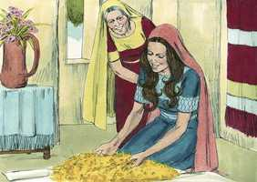 

**20** 	Então Noemi disse à sua nora: Bendito seja ele do Senhor, que ainda não tem deixado a sua beneficência nem para com os vivos nem para com os mortos. Disse-lhe mais Noemi: Este homem é nosso parente chegado, e um dentre os nossos remidores.

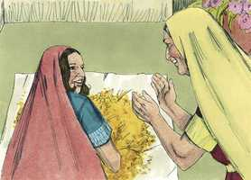 

**21** 	E disse Rute, a moabita: Também ainda me disse: Com os moços que tenho te ajuntarás, até que acabem toda a sega que tenho.

**22** 	E disse Noemi a sua nora: Melhor é, filha minha, que saias com as suas moças, para que noutro campo não te encontrem.

**23** 	Assim, ajuntou-se com as moças de Boaz, para colher até que a sega das cevadas e dos trigos se acabou; e ficou com a sua sogra.

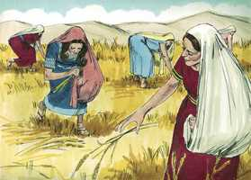 

> **Cmt MHenry** Intro: *• Versículos 1-3*> *Rute espiga nos campos de Boaz*> *• Versículos 4-16*> *A bondade de Boaz para com Rute*> *• Versículos 17-23*> *Rute regressa a casa de sua sogra*