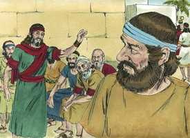
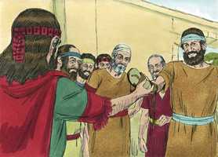

# Rute Cap 04

**1** 	E BOAZ subiu à porta, e assentou-se ali; e eis que o remidor de que Boaz tinha falado ia passando, e disse-lhe: Ó fulano, vem cá, assenta-te aqui. E desviou-se para ali, e assentou-se.

> **Cmt MHenry**: *Versículos 1-8* Toda a questão dependia das leis dadas por Moisés sobre a herança e, sem dúvida, todo foi arranjado da forma regular e legal. O parente rejeitou a oferta quando soube das condições. Em forma parecida, muitos rejeitam a grande redenção; não estão dispostos a desposar a religião; têm ouvido boas coisas dela e nada têm a dizer em sua contra; falam bem dela, contudo, estão dispostos a desligar-se dela, e não querem unir-se a ela, por medo de perder sua própria herança neste mundo. Renunciou a seu direito em favor de Boaz. O trato justo e honesto em todo o reforma a contratos e negócios é algo do que devem tomar consciência todos os que se reconhecem como verdadeiros israelitas, nos que não há engano. Acharão que a melhor política é a honestidade.

 

**2** 	Então tomou dez homens dos anciãos da cidade, e disse: Assentai-vos aqui. E assentaram-se.

**3** 	Então disse ao remidor: Aquela parte da terra que foi de Elimeleque, nosso irmão, Noemi, que tornou da terra dos moabitas, está vendendo.

 

**4** 	E eu resolvi informar-te disso e dizer-te: Compra-a diante dos habitantes, e diante dos anciãos do meu povo; se a hás de redimir, redime-a, e se não a houveres de redimir, declara-mo, para que o saiba, pois outro não há senão tu que a redima, e eu depois de ti. Então disse ele: Eu a redimirei.

> **Cmt MHenry**: *CAPÍTULO 40N-Mt 41N-Mc 42N-Lc 43N-Joa 44N-At 45N-Rm 46N-1Co 47N-2Co 48N-Gl 49N-Ef

**5** 	Disse porém Boaz: No dia em que comprares a terra da mão de Noemi, também a comprarás da mão de Rute, a moabita, mulher do falecido, para suscitar o nome do falecido sobre a sua herança.

**6** 	Então disse o remidor: Para mim não a poderei redimir, para que não prejudique a minha herança; toma para ti o meu direito de remissão, porque eu não a poderei redimir.

 

**7** 	Havia, pois, já de muito tempo este costume em Israel, quanto a remissão e permuta, para confirmar todo o negócio; o homem descalçava o sapato e o dava ao seu próximo; e isto era por testemunho em Israel.

**8** 	Disse, pois, o remidor a Boaz: Toma-a para ti. E descalçou o sapato.

 

**9** 	Então Boaz disse aos anciãos e a todo o povo: Sois hoje testemunhas de que tomei tudo quanto foi de Elimeleque, e de Quiliom, e de Malom, da mão de Noemi,

> **Cmt MHenry**: *Versículos 9-12* Os homens estão dispostos a aproveitar as oportunidades de aumentar sua fortuna, porém poucos conhecem o valor da piedade. Tais são os sábios deste mundo aos que o Senhor acusa de estultícia. Eles não se preocupam da necessidade de sua alma e rejeitam a salvação de Cristo por temor a perder sua herança. Mas Deus deu a Boaz a honra de incluí-lo na linhagem do Messias, enquanto do parente que temeu rebaixar-se e perder sua herança, foi esquecido o nome, família e herança.

 

**10** 	E de que também tomo por mulher a Rute, a moabita, que foi mulher de Malom, para suscitar o nome do falecido sobre a sua herança, para que o nome do falecido não seja desarraigado dentre seus irmãos e da porta do seu lugar; disto sois hoje testemunhas.

**11** 	E todo o povo que estava na porta, e os anciãos, disseram: Somos testemunhas; o Senhor faça a esta mulher, que entra na tua casa, como a Raquel e como a Lia, que ambas edificaram a casa de Israel; e porta-te valorosamente em Efrata, e faze-te nome afamado em Belém.

**12** 	E seja a tua casa como a casa de Perez (que Tamar deu à luz a Judá), pela descendência que o Senhor te der desta moça.

**13** 	Assim tomou Boaz a Rute, e ela lhe foi por mulher; e ele a possuiu, e o Senhor lhe fez conceber, e deu à luz um filho.

> **Cmt MHenry**: *Versículos 13-22* Rute teve um filho às vezes do qual nasceram milhares e miríades para Deus; parte da linhagem de Cristo foi instrumento para a felicidade de todos os que serão salvos por Ele: nós os gentios e os de origem judaica. Ela foi um testemunho ante o mundo gentio de que Deus não os havia desamparado por completo, senão que, a seu devido tempo, chegariam a ser um com seu povo escolhido, e partícipes de sua salvação. A oração a Deus esteve presente no matrimônio e o louvor assistiu ao nascimento do menino. Que pena que esta linguagem piedosa já não se use entre os cristãos, ou que tenha sido deixada cair no formalismo! Aqui está a linhagem de Davi por parte de Rute. Veio o tempo em que Belém de Judá exibiu maravilhas maiores que as da história de Rute, quando de outra pobre mulher da mesma raça nasceu o bebê desprezado que dirigiu os conselhos do amo romano do mundo e fez vir príncipes e sábios do oriente para depositar tesouros de ouro, incenso e mirra a seus pés. Seu nome permanecerá por sempre e todas as nações lhe dirão bendito. Nessa Semente serão benditas todas as nações da terra.

 

**14** 	Então as mulheres disseram a Noemi: Bendito seja o Senhor, que não deixou hoje de te dar remidor, e seja o seu nome afamado em Israel.

**15** 	Ele te será por restaurador da alma, e nutrirá a tua velhice, pois tua nora, que te ama, o deu à luz, e ela te é melhor do que sete filhos.

**16** 	E Noemi tomou o filho, e o pôs no seu colo, e foi sua ama.

**17** 	E as vizinhas lhe deram um nome, dizendo: A Noemi nasceu um filho. E deram-lhe o nome de Obede. Este é o pai de Jessé, pai de Davi.

**18** 	Estas são, pois, as gerações de Perez: Perez gerou a Hezrom,

**19** 	E Hezrom gerou a Rão, e Rão gerou a Aminadabe,

**20** 	E Aminadabe gerou a Naassom, e Naassom gerou a Salmom,

**21** 	E Salmom gerou a Boaz, e Boaz gerou a Obede,

**22** 	E Obede gerou a Jessé, e Jessé gerou a Davi.

> **Cmt MHenry** Intro: *• Versículos 1-8*> *O parente recusa remir a herança de Rute*> *• Versículos 9-12*> *Boaz se casa com Rute*> *• Versículos 13-22*> *Nascimento de Obede*