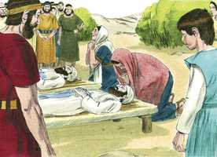

# 1Samuel Cap 04

**1** 	E VEIO a palavra de Samuel a todo o Israel; e Israel saiu à peleja contra os filisteus e acampou-se junto a Ebenézer; e os filisteus se acamparam junto a Afeque.

> **Cmt MHenry**: *Versículos 1-9* Israel é açoitado pelos filisteus. O pecado, a coisa maldita, estava no acampamento e deu aos inimigos toda a vantagem que podiam desejar. Reconheceram a mão de Deus em sua tribulação, porém em vez de submeter-se, falaram com raiva, como se não percebessem que tivessem cometido nenhuma provocação. A insensatez do homem entorta seu caminho, e depois seu coração se irrita contra Jeová ([Provérbios 19.3](../20A-Pv/19.md#3)), e o culpam a Ele. Supuseram que podiam comprometer a Deus a manifestar-se em favor deles, levando a arca a seu acampamento. Os que regressaram à vida de religião, às vezes demonstraram um grande afeto pelas observâncias externas, como se estas pudessem salvá-los e como se a arca, o trono de Deus, no acampamento, os conduzisse ao céu, ainda quando o mundo e a carne estejam entronizados no coração.

**2** 	E os filisteus se dispuseram em ordem de batalha, para sair contra Israel; e, estendendo-se a peleja, Israel foi ferido diante dos filisteus, porque feriram na batalha, no campo, uns quatro mil homens.

**3** 	E voltando o povo ao arraial, disseram os anciãos de Israel: Por que nos feriu o Senhor hoje diante dos filisteus? Tragamos de Siló a arca da aliança do Senhor, e venha no meio de nós, para que nos livre da mão de nossos inimigos.

**4** 	Enviou, pois, o povo a Siló, e trouxeram de lá a arca da aliança do Senhor dos Exércitos, que habita entre os querubins; e os dois filhos de Eli, Hofni e Finéias, estavam ali com a arca da aliança de Deus.

> **Cmt MHenry**: *CAPÍTULO 40N-Mt 41N-Mc 42N-Lc 43N-Joa 44N-At 45N-Rm 46N-1Co 47N-2Co 48N-Gl 49N-Ef

**5** 	E sucedeu que, vindo a arca da aliança do Senhor ao arraial, todo o Israel gritou com grande júbilo, até que a terra estremeceu.

**6** 	E os filisteus, ouvindo a voz de júbilo, disseram: Que voz de grande júbilo é esta no arraial dos hebreus? Então souberam que a arca do Senhor era vinda ao arraial.

**7** 	Por isso os filisteus se atemorizaram, porque diziam: Deus veio ao arraial. E diziam mais: Ai de nós! Tal nunca jamais sucedeu antes.

**8** 	Ai de nós! Quem nos livrará da mão desses grandiosos deuses? Estes são os deuses que feriram aos egípcios com todas as pragas junto ao deserto.

**9** 	Esforçai-vos, e sede homens, ó filisteus, para que porventura não venhais a servir aos hebreus, como eles serviram a vós; sede, pois, homens, e pelejai.

**10** 	Então pelejaram os filisteus, e Israel foi ferido, fugindo cada um para a sua tenda; e foi tão grande o estrago, que caíram de Israel trinta mil homens de pé.

> **Cmt MHenry**: *Versículos 10-11* A captura da arca foi um grande juízo contra Israel e sinal certo do desagrado de Deus. Que ninguém pense em escudar-se contra a ira de Deus sob o manto de uma profissão externa de fé.

**11** 	E foi tomada a arca de Deus: e os dois filhos de Eli, Hofni e Finéias, morreram.

 

**12** 	Então correu, da batalha, um homem de Benjamim, e chegou no mesmo dia a Siló; e trazia as vestes rotas, e terra sobre a cabeça.

> **Cmt MHenry**: *Versículos 12-18* A derrota do exército foi muito penosa para Eli, porquanto era o juiz; as notícias da morte de seus dois filhos, com os que tinha sido tão indulgente, e que morreram sem arrependimento, como tinha razão para temer, o comoveram como pai; mas havia uma preocupação maior ainda em seu espírito. Quando o mensageiro concluiu seu relato dizendo "a arca de Deus foi capturada", ele foi abatido no coração e morreu instantaneamente. Um homem pode morrer em forma miserável, e contudo não morrer eternamente; pode chegar a um final inoportuno, mas o final será paz.

**13** 	E, chegando ele, eis que Eli estava assentado numa cadeira, olhando para o caminho; porquanto o seu coração estava tremendo pela arca de Deus. Entrando, pois, aquele homem a anunciar isto na cidade, toda a cidade gritou.

**14** 	E Eli, ouvindo os gritos, disse: Que alvoroço é esse? Então chegou aquele homem apressadamente, e veio, e o anunciou a Eli.

**15** 	E era Eli da idade de noventa e oito anos; e estavam os seus olhos tão escurecidos, que já não podia ver.

**16** 	E disse aquele homem a Eli: Eu sou o que venho da batalha; porque eu fugi hoje da batalha. E disse ele: Que coisa sucedeu, filho meu?

**17** 	Então respondeu o que trazia as notícias, e disse: Israel fugiu de diante dos filisteus, e houve também grande matança entre o povo; e, além disso, também teus dois filhos, Hofni e Finéias, morreram, e a arca de Deus foi tomada.

**18** 	E sucedeu que, fazendo ele menção da arca de Deus, Eli caiu da cadeira para trás, ao lado da porta, e quebrou-se-lhe o pescoço e morreu; porquanto o homem era velho e pesado; e tinha ele julgado Israel quarenta anos.

**19** 	E, estando sua nora, a mulher de Finéias, grávida, e próxima ao parto, e ouvindo estas notícias, de que a arca de Deus era tomada, e de que seu sogro e seu marido morreram, encurvou-se e deu à luz; porquanto as dores lhe sobrevieram.

> **Cmt MHenry**: *Versículos 19-22* A esposa de Finéias parece ter sido uma pessoa piedosa. Seu lamento de moribunda foi pela perda da arca, e o traspasso filha glória de Israel. Que é um gozo terreno para quem está moribundo? Nenhum gozo, senão o espiritual e divino, resistirá então; a morte é algo demasiado grave para reconhecer o sabor de um gozo terreno. Que é isso para quem lamenta a perda da arca? Que prazer podemos achar em nossas consolações e deleites de criaturas, se necessitamos da palavra e das ordenanças de Deus, especialmente se quisermos o consolo de sua presença bondosa e a luz de Seu rosto? Se Deus vai embora, a glória vai embora, e todo o bom vai embora. Aí de nós se Ele vai embora! Todavia, embora a glória seja traspassada de uma nação, cidade ou aldeia pecadoras a outra, contudo, nunca se irá por completo, pois brilha num lugar, quando se eclipsa num outro. "

**20** 	E, ao tempo em que ia morrendo, disseram as mulheres que estavam com ela: Não temas, pois deste à luz um filho. Ela porém não respondeu, nem fez caso disso.

**21** 	E chamou ao menino Icabode, dizendo: De Israel se foi a glória! Porque a arca de Deus foi tomada, e por causa de seu sogro e de seu marido.

**22** 	E disse: De Israel a glória é levada presa; pois é tomada a arca de Deus.

> **Cmt MHenry** Intro: *• Versículos 1-9*> 28A-Os israelitas vencidos pelos filisteus*> *• Versículos 10-11*> *Captura da arca*> *• Versículos 12-18*> *A morte de Eli*> *• Versículos 19-22*> *Nascimento de Icabode*