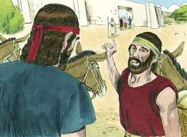
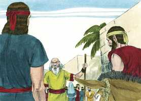
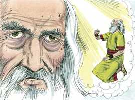
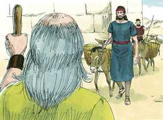
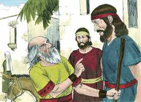

# 1Samuel Cap 09

**1** 	E HAVIA um homem de Benjamim, cujo nome era Quis, filho de Abiel, filho de Zeror, filho de Becorate, filho de Afia, filho de um homem de Benjamim; homem poderoso.

> **Cmt MHenry**: *Versículos 1-10* Saul saiu disposto a buscar os asnos de seu pai. Sua obediência para com seu pai era digna de elogio. Seu servo propôs que, como agora estavam em Ramá, visitassem a Samuel para pedi-lhe conselho. Onde nos encontremos devemos usar a oportunidade de familiarizar-nos com os que são sábios e bons. Muitos consultam a um homem de Deus se este se cruza em seu caminho, mas não dará um passo fora de sua senda para obter sabedoria. Sentimos muito as perdas mundanas e nos esforçamos para compensá-las, mas quão pouco tentamos procurar a salvação de nossa alma, e quão logo nos cansamos disto! Se os ministros dissessem aos homens como obter fortuna ou ficarem ricos, seriam mais consultados e teriam maior honra que agora, que se dedicam a ensiná-lhes como escapar da miséria eterna e obter a vida eterna. A maioria das pessoas preferiria que lhes dissessem sua sorte e não seu dever. Samuel não necessitava o dinheiro deles nem lhes teria negado conselho se nada tivessem trazido, contudo eles o deram como sinal de respeito e pelo valor que assinavam a seu ofício, e conforme com o costume generalizado da época, de levar sempre um presente aos que estão em autoridade.

**2** 	Este tinha um filho, cujo nome era Saul, moço, e tão belo que entre os filhos de Israel não havia outro homem mais belo do que ele; desde os ombros para cima sobressaía a todo o povo.

**3** 	E perderam-se as jumentas de Quis, pai de Saul; por isso disse Quis a Saul, seu filho: Toma agora contigo um dos moços, e levanta-te e vai procurar as jumentas.

**4** 	Passaram, pois, pela montanha de Efraim, e dali passaram à terra de Salisa, porém não as acharam; depois passaram à terra de Saalim, porém tampouco estavam ali; também passaram à terra de Benjamim, porém tampouco as acharam.

**5** 	Vindo eles então à terra de Zufe, Saul disse para o seu moço, com quem ele ia: Vem, e voltemos; para que porventura meu pai não deixe de inquietar-se pelas jumentas e se aflija por causa de nós.

**6** 	Porém ele lhe disse: Eis que há nesta cidade um homem de Deus, e homem honrado é; tudo quanto diz, sucede assim infalivelmente; vamo-nos agora lá; porventura nos mostrará o caminho que devemos seguir.

 

**7** 	Então Saul disse ao seu moço: Eis, porém, se lá formos, que levaremos então àquele homem? Porque o pão de nossos alforjes se acabou, e presente nenhum temos para levar ao homem de Deus; que temos?

**8** 	E o moço tornou a responder a Saul, e disse: Eis que ainda se acha na minha mão um quarto de um siclo de prata, o qual darei ao homem de Deus, para que nos mostre o caminho

**9** 	(Antigamente em Israel, indo alguém consultar a Deus, dizia assim: Vinde, e vamos ao vidente; porque ao profeta de hoje, antigamente se chamava vidente).

> **Cmt MHenry**: *CAPÍTULO 9*

**10** 	Então disse Saul ao moço: Bem dizes; vem, pois, vamos. E foram-se à cidade onde estava o homem de Deus.

**11** 	E, subindo eles à cidade, acharam umas moças que saíam a tirar água; e disseram-lhes: Está aqui o vidente?

> **Cmt MHenry**: *Versículos 11-17* As mesmas donzelas da cidade os conduziram ao profeta. Elas tinham ouvido do sacrifício e podiam falar da necessidade da presença de Samuel. não é pouco benefício viver em lugares santos e religiosos. sempre devemos estar prestes para ajudar aos que buscam aos profetas de Deus. Apesar de que Deus tinha concedido com desagrado o pedido de Israel de um rei, lhes envia um homem que os capitaneie, que os salve da mão dos filisteus. O faz em Sua graça, escutando seu clamor.

**12** 	E elas lhes responderam, e disseram: Sim, eis aí o tens diante de ti; apressa-te, pois, porque hoje veio à cidade; porquanto o povo tem hoje sacrifício no alto.

**13** 	Entrando vós na cidade, logo o achareis, antes que suba ao alto para comer; porque o povo não comerá, até que ele venha; porque ele é o que abençoa o sacrifício, e depois comem os convidados; subi, pois, agora, que hoje o achareis.

**14** 	Subiram, pois, à cidade; e, vindo eles no meio da cidade, eis que Samuel lhes saiu ao encontro, para subir ao alto.

 

**15** 	Porque o Senhor revelara isto aos ouvidos de Samuel, um dia antes que Saul viesse, dizendo:

**16** 	Amanhã a estas horas te enviarei um homem da terra de Benjamim, o qual ungirás por capitão sobre o meu povo de Israel, e ele livrará o meu povo da mão dos filisteus; porque tenho olhado para o meu povo; porque o seu clamor chegou a mim.

 

**17** 	E quando Samuel viu a Saul, o Senhor lhe respondeu: Eis aqui o homem de quem eu te falei. Este dominará sobre o meu povo.

 

**18** 	E Saul se chegou a Samuel no meio da porta, e disse: Mostra-me, peço-te, onde está a casa do vidente.

> **Cmt MHenry**: *Versículos 18-27* Samuel, aquele bom profeta, distava muito de invejar a Saul ou de tê-lhe má vontade; foi o primeiro e o mais inclinado a rendê-lhe honras. Tanto esse anoitecer como cedo na seguinte manhã, Samuel teve comunhão com Saul sobre o telhado da casa. Podemos supor que Samuel agora convencera a Saul de que Deus o havia nomeado para reinar, e que ele estava disposto a renunciar. Quão diferentes são os propósitos do Senhor para nós, do que são nossas próprias intenções! Talvez Saul era o único que sempre saia a buscar os asnos e, literalmente, achou um reino; porém muitos saíram e trasladaram sua morada em busca de riquezas e prazeres, e foram levados a lugares onde acharam a salvação para sua alma. assim, se encontraram com os que falaram como se soubessem os secretos de sua vida e de seu coração, e foram seriamente guiados a considerar a palavra do Senhor. Se este não tem sido nosso caso, embora nossos planos mundanos não tenham prosperado, não nos preocupemos por isso; o Senhor nos deu ou nos tem preparado para o que é muito melhor.

**19** 	E Samuel respondeu a Saul, e disse: Eu sou o vidente; sobe diante de mim ao alto, e comei hoje comigo; e pela manhã te despedirei, e tudo quanto está no teu coração, to declararei.

 

**20** 	E quanto às jumentas que há três dias se te perderam, não ocupes o teu coração com elas, porque já se acharam. E para quem é todo o desejo de Israel? Porventura não é para ti, e para toda a casa de teu pai?

**21** 	Então respondeu Saul, e disse: Porventura não sou eu filho de Benjamim, da menor das tribos de Israel? E a minha família a menor de todas as famílias da tribo de Benjamim? Por que, pois, me falas com semelhantes palavras?

**22** 	Porém Samuel tomou a Saul e ao seu moço, e os levou à câmara; e deu-lhes lugar acima de todos os convidados, que eram uns trinta homens.

**23** 	Então disse Samuel ao cozinheiro: Dá aqui a porção que te dei, de que te disse: Põe-na à parte contigo.

**24** 	Levantou, pois, o cozinheiro a espádua, com o que havia nela, e pô-la diante de Saul; e disse Samuel: Eis que o que foi reservado está diante de ti. Come; porque se guardou para ti para esta ocasião, dizendo eu: Tenho convidado o povo. Assim comeu Saul aquele dia com Samuel.

**25** 	Então desceram do alto para a cidade; e falou com Saul sobre o eirado.

**26** 	E se levantaram de madrugada; e sucedeu que, quase ao subir da alva, chamou Samuel a Saul ao eirado, dizendo: Levanta-te, e despedir-te-ei. Levantou-se Saul, e saíram ambos para fora, ele e Samuel.

**27** 	E, descendo eles para a extremidade da cidade, Samuel disse a Saul: Dize ao moço que passe adiante de nós (e passou); porém tu espera agora, e te farei ouvir a palavra de Deus.

> **Cmt MHenry** Intro: *• Versículos 1-10*> *Saul levado ante Samuel*> *• Versículos 11-17*> *Falam a Samuel sobre Saul*> *• Versículos 18-27*> *O trato que Samuel dá a Saul*