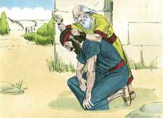
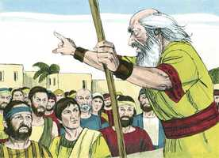
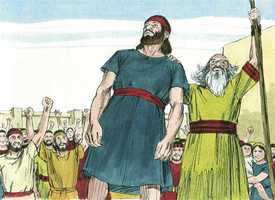

# 1Samuel Cap 10

**1** 	ENTÃO tomou Samuel um vaso de azeite, e lho derramou sobre a cabeça, e beijou-o, e disse: Porventura não te ungiu o Senhor por capitão sobre a sua herança?

> **Cmt MHenry**: *Versículos 1-8* A sagrada unção, então usada, indicava o grande Messias, o Ungido, o Rei da igreja e Sumo Sacerdote de nossa profissão, ungido com o óleo do Espírito, não por medida, senão sem medida, e por acima de todos os sacerdotes e príncipes da igreja judaica. Para maior satisfação de Saul, Samuel lhe dá alguns sinais que devem acontecer o mesmo dia. O primeiro lugar ao qual o dirige, era o sepulcro de um de seus antepassados; ali lembraria sua própria mortalidade e, agora que tinha uma coroa diante dele, devia pensar em seu túmulo, no qual toda sua honra ficaria sob o pó. Desde a época de Samuel parece ter havido escolas ou lugares públicos onde jovens piedosos eram levados ao conhecimento das coisas divinas. Saul deve ter-se sentido fortemente motivado a unir-se a eles para converter-se num homem distinto do que tinha sido. O Espírito de Deus muda os homens, os transforma maravilhosamente. Saul, louvando a Deus na comunhão dos santos, se tornou *outro* homem, mas pode duvidar-se de que chegasse a ser um homem *novo*.

 

**2** 	Apartando-te hoje de mim, acharás dois homens junto ao sepulcro de Raquel, no termo de Benjamim, em Zelza, os quais te dirão: Acharam-se as jumentas que foste buscar, e eis que já o teu pai deixou o negócio das jumentas, e anda aflito por causa de vós, dizendo: Que farei eu por meu filho?

**3** 	E quando dali passares mais adiante, e chegares ao carvalho de Tabor, ali te encontrarão três homens, que vão subindo a Deus a Betel; um levando três cabritos, o outro três bolos de pão e o outro um odre de vinho.

**4** 	E te perguntarão como estás, e te darão dois pães, que tomarás das suas mãos.

**5** 	Então chegarás ao outeiro de Deus, onde está a guarnição dos filisteus; e há de ser que, entrando ali na cidade, encontrarás um grupo de profetas que descem do alto, e trazem diante de si saltérios, e tambores, e flautas, e harpas; e eles estarão profetizando.

**6** 	E o Espírito do Senhor se apoderará de ti, e profetizarás com eles, e tornar-te-ás um outro homem.

**7** 	E há de ser que, quando estes sinais te vierem, faze o que achar a tua mão, porque Deus é contigo.

**8** 	Tu, porém, descerás antes de mim a Gilgal, e eis que eu descerei a ti, para sacrificar holocaustos, e para oferecer ofertas pacíficas; ali sete dias esperarás, até que eu venha a ti, e te declare o que hás de fazer.

**9** 	Sucedeu, pois, que, virando ele as costas para partir de Samuel, Deus lhe mudou o coração em outro; e todos aqueles sinais aconteceram naquele mesmo dia.

> **Cmt MHenry**: *Versículos 9-16* Os sinais que Samuel deu a Saul aconteceram pontualmente; achou que Deus tinha-lhe dado outro coração, outra disposição mental. Todavia, não confiem demasiado numa demonstração externa de devoção e numa mudança presente repentina. Saul entre os profetas seguia sendo Saul. O fato de ser ungido foi mantido em secreto. Deixa que Deus execute sua obra por meio de Samuel e fica calado, para ver em que dará tudo.

**10** 	E, chegando eles ao outeiro, eis que um grupo de profetas lhes saiu ao encontro; e o Espírito de Deus se apoderou dele, e profetizou no meio deles.

> **Cmt MHenry**: *CAPÍTULO 10A-2Sm

**11** 	E aconteceu que, como todos os que antes o conheciam viram que ele profetizava com os profetas, então disse o povo, cada um ao seu companheiro: Que é o que sucedeu ao filho de Quis? Está também Saul entre os profetas?

**12** 	Então um homem dali respondeu, e disse: Pois quem é o pai deles? Pelo que se tornou em provérbio: Está Saul também entre os profetas?

**13** 	E, acabando de profetizar, foi ao alto.

**14** 	E disse-lhe o tio de Saul, a ele e ao seu moço: Aonde fostes? E disse ele: A buscar as jumentas, e, vendo que não apareciam, fomos a Samuel.

**15** 	Então disse o tio de Saul: Declara-me, peço-te, o que vos disse Samuel?

**16** 	E disse Saul a seu tio: Declarou-nos, na verdade, que as jumentas foram encontradas. Porém o negócio do reino, de que Samuel falara, não lhe declarou.

**17** 	Convocou, pois, Samuel o povo ao Senhor, em Mizpá.

> **Cmt MHenry**: *Versículos 17-27* Samuel diz à gente: Vocês desprezaram hoje a seu Deus. Tão pouco interessado por esse poder estava Saul, que pouco depois de possuí-lo já não podia pensar em separar-se dele, que se escondeu. Bom é estar cientes de nossa indignidade e insuficiência para os serviços aos quais fomos chamados; mas os homens não devem ir-se ao outro extremo, recusando os serviços aos quais o Senhor e a igreja os chamam. A maior parte da gente tratou o assunto com indiferença. Saul foi modestamente a sua casa, porém foi acompanhado por um bando de homens cujos corações Deus preparou para apoiar sua autoridade. Se o coração se inclinar em qualquer momento em forma correta, é porque Ele o tocou. Um toque basta quando é divino. Outros o desprezaram. Tão diferente é a forma como nosso excelso Redentor afeta aos homens. Há um remanescente que se submete a Ele que o segue onde quer que vá; são os que foram tocados por Deus e aos que deu a disposição de segui-lo. porém, há outros que o desprezam, que perguntam: Como nos salvará este? Sentem-se ofendidos por Ele, e serão castigados.

**18** 	E disse aos filhos de Israel: Assim disse o Senhor Deus de Israel: Eu fiz subir a Israel do Egito, e livrei-vos da mão dos egípcios e da mão de todos os reinos que vos oprimiam.

 

**19** 	Mas vós tendes rejeitado hoje a vosso Deus, que vos livrou de todos os vossos males e trabalhos, e lhe tendes falado: Põe um rei sobre nós. Agora, pois, ponde-vos perante o Senhor, pelas vossas tribos e segundo os vossos milhares.

**20** 	Tendo, pois, Samuel feito chegar todas as tribos, tomou-se a tribo de Benjamim.

**21** 	E, fazendo chegar a tribo de Benjamim pelas suas famílias, tomou-se a família de Matri; e dela se tomou Saul, filho de Quis; e o buscaram, porém não se achou.

**22** 	Então tornaram a perguntar ao Senhor se aquele homem ainda viria ali. E disse o Senhor: Eis que se escondeu entre a bagagem.

**23** 	E correram, e o tomaram dali, e pôs-se no meio do povo; e era mais alto do que todo o povo desde o ombro para cima.

**24** 	Então disse Samuel a todo o povo: Vedes já a quem o Senhor escolheu? Pois em todo o povo não há nenhum semelhante a ele. Então jubilou todo o povo, e disse: Viva o rei!

 

**25** 	E declarou Samuel ao povo o direito do reino, e escreveu-o num livro, e pô-lo perante o Senhor; então despediu Samuel a todo o povo, cada um para sua casa.

**26** 	E foi também Saul à sua casa, em Gibeá; e foram com ele do exército aqueles cujos corações Deus tocara.

**27** 	Mas os filhos de Belial disseram: É este o que nos há de livrar? E o desprezaram, e não lhe trouxeram presentes; porém ele se fez como surdo.

> **Cmt MHenry** Intro: *• Versículos 1-8*> *Samuel unge a Saul*> *• Versículos 9-16*> *Saul profetiza*> *• Versículos 17-27*> *Saul escolhido rei*