# 1Samuel Cap 16

**1** 	ENTÃO disse o Senhor a Samuel: Até quando terás dó de Saul, havendo-o eu rejeitado, para que não reine sobre Israel? Enche um chifre de azeite, e vem, enviar-te-ei a Jessé o belemita; porque dentre os seus filhos me tenho provido de um rei.

> **Cmt MHenry**: *Versículos 1-5* Se vê que Saul tinha ficado muito mal. De que não seria culpável se pensou em matar a Samuel? Os anciãos de Belém tremeram ante a chegada de Samuel. Nos convém reverenciar os mensageiros de Deus e tremer diante de Sua palavra. Sua resposta foi: Sim, venho oferecer sacrifício a Jeová. Quando nosso Senhor Jesus veio ao mundo, mesmo que os homens tivessem razão para temer que sua missão era condenar o mundo, deu, contudo, toda a seguridade de que veio em paz, pois veio oferecer sacrifício e trouxe consigo sua oferta: Me preparas-te corpo. Santifiquemo-nos e confiemos em seu sacrifício.

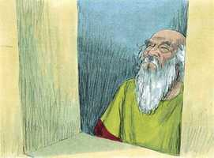 

**2** 	Porém disse Samuel: Como irei eu? pois, ouvindo-o Saul, me matará. Então disse o Senhor: Toma uma bezerra das vacas em tuas mãos, e dize: Vim para sacrificar ao Senhor.

**3** 	E convidarás a Jessé ao sacrifício; e eu te farei saber o que hás de fazer, e ungir-me-ás a quem eu te disser.

**4** 	Fez, pois, Samuel o que dissera o Senhor, e veio a Belém; então os anciãos da cidade saíram ao encontro, tremendo, e disseram: De paz é a tua vinda?

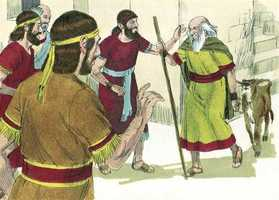 

**5** 	E disse ele: É de paz, vim sacrificar ao Senhor; santificai-vos, e vinde comigo ao sacrifício. E santificou ele a Jessé e a seus filhos, e os convidou ao sacrifício.

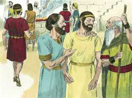 

**6** 	E sucedeu que, entrando eles, viu a Eliabe, e disse: Certamente está perante o Senhor o seu ungido.

> **Cmt MHenry**: *Versículos 6-13* Era raro que Samuel, que se havia decepcionado tanto de Saul, cujo rosto e estatura lhe recomendavam, julgasse a outro homem por seu aspecto exterior. Podemos dizer *como se vêm* os homens, porém Deus pode dizer 18A-Jo 46N-1Co 47N-2Co 62N-1Jo 63N-2Jo 64N-3Jo que são*. Ele julga os homens pelo coração. Freqüentemente nos formamos um juízo errado de um personagem, porém o Senhor valoriza somente a fé, o temor e o amor plantados no coração, por acima do discernimento humano. Deus não favorece a nossos filhos conforme a nossa parcialidade afetiva; freqüentemente, honra e abençoa os que foram menos considerados. Afinal, foi nomeado Davi. Ele era o filho menor de Jessé; seu nome significa Amado; era tipo do amado Filho de Deus. parecia que Davi era o menos dotado de todos os filhos de Jessé. Porém o Espírito do Senhor desceu sobre ele desde esse diâmetro em diante. Sua unção não foi uma cerimônia vazia; um poder divino veio com esse sinal instituído; ele se achou de repente com grande sabedoria e valor, com todas as capacidades de um príncipe, embora seu desenvolvimento não o devesse a circunstâncias externas. Isto lhe confirmava que sua eleição era de Deus. a melhor evidência de ser predestinado ao reino da glória é ser selado com o Espírito da promessa e experimentar uma obra de graça no coração.

**7** 	Porém o Senhor disse a Samuel: Não atentes para a sua aparência, nem para a grandeza da sua estatura, porque o tenho rejeitado; porque o Senhor não vê como vê o homem, pois o homem vê o que está diante dos olhos, porém o Senhor olha para o coração.

**8** 	Então chamou Jessé a Abinadabe, e o fez passar diante de Samuel, o qual disse: Nem a este tem escolhido o Senhor.

 

**9** 	Então Jessé fez passar a Sama; porém disse: Tampouco a este tem escolhido o Senhor.

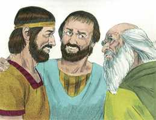 

**10** 	Assim fez passar Jessé a seus sete filhos diante de Samuel; porém Samuel disse a Jessé: O Senhor não tem escolhido a estes.

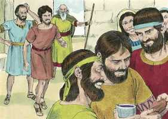 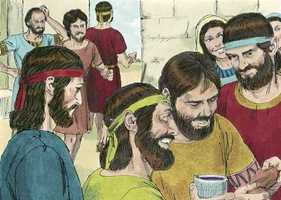 

**11** 	Disse mais Samuel a Jessé: Acabaram-se os moços? E disse: Ainda falta o menor, que está apascentando as ovelhas. Disse, pois, Samuel a Jessé: Manda chamá-lo, porquanto não nos assentaremos até que ele venha aqui.

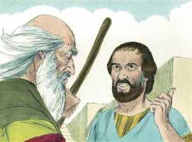 

**12** 	Então mandou chamá-lo e fê-lo entrar (e era ruivo e formoso de semblante e de boa presença); e disse o Senhor: Levanta-te, e unge-o, porque é este mesmo.

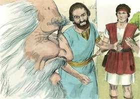 

**13** 	Então Samuel tomou o chifre do azeite, e ungiu-o no meio de seus irmãos; e desde aquele dia em diante o Espírito do Senhor se apoderou de Davi; então Samuel se levantou, e voltou a Ramá.

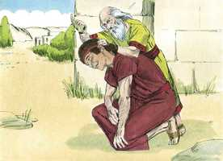 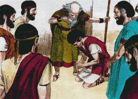 

**14** 	E o Espírito do Senhor se retirou de Saul, e atormentava-o um espírito mau da parte do Senhor.

> **Cmt MHenry**: *Versículos 14-23* Saul se aterrorizava de si mesmo. o Espírito do Senhor foi-se dele. Se Deus e sua graça não nos governam, o pecado e Satanás tomarão possessão de nós. O diabo, por permissão divina, perturbou e aterrorizou a Saul pelos humores corruptos de seus corpo e as paixões de sua mente. Ficou temeroso, beligerante, descontente e, às vezes, maluco. É uma pena que a música, que pode ser útil para o bom gênio da mente, seja sempre mal utilizada para respaldar a vaidade e a luxúria e seja ocasião para afastar o coração de Deus e das coisas serias. Isso é afastar o Espírito bom, não o mau. A música, as diversões, a companhia ou os negócios tem sido utilizados *por um tempo* para acalmar a consciência ferida; porém nada pode efetuar uma cura real, senão o sangue de Cristo aplicado com fé e o Espírito santificador que sela o perdão, por sua santa consolação. Todos os outros planos para dissipar a melancolia religiosa, o que farão com certeza é acrescentar o mal-estar, seja neste mundo ou no próximo.

**15** 	Então os criados de Saul lhe disseram: Eis que agora o espírito mau da parte de Deus te atormenta;

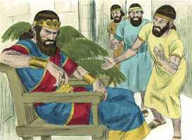 

**16** 	Diga, pois, nosso senhor a seus servos, que estão na tua presença, que busquem um homem que saiba tocar harpa, e será que, quando o espírito mau da parte de Deus vier sobre ti, então ele tocará com a sua mão, e te acharás melhor.

> **Cmt MHenry**: *CAPÍTULO 16A-Ne

**17** 	Então disse Saul aos seus servos: Buscai-me, pois, um homem que toque bem, e trazei-mo.

**18** 	Então respondeu um dos moços, e disse: Eis que tenho visto a um filho de Jessé, o belemita, que sabe tocar e é valente e vigoroso, e homem de guerra, e prudente em palavras, e de gentil presença; o Senhor é com ele.

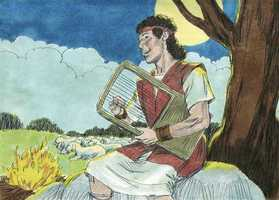 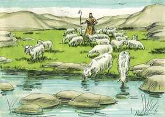 

**19** 	E Saul enviou mensageiros a Jessé, dizendo: Envia-me Davi, teu filho, o que está com as ovelhas.

**20** 	Então tomou Jessé um jumento carregado de pão, e um odre de vinho, e um cabrito, e enviou-os a Saul pela mão de Davi, seu filho.

**21** 	Assim Davi veio a Saul, e esteve perante ele, e o amou muito, e foi seu pajem de armas.

**22** 	Então Saul mandou dizer a Jessé: Deixa estar a Davi perante mim, pois achou graça em meus olhos.

**23** 	E sucedia que, quando o espírito mau da parte de Deus vinha sobre Saul, Davi tomava a harpa, e a tocava com a sua mão; então Saul sentia alívio, e se achava melhor, e o espírito mau se retirava dele.

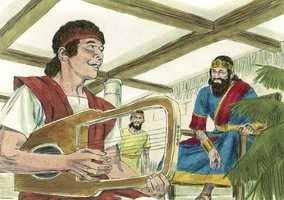 

> **Cmt MHenry** Intro: *• Versículos 1-5*> *Samuel enviado a Belém a Jessé*> *• Versículos 6-13*> *Unção de Davi*> *• Versículos 14-23*> *Saul perturbado por um espírito maligno, e acalmado por*