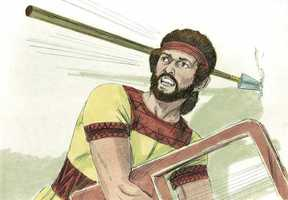
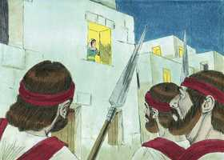
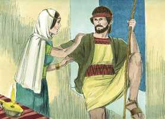
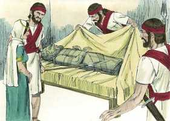
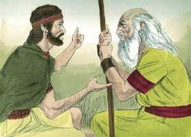

# 1Samuel Cap 19

**1** 	E FALOU Saul a Jônatas, seu filho, e a todos os seus servos, para que matassem a Davi. Porém Jônatas, filho de Saul, estava mui afeiçoado a Davi.

> **Cmt MHenry**: *Versículos 1-10* Que convincentes são as palavras retas! Por um tempo Saul esteve convencido do irracional de sua inimizade contra Davi; porém continuou com seu rancor. Tão incurável é o ódio da semente da serpente contra a da mulher, tão enganoso e perverso é o coração do homem sem a graça de Deus ([Jr 17.9](../24A-Jr/17.md#9)).

**2** 	E Jônatas o anunciou a Davi, dizendo: Meu pai, Saul, procura matar-te, pelo que agora guarda-te pela manhã, e fica-te em oculto, e esconde-te.

**3** 	E sairei eu, e estarei à mão de meu pai no campo em que estiverdes, e eu falarei de ti a meu pai, e verei o que há, e to anunciarei.

**4** 	Então Jônatas falou bem de Davi a Saul, seu pai, e disse-lhe: Não peque o rei contra seu servo Davi, porque ele não pecou contra ti, e porque os seus feitos te são muito bons.

**5** 	Porque expôs a sua vida, e feriu aos filisteus, e fez o Senhor um grande livramento a todo o Israel; tu mesmo o viste, e te alegraste; porque, pois, pecarias contra o sangue inocente, matando a Davi, sem causa?

**6** 	E Saul deu ouvidos à voz de Jônatas, e jurou Saul: Vive o Senhor, que não morrerá.

**7** 	E Jônatas chamou a Davi, e contou-lhe todas estas palavras; e Jônatas levou Davi a Saul, e esteve perante ele como antes.

**8** 	E tornou a haver guerra; e saiu Davi, e pelejou contra os filisteus, e feriu-os com grande matança, e fugiram diante dele.

**9** 	Porém o espírito mau da parte do Senhor se tornou sobre Saul, estando ele assentado em sua casa, e tendo na mão a sua lança; e tocava Davi com a mão, a harpa.

**10** 	E procurou Saul encravar a Davi na parede, porém ele se desviou de diante de Saul, o qual feriu com a lança a parede; então fugiu Davi, e escapou naquela mesma noite.

 

**11** 	Porém Saul mandou mensageiros à casa de Davi, que o guardassem, e o matassem pela manhã; do que Mical, sua mulher, avisou a Davi, dizendo: Se não salvares a tua vida esta noite, amanhã te matarão.

> **Cmt MHenry**: *Versículos 11-24* A estratagema de Mical para ganhar tempo até que Davi estiver longe era permissível, porém sua falsidade não teve nem sequer a defesa da necessidade para escusá-la e manifesta que ela não estava sob a influência do mesmo espírito de piedade revelado que havia ditado as palavras de Jônatas a Saul. Davi fez de Deus seu refúgio ao fugir a Samuel. Este, como profeta, era o melhor habilitado para aconselhá-lo a que fazer nesse momento perigoso. Achou pouco conforto ou satisfação na corte de Saul, e por iso foi buscá-lo na igreja de Samuel. quão pouco é o prazer que têm neste mundo os que têm uma vida de comunhão com Deus; a isto regressou Davi no momento difícil. Com tanta impaciência buscava Saul o sangue de Davi, tão inquieto estava em sua contra, que embora uma providência após outra a frustraram, não lograva perceber que Davi estava sob a proteção especial de Deus. Quando Deus toma este caminho para proteger a Davi, até Saul profetiza. Muitos têm grandes dons, mas nada de graça; podem profetizar no nome de Cristo, mas são desconhecidos por Ele. procuremos diariamente renovar a graça que será em nós como poço de água que brota para a vida eterna. Aferremo-nos à vaidade e à santidade com propósito pleno do coração. Em todo perigo e problema busquemos a proteção, o consolo e a direção das ordenanças de Deus.

 

**12** 	Então Mical desceu a Davi por uma janela; e ele se foi, e fugiu, e escapou.

 

**13** 	E Mical tomou uma estátua e a deitou na cama, e pôs-lhe à cabeceira uma pele de cabra, e a cobriu com uma coberta.

**14** 	E, mandando Saul mensageiros que trouxessem a Davi, ela disse: Está doente.

**15** 	Então Saul tornou a mandar mensageiros que fossem a Davi, dizendo: Trazei-mo na cama, para que o mate.

**16** 	Vindo, pois, os mensageiros, eis que a estátua estava na cama, e a pele de cabra à sua cabeceira.

 

**17** 	Então disse Saul a Mical: Por que assim me enganaste, e deixaste ir e escapar o meu inimigo? E disse Mical a Saul: Porque ele me disse: Deixa-me ir, por que hei de eu matar-te?

**18** 	Assim Davi fugiu e escapou, e foi a Samuel, em Ramá, e lhe participou tudo quanto Saul lhe fizera; e foram, ele e Samuel, e ficaram em Naiote.

 

**19** 	E o anunciaram a Saul, dizendo: Eis que Davi está em Naiote, em Ramá.

> **Cmt MHenry**: *CAPÍTULO 19A-Sl

**20** 	Então enviou Saul mensageiros para trazerem a Davi, os quais viram uma congregação de profetas profetizando, onde estava Samuel que presidia sobre eles; e o Espírito de Deus veio sobre os mensageiros de Saul, e também eles profetizaram.

**21** 	E, avisado disto Saul, enviou outros mensageiros, e também estes profetizaram; então enviou Saul ainda uns terceiros mensageiros, os quais também profetizaram.

**22** 	Então foi também ele mesmo a Ramá, e chegou ao poço grande que estava em Secu; e, perguntando, disse: Onde estão Samuel e Davi? E disseram-lhe: Eis que estão em Naiote, em Ramá.

**23** 	Então foi para Naiote, em Ramá; e o mesmo Espírito de Deus veio sobre ele, e ia profetizando, até chegar a Naiote, em Ramá.

**24** 	E ele também despiu as suas vestes, e profetizou diante de Samuel, e esteve nu por terra todo aquele dia e toda aquela noite; por isso se diz: Está também Saul entre os profetas?

> **Cmt MHenry** Intro: *• Versículos 1-10*> *Jônatas reconcilia a seu pai com Davi – Saul trata de matá-lo*> *outra vez*> *• Versículos 11-24*> *Davi foge a Samuel*