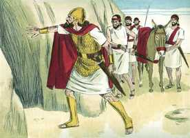
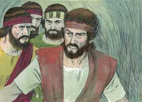
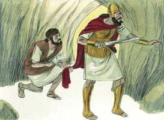

# 1Samuel Cap 24

**1** 	E SUCEDEU que, voltando Saul de perseguir os filisteus, anunciaram-lhe, dizendo: Eis que Davi está no deserto de En-Gedi.

> **Cmt MHenry**: *Versículos 1-7* Deus entregou a Saul nas mãos de Davi. Era uma oportunidade dada a Davi para exercer fé e paciência. Tinha-lhe sido prometido o reino, mas não tinha ordem de matar o rei. Arrazoa firmemente consigo mesmo e com seus homens em contra de fazer algum dano a Saul. o pecado é algo que nos deve causar sobressalto, e devemos resistir as tentações para pecar. Davi não só consideraria isto mau em si; tampouco toleraria que os seus o fizessem. Assim, devolveu bem por mal àquele de quem recebera mal por bem; deste modo, assentou um exemplo para todos os que se dizem cristãos, de não deixar-se vencer pelo mal, senão de vencer o mal com o bem.

**2** 	Então tomou Saul três mil homens, escolhidos dentre todo o Israel, e foi em busca de Davi e dos seus homens, até sobre os cumes das penhas das cabras montesas.

**3** 	E chegou a uns currais de ovelhas no caminho, onde estava uma caverna; e entrou nela Saul, a cobrir seus pés; e Davi e os seus homens estavam nos fundos da caverna.

 

**4** 	Então os homens de Davi lhe disseram: Eis aqui o dia, do qual o Senhor te diz: Eis que te dou o teu inimigo nas tuas mãos, e far-lhe-ás como te parecer bem aos teus olhos. E levantou-se Davi, e mansamente cortou a orla do manto de Saul.

  

**5** 	Sucedeu, porém, que depois o coração doeu a Davi, por ter cortado a orla do manto de Saul.

**6** 	E disse aos seus homens: O Senhor me guarde de que eu faça tal coisa ao meu senhor, ao ungido do Senhor, estendendo eu a minha mão contra ele; pois é o ungido do Senhor.

**7** 	E com estas palavras Davi conteve os seus homens, e não lhes permitiu que se levantassem contra Saul; e Saul se levantou da caverna, e prosseguiu o seu caminho.

**8** 	Depois também Davi se levantou, e saiu da caverna, e gritou por detrás de Saul, dizendo: Rei, meu senhor! E, olhando Saul para trás, Davi se inclinou com o rosto em terra, e se prostrou.

> **Cmt MHenry**: *Versículos 8-15* Davi foi acusado falsamente de que procurava o mal de Saul; demonstra a Saul que a providência de Deus tinha-lhe dado a oportunidade de fazê-lo. e foi com um bom princípio que se negou a fazê-lo. declara sua decidida resolução de não ser jamais seu próprio vingador. Se os homens lhe fizerem mal, Deus nos fará bem ao máximo no juízo do grande dia.

**9** 	E disse Davi a Saul: Por que dás tu ouvidos às palavras dos homens que dizem: Eis que Davi procura o teu mal?

**10** 	Eis que este dia os teus olhos viram, que o Senhor hoje te pôs em minhas mãos nesta caverna, e alguns disseram que te matasse; porém a minha mão te poupou; porque disse: Não estenderei a minha mão contra o meu senhor, pois é o ungido do Senhor.

**11** 	Olha, pois, meu pai, vê aqui a orla do teu manto na minha mão; porque cortando-te eu a orla do manto, não te matei. Sabe, pois, e vê que não há na minha mão nem mal nem rebeldia alguma, e não pequei contra ti; porém tu andas à caça da minha vida, para ma tirares.

 

**12** 	Julgue o Senhor entre mim e ti, e vingue-me o Senhor de ti; porém a minha mão não será contra ti.

**13** 	Como diz o provérbio dos antigos: Dos ímpios procede a impiedade; porém a minha mão não será contra ti.

**14** 	Após quem saiu o rei de Israel? A quem persegues? A um cão morto? A uma pulga?

**15** 	O Senhor, porém, será juiz, e julgará entre mim e ti, e verá, e advogará a minha causa, e me defenderá da tua mão.

**16** 	E sucedeu que, acabando Davi de falar a Saul todas estas palavras, disse Saul: É esta a tua voz, meu filho Davi? Então Saul levantou a sua voz e chorou.

> **Cmt MHenry**: *Versículos 16-22* Saul fala totalmente vencido pela bondade de Davi. Muitos se lamentam de seus pecados sem arrepender-se verdadeiramente deles; choram amargamente por eles, porém continuam apaixonados deles, e ligados a eles. Agora Deus cumpriu a Davi a palavra com que lhe tinha feito ter esperanças de que faria reluzir sua justiça como a luz ([Sl 37.6](../19A-Sl/37.md#6)). os que se cuidam de manter uma boa consciência, podem deixar que Deus lhes dê o crédito por ela. Cedo ou tarde, Deus forçará até àqueles que são da sinagoga de sentimento a que conheçam e aceitem aos que Ele amou. Eles se separaram em paz. Saul foi para sua casa convicto, mas não convertido; envergonhado de sua inveja por Davi, porém retendo em seu peito essa raiz de amargura; irritado de que quando por fim tinha achado a Davi, não teve seu coração para destruí-lo, como se havia proposto. O rancor parece freqüentemente morto quando somente está dormido, e reviverá com dupla força. Contudo, seja que o Senhor amarre as mãos dos homens ou afete seus corações, de modo que não nos firam, a liberação é igualmente Sua; é prova de Seu amor e antecipo de nossa salvação, e deve tornar-nos agradecidos.

**17** 	E disse a Davi: Mais justo és do que eu; pois tu me recompensaste com bem, e eu te recompensei com mal.

 

**18** 	E tu mostraste hoje que procedeste bem para comigo, pois o Senhor me tinha posto em tuas mãos, e tu não me mataste.

**19** 	Porque, quem há que, encontrando o seu inimigo, o deixaria ir por bom caminho? O Senhor, pois, te pague com bem, por isso que hoje me fizeste.

**20** 	Agora, pois, eis que bem sei que certamente hás de reinar, e que o reino de Israel há de ser firme na tua mão.

**21** 	Portanto agora jura-me pelo Senhor que não desarraigarás a minha descendência depois de mim, nem desfarás o meu nome da casa de meu pai.

**22** 	Então jurou Davi a Saul. E foi Saul para a sua casa; porém Davi e os seus homens subiram ao lugar forte.

> **Cmt MHenry** Intro: *CAPÍTULO 24A-Jr> *• Versículos 1-7*> *Davi perdoa a vida de Saul*> *• Versículos 8-15*> *Davi demonstra sua inocência*> *• Versículos 16-22*> *Saul reconhece sua falta*