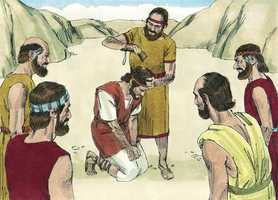

# 2 Samuel Cap 02

**1** 	E SUCEDEU depois disto que Davi consultou ao Senhor, dizendo: Subirei a alguma das cidades de Judá? E disse-lhe o Senhor: Sobe. E falou Davi: Para onde subirei? E disse: Para Hebrom.

> **Cmt MHenry**: *Versículos 1-7* Depois de morrer Saul, muitos se uniram a Davi em Ziclague ([1 Cr 12.22](../46N-1Co/12.md#22)), mas ele confiou em Deus, que lhe prometeu o reino, que lhe seria dado a seu tempo e a Seu jeito. Contudo, a segura esperança da promessa de Deus iniciará boas empresas. Se eu for eleito para a coroa de vida, não se segue que "então, eu já não faço nada", senão que "então, farei todo o que Deus me mandar". Este bom uso fez Davi de sua eleição e assim agirão todos os eleitos de Deus. Em todas nossas viagens e mudanças é consolador ver que Deus vai diante nosso; e podemos fazê-lo, se pela fé e a oração o colocamos por diante de nós. Ele escolheu a senda de Davi conforme com a promessa. Davi ascendeu paulatinamente: deste modo, o reino do Messias, o Filho de Davi, se estabelece gradualmente; Ele é o Senhor de tuso, porém ainda não vemos todas as coisas submetidas a Ele.

**2** 	E subiu Davi para lá, e também as suas duas mulheres, Ainoã, a jizreelita, e Abigail, a mulher de Nabal, o carmelita.

> **Cmt MHenry**: *CAPÍTULO 20A-Pv 21A-Ec 22A-Ct 23A-Is 24A-Jr 25A-Lm 26A-Ez 27A-Dn 28A-Os 29A-Jl

**3** 	Fez também Davi subir os homens que estavam com ele, cada um com a sua família; e habitaram nas cidades de Hebrom.

**4** 	Então vieram os homens de Judá, e ungiram ali a Davi rei sobre a casa de Judá. E deram avisos a Davi, dizendo: Os homens de Jabes-Gileade foram os que sepultaram a Saul.

 

**5** 	Então enviou Davi mensageiros aos homens de Jabes-Gileade, para dizer-lhes: Benditos sejais vós do Senhor, que fizestes tal beneficência a vosso senhor, a Saul, e o sepultastes!

**6** 	Agora, pois, o Senhor use convosco de beneficência e fidelidade; e também eu vos farei este bem, porquanto fizestes isto.

**7** 	Esforcem-se, pois, agora as vossas mãos, e sede homens valentes, pois Saul, vosso senhor, é morto, mas também os da casa de Judá já me ungiram a mim por seu rei.

**8** 	Porém Abner, filho de Ner, capitão do exército de Saul, tomou a Is-Bosete, filho de Saul, e o fez passar a Maanaim,

> **Cmt MHenry**: *Versículos 8-17* Em geral, a nação rejeitou a Davi. Por este médio, preparou o Senhor a seu servo para sua futura honra e utilidade; e ficou demonstrada a tendência da verdadeira piedade em sua conduta, apesar de experimentar diversas dificuldades. Davi foi nisto um tipo de Cristo, porque Israel não se submeteria a Ele, embora tinha sido ungido pelo Pai para ser Príncipe e Salvador deles. Abner quis dizer que os jovens *lutem* diante de nós, quando disse: "Deixa levantar os moços, e joguem diante de nós": assim os néscios zombam do pecado. mas é indigno de ser chamado humano quem pode jogar assim com o sangue humano.

**9** 	E o constituiu rei sobre Gileade, e sobre os assuritas, e sobre Jizreel, e sobre Efraim, e sobre Benjamim, e sobre todo o Israel.

**10** 	Da idade de quarenta anos era Is-Bosete, filho de Saul, quando começou a reinar sobre Israel, e reinou dois anos; mas os da casa de Judá seguiam a Davi.

**11** 	E foi o número dos dias que Davi reinou em Hebrom, sobre a casa de Judá, sete anos e seis meses.

**12** 	Então saiu Abner, filho de Ner, com os servos de Is-Bosete, filho de Saul, de Maanaim a Gibeom.

**13** 	Saíram também Joabe, filho de Zeruia, e os servos de Davi, e se encontraram uns com os outros perto do tanque de Gibeom; e pararam estes deste lado do tanque, e os outros do outro lado do tanque.

**14** 	E disse Abner a Joabe: Deixa levantar os moços, e joguem diante de nós. E disse Joabe: Levantem-se.

**15** 	Então se levantaram, e passaram, em número de doze de Benjamim, da parte de Is-Bosete, filho de Saul, e doze dos servos de Davi.

**16** 	E cada um lançou mão da cabeça do outro, cravou-lhe a espada no lado, e caíram juntos, por isso se chamou àquele lugar Helcate-Hazurim, que está junto a Gibeom.

**17** 	E seguiu-se naquele dia uma crua peleja; porém Abner e os homens de Israel foram feridos diante dos servos de Davi.

**18** 	E estavam ali os três filhos de Zeruia, Joabe, Abisai, e Asael; e Asael era ligeiro de pés, como as gazelas do campo.

> **Cmt MHenry**: *Versículos 18-24* A morte costuma chegar pelos caminhos menos suspeitos. Freqüentemente somos traídos pelas façanhas que nos orgulham! A velocidade de Asael, da qual ele tanto presumia, não lhe serviu; antes, apressou seu final.

**19** 	E Asael perseguiu a Abner; e não se desviou de detrás de Abner, nem para a direita nem para a esquerda.

**20** 	E Abner, olhando para trás, perguntou: És tu Asael? E ele falou: Eu sou.

**21** 	Então lhe disse Abner: Desvia-te para a direita, ou para a esquerda, e lança mão de um dos moços, e toma os seus despojos. Porém Asael não quis desviar-se de detrás dele.

**22** 	Então Abner tornou a dizer a Asael: Desvia-te de detrás de mim; por que hei de eu ferir-te e dar contigo em terra? E como levantaria eu o meu rosto diante de Joabe, teu irmão?

**23** 	Porém, não querendo ele se desviar, Abner o feriu com a ponta da lança pela quinta costela, e a lança lhe saiu por detrás, e caiu ali, e morreu naquele mesmo lugar; e sucedeu que, todos os que chegavam ao lugar onde Asael caiu e morreu, paravam.

**24** 	Porém Joabe e Abisai perseguiram a Abner; e pôs-se o sol, chegando eles ao outeiro de Amá, que está diante de Gia, junto ao caminho do deserto de Gibeão.

**25** 	E os filhos de Benjamim se ajuntaram atrás de Abner, e fizeram um batalhão, e puseram-se no cume de um outeiro.

> **Cmt MHenry**: *Versículos 25-32* Abner chama a atenção de Joabe sobre as más conseqüências de uma guerra civil. Os que tomam levianamente tais lutas antinaturais, acharão que são amargura para todos os envolvidos. Quão fácil é que os homens usem a razão quando lhes convêm, mas não a usem se lhes for inconveniente! Veja-se como o curso dos acontecimentos altera o propósito dos homens! o mesmo que parecia grato pela manhã, pela noite se vê deprimente. Os mais dados a começar uma contenda, se arrependerão antes que tenha acabado, e teria sido melhor deixá-la antes de meter-se nela, como aconselha Salomão. Isto vale para todo pecado: oh, que os homens considerassem a tempo o que afinal trará amargura! Aqui se menciona o funeral de Asael. Se faz distinção entre o pó de alguns e o de outros, porém na ressurreição não haverá diferença senão entre os santos e os ímpios, a qual perdurará. "

**26** 	Então Abner gritou a Joabe, e disse: Consumirá a espada para sempre? Não sabes tu que por fim haverá amargura? E até quando não hás de dizer ao povo que deixe de perseguir a seus irmãos?

**27** 	E disse Joabe: Vive Deus, que, se não tivesses falado, só pela manhã o povo teria cessado, cada um, de perseguir a seu irmão.

**28** 	Então Joabe tocou a buzina, e todo o povo parou, e não perseguiram mais a Israel; e tampouco pelejaram mais.

**29** 	E caminharam Abner e os seus homens toda aquela noite pela planície; e, passando o Jordão, caminharam por todo o Bitrom, e chegaram a Maanaim.

**30** 	Também Joabe voltou de perseguir a Abner, e ajuntou todo o povo; e dos servos de Davi faltaram dezenove homens, e Asael.

**31** 	Porém os servos de Davi feriram dentre os de Benjamim, e dentre os homens de Abner, a trezentos e sessenta homens, que ali ficaram mortos.

**32** 	E levantaram a Asael, e sepultaram-no na sepultura de seu pai, que estava em Belém; e Joabe e seus homens caminharam toda aquela noite, e amanheceu-lhes o dia em Hebrom.

> **Cmt MHenry** Intro: *• Versículos 1-7*> *Davi coroado rei em Hebrom*> *• Versículos 8-17*> *Abner coroa rei a Is-Bosete – Batalha entre os homens de*> *Abner e Joabe*> *• Versículos 18-24*> *Abner mata a Asael*> *• Versículos 25-32*> *Ambos bandos retrocedem*