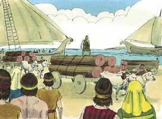

# 2 Samuel Cap 05

**1** 	ENTÃO todas as tribos de Israel vieram a Davi, em Hebrom, e falaram, dizendo: Eis-nos aqui, somos teus ossos e tua carne.

> **Cmt MHenry**: *Versículos 1-5* Davi foi ungido rei pela terceira vez. Seu progresso foi gradual para provar sua fé e para que ganhasse experiência. Deste modo, seu reinado tipifica o do Messias, que alcançaria sua altura gradualmente. Assim Jesus chegou a ser nosso irmão, tomou nossa natureza, habitou nela para chegar a ser nosso Príncipe e Salvador: o pecador humilhado recebe alento da relação de amor, pede sua salvação, se submete a sua autoridade e anela sua proteção.

**2** 	E também outrora, sendo Saul ainda rei sobre nós, eras tu o que saías e entravas com Israel; e também o Senhor te disse: Tu apascentarás o meu povo de Israel, e tu serás príncipe sobre Israel.

**3** 	Assim, pois, todos os anciãos de Israel vieram ao rei, em Hebrom; e o rei Davi fez com eles acordo em Hebrom, perante o Senhor; e ungiram a Davi rei sobre Israel.

**4** 	Da idade de trinta anos era Davi quando começou a reinar; quarenta anos reinou.

**5** 	Em Hebrom reinou sobre Judá sete anos e seis meses, e em Jerusalém reinou trinta e três anos sobre todo o Israel e Judá.

> **Cmt MHenry**: *CAPÍTULO 50N-Fp 51N-Cl 52N-1Ts 53N-2Ts 54N-1Tm 55N-2Tm 56N-Tt 57N-Fm 58N-Hb 59N-Tg

**6** 	E partiu o rei com os seus homens a Jerusalém, contra os jebuseus que habitavam naquela terra; e falaram a Davi, dizendo: Não entrarás aqui, pois os cegos e os coxos te repelirão, querendo dizer: Não entrará Davi aqui.

> **Cmt MHenry**: *Versículos 6-10* Os inimigos do Povo de Deus costumam estar muito confiados em sua própria força, e completamente seguros quando se aproxima o dia de sua queda. Mas o orgulho e a insolência dos jebuseus animou a Davi, e o Senhor Deus dos exércitos esteve com ele. Da mesma forma, no dia do poder de Deus, a praça forte de Satanás, a coração humano, é mudado em morada de Deus pelo Espírito, e num trono sobre o qual reina o Filho de Davi, e leva todo pensamento cativo a sua obediência. Que ele venha desse modo, e recupere e limpe nossos corações; e que, destruindo todo ídolo, reine ali para sempre!

**7** 	Porém Davi tomou a fortaleza de Sião; esta é a cidade de Davi.

**8** 	Porque Davi disse naquele dia: Qualquer que ferir aos jebuseus, suba ao canal e fira aos coxos e aos cegos, a quem a alma de Davi odeia. Por isso se diz: Nem cego nem coxo entrará nesta casa.

**9** 	Assim habitou Davi na fortaleza, e a chamou a cidade de Davi; e Davi foi edificando em redor, desde Milo para dentro.

**10** 	E Davi ia, cada vez mais, aumentando e crescendo, porque o Senhor Deus dos Exércitos era com ele.

**11** 	E Hirão, rei de Tiro, enviou mensageiros a Davi, e madeira de cedro, e carpinteiros, e pedreiros que edificaram a Davi uma casa.

> **Cmt MHenry**: *Versículos 11-16* A casa de Davi não era a pior nem a menos apta para ser dedicada a Deus, por ter sido edificada por estrangeiros. Se profetiza da igreja do evangelho que "estrangeiros edificarão teus muros, e seus reis te servirão" ([Is 60.10](../23A-Is/60.md#10)). O governo de Davi estava arraigado e edificado. Davi foi instaurado rei; assim é o Filho de Davi, e todos os que por Ele são feitos reis e sacerdotes para nosso Deus. Nunca tinha parecido tão grande a nação de Israel como agora começava a ser. Muitos têm o favor e o amor de Deus, porém não o percebem, e querem seu consolo; porque a felicidade está em ser exaltado a isso e percebê-lo. Davi reconhece que Deus tinha feito grandes coisas por ele por amor de seu povo, para que ele fosse uma bênção para eles, e que eles fossem felizes sob seu reinado. Versículos 17-25 Os filisteus não consideraram que Davi tinha consigo a presença de Deus, coisa que Saul tinha rejeitado e perdido. O reino do Messias foi atacado pelas potestades das trevas em quanto foi instaurado no mundo. Os pagãos se enfureceram, e os reis da terra se opuseram, mas tudo foi em vão ([Sl 2.1](../19A-Sl/02.md#1) ss). A destruição se voltará sobre o próprio reino de Satanás, como aconteceu aqui. Davi confessa que depende de Deus para a vitória e se encomenda ao beneplácito de Deus, "O farás?" A certeza que Deus nos deu da vitória sobre nossos inimigos espirituais deveria dar-nos valor em nossos conflitos espirituais. Davi esperou até que Deus se moveu; então se moveu ele, mas não antes. Estava preparado para depender de Deus e sua providência. Deus cumpriu sua promessa e Davi não deixou de aproveitar suas vantagens. Quando o reino do Messias ia ser estabelecido, os apóstolos, que derrotariam o reinado do diabo, não deviam tentar coisa alguma até que recebessem o Espírito da promessa, que veio desde o céu com um ruído como de vento forte que soprava ([Atos 2.2](../44N-At/02.md#2)). "

 

**12** 	E entendeu Davi que o Senhor o confirmara rei sobre Israel, e que exaltara o seu reino por amor do seu povo.

**13** 	E tomou Davi mais concubinas e mulheres de Jerusalém, depois que viera de Hebrom; e nasceram a Davi mais filhos e filhas.

**14** 	E estes são os nomes dos que lhe nasceram em Jerusalém: Samua, e Sobabe, e Natã, e Salomão,

**15** 	E Ibar, e Elisua, e Nefegue, e Jafia,

**16** 	E Elisama, e Eliada, e Elifelete.

**17** 	Ouvindo, pois, os filisteus que haviam ungido a Davi rei sobre Israel, todos os filisteus subiram em busca de Davi; o que ouvindo Davi, desceu à fortaleza.

**18** 	E os filisteus vieram, e se estenderam pelo vale de Refaim.

**19** 	E Davi consultou ao Senhor, dizendo: Subirei contra os filisteus? Entregar-mos-ás nas minhas mãos? E disse o Senhor a Davi: Sobe, porque certamente entregarei os filisteus nas tuas mãos.

**20** 	Então foi Davi a Baal-Perazim; e feriu-os ali Davi, e disse: Rompeu o Senhor a meus inimigos diante de mim, como quem rompe águas. Por isso chamou o nome daquele lugar Baal-Perazim.

**21** 	E deixaram ali os seus ídolos; e Davi e os seus homens os tomaram.

**22** 	E os filisteus tornaram a subir, e se estenderam pelo vale de Refaim.

**23** 	E Davi consultou ao Senhor, o qual disse: Não subirás; mas rodeia por detrás deles, e virás a eles por defronte das amoreiras.

**24** 	E há de ser que, ouvindo tu um estrondo de marcha pelas copas das amoreiras, então te apressarás; porque o Senhor saiu então diante de ti, a ferir o arraial dos filisteus.

**25** 	E fez Davi assim como o Senhor lhe tinha ordenado; e feriu os filisteus desde Geba, até chegar a Gezer.

> **Cmt MHenry** Intro: *• Versículos 1-5*> *Davi reina sobre todo Israel*> *• Versículos 6-10*> *Toma a fortaleza de Sião*> *• Versículos 11-16*> *O reino de Davi se estabelece*> *• Versículos 17-25*> *A derrota dos filisteus*