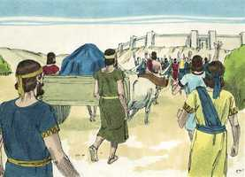
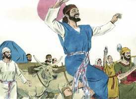
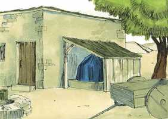
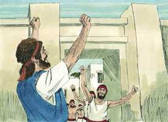
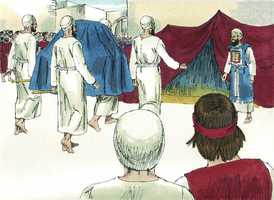
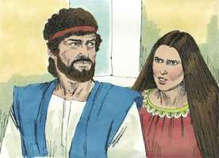

# 2 Samuel Cap 06

**1** 	E TORNOU Davi a ajuntar todos os escolhidos de Israel, em número de trinta mil.

> **Cmt MHenry**: *Versículos 1-5* Deus está presente na alma de seu povo, quando querem os sinais externos de sua presença, mas agora que Davi está instalado no trono, começa a reviver a honra da arca. Aprendamos disto a pensar e falar de Deus com altura; e a pensar e falar com honra das sagradas ordenanças, que são para nós o que a arca era para Israel, o sinal da presença de Deus ([Mt 28.20](../40N-Mt/28.md#20)). Cristo é nossa Arca; em e por Ele manifesta Deus sua mediação, na que se mostra o nome de Jeová e todas Suas glórias. Os sacerdotes deviam levar a arca sobre seus ombros. Os filisteus podem levar a arca num carro sem sofrer por isso, todavia os israelitas não podem, pois isto não era o disposto por Deus.

**2** 	E levantou-se Davi, e partiu, com todo o povo que tinha consigo, para Baalim de Judá, para levarem dali para cima a arca de Deus, sobre a qual se invoca o nome, o nome do Senhor dos Exércitos, que se assenta entre os querubins.

 

**3** 	E puseram a arca de Deus em um carro novo, e a levaram da casa de Abinadabe, que está em Gibeá; e Uzá e Aiô, filhos de Abinadabe, guiavam o carro novo.

**4** 	E levando-o da casa de Abinadabe, que está em Gibeá, com a arca de Deus, Aiô ia adiante da arca.

**5** 	E Davi, e toda a casa de Israel, festejavam perante o Senhor, com toda a sorte de instrumentos de pau de faia, como também com harpas, e com saltérios, e com tamboris, e com pandeiros, e com címbalos.

 

**6** 	E, chegando à eira de Nacom, estendeu Uzá a mão à arca de Deus, e pegou nela; porque os bois a deixavam pender.

> **Cmt MHenry**: *Versículos 6-11* Uzá foi morto de um só golpe por tocar a arca. Deus véu presunção e irreverência no coração de Uzá. A familiaridade com o mais digno de reverência, serve muito bem para despertar o desprezo.. se for um crime tão grande que alguém tocasse a arca da aliança, sem ter direito de fazê-lo, o que será dos que pretendem ter os privilégios da aliança sem viver à altura desta? Obede-Edom abriu suas portas sem medo, sabendo que a arca era sabor de morte para morte somente para os que a tratavam em forma incorreta. A mesma mão que castigou a orgulha presunção de Uzá, recompensou a ousadia humilde de Obede-Edom. Que ninguém pense o pior do evangelho pelos juízos dos que o rejeitam, antes considere as bênçãos que traz para todos os que o recebem. Os chefes de família sejam estimulados a preservar a religião em sua família. É bom viver numa família que recebe a arca, porque todo o que a rodear andará melhor.

> **Cmt MHenry**: *CAPÍTULO 60N-1Pe 61N-2Pe 62N-1Jo 63N-2Jo 64N-3Jo 65N-Jd 66N-Ap

**7** 	Então a ira do Senhor se acendeu contra Uzá, e Deus o feriu ali por esta imprudência; e morreu ali junto à arca de Deus.

 

**8** 	E Davi se contristou, porque o Senhor abrira rotura em Uzá; e chamou àquele lugar Perez-Uzá, até ao dia de hoje.

**9** 	E temeu Davi ao Senhor naquele dia; e disse: Como virá a mim a arca do Senhor?

**10** 	E não quis Davi retirar para junto de si a arca do Senhor, à cidade de Davi; mas Davi a fez levar à casa de Obede-Edom, o giteu.

 

**11** 	E ficou a arca do Senhor em casa de Obede-Edom, o giteu, três meses; e abençoou o Senhor a Obede-Edom, e a toda a sua casa.

**12** 	Então avisaram a Davi, dizendo: Abençoou o Senhor a casa de Obede-Edom, e tudo quanto tem, por causa da arca de Deus; foi pois Davi, e trouxe a arca de Deus para cima, da casa de Obede-Edom, à cidade de Davi, com alegria.

> **Cmt MHenry**: *Versículos 12-19* Ficou evidente que era bem-aventurado o homem que tinha a arca perto dele. Cristo é sem dúvida pedra de tropeço, e Rocha de escândalo para os desobedientes, porém para os que crêem, Ele é a Pedra do ângulo, eleita, preciosa ([1 Pe 2.6-8](../60N-1Pe/02.md#6)). Sejamos religiosos. É a arca uma bênção para as casas dos outros? nós podemos tê-la, com sua bênção, sem roubá-la de nossos vizinhos. Davi ofereceu sacrifícios a Deus ao partir. Provavelmente nos vã bem em nossos esforços quando comecemos com Deus e diligentemente busquemos estar em paz com Ele. Somos tão indignos e nosso serviço tão contaminado, que todo nosso gozo em Deus deve relacionar-se com o arrependimento e a fé no sangue expiatório do Redentor. Davi estava presente com grandes expressões de gozo. devemos servir a Deus com todo nosso corpo e alma, e com todo dom e poder que possuamos. Nesta ocasião, Davi deixou de lado suas roupas reais e se pôs uma simples túnica de linho. Davi orou com o povo e por eles, e como profeta os abençoou solenemente em nome do Senhor.

 

**13** 	E sucedeu que, quando os que levavam a arca do Senhor tinham dado seis passos, sacrificava bois e carneiros cevados.

 

**14** 	E Davi saltava com todas as suas forças diante do Senhor; e estava Davi cingido de um éfode de linho.

**15** 	Assim subindo, levavam Davi e todo o Israel a arca do Senhor, com júbilo, e ao som das trombetas.

**16** 	E sucedeu que, entrando a arca do Senhor na cidade de Davi, Mical, a filha de Saul, estava olhando pela janela; e, vendo ao rei Davi, que ia bailando e saltando diante do Senhor, o desprezou no seu coração.

**17** 	E introduzindo a arca do Senhor, a puseram no seu lugar, na tenda que Davi lhe armara; e ofereceu Davi holocaustos e ofertas pacíficas perante o Senhor.

**18** 	E acabando Davi de oferecer os holocaustos e ofertas pacíficas, abençoou o povo em nome do Senhor dos Exércitos.

**19** 	E repartiu a todo o povo, e a toda a multidão de Israel, desde os homens até às mulheres, a cada um, um bolo de pão, e um bom pedaço de carne, e um frasco de vinho; então retirou-se todo o povo, cada um para sua casa,

**20** 	E, voltando Davi para abençoar a sua casa, Mical, a filha de Saul, saiu a encontrar-se com Davi, e disse: Quão honrado foi o rei de Israel, descobrindo-se hoje aos olhos das servas de seus servos, como sem pejo se descobre qualquer dos vadios.

> **Cmt MHenry**: *Versículos 20-23* Davi regressou para abençoar sua casa, para orar por eles e com eles, e para oferecer sua ação de graças familiar por esta misericórdia nacional. Trabalho de anjos é adorar a Deus e, certamente, não pode rebaixar ao maior dos homens. Contudo, nem sequer os palácios dos príncipes estão isentos de problemas familiares. Os exercícios da religião podem parecer errados aos olhos dos que têm pouca ou nenhuma religião em si mesmos. Se nos apresentamos ante Deus aprovados no que fazemos em religião, e o fazemos diante do Senhor, não devemos prestar ouvidos às repreensões. A piedade terá seu elogio: não sejamos indiferentes, nem temamos nem nos envergonhemos ao reconhecê-lo. Davi se contentou com justificar-se e não repreendeu nem culpou a insolência de Mical, mas Deus a castigou. Deus honrará aos que o honram, porém serão pouco estimados os que o desprezam a Ele, a seus servos e a seu serviço.

 

**21** 	Disse, porém, Davi a Mical: Perante o Senhor, que me escolheu preferindo-me a teu pai, e a toda a sua casa, mandando-me que fosse soberano sobre o povo do Senhor, sobre Israel, perante o Senhor tenho me alegrado.

**22** 	E ainda mais do que isto me envilecerei, e me humilharei aos meus olhos; mas das servas, de quem falaste, delas serei honrado.

**23** 	E Mical, a filha de Saul, não teve filhos, até o dia da sua morte.

> **Cmt MHenry** Intro: *• Versículos 1-5*> *A arca sai de Quiriate-Jearim*> *• Versículos 6-11*> *Uzá morre por tocar a arca – Bênção para Obede-Edom*> *• Versículos 12-19*> *Davi leva a arca a Sião*> *• Versículos 20-23*> *A má conduta de Mical*